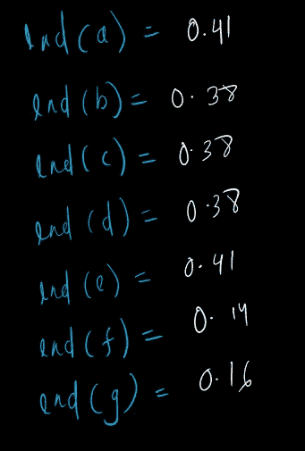
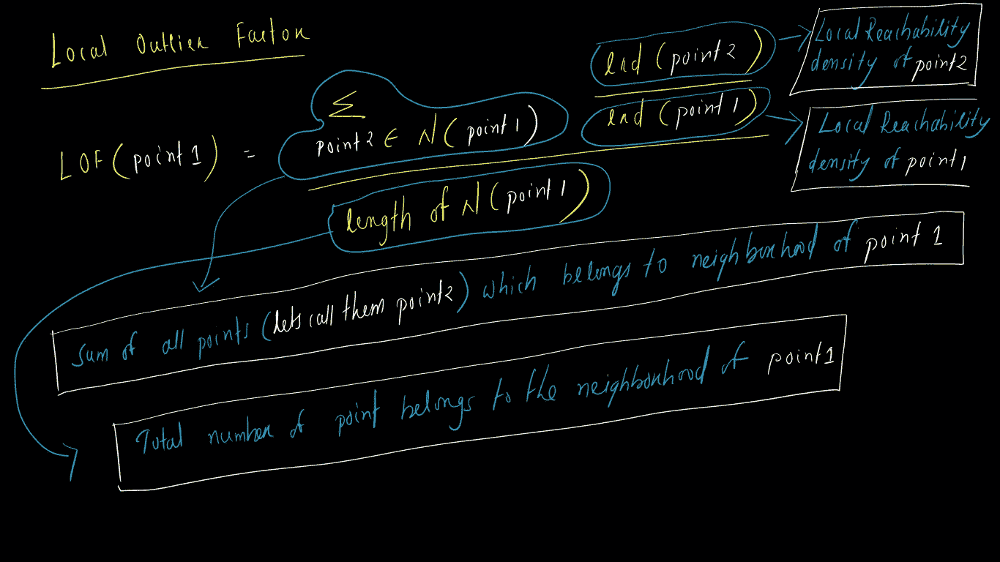
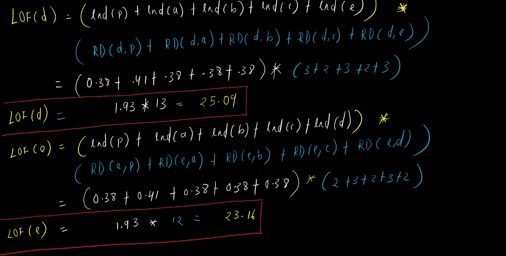

# 机器学习中的离群点检测

> 原文：<https://medium.com/analytics-vidhya/outlier-detection-in-machine-learning-442962addbc6?source=collection_archive---------24----------------------->

## 局部异常因素

在这篇博客中，我将试着解释我们如何使用一种简单的叫做**局部异常值因子**的技术来检测数据集中的异常值。在此之前，我们需要了解，

> ***离群值是什么意思？***

让我们看看这幅画

*   存在 5 组/簇点，即**黄色、白色、蓝色、绿色、红色**。
*   **紫**色中有一些点远离 5 大组。这些点不属于任何一个组，我们可以称它们为离群点。
*   请记住，在收集数据时，我们会在数据集中获得异常值(称为收集错误)，这可能是一个错误的类型或错误的观察等。

> ***脱离******或不同于特定组或集合中所有其他点的点称为离群点***
> 
> 为什么我们应该关心离群值？

*   **嗯！！**当我们的数据集中有异常值时，我们会面临数据分析方面的困难，例如分布可能会出现偏差，这会导致我们对数据的错误解读，请记住，我们会根据数据做出大量决策，并且假设如果我们因为异常值而给出一些错误信息，那么这可能会给企业带来巨大损失。
*   一些机器学习算法会给你不好/差的结果或者你不期望从算法中得到的结果，这时我们应该看看数据集上是否存在离群值。 ***查 btw*** 其好做法

有不同技术可以检测异常值，但在这篇博客中，我将写 LOF ( ***基于密度的异常值检测技术*** )

## 局部异常因素

我们需要了解的 3 件事

1.  **可达性距离(RD)**
2.  **局部可达性密度**
3.  **局部异常值因子(LOF)**

为了更好地理解，让我们来理解一些术语

让我们以**为例**来了解更多。我画了一些点 a，b，c，d，e，f，g 和 p。

现在我们需要找出给定点的异常值。

让我们计算每个点之间的距离。

曼哈顿距离

现在我们得出了计算距离公式。

我已经创建了一个两点之间距离的查找表。我们将在计算时使用它。可以试试看(:

现在的问题是

现在让我们明白

## **可达性距离(RD)**

什么**可达性距离(RD)** 表示:G ***给我两点间的最大距离(*** *其中考虑了* *第 k 个最近邻点 1 的距离和点 1 与点 2 的距离* ***)***

让我们写下公式

可达性距离

让我们举一个例子

这样我们就可以计算其他的 RD 值。这里我创建了一个查找表。如果你有纸和笔，自己尝试一下，这将是一个有趣的任务。

我知道我知道！！！请不要生我的气。这是为了方便，或者我们可以说是为了将来的计算。我们得到了可达性距离，现在让我们理解

## **局部可达性密度**

**局部可达性密度(lrd) *: its 试图捕捉一个点在其邻域点内的密度。我知道这令人困惑，但请和我呆在一起，我会解释的***

**LRD 的公式**是

LRD

同样，我们可以用简单的话来写

LRD

让**计算**点 p、**的 lrd**

我已经使用了 RD 值的查找表

像这样我们可以计算其他 lrd。你也可以参加

现在我们来到了

## 局部异常因素

LOF 是 lrd 和 rd 的组合。我会告诉你，但首先让我们看看它的公式。

力线

让我们理解每个术语

让我们简化我们的公式

现在，如果你观察到我们可以抵消点 1 的邻域总数，仔细查看抵消后的公式，我们可以发现我们有 **lrd(点 2)和 rd(点 1，点 2)。**

让我们来看看推导过程

本地异常因素(LOF)

让我们计算我们拥有的每个点的 LOF，从中我们将消除具有较大值的点，我们可以称它们为异常值。

现在得到了所有 7 个点的 LOF 值，即 a，b，c，s，e，f，g 和 p

按降序排列 LOF 值，并取出较大的值

1.  **LOF(f) = 89.04**
2.  **LOF(克)= 77.7**
3.  **LOF(p) = 25.48**
4.  **LOF(b) = 25.48**
5.  **LOF(摄氏度)= 25.48**
6.  **LOF(d) = 25.09**
7.  **LOF(a) = 23.16**
8.  **LOF(e) = 23.16**

现在我们可以排除点 f，因为它具有较大的值(**所以 f 是一个异常值**)。接下来，我们可以看到第二个更大的值是 g，这也是一个相当大的值，因此我们也可以针对该数据集消除它( **g 也是一个异常值**)。

一些参考

*   http://www . CSE . ust . hk/~陈雷/courses/comp 5331/lections/LOF _ example . pdf
*   https://en.m.wikipedia.org/wiki/Local_outlier_factor

谢谢你