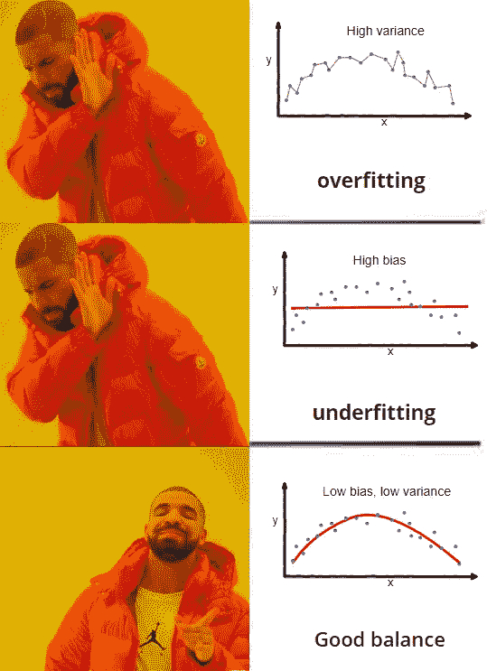
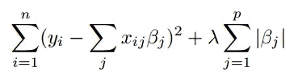
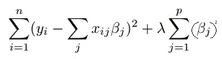

# 过度拟合与欠拟合

> 原文：<https://medium.com/analytics-vidhya/over-fitting-vs-under-fitting-45d977a5ef14?source=collection_archive---------10----------------------->

让我们从讨论图像中使用的术语开始。

**偏差-** 代表训练数据中的误差。

**方差-** 代表测试数据中的误差。

**过拟合-** 该算法显示出对训练数据的良好拟合，但对测试数据的拟合不佳，即低偏差和高方差。

**欠拟合-** 该算法既不能很好地拟合训练数据，也不能很好地拟合测试数据，即高偏差和高方差。

现在我们知道什么是过度拟合和欠拟合。大家来讨论一下，当我们有这个问题的时候，应该怎么做。

# 过度拟合

1.  尝试正则化模型

正则化回归是一种回归类型，其中系数估计被约束为零。系数的幅度(大小)以及误差项的幅度会受到惩罚。

**Lasso 回归:-** Lasso 回归执行 L1 正则化，增加一个等于系数大小绝对值的惩罚。这种类型的正则化可以导致具有较少系数的不同模型；一些系数可以为零，并从模型中消除。

**岭回归:-** 岭回归属于一类使用 L2 正则化的回归工具。另一种类型的正则化，L1 正则化，通过添加等于系数幅度绝对值的 L1 惩罚来限制系数的大小。这有时会导致某些系数被完全移除。L2 正则化增加了 L2 惩罚，它等于系数大小的平方。所有系数都以相同的系数减少(因此没有系数被消除)。

2.尝试超参数调谐。

超参数调整是为学习算法选择一组最佳超参数的问题。超参数是一个参数，其值用于控制学习过程。

3.修剪是基于树的。

修剪是用来克服过度拟合问题的方法之一。就其字面意义而言，修剪是一种有选择地去除树(或植物)的某些部分，如枝、芽或根，以促进树的形成和健康生长的做法。

4.使用**和**交叉验证。

5.尝试更简单的模型。

6.尝试获取更多的训练数据。

7.如果算法允许，使用提前停止。

# **装配不足**

1.  增加模型的复杂度。
2.  减少正规化。
3.  迭代次数的增加会有所帮助。

# **不平衡类**

不平衡的数据是另一个大问题。即使模型表现不佳，它也能显示出很高的准确性。以下是处理不平衡数据集的一些方法。

> 我已经详细解释了准确度、精确度和召回率。请查看我在这方面的文章。[链接](/analytics-vidhya/performance-metrics-4d0b62abfdc)

1.  **过采样:**增加频率小的类的行数。这实际上需要为较小的班级获取更多的数据，这可能很困难。*(提示:复制行可能会有帮助)*
2.  **欠采样:**减少大班的行数，使训练更加均衡。
3.  **使用 SMOTE 生成数据:**合成少数过采样技术为较小的类生成新的数据点。
4.  **类权重:**一些算法允许你给类分配不同的权重来提高训练。

**最终想法**

处理过拟合、欠拟合和不平衡数据集是很重要的。尽管在培训中取得了很好的效果，但它可能会在生产中引起很大的问题。为了使用适当的技术，我们需要了解我们拥有什么类型的数据以及我们使用什么类型的算法。