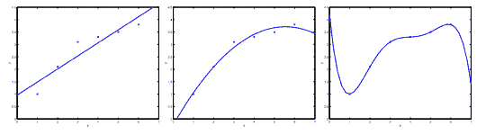
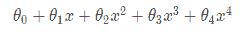
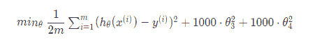
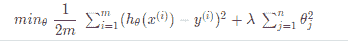
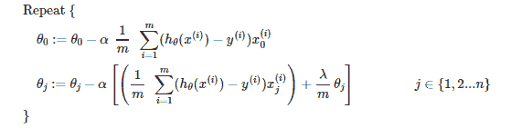
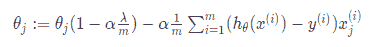
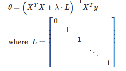
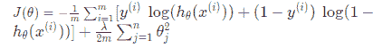
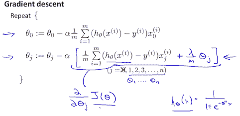

# 过度拟合和欠拟合

> 原文：<https://medium.com/analytics-vidhya/overfitting-and-underfitting-d04dbd985577?source=collection_archive---------15----------------------->

在这篇文章中，**让我们来解决困扰所有机器学习的问题**。我假设您已经阅读了我以前的文章，其中我向您介绍了机器学习，并带您浏览了一些经典算法。这篇文章的先决条件是你应该至少熟悉一种算法，无论是[线性回归](https://hemanth-kotagiri43.medium.com/introduction-to-machine-learning-30a50cdec18e)、[多元回归](/mlearning-ai/at-what-price-should-you-sell-your-home-multivariate-linear-regression-a6824ec172b1)、[逻辑回归](https://hemanth-kotagiri43.medium.com/lets-learn-the-fundamentals-of-classifying-cancer-logistic-regression-20a1dd24e570)还是其他。我已经链接了文章，你可以点击并通读它们！—以上任何人都足以理解本文中的概念。我们开始吧！

# 介绍

好了，你已经收集了所有你需要的数据并对其进行了预处理，你已经注意到了所有你想包含的特征并移除了那些你不想包含的特征。在我们直接进入问题之前，让我们学习一些关于数据的技术术语，以便我们在同一页上。

**训练数据/集合**是数据点的集合，是训练算法的起点。听起来很简单？是的，你使用这些数据来学习和识别数据中的模式，并有希望形成一个好的假设。

**验证数据/集合**是你训练过的算法从未见过的数据点集合。您可以根据通过将这些数据输入到模型中而收集到的预测来决定算法的性能。仅根据您的模型在该设备上的性能，您是否能够决定它是否如预期那样工作。

**测试数据/集合**就像最后一招。当然，你的模型并不知道这些数据点，但这是最终的评估步骤。你根据从先前集合的性能中获得的见解调整你的模型，并在这个集合上测试算法。

为什么我要说这些？你看，当你训练一个算法时——无论是回归问题陈述还是分类，数据都是决定你的模型从长远来看有多好的因素。正如一句名言所说:

> 最后赢的不是拥有 99%准确模型的人，而是拥有大量数据的人。

# 过度拟合和欠拟合

现在，我们已经对训练集、验证集和测试集等技术术语有了一个简单的概念，为了简单起见，让我们将算法的性能集中在第一步，即训练集。假设你已经训练了一个模型三次。每次训练后，您都通过绘制几个数据点的最佳拟合曲线来检查算法的性能。这些是你得到的图表:

过度拟合和欠拟合的演示—图片来自 Coursera 的机器学习课程

从上图可以得出几个关键的见解。它们是:

*   **第一个图**:我们显然**对数据**进行了欠拟合。在这种情况下，我们使用的是一个线性函数，它不能给出新数据点的最佳预测。请注意，无论您做什么，当您不包括多项式项时，曲线是线性的，并且最佳拟合线的成本将保持不变。这可以通过包含一些多项式项使其成为非线性函数来解决，并有望得到更好的假设。天真地看起来，我们添加的功能越多，就越符合数据。然而，事实并非如此，你会明白为什么。
*   **第三个图**:如果我们添加了太多的特性，我们最终会以**过度拟合**不是最优的训练数据而告终，因为如果我们这样做，对于测试数据甚至验证数据来说，输出将不会接近真实值。
*   **第二个图**:这是**理想曲线**，它是所提供的训练数据的正确假设，不会过拟合或欠拟合。

**欠拟合**或高偏差是指假设函数 h 的形式与数据趋势的映射不佳。这通常是由于功能过于简单或使用的功能太少造成的。

**过度拟合**或高方差是由一个假设函数引起的，该假设函数适合可用数据，但不能很好地概括以预测新数据。它通常是由一个复杂的函数造成的，该函数创建了许多与数据无关的不必要的曲线和角度。

# 但是，我们如何克服这两个问题呢？

简单地说**当你面临拟合不足的时候**——你可以求助于添加更多的特性，还可以包括一些多项式项，或者甚至合并现有的两个特性，组成一个新的特性。你可以这样做，但这是以过度适应为代价的。

在另一种情况下，**当您看到您的算法过度拟合**时，有两种最常见的方法可以解决它。第一种方法是简单地减少用于训练的特征的数量，并且小心地手动选择特征。另一个是正规化。正则化的主要目的是保持所有的特征，但是减少参数 *θj* 的大小。而且，当我们有许多稍微有用的特性时，它工作得很好。让我们在线性回归和逻辑回归的竞赛中讨论这个问题。

# 正则线性回归

## 价值函数

当我们选择正则化我们的算法时，我们需要做一些改变。如果我们从假设函数中检测到过度拟合，我们可以通过增加成本来降低函数中某些项的权重。假设我们想让下面的函数更加二次化:

假设函数

如果我们想要消除最后两项的影响而不实际移除它们，我们可以如下修改成本函数:

最后两个特征的正则化

我们在末尾添加了这两个额外的术语来惩罚最后两个特性。如果我们对惩罚所有特性感兴趣，我们做以下事情:

使用具有额外求和的上述成本函数，我们可以平滑我们的假设函数的输出以减少过拟合。如果λ选择得太大，可能会使函数过于平滑，从而导致欠拟合。因此，我们应该仔细选择和调整λ的值。

## 梯度下降

我们将修改梯度下降函数，将 *θ0* 从其余参数中分离出来，因为我们不想惩罚偏差项 *θ0* 。

正则化梯度下降

您可以观察到，我们添加了第一项“(1 — α*(λ/m)”，它将始终小于 1，并负责每个参数的正则化。

## 正态方程

为了加入正则化，该方程与我们的原始方程相同，只是我们加入了另一项:

# 正则化逻辑回归

## 价值函数

我们可以通过在文章的[中定义的成本函数的末尾增加一项来正则化这个等式。](https://hemanth-kotagiri43.medium.com/lets-learn-the-fundamentals-of-classifying-cancer-logistic-regression-20a1dd24e570)

逻辑回归的成本函数

## 梯度下降

类似地，我们添加相同的正则化项“(λ/m)**θj”***，排除**为“ *θ0”的偏差项。*下面显示了我们如何将这些修改添加到逻辑回归的优化算法中。

逻辑回归的优化算法——来自 Coursera 机器学习课程的图片

# 最后的想法

一口气学了这么多知识！如果你不能得到所有这些，或者看着那些长长的数学方程式感到害怕，不要难过。如果你读过我以前的文章，或者对我以前讨论的概念有一丁点的了解，它们是非常简单的。但是，如果你得到了这一切，再次祝贺你！拍拍自己的背，继续前进！概括地说，我们已经讨论了与数据相关的技术术语，了解了过度拟合和欠拟合——它们的原因，以及如何解决它们。我们还通过询问组成线性回归和逻辑回归的各个部分(成本函数、梯度下降),详细介绍了它们的正则化。永远不要停止学习，相信我，你可以学到任何东西！

> 对宝贝，用耐心。