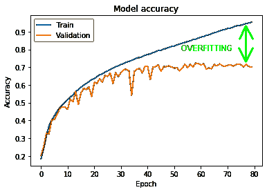

# 机器学习中的过拟合与数据泄漏

> 原文：<https://medium.com/analytics-vidhya/overfitting-vs-data-leakage-in-machine-learning-ec59baa603e1?source=collection_archive---------2----------------------->

构建机器学习(ML)模型并不总是直截了当的，工作流可以被封装成几个清晰的步骤，包括数据收集和准备、模型训练和评估以及模型部署。然而，为了将我们的 ML 模型部署到生产中，实现高精度并不是我们应该依赖的测量模型性能的唯一正确的方法。过于乐观的准确性结果可能表明有猫腻。但是我们如何知道背后的问题呢？嗯，大多数 ML 从业者应该熟悉过度拟合，这是我们可能遇到的一个问题，或者可能是数据泄漏。

更进一步的问题是在 ML 中这两个术语之间是否有区别？我记得有一次我遇到了数据泄露问题，我的一个同事让我只说“过拟合”而不是“数据泄露”，因为简单地说数据泄露就是过拟合。这就是我写这篇文章的原因。但是首先，为了正确地解决这个问题，让我们回忆一下过度拟合的定义。

# 什么是过度拟合？

过度拟合时训练和验证/测试精度之间的差异[2]

为了评估特定 ML 模型的性能，我们总是将数据分成两组，包括训练和测试子集。该算法在训练数据集上进行训练，并在测试数据集上进行评估/测试，然后应用(部署到生产中)对新的(看不见的)数据点进行预测。当模型在训练数据上表现太好，但在新数据点上表现不佳时，就会发生过度拟合，而目标是最大化它在看不见的数据点上的准确性(我们不只是希望它从数据中学习)。这意味着该模型不能推广到看不见的数据(即，经过训练的模型不能适应新数据)。

# 什么是数据泄露？

> *“当你用来训练一个机器学习算法的数据恰好拥有你试图预测的信息时”。*
> 
> *——*丹尼尔·d·古铁雷斯

数据泄漏被认为是机器学习[1]中的“十大错误之一”，当训练数据集中的一个数据点的信息泄漏/引入时，就会发生这种情况，该数据点在训练阶段是不可获得的(即，测试数据集意外包含在训练数据集中)。

# 过度拟合与数据泄漏

经过上述定义后，区别是否清晰？如果没有，我们在这里对比一下。

当数据泄漏发生时，可能会导致过度拟合(过于乐观的训练精度)，但该模型在测试数据上也表现得太好。正如我们提到的，数据点从测试集泄露到训练集，这意味着模型将预测它学习/看到的东西(但我们认为它是看不见的数据点)，而过度拟合可能导致预测模型的泛化性能较差。

# 为什么了解 ML 中过度拟合和数据泄漏的区别很重要？

> “所有的生活都是解决问题”。— *卡尔·波普尔*

如果你在考试，理解问题有多重要？嗯，我确实相信正确理解问题是正确答案的 50%。在解决任何领域的问题时，这种想法都是相似的，重要的是确定和识别问题/原因，以便选择和正确实施解决方案。了解过度拟合和数据泄漏之间的区别可以节省时间和资源，并有助于更快地做出决策。

# 关于过度拟合的进一步阅读

1.  [过拟合](https://en.wikipedia.org/wiki/Overfitting)
2.  Vezhnevets，亚历山大，和奥尔加巴里诺瓦。"通过去除混淆样本来避免过度拟合."*欧洲机器学习会议*。施普林格，柏林，海德堡，2007。
3.  *提示 7:最小化过度拟合*。d .奇克科(2017 年 12 月)。[“计算生物学中机器学习的十个快速技巧”](https://www.ncbi.nlm.nih.gov/pmc/articles/PMC5721660)

# 关于数据泄漏的进一步阅读

1.  [数据准备时如何避免数据泄露](https://machinelearningmastery.com/data-preparation-without-data-leakage/)
2.  瑞安马克。*结构化数据深度学习*。曼宁出版公司，2020。
3.  丹尼尔·古铁雷斯..机器学习和数据科学:统计学习方法介绍，美国，工艺出版社，2015 年。

# 结论

过度拟合和数据泄漏都是机器学习中严重而重要的问题，因为它们都呈现误导性的结果，因为如果它们被部署在现实世界中，它们可能具有戏剧性的影响。

你对数据泄露或这篇文章有什么问题吗？请在评论中提出你的问题，我会尽力回答。

# 参考

[1]尼斯贝特、罗伯特、约翰·埃尔德和加里·迈纳。 [*统计分析与数据挖掘应用手册*](https://books.google.ca/books?hl=en&lr=&id=U5np34a5fmQC&oi=fnd&pg=PP1&dq=Nisbet,+R.,+Elder,+J.+and+Miner,+G.+2009.+Handbook+of+Statistical+Analysis+and+Data+Mining+Applications.+Academic+Press.&ots=Ss_-ERBhGK&sig=f60wYYOuBekf9JRKzA21BwBJAA8&redir_esc=y#v=onepage&q=Nisbet%2C%20R.%2C%20Elder%2C%20J.%20and%20Miner%2C%20G.%202009.%20Handbook%20of%20Statistical%20Analysis%20and%20Data%20Mining%20Applications.%20Academic%20Press.&f=false) 。学术出版社，2009 年。

[2] [卷积神经网络 3:卷积神经网络和过拟合](https://aigeekprogrammer.com/convnets-and-overfitting/)