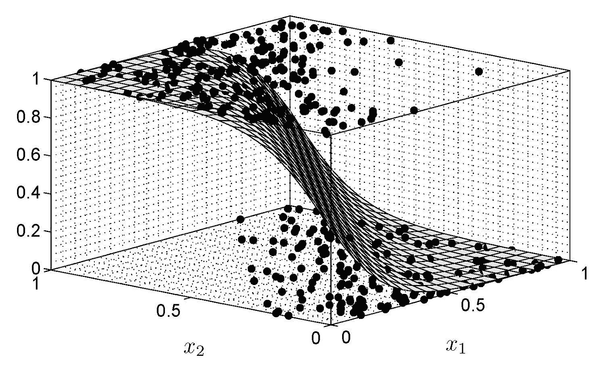
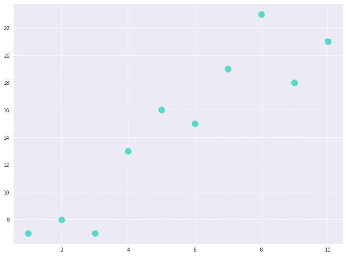
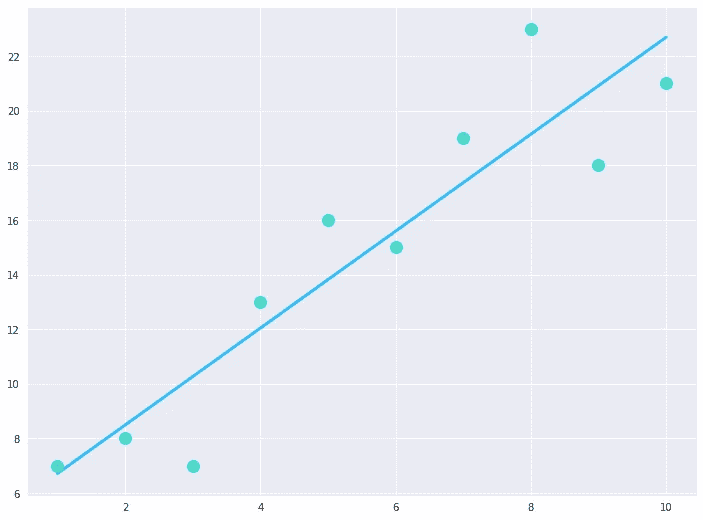
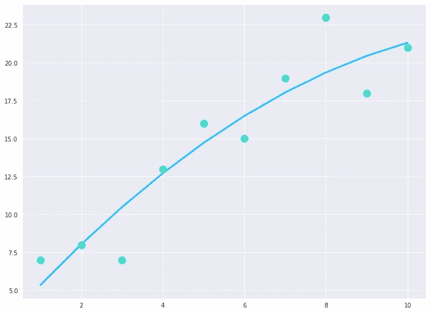
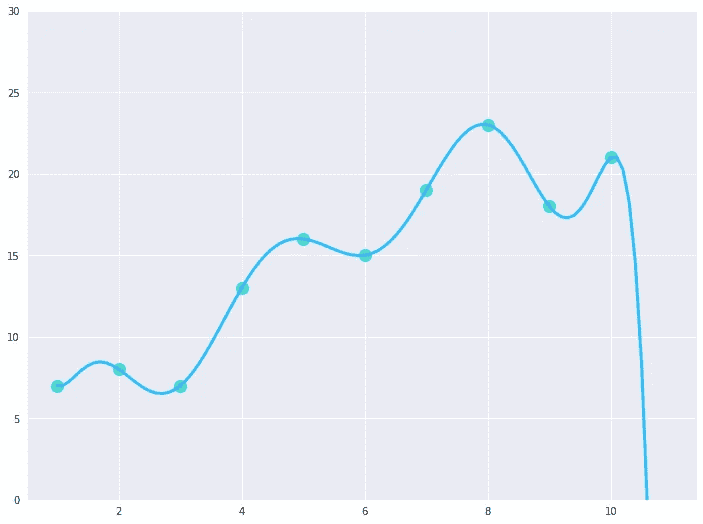
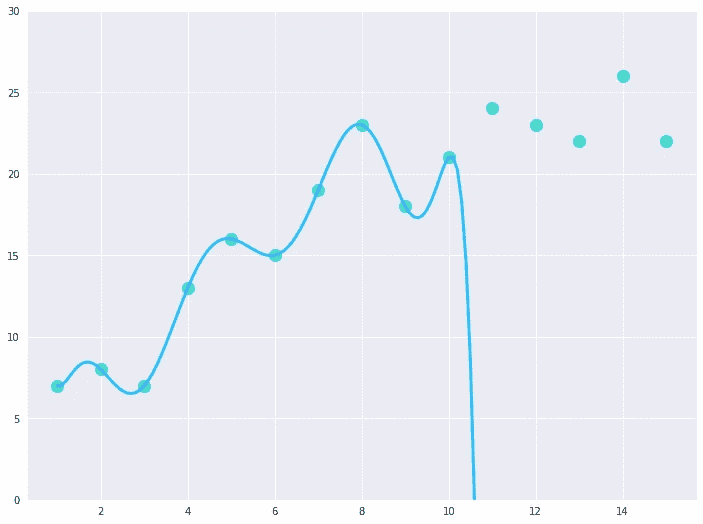
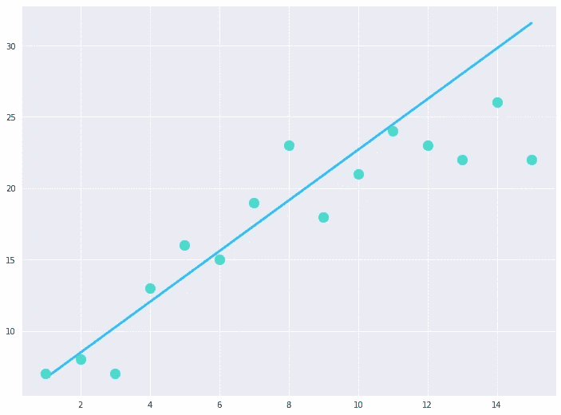
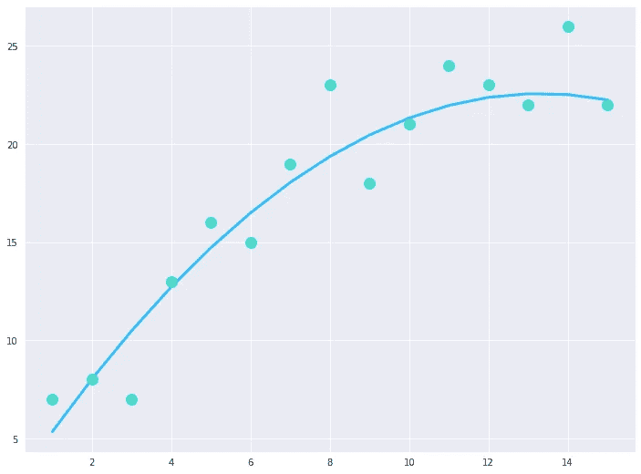

# 过度适应 vs 欠适应:机器学习的指导哲学

> 原文：<https://medium.com/analytics-vidhya/overfitting-vs-underfitting-the-guiding-philosophy-of-machine-learning-c6ce5fe9f9bb?source=collection_archive---------8----------------------->

照片由来自[佩克斯](https://www.pexels.com/photo/white-puzzle-piece-on-blue-textile-5505122/?utm_content=attributionCopyText&utm_medium=referral&utm_source=pexels)的[迈克·范·肖特沃特](https://www.pexels.com/@mike-van-schoonderwalt-1884800?utm_content=attributionCopyText&utm_medium=referral&utm_source=pexels)拍摄

让我们面对现实吧，甚至在我们真正接触数据科学之前，我们可能已经听说过这两个术语:过度适应和欠适应。这两个术语应该被视为机器学习的指导原则的原因是，现有的每个机器学习模型都符合这两者之间的权衡，这反过来决定了它们的性能，因此每个机器学习算法都试图创建在它们之间提供最佳权衡的模型。

# 但是我们为什么关心它呢？

每当我们使用机器学习对任何数据进行建模时，最终目标是当向训练好的模型提供一组以前看不到的输入时，该模型应该能够正确地预测输出标签。那么这个模型是如何实现的呢？这是通过在训练过程中学习从输入到输出标签的一组决策映射或简单函数来实现的。

因此，我们的模型的有效性和性能只有在使用以前未见过的数据进行评估时才能实现。那么，我们怎么能说一个模型是否会对以前看不到的数据做出好的预测呢？这取决于模型的“可推广性”,即，如果模型在训练期间学习的决策映射对以前未见过的数据仍然有效，从而为它们产生正确的预测，则该模型可被视为可推广的。

正如我们将了解到的，过度拟合和欠拟合都是模型推广的障碍；一个完美的一般化模型不会有任何过拟合或欠拟合。尽管在现实中，不可能实现一个完美的没有过度拟合和欠拟合的通用模型。相反，我们依赖于它们之间的权衡，我们努力将它们都减少到我们实现“最佳拟合”的点，即模型的最大可能概化。

# 什么是模型？

统计模型的表示[ [来源](https://people.smp.uq.edu.au/DirkKroese/statbook/)

在了解过度拟合和欠拟合之前，我们必须了解什么是模型。在统计学和数据科学领域，

> 模型可以被理解为现实世界的抽象表示，它是仅使用提供给我们的数据创建的，也称为“样本”。

打个比方，如果我们想制作一个有形的物理教室的通用模型，那么教室的每个物理方面，比如长凳的数量、桌子的数量、白板的尺寸等等。是我们可以用来建模的相关信息或数据。

模型也可以被认为是将一组输入映射到一个输出的数学函数。这组输入和输出是我们模型的不同“方面”,通过机器学习，我们试图在这组输入和输出之间建立关系。例如，给定教室中的长凳和书桌的数量，我们可以很容易地建立一个关系来计算可以同时上课的学生数量。

过度适应、良好适应和不适应的概念

那么这个概念是如何延伸到过度适应和欠适应的呢？让我们考虑一个场景，一个学生需要一套定制的校服。为此，裁缝首先需要一些关于学生体格的信息，这样制服才会合适学生。但有一个问题，尽管裁缝非常熟练，可以非常准确地测量学生的体型，并根据这些数据完美地定制服装，但裁缝使用的面料在洗涤时会有一定程度的缩水。由于这个原因，衣服的合身程度总是有一定程度的不确定性，因为缩水的量无法预先确定。

那么，裁缝如何在裁剪校服的同时适应这种不确定性，使它仍然适合学生呢？如果裁缝决定把校服做得比测量值宽松，那么即使缩水后，校服也会宽松或者“不合身”。如果裁缝决定完全按照尺寸来做校服，那么校服在缩水后肯定会很紧或者“过紧”。那么解决办法是什么呢？裁缝在缝制校服时，只留有适当的缩水余量，这样即使在洗涤后，它也能为学生提供完美合身或“最合身”的衣服。

# 用回归模型理解过度拟合和欠拟合

让我们做一个简单的实验。为了理解欠拟合和过拟合的概念，我们将尝试用一些回归模型来拟合一组数据点。我们的第一步将是导入几个 Python 库，使我们能够拟合回归模型并绘制它们:

让我们获取一些样本数据点来拟合模型:

以下是它们在散点图中的显示方式:

2D 平面中 10 个数据点的散点图

首先，我们将对这些数据点拟合一条基本线性回归线，并使用拟合模型的系数和 y 截距计算回归公式，此处用“a”表示。此后，我们沿着数据点绘制回归线:

执行上述代码后，我们获得了以下结果:

拟合 10 个数据点的线性回归模型

如上所示的基本线性回归线似乎可以很好地模拟我们的数据点，但我们可以看到它并没有很好地捕捉整体趋势；我们得到 0.85 的 r 平方分数**。但是我们能做得更好吗？让我们试着拟合一条 2 次多项式回归直线，并绘制它:**

上面这段代码生成了以下图形:

拟合 10 个数据点的二次多项式回归模型

这一次我们获得了 0.87 的 **r 平方值。**虽然我们的得分没有显著提高，但现在看来，随着多项式次数的增加，r 平方得分也在增加，数据的总体趋势也变得更加准确。因此，有人可能会说，我们应该不断增加多项式的次数，因为它可以提高分数。我们会尽力找出接下来会发生什么。让我们尝试拟合一条 9 次多项式回归线，并绘制它:

执行上面的代码后，我们得到了下面的图:

拟合 10 个数据点的 9 次多项式回归模型

我们的模型这次产生了 0.99 的 **r 平方分数！这似乎是一个非常好的回归模型，有着如此令人印象深刻的分数。还是事实如此？**

正如我们之前读到的，任何模型的好坏都是由其可推广性决定的。因此，为了确定这个模型有多一般化，让我们向我们的合成数据集添加五个额外的观察值，它们应该与原始数据样本属于相同的分布。值得注意的是，该模型尚未在这些数据点上进行训练。下面是新添加的数据点的模型行为:

对 5 个额外数据点进行测试的 9 次多项式回归模型

刚刚发生了什么？我们之前已经获得了 9 次多项式回归线的最佳 r 平方分数，但它未能对这些新点中的任何一个进行建模，这次我们收到了负 r 平方分数**，这表明它是一个极其低效的模型。由此可以得出结论，它不是一个一般化的模型；尽管它在尝试对训练数据进行建模时表现出色，但它无法对任何未经训练的新数据点进行建模。因此，该模型可以被视为过拟合模型或高方差模型。**

# 过度拟合

根据维基百科，过度拟合是指

> 分析结果与特定的一组数据过于接近或精确，因此可能无法拟合额外的数据或可靠地预测未来的观察结果

在我们的实验中很明显，9 次多项式回归模型符合训练数据到这样的程度，以至于它失去了概括的能力，或者换句话说，该模型拾取了总体趋势中的随机波动，即数据中的噪声。因此，该模型无法正确预测之前未发现的点，因为它没有从数据中了解总体趋势，而只是拾取了噪声。这种特殊情况被认为是过度拟合。

在这种特殊情况下，模型不断提出复杂甚至复杂的决策规则，目标是对所有训练数据点进行完美建模。但是在这个过程中，它完全忽略了一般化的概念，因此，那些决策规则无法对看不见的数据点进行建模。

现在，人们可能会凭直觉认为复杂的决策规则总是会导致过度拟合，因此人们应该坚持尽可能简单的决策规则，希望这将有助于模型很好地泛化。但事实是这样吗？让我们找出答案。

这一次，我们将尝试使用线性回归模型对相同的五个额外观察值进行建模，从逻辑上来说，它们应该映射得非常好，因为这一次模型应该更加一般化。但是，这种情况发生了:

正在测试 5 个额外数据点的线性回归模型

我们这次获得了 0.65 的 r 平方分数**，很明显，线性回归模型仍然没有对新数据点进行正确建模，性能不但没有提高，反而有所下降。因此，该模型可被视为欠拟合模型或高度偏差模型。**

# 欠拟合

根据维基百科，

> 当统计模型或机器学习算法无法充分捕捉数据的底层结构时，就会出现欠拟合。

在我们的实验中也很明显，线性回归从未能够正确地对数据建模，它不能很好地拟合训练数据，也不能对看不见的数据建模。

通常，当没有足够的训练数据供模型学习时，或者当模型本身由于其潜在的性质而无法从数据中捕捉趋势时，会发现模型不适合。

那么解决办法是什么呢？解决这个难题的唯一可能的方法是，我们在两者之间的某个地方相遇，在那里模型既不过拟合也不欠拟合，我们有一个“非常拟合”的模型。如果我们尝试使用二次多项式回归模型对我们的五个看不见的数据点建模，我们将获得以下结果:

对 5 个额外数据点进行测试的二次多项式回归模型

我们得到了 0.90 的 r 平方分数！这一次，模型能够正确地预测和模拟数据的总体趋势，这一点通过添加五个看不见的数据点后 r 平方得分的增加得到了证实。

这个特定模型学习的决策映射足够一般化，因此它也可以映射它尚未训练过的数据点。

# 结论

偏差-方差权衡曲线

过度拟合和欠拟合是支配机器学习模型每个方面的两种支配力量。尽管没有逃避它们并直接实现良好的偏差-方差权衡的灵丹妙药，但我们仍在不断发展并在数据级别和算法级别适应我们的机器学习技术，以便我们可以开发不容易过度拟合和欠拟合的模型。