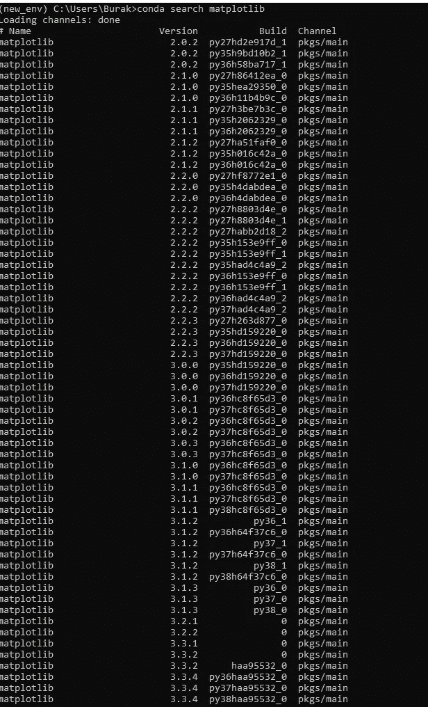
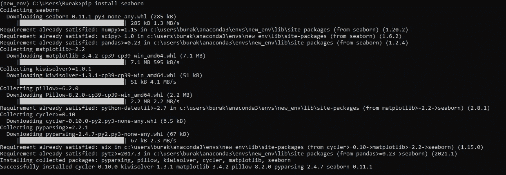

# 概述:创建 Python 虚拟环境和管理依赖性

> 原文：<https://medium.com/analytics-vidhya/overview-creating-python-virtual-environment-and-managing-dependency-management-25023bb24cb3?source=collection_archive---------8----------------------->

# **什么是虚拟环境？**

虚拟环境是一种创建环境的方式，这种环境将具有不同需求的不同项目相互隔离。这是大多数 Python 开发人员使用的最重要的工具之一。

# **什么是依赖管理？**

依赖性管理是 Python 可持续、安全项目的基石。如果您的依赖关系得到了很好的管理，您就不会发现自己处于长期支持时间表的错误一端，或者拥有彼此不一致的依赖关系。这是一个在开始时很难理解，但在后来却不可或缺的概念。

***具有创建和管理虚拟环境功能的工具:***

> Venv(标准库的一部分)
> 
> Virtualenv(广泛使用)
> 
> 高级接口
> 
> Conda(不仅针对 Python)
> 
> *诗歌、画中画工具、影线等。

# **康达用法**

conda:包和 venv 管理工具(anaconda 存储库)

***列表环境:***

> 康达环境列表

***创建新环境:***

> conda create–n 环境名称

***激活环境:***

> conda 激活环境 _ 名称

***安装包:***

> conda 安装包 _ 名称

***安装包:***

> conda 安装软件包名称 1 软件包名称 2

***安装包具体版本:***

> conda 安装包 _ 名称=版本

***清除包:***

> conda 删除包 _ 名称

***列出已安装的软件包:***

> 康达列表

***更新具体包:***

> conda 更新包 _ 名称

***更新所有包:***

> 康达更新-全部

***升级所有包:***

> 康达升级-全部

***搜索包版本:***

> conda 搜索包 _ 名称

***将包保存到 YML 或 YAML 文件(阅读区别说明):***

> conda env export > environment _ name . yml

*或*

> conda 环境导出>环境名称. yaml

***导入 yml 或 yaml 文件:***

> conda env create -f 环境. yml

*或*

> conda env create-f environment . YAML

***停用环境:***

> 康达停用

***移除环境:***

> conda 环境移除-n 环境名称

***用特定版本的 python 创建环境:***

> conda create -n 环境名称 python =版本

***用特定的 Python 版本和包创建环境:***

> conda create -n 环境名称 python =版本包名称 1 包名称 2

***列出停用环境中的所有软件包:***

> conda 列表-n 环境名称

# **画中画用法**

Pypi (python 包索引)包管理工具，简称 pip

## **安装包:**

***来自 PyPI:***

> pip 安装包 _ 名称

***来自 Git 仓库(阅读注释):***

> python -m pip 安装 git+https://github . com/PSF/requests . git

***安装具体版本:***

> pip 安装包 _ 名称= =版本

***导出当前环境下的包版本:***

> pip 冻结> requirements.txt

***导入包版本:***

> pip 安装-r 要求. txt

# **备注:**

> 正如你所看到的，我们在用 conda 安装软件包时只使用了一个=,而在用 pip 安装时使用了两个=。
> 
> 我们在用 conda 保存包时使用“conda env export > environment _ name . yml”，用 pip 保存“pip freeze > requirements.txt”。
> 
> 。yaml 和。yml 也一样。区别只是喜好问题。不管你用的是哪一个。
> 
> 我们需要安装 git 应用程序来安装来自 git 存储库的包。([https://git-scm.com/downloads](https://git-scm.com/downloads))
> 
> Venv 和 Virtualenv 使用 pip 作为包管理工具。
> 
> Conda 和 Pipenv 都可以进行包管理和虚拟环境管理。
> 
> 如果我们想安装更新的包，我们只写包名。
> 
> 如果我们想安装一个特定的版本，我们写== for conda = pip，写我们想要的版本。
> 
> 为了安装多个包，我们并排编写，中间不放任何东西。
> 
> 指定 python 版本很重要，因为我们需要工作的版本可能不总是最新的版本。

***参考文献:***

[https://www.veribilimiokulu.com/](https://www.veribilimiokulu.com/)

【https://snyk.io/blog/dependency-management-tools-python/*T42*