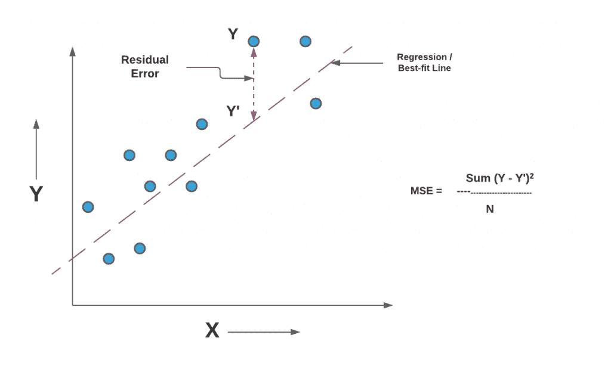
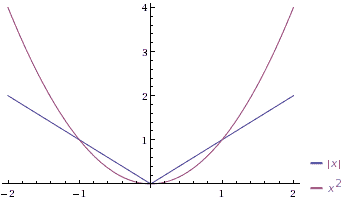
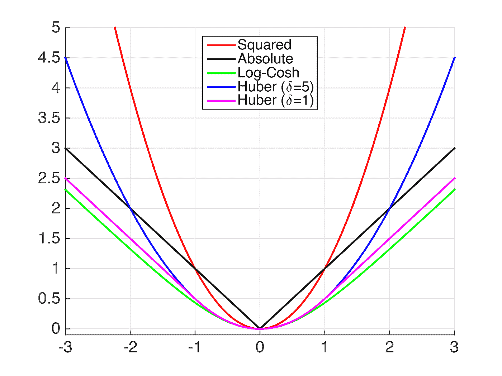
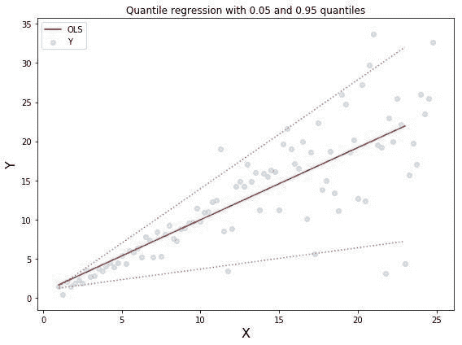
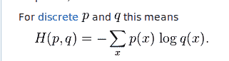
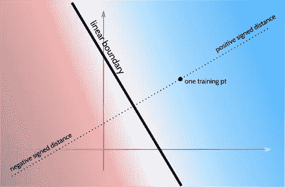
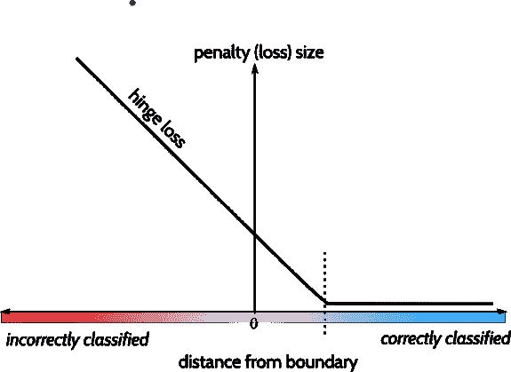

# 机器学习损失函数综述

> 原文：<https://medium.com/analytics-vidhya/overview-of-loss-functions-for-machine-learning-61829095fa8a?source=collection_archive---------8----------------------->

机器学习本质上是一个优化问题。对于任何优化问题，我们都需要计算我们的预测离事实有多远的方法，以确定我们需要模型朝哪个方向改变。

我们通过最小化模型的损失和成本函数来做到这一点。

损失函数获取预测值，并通过输出误差度量将预测值与实际值或数据标签进行比较。这个误差决定了神经元的权重应该如何变化。成本函数是整个数据和预测样本的平均损失。

分类问题和回归问题由于其输出的性质而具有不同类型的损失函数。分类问题是模型必须正确地将输入标注为一个类。回归函数预测数字。基于这两个示例，没有任何损失函数适用于每种类型的输入数据。

# 回归损失

**MSE(均方误差/平方误差损失)**

也称为机器学习中的 L2(岭)损失

就像它的名字一样，它是实际值和预测值之间距离的平方之和。线性回归使用 MSE。

如果数据容易出现异常值，MSE 可能不是合适的选择，因为对大的异常值求平方会使损失非常大。不成比例的大数字会影响梯度下降的稳定性。

MSE 也不适合逻辑回归，因为数据可能不是完全凸的。

**MAE(平均绝对误差)**

——也被称为 L1(拉索)损失

它是预测值和实际值之间距离的绝对值。

它也比 MSE 更稳健，但在其他数学方程中使用绝对值并不容易。(这会使导数变得复杂)

平方损失与绝对误差损失

如该图所示，当误差低于 1 时，MSE 梯度小于 MAE 梯度。

**胡伯损失/平滑平均绝对误差**

组合 MSE 和 MAE，以便函数对小误差进行平方运算，对大误差进行线性运算(偏移δ)

当δ接近零时，它接近绝对误差，当δ接近无穷大时，它接近均方误差。

虽然 Huber loss 结合了 MSE 和 MAE 的最佳方面，但 delta 成为了另一个需要训练的超参数。

它用于稳健回归、M-估计、加法建模以及分类

**测井曲线损失**

对数余弦损失的工作原理类似于抵抗异常值的均方误差。与 Huber 不同，它也是连续二次可微的——这是一些 ML 模型在计算中所要求的。

它很难处理价值巨大的不正确预测。

**分位数损失**

使用预测范围来预测间隔。它不需要恒定方差或正态分布来获得信息预测区间。

它根据自变量的值估计因变量的分位数。当分位数为第 50 个百分位时，它成为 MAE 函数。

根据您选择的分位数，它会惩罚高估或低估。

# 二元分类损失

我们将一个对象分配给两个类中的一个。二元分类的一个例子是将图像标记为包含或不包含猫的图像。

**二元交叉熵损失(对数损失)**

因为我们将输出映射到概率空间，所以我们可以通过模型表示输入在某个类中的概率来测量损失。

使用来自 P 和 Q 的事件概率计算交叉熵，如下所示:

大熵意味着模型中有更多的不确定性。我们希望最小化这个函数，因为熵度量的是给定分布的不确定性。但是我们不知道我们预测的实际分布——kull back-lei bler 散度根据一个假设的分布计算损失。

二元交叉熵损失通常与对数损失归为一类。其核心是，它还使用伯努利分布的负对数来解决最大化问题。它在计算上类似于最小化负对数似然，尽管这并不意味着对数损失和交叉熵损失完全相同。

这种损失所使用的激活器通常是 Sigmoid 函数，因为其输出在[0，1]之间，这很容易分成两个类别→高于 0.5 是一个类别，低于 0.5 是另一个类别。

**铰链损耗**

铰链损失用于支持向量机，并用-1 和 1 而不是 0 和 1 分类。因此，网络的最后一个激活层必须是双曲正切 Tanh。

这个损失函数的作用类似于二元交叉熵，只是它也惩罚了正确标记但不可信的预测。(回归概率低，但只到某一点)

这是通过计算数据的实际值和预测的线性边界之间的距离来实现的。

参考文献 5 中的图片

例如，一旦预测准确可信，铰链误差为零，否则线性增加。

参考文献 5 中的图片

直观上，它使用分类符号的差异来计算损失。如果预测值与实际值符号相反，误差会更大。

这种损耗还有一种扩展，称为平方铰链损耗和立方铰链损耗。这使误差函数变得平滑，并使计算微分在数值上更容易，尽管它可能不会执行得更好。

尽管有其特点，这种损失并不可靠地执行优于交叉熵。

# 多类分类损失

## 分类/多类交叉熵损失

分类交叉熵使用一个热点向量从二进制交叉熵损失中进行归纳。

每个类都有一个概率为 1 的类标签，所有其他类标签的概率为 0。

当有几千或者几十万个标签，没有那么多数据的时候，这就变成了一个稀疏多类交叉熵问题。在这种情况下，为了节省内存，目标变量有时不是为训练而一次性编码的。

它与 Softmax activator 一起使用——这意味着类不是独立的，因为这个 activator 的输出不是独立的。

## KL-散度

KL 散度衡量一个概率分布与另一个分布的不同程度。较低的散度意味着分布更接近实际分布。

它更接近复杂的功能，而不是分类，例如必须学习密集特征的自动编码器。

与交叉熵损失相比，它衡量的是两个概率分布之间的相对差异，而不是分布之间的总熵——这就是为什么 KL 散度有时也被称为*相对熵。*

它也用于深度生成模型，如变分自动编码器。(VAE)

参考资料:

1.  [(回归函数)https://heart beat . fritz . ai/5-Regression-loss-Functions-all-machine-learners-should-know-4fb 140 e 9 D4 b 0](https://heartbeat.fritz.ai/5-regression-loss-functions-all-machine-learners-should-know-4fb140e9d4b0)
2.  [(交叉熵损失/KL)https://towards data science . com/understanding-binary-Cross-Entropy-log-Loss-a-visual-explain-a3ac 6025181 a](https://towardsdatascience.com/understanding-binary-cross-entropy-log-loss-a-visual-explanation-a3ac6025181a)
3.  [https://liyanxu.blog/2018/10/28/review-of-cross-entropy/](https://liyanxu.blog/2018/10/28/review-of-cross-entropy/)
4.  [https://machine learning mastery . com/cross-entropy-for-machine-learning/](https://machinelearningmastery.com/cross-entropy-for-machine-learning/)
5.  (铰链损耗)[https://math . stack exchange . com/questions/782586/how-do-you-minimize-Hinge-Loss](https://math.stackexchange.com/questions/782586/how-do-you-minimize-hinge-loss)