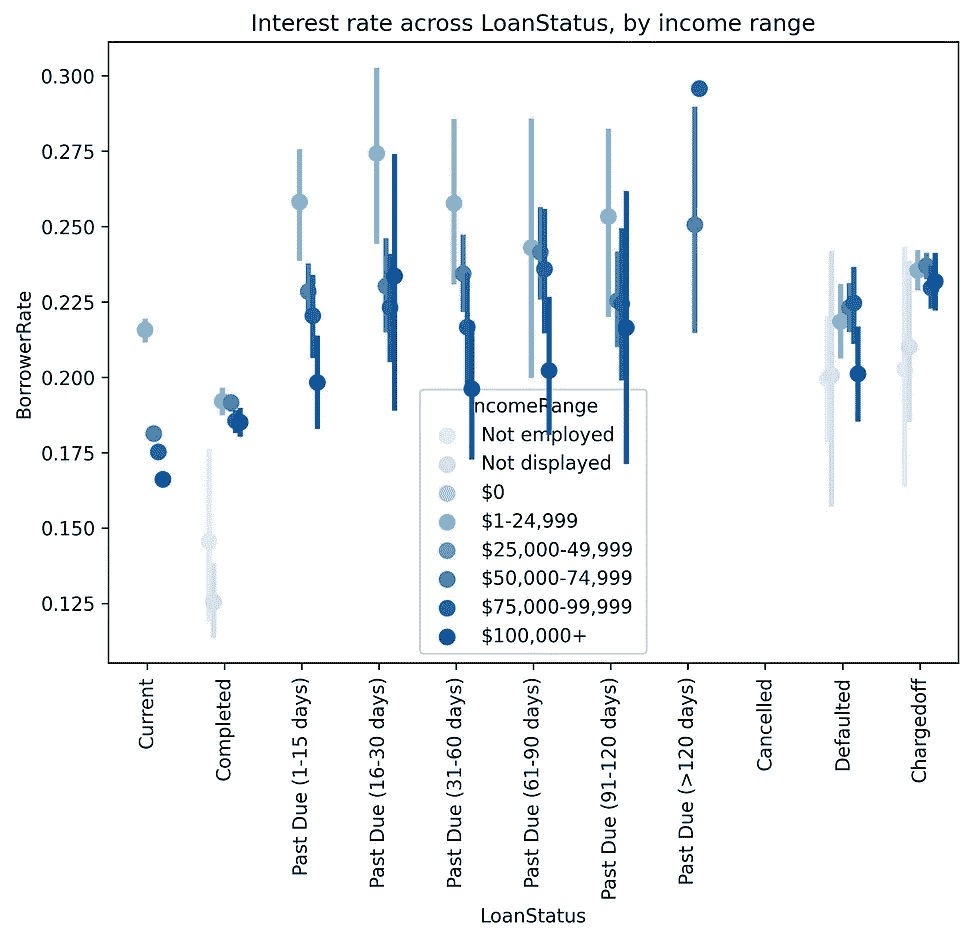

# 使用 Python 实现 P2P 借贷数据可视化——Prosper market place

> 原文：<https://medium.com/analytics-vidhya/p2p-lending-data-visualisation-with-python-prosper-marketplace-d1ae722c2534?source=collection_archive---------8----------------------->

点对点(P2P)贷款，或众筹*，*已经成为全球市场新兴的替代金融服务。随着该行业越来越受欢迎，它可能会对越来越多的人的财务决策产生长期影响。考虑到这一点，该项目旨在使用 Prosper 的真实数据来可视化和了解不同借款人群体之间贷款利率差异的原因。

# 数据集概述

数据集中有 81 个特征的 113，937 笔贷款。(在调查开始之前，由于缺失值和异常值，删除了 44，384 个数据点)。变量由数值类型和分类类型组成。这些属性包括表明借款人特征(如他们是否是房主)和贷款特征(如期限、状态)的变量。

# 借款人利率分布一瞥

我的主要关注点是寻找利率的预测变量(`BorrowerRate`)。所以我将首先用下图来看看这个专栏。利率正态分布在 0 到 0.4 之间，大多数贷款在 0.08 到 0.35 之间，数据有一个 0.17 的众数。借款人 APR 列的分布与前一个变量几乎相同；因此，下面的讨论将只集中于一个，即`BorrowerRate`。

# 利率与 Prosper 分数/条款/贷款状态

经过一些初步的探索，我发现了 3 个可能导致高利率的潜在参数——借款人的 Prosper 评分、贷款期限和贷款状态。

该图表显示:

*   Prosper 得分越高，利率越低。
*   偿还贷款的时间越长，利率就越高。
*   贷款到期时间越长，利率就越高。

有了这个结果，我们现在可以从 Prosper 分数开始，更仔细地看看每个变量。

# Prosper 分数衡量什么？

由于利率与 Prosper 分数负相关，我首先确定分数是如何确定的。从下图可以看出，随着 Prosper 得分的增加，高收入范围内的借款人比例也在增加。同样的趋势也适用于借款人是否也是房主的二元变量，分数越高，借款人拥有住房的可能性越大。

因此，我们可以得出结论，分数与以下因素相关:

*   申报月收入
*   不管是不是房主

# ProsperScore 的利率，由房主或不是

一般来说，房主支付的利率比非房主略低(大约 0.05%)。`ProsperScore`介于 4 和 7 之间的最常见。利率在此范围内变化，最低和最高分数的利率范围较窄。

**对于除 1.0 之外的所有分数，房主通常可以期望获得比非房主更低的利率。**

# 按收入范围划分的不同期限的利率

从左边的下图中，我们可以看到，在每个收入范围组中，费率随着条款数量的增加而增加；总的来说，对于相同金额的条款，收入较高的人通常获得较低的利率。

# 不同贷款状态的利率，按收入范围

右边的上图强烈地表明，对于每种贷款状态，总利率随着收入范围的增加而降低。但是一旦一笔贷款被拖欠或取消，利率会维持在与过期贷款相同的水平，而不是继续增长。

# 可用银行卡信用与美国利率

在之前的研究中，我还发现，尽管有贷款期限，可用的银行卡信用数量与利率呈负相关。因此，我继续根据我们对 Prosper 分数的上述发现来评估这一变量的重要性。

# 可用银行卡信用卡与利率，按 Prosper 评分

高`ProsperScore`的借款人大多银行卡信用高，享受最低利率(0.15 以下)。这些图更多地聚集在左下角，并且在上边有更宽的分布，这意味着在较低的分数中，银行卡信用的作用不太重要。

# 较低的银行卡信用可能是最低利率的障碍

对于利率较低的借款人来说，他们几乎都有较高的银行卡信用，而月收入与利率没有明显的相关性。

# 不同月收入的利率，按收入范围分组

收入较高不一定意味着利率较低，但在 0.10 以下的利率区间，大部分借款人收入较高。

在了解到利率随着贷款到期日的延长或期限的延长而上升后，我扩展了对借款人财务状况和贷款特征的调查。一方面，我研究了借款人的个人情况对利率与贷款类型和状态之间现有相关性的影响。另一方面，由于 ProsperScore 似乎是最强的间接指标，我试图将其潜在变量直接与利率联系起来，包括`DebtToIncomeRatio`和`TotalInquiries`等。

# 结论

更短的贷款期限和更好的贷款状况意味着更低的利率，但最终决定利率的是个人的财务状况。银行卡信用和收入范围较高的借款人和房主有更多的机会获得较低的利率。

收入范围和利率之间的负相关关系(在双变量探索阶段观察到的)在多变量探索中得到证实。之前，我发现`Term`变量与利率正相关，但不清楚借款人的“收入范围”(`IncomeRange`)与利率的负相关如何影响这种相关性。

在多变量探索中，观察到在每个收入范围组内，利率随着期限的增加而增加，**，但对于同一期限，收入较高的人能够获得较低的利率**。

同样，虽然`ProsperScore`与利率负相关，但**借款人是否是** **房主仍然证明决定他们是否可以获得更低的利率**，即与非房主得分相同的房主可以享受更低的利率。此外，尽管`LoanStatus`不同，利率也会随着收入范围的增加而降低。较低的银行卡信用可能是最低利率的障碍。

请随意查看该项目的 [GitHub 资源库](https://github.com/EvelynLinn/Data-Analysis-Portfolio)并探索更多内容。