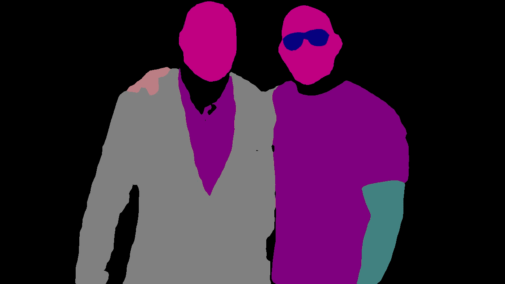

# PaddleHub

> 原文：<https://medium.com/analytics-vidhya/paddlehub-fdd1ec75a07b?source=collection_archive---------9----------------------->

PaddleHub 是一个工具包，具有令人敬畏的预训练模型，使我们能够在一行代码中执行计算机视觉和 NLP 任务。


使用 PaddleHub，不需要有任何深度学习的先验知识。所有的模型都是开源的，可以免费使用。

知识库链接:[https://github.com/PaddlePaddle/PaddleHub](https://github.com/PaddlePaddle/PaddleHub)

# 首先，安装 paddlehub

# 现在导入 paddlehub

我们已经完成了安装，现在可以开始我们的任务了。

# 1.人脸检测

出局:


# 2.关键点检测

出局:


# 3.人体分割

出局:


# **4。人工解析**

出局:



# 5.词汇分析

出局:

```
[{'word': ['I', ' ', 'am', ' ', 'an', ' ', 'immortal'], 'tag': ['xc', 'w', 'xc', 'w', 'xc', 'w', 'xc']}]
```

# 6.情感分析

出局:

```
[{'text': 'Believing in yourself means having faith in your own capabilities', 'sentiment_label': 1, 'sentiment_key': 'positive', 'positive_probs': 0.9967, 'negative_probs': 0.0033}]
```

这是一些可以使用 paddlehub 轻松执行的计算机视觉和 NLP 任务。

如果你想了解更多关于 paddlehub 的信息，请访问他们的回购:【https://github.com/PaddlePaddle/PaddleHub 