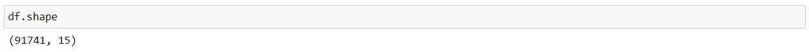

# 熊猫电力

> 原文：<https://medium.com/analytics-vidhya/panda-power-8f6268c4c85a?source=collection_archive---------8----------------------->

Pandas 是一个开源 python 库，用于数据操作、数据清理和分析。它提供了许多功能来加速数据分析过程。熊猫是在 NumPy 包的基础上构建的，因此它从 NumPy 包中获得了很多基本的灵感。两个主要的数据结构是一维的**系列**和二维的**数据帧**。

它是数据科学家和数据分析师的武器库中最重要和最有用的工具之一。

那么，让我们开始吧。

如果您的系统中已经安装了 python 和 pip，那么安装 pandas 是一件轻而易举的事情，否则先安装，然后运行下面的命令。

**先装熊猫:**

在您安装了 Pandas 之后，我们将导入 Pandas 模块。我们将把“pandas”作为 pd 的别名，因为它使代码更容易阅读，也避免了任何命名空间问题。

接下来，我们将导入 **os** 模块，这将帮助我们获得输入文件。os 模块基本上提供了与操作系统交互的各种功能。

然后，我们将创建一个函数，该函数将获取文件名作为输入，并从当前工作目录的位置加载特定的文件。然后，我们将在 Pandas 函数中调用这个函数，这个函数是" **read_csv()** "，它将从提供的位置读取文件。

**1。阅读**

注意——有各种其他方法来读取不同类型的文件，如 read_json()、read_html()、read_excel()等。可以根据需要使用。

注意—本文中使用的数据集是 [this](https://www.kaggle.com/melihkanbay/police) 。

**2。头()**

然后，我们将使用 pandas“head()”函数来显示数据集中的前 5 行。注意—我们可以通过将计数作为参数提供给" **head()** "函数来提供想要显示的行数，即(df.head(10) —现在将显示我们的数据集中的 10 行)。

注意—还有一个“ **tail()** ”方法，它将显示我们的数据集的最后 5 行。

**3。形状**

现在，如果我们想要查看数据集的维度，我们可以使用“shape ”,它将以(行数，列数)的格式显示维度。

**4。info()**

现在，如果我们想知道更多关于数据集的信息，我们可以使用 pandas 的“info()”函数。它显示关于我们的数据的各种信息，如列名、每列中非空值的数量(特性)、每列的类型、内存使用情况等。

**5。to_datetime()**

因此，在读取 CSV 文件时，文件中的 DateTime 对象被作为 string 对象读取，因此，在 string 上执行 DateTime 操作(如 time difference)有点困难。因此，这就是熊猫的“to_datetime()”方法发挥作用的地方。您也可以根据您的要求提供各种格式。

**6。isnull()**

使用“isnull()”和“sum()”函数，我们可以找到数据帧中每个特征的空值的数量。

**7。drop()**

现在，我们可以看到“county_name”列完全是空的，因此它不会提供任何对我们有益的信息。因此，我们将使用 pandas 的“drop()”函数删除该特定列。注意—我们提供“inplace=True”来修改当前数据帧。

**8。**描述()

现在，使用“describe()”函数，我们可以获得关于数据框架中数字列的各种信息，例如总行数、平均值、最小值、最大值以及特定特性中值的分布。

**9。value_counts()**

“value_counts()”函数用于识别特征中的不同类别以及每个类别的值的计数。

**10。菲尔娜()**

现在，我们知道，通过使用“isnull()”和“sum()”函数，我们可以检查我们的数据是否有任何缺失值。所以，现在我们可以看到这个“driver_gender”特性有 5335 个 nan 或缺失值。因此，我们将使用“fillna()”函数使用这个特定特性的模式(在数据集中出现频率最高的值)来填充缺失的值。在数字特征的情况下，我们也可以使用均值和中值。

注—这种填充缺失值或 nan 值的方法不是最有效的方法，还有其他更有效的插补方法。当我们处理缺失值时，会有很多想法，但这只是为了解释 fillna()函数的功能。

**11。样本()**

我们可以使用“sample()”函数，它允许我们从数据帧中选择随机值。我们可以把想要获取的行数作为参数传递给它。

**12。努尼克()**

我们可以使用“nunique()”函数来查找序列或数据框中唯一值的数量。通常，它用于分类特征的情况，以识别特定特征中的类别数量。

**13。列**

顾名思义，“列”获取数据框中所有要素/列的名称。

**14。nsmallest() & nlargest()**

因此，顾名思义，“nsmallest() & nlargest()”函数用于从我们的数据集中分别获得“n”个最低或最高的行。

**15。groupby()**

“groupby()”函数在数据分析中非常有用，因为它允许我们揭示不同变量之间的潜在关系。然后，我们可以使用“ **agg()** ”函数对组应用聚合，并通过各种聚合操作(如均值、大小、总和、标准差等)传递聚合。

**16。get_group()**

我们可以使用“get_group()”函数来选择一个特定的组进行分析。

注意——为了更好地理解数据，我们可以根据我们的要求组合 pandas 的各种方法，如下所示:

**17。loc()和 iloc()**

loc()和 iloc()方法用于对 pandas 数据帧中的数据进行切片，这有助于根据给定的条件过滤数据。

**loc** —按标签选择

**iloc** —按位置选择

**iloc()** 在指定的行和列范围内对数据帧进行切片。

18。分类

我们可以使用 Pandas " **sort_index()** "和" **sort_values()** "函数按索引或值对数据帧进行排序。下面是按值排序的实现:

**19。查询**

我们可以使用 Pandas query()函数根据我们的条件或要求过滤我们的数据框，如下所示:

20。set_index()

所以，我们可以使用 Pandas 的" set_index()"函数将任何列设置为索引。

21。复制()

我们可以使用“duplicated()”函数来查找数据集中所有重复的行。然后，我们可以使用 drop_duplicates()函数删除重复的值，因为有太多的重复值会影响我们的模型在后期的准确性。

22。get_dummies()

pandas“get _ dummies()”方法用于将数据的分类特征转换为虚拟变量或指示变量。

我们通常进行这种转换，因为一些机器学习模型不能很好地处理类别值，如 Random Forrest，如果我们的特征中有太多的类别，我们就不应该使用这种转换，因为它会在我们的数据框中创建太多的新特征，这会对我们的模型的性能产生影响。

23。select_dtypes()

我们可以从数据框中分离出数值和分类特征，并通过使用“select_dtypes()”函数创建新的数据框，包括“np.number”来选择数值列，而包括“objects”来选择分类列。

24。concat()

我们可以使用 concat()方法，通过可选的集合逻辑(如 union 和 intersection)将 pandas 对象连接成一个数据帧输出。

默认情况下，axis=0，即按行连接，因此如果我们设置 axis=1，将执行按列连接。

**二十五。apply()**

假设我们创建了自己的自定义函数，并希望在数据框中使用该函数。这就是熊猫的“apply()”功能发挥作用的地方。它允许我们将自定义函数应用于特定系列的每个元素。

因此，这里我们创建了自己的自定义函数 currentAge()，它通过从当前年份(2021 年)中减去某人的出生日期来返回此人的当前年龄。然后，我们可以在“apply()”函数中使用这个函数。

**26。qcut()和 cut()**

因此，当我们必须处理连续的数字数据时，将它们放入多个桶中，然后继续对数据进行进一步的分析通常会很有帮助。Pandas 提供了两个方法，即 qcut()和 cut()，这有助于我们将连续数据转换为一组离散的桶。

**qcut()** 方法确保了每个箱内的值分布更加均匀，因此我们可以说这是一个更好的采样。我们只是传递箱子的数量，然后熊猫做幕后工作来决定每个箱子有多宽。

**cut()** 方法用于明确定义条块边缘，因此所有条块上的值分布不均匀。可能会出现某个箱子里没有物品的情况，所以我们应该小心。

27。to_csv()

现在，我们可以使用 pandas 的“to_csv()”函数将数据帧保存在 CSV 文件中。

由于我们不想存储每一行的前面的索引，因此，我们将设置 index=False。

因此，我们已经介绍了 Pandas 的各种功能，这有助于数据探索和数据操作，最终加快数据分析过程并提供有价值的见解。

感谢阅读，继续学习。

如果你觉得这篇文章有帮助，那么请关注我的 [**LinkedIn**](https://www.linkedin.com/in/nkr4nikhilraj) 。

**结局？**