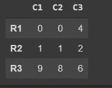

# 熊猫

> 原文：<https://medium.com/analytics-vidhya/pandas-eb6b61a24dd5?source=collection_archive---------34----------------------->


# 介绍

pandas 是一个 Python 包，它提供了快速、灵活、富于表现力的数据结构，旨在使处理“关系”或“标签”数据变得既简单又直观。它的目标是成为用 Python 进行实际的、**真实世界的**数据分析的基础高级构建块。此外，它还有一个更广泛的目标，那就是成为任何语言中最强大、最灵活的开源数据分析/操作工具。它已经在朝着这个目标前进。

# 数据帧

`[**DataFrame**](https://pandas.pydata.org/docs/reference/api/pandas.DataFrame.html#pandas.DataFrame)`是一个二维数据结构，可以在列中存储不同类型的数据(包括字符、整数、浮点值、分类数据等等)。它类似于电子表格、SQL 表或 r 中的`data.frame`。

# 创建数据帧。

现在我们将使用 NumPy 创建一个数组。和数据帧。

```
arr = np.random.randint(0,10,(5,3))
df = pd.DataFrame(arr)
```

现在，我们将创建数据框的索引和列名。

```
df.columns = [“C1”,”C2",”C3"]
df.index = [“R1”,”R2",”R3",”R4",”R5",]
```

现在，数据框看起来像这样。


> 读取或选择数据。

完全基于整数位置的索引，用于按位置选择。

`.iloc[]`主要基于整数位置(从轴的`0`到`length-1`)，但也可用于布尔数组。

```
df.iloc[2]
>> C1    9 
   C2    8
   C3    6
```

*。loc[2]* 显示以下输出，因为*。当索引从 0 开始时，loc[2]读取每个值* **R3** 。

```
df.iloc[2,1]
>> 8
```

输出为 8，因为在读取了 **R3** 的值之后，读取了**列**的值，并且**列**的索引也从 **0** 开始。

```
df.iloc[0]
>>C1    0 
  C2    0 
  C3    4
```

它从索引 R1 中读取每个值

```
df.iloc[:,0]>> R1    0  
   R2    1 
   R3    9 
   R4    7 
   R5    8
```

> 。通信线路（LinesofCommunication）

通过标签或布尔数组访问一组行和列。

`.loc[]`主要基于标签，但也可用于布尔数组。

```
df.loc["R2"]
>> C1    1 
   C2    1 
   C3    2
```

。loc["R2"]通过调用索引名来读取值。

```
df.loc["R2","C1"]
>> 1
```

。loc["R2 "，" c1"]从索引 *R2* 读取值，从索引 *R2* 读取 *C1* 的值

```
df.loc["R1":"R3"]
```



它从 *R1* 和 *R3* 读取每个值

```
df.loc["R1":"R3" , "C1":"C2"]
```


它从索引 R1 到 R3，从列 C1 到 C2 读取值。

谢谢大家！