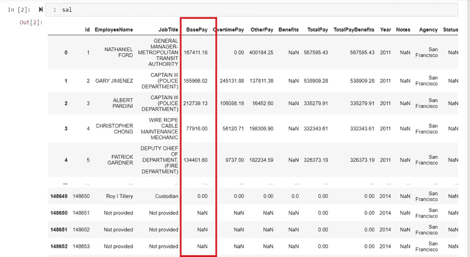
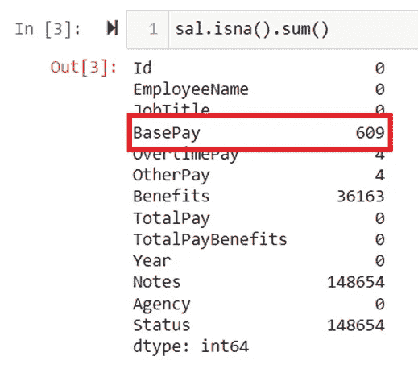
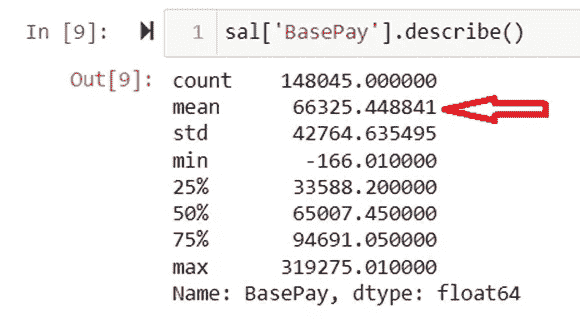
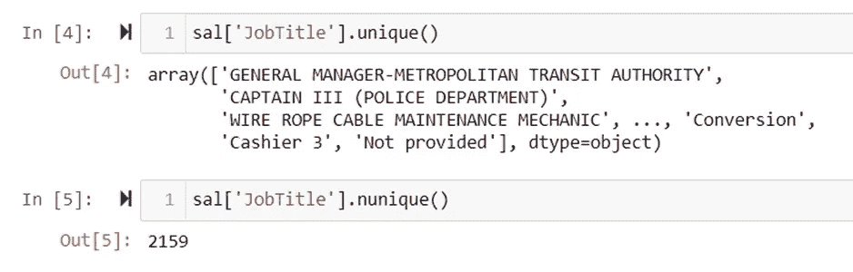
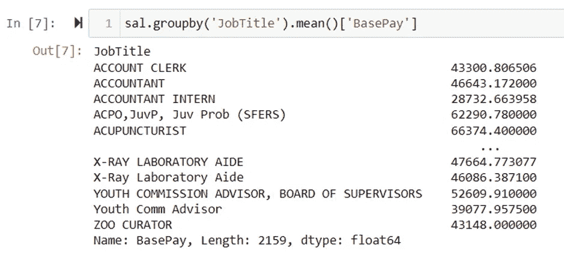
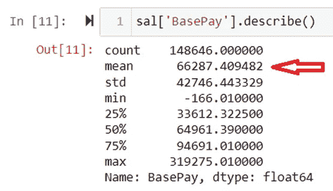
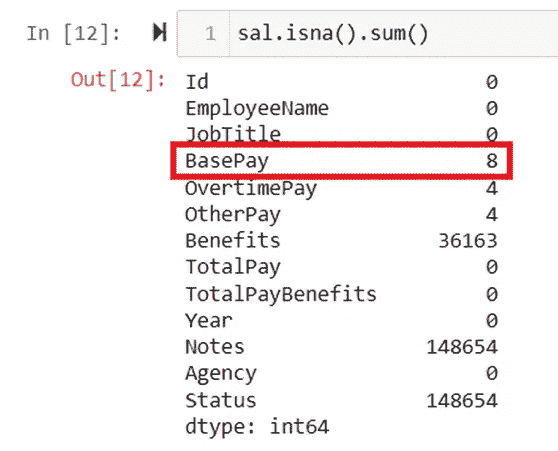
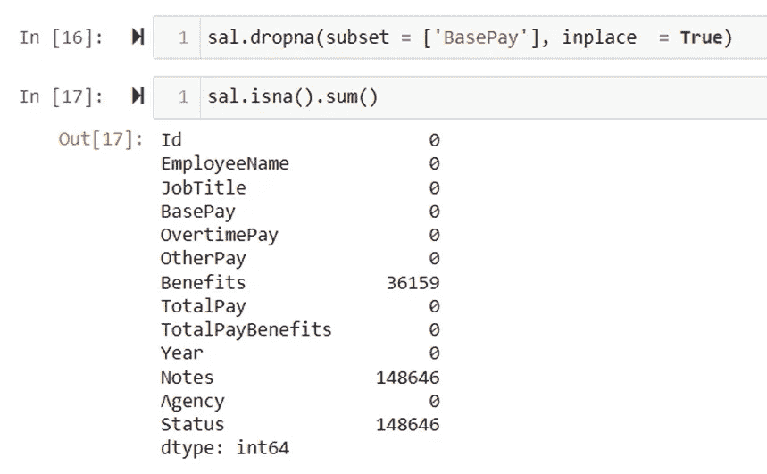

# 熊猫——EDA:取代 NaN 的明智之举

> 原文：<https://medium.com/analytics-vidhya/pandas-eda-smart-way-to-replace-nan-554aedc0b5b6?source=collection_archive---------1----------------------->

## 在本文中，我展示了一个小技巧来替换数据集中的空值/缺失值。这是 EDA 的一部分。

许多分析师习惯于放弃 NaN，或者用变量均值或其他统计度量来代替所有 NaN。然而，这并不总是正确的方法。

在下面的例子中，我选择了数据集，其中一些列有 NaN 值，我已经展示了如何用 mean 替换 NaN。等一下！！这不是专栏的全部意思。


在 [Unsplash](https://unsplash.com?utm_source=medium&utm_medium=referral) 上由[Towfiqu barb huya](https://unsplash.com/@towfiqu999999?utm_source=medium&utm_medium=referral)拍摄的照片

这里，我只选择了基本工资变量来替换 NaN。



屏幕截图 1

现在，某个特定特征中缺失值的总数如下所示。基薪变量中有 609 个 NaN。



屏幕截图 2

现在，一种选择是用变量的平均值 66325.44 代替 NaN。然而，这里我们展示了用 mean 替换 NaN 的方法，但是是针对特定的 JobTitle。



屏幕截图 3

从总经理到出纳员，总共有 2154 个独特的职位名称。现在，例如，如果我们用平均值[特征平均值]替换总经理基本工资的缺失值，或者用平均值[特征平均值]替换出纳基本工资的缺失值。这将是不公正和虚假的。



屏幕截图 4

因此，在这个方法中，我们展示了用平均值替换缺失值的技术，但是是针对特定的职位。也就是说，总经理的平均值仅适用于基本工资的职称为总经理的缺失值。

和方法如下所示，



屏幕截图 5

这里，在下面的方法中，我们使用了 groupby()和 transform()函数来替换 NaN。

```
sal[‘BasePay’] = sal[‘BasePay’].fillna(sal.groupby(“JobTitle”)[‘BasePay’].transform(‘mean’))
```

现在，在用 NaN 代替 BasePay 后，您可以看到平均值的明显差异，即从 66325.44 变为 66287.40



屏幕截图 6

但是，仍然有 8 个值丢失！怎么会？

这些缺失的值来自数据，而 JobTitel 中没有提供这些数据(参见第一个屏幕截图)



屏幕截图 6

现在，在这种情况下，我们不是替换丢失的值，而是删除整个行。



屏幕截图 7

完整代码— [点击这里](https://github.com/RutvijBhutaiya/NaN-Replacement-/blob/main/NaN%20Replacement.ipynb)

[](https://github.com/RutvijBhutaiya/NaN-Replacement-) [## GitHub-rutvijbhutaya/NaN-替换-

### 此时您不能执行该操作。您已使用另一个标签页或窗口登录。您已在另一个选项卡中注销，或者…

github.com](https://github.com/RutvijBhutaiya/NaN-Replacement-)