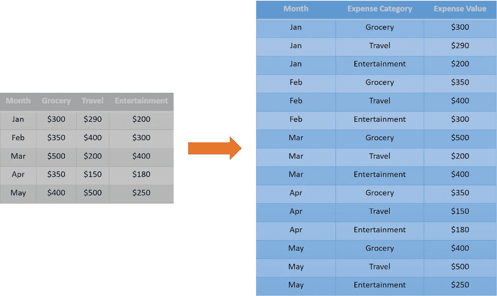
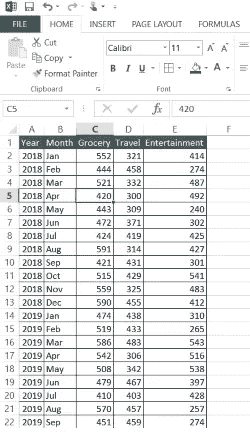

# 熊猫初学者——重塑数据框架——第 1 部分

> 原文：<https://medium.com/analytics-vidhya/pandas-for-beginners-reshaping-dataframes-part-1-cfb43f6170bf?source=collection_archive---------17----------------------->

## 将数据从宽格式转换为长格式


照片由[达拉斯里德](https://unsplash.com/@dallasreedy?utm_source=medium&utm_medium=referral)在 [Unsplash](https://unsplash.com?utm_source=medium&utm_medium=referral) 上拍摄

在分析项目的预处理阶段，我们经常遇到的一个数据争论场景是重塑数据。我们的大多数同事在开始他们的数据科学之旅时都在努力将列转换成行，反之亦然。下图将有助于更好地理解我们试图解决的问题:



从宽到长的形式(图片由用户提供)

上面介绍的场景称为宽格式到长格式的转换或取消数据帧的透视。在这里，我们将列标题作为类别放在一列中(在本例中为费用类别)，并在另一列中获取它们的相应值(在本例中为费用值)。为了应对这种情况，熊猫提供了一个现成的功能 ***融化*** *。*实施该功能的逐步方法详述如下:

# 假设和建议

动手是掌握编程的关键。我们建议您在完成教程的过程中继续实现这些代码。**样本数据**和**关联的木星笔记本**在**场景 _2 文件夹**的 [***this GitHub 链接***](https://github.com/dalmiaujjwal/Data_Wrangling_Tips_Tricks) 中。

如果你是 GitHub 新手，想学习它，请通过 [***这篇***](https://towardsdatascience.com/must-know-tools-for-data-scientists-114d0b52b0a9) 教程。要在您的系统上建立一个新的 Python 环境，请阅读本教程。

以下是本教程中使用的 Python 概念和 pandas 函数/方法的列表:

## 熊猫功能

*   阅读 _csv
*   熔化

# 我们开始吧

## 步骤 1 —准备好数据

在本教程中，我们创建了一个虚拟数据集，其中包含不同费用类别的每月费用。这个数据集和样本数据快照的字典如下:

*   年份—日历年
*   月份—一年中的月份
*   食品杂货——家庭购买食品杂货的费用
*   旅行——家庭旅行产生的费用
*   娱乐——家庭娱乐支出



样本数据(图片由作者提供)

## 步骤 2——用 Python 导入 pandas 包和数据集。

一旦有了可用的数据，下一步就是将其导入到 Python 环境中。

```
**#### Sample Code
#### Importing Pandas** import pandas as pd**#### Importing Data File - Change the Windows Folder Location** imp_data = pd.read_csv("C:\\Ujjwal\\Analytics\\Git\\Scenario_2\\expenses.csv")
```

我们使用了 Pandas ***read_csv*** 函数来读取 Python 中的数据。

## 第 3 步—创建长形式的费用表。

一旦我们读取了数据，应用 Pandas ***melt*** 函数来创建输入数据帧的 long 或 unpivoted 形式。

```
**#### Create the long-form**
Long_data = pd.melt(imp_data, id_vars=["Year", "Month"], 
                    value_vars=["Grocery", "Travel", "Entertainment"], 
                    var_name="Expense Category", 
                    value_name="Expense Value")
```

**解释**

*熔化*功能需要以下参数作为输入:

*   **数据帧名称**—melt 函数的第一个参数是我们必须应用操作的数据帧。
*   **id_vars** —传递我们**不希望**取消透视的 dataframe 列名列表。
*   **value _ vars**—传递我们**希望**取消透视的数据帧列名列表。
*   **变量名称** —用于新变量列的名称。该列将包含不同的类别(在我们的例子中是费用类别)
*   **值名称** —用于值列的名称。该列将包含与不同类别相关的值(在我们的例子中是费用值)

请注意， ***熔化*** 函数返回一个新的非透视数据帧作为输出。将这个输出捕获到一个新变量中(在我们的例子中是 Long_data ),以备将来使用。

# 结束语

在本教程中，我们将数据从宽格式转换为长格式。你能把长表格改回宽表格吗，这样我们就能看到每年每个类别的月支出了。答案请查看[***GitHub***](https://github.com/dalmiaujjwal/Data_Wrangling_Tips_Tricks)库中提供的代码。有关详细的解释，请查看下一个教程。

如果这个教程对你有用，别忘了鼓掌。

快乐学习！！！！