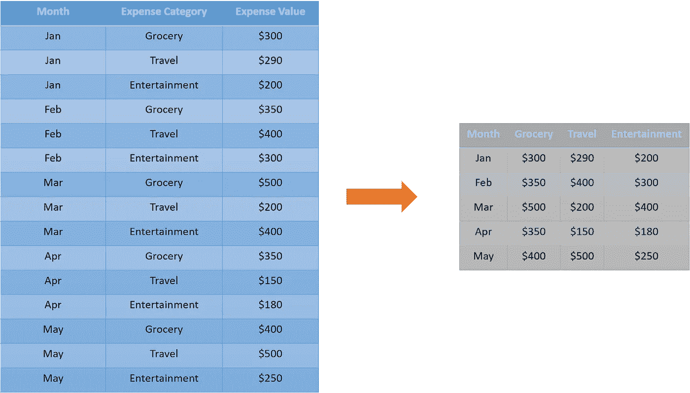
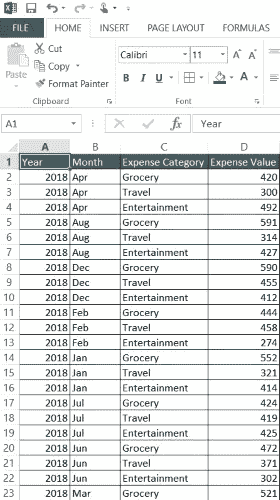
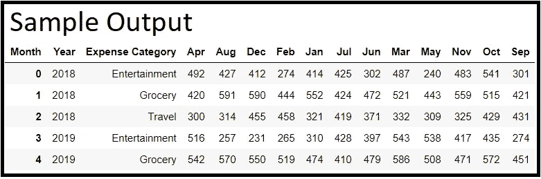

# 初学者的熊猫:重塑数据框架(第 2 部分)

> 原文：<https://medium.com/analytics-vidhya/pandas-for-beginners-reshaping-dataframes-part-2-e8ac212c0aec?source=collection_archive---------9----------------------->

## 将数据从长格式转换为宽格式


在 [Unsplash](https://unsplash.com?utm_source=medium&utm_medium=referral) 上[翻滚 926](https://unsplash.com/@billow926?utm_source=medium&utm_medium=referral) 拍照

在上一个教程中，我们演示了 Pandas ***melt*** 函数来将宽数据表单重塑为长表单。本教程将关注相反的过程。让所有人都站在同一立场上，展示我们试图解决的问题:



从长到宽的形式(图片由用户提供)

我们大多数人在使用 Microsoft excel 时都经历过这样的场景。是的，宽大的桌子类似于著名的数据透视表。我们通常使用它们根据特定的维度(在我们的例子中是费用类别)来总结我们的数据。为了执行这些汇总任务，Pandas 提供了一个现成的函数***【pivot _ table】****。*实施该功能的逐步方法详述如下:

# 假设和建议

动手是掌握编程的关键。我们建议您在完成教程的过程中继续实现这些代码。**样本数据**和**关联的木星笔记本**在 [**的 **Scenario_3 文件夹**这个 GitHub 链接**](https://github.com/dalmiaujjwal/Data_Wrangling_Tips_Tricks) 中。

如果你是 GitHub 新手，想学习它，请通过 [***这篇***](https://towardsdatascience.com/must-know-tools-for-data-scientists-114d0b52b0a9) 教程。要在您的系统上建立一个新的 Python 环境，请阅读本教程。

以下是本教程中使用的 Python 概念和 pandas 函数/方法的列表:

## 熊猫功能

*   阅读 _csv
*   数据透视表 _ 表格

# 我们开始吧

## 步骤 1 —准备好数据

在本教程中，我们创建了一个虚拟数据集，其中包含一个家庭在 2018 年、2019 年和 2020 年不同费用类别中发生的每月费用。这个数据集和样本数据快照的字典如下:

*   年份—日历年
*   月份—一年中的月份
*   费用类别——家庭发生费用的类别
*   费用值——家庭发生的费用值



样本数据(用户提供的图像)

## 步骤 2——用 Python 导入 pandas 包和数据集。

一旦有了可用的数据，下一步就是将其导入到 Python 环境中。

```
**#### Sample Code
#### Importing Pandas** import pandas as pd**#### Importing Data File - Change the Windows Folder Location** imp_data = pd.read_csv("C:\\Ujjwal\\Analytics\\Git\\Scenario_3\\Expenses_Long.csv")
```

我们使用了 Pandas ***read_csv*** 函数来读取 Python 中的数据。

## 第 3 步—创建宽格式的费用表(没有汇总)。

一旦我们读取了数据，应用 Pandas***pivot _ table***函数来创建宽格式的输入数据帧。

```
**#### Create the wide-form**
Wide_data = pd.pivot_table(imp_data,index=["Year","Expense Category"], columns="Month",values = "Expense Value").reset_index()**#### Sample Output** Wide_data.head()
```



示例输出(图片由作者提供)

**解释**

***pivot _ table****函数需要以下参数作为输入:*

*   ***数据帧名称**—*pivot _ table*函数的第一个参数是我们必须应用操作的数据帧。*
*   ***索引** —与 excel 数据透视表的**行部分同义。传递给*索引参数*的列名将构成最终数据帧的行。***
*   ***列** —这与 excel 数据透视表的**列部分同义。传递给*列参数*的列名将构成最终数据帧的新列。***
*   ***值** —与 excel 数据透视表的**值部分同义。传递给*值参数*的列名将用于填充最终数据帧的单元格***

***点注***

*   ***reset_index()** —我们已经使用了 ***reset_index*** 函数来删除 pivot_table 创建的多级索引。*
*   *为了**将多个列**传递给索引、列或值参数，**以列表的形式使用它们**。*
*   *就像 ***融化*** 函数一样， ***pivot_table*** 也返回一个新的旋转数据帧作为输出。将这个输出捕获到一个新的变量中(在我们的例子中是 Wide_data ),以供将来使用。*

# *结束语*

*您知道数据透视表是 Microsoft excel 最常见的功能之一吗？在 Python 中快速实现数据争论步骤可以大大缩短我们的模型构建生命周期。我希望上面介绍的解决方案是有帮助的。*

*你知道如何将数据转换成长格式时进行汇总吗？能否跨不同费用类别计算 2018、2019、2020 年每月平均费用？答案请查看[***GitHub***](https://github.com/dalmiaujjwal/Data_Wrangling_Tips_Tricks)资源库中提供的代码。*

*快乐学习！！！！*