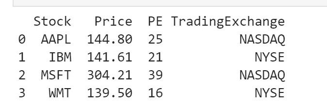
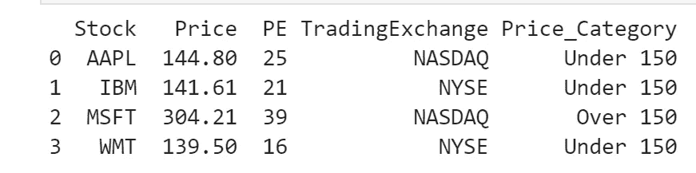
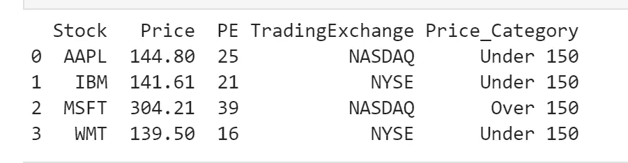
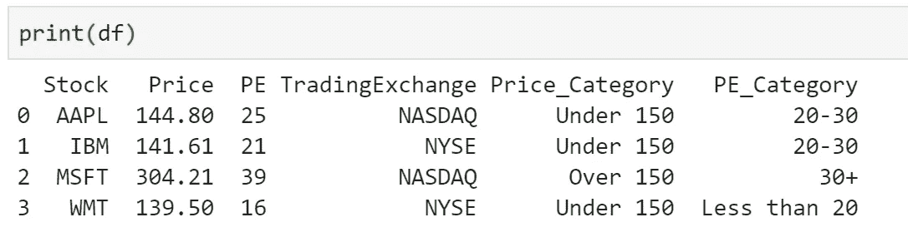

# 熊猫:如何根据条件改变价值

> 原文：<https://medium.com/analytics-vidhya/pandas-how-to-change-value-based-on-condition-fc8ee38ba529?source=collection_archive---------0----------------------->


DataFrame 列中的值可以基于条件表达式进行更改。在本教程中，我们将介绍几种创建 Pandas 条件列的方法。

# **加载样本数据帧**

```
import pandas as pddata = {'Stock': ['AAPL', 'IBM', 'MSFT', 'WMT'],
       'Price': [144.8, 141.61, 304.21, 139.5],
       'PE': [25, 21, 39, 16],  
       'TradingExchange': ['NASDAQ', 'NYSE', 'NASDAQ', 'NYSE']}df = pd.DataFrame(data)print(df)
```



# 方法 1:使用 Pandas loc 创建条件列

Pandas 的 loc 可以根据条件创建布尔掩码。它可以只是选择行和列，也可以用于过滤数据帧。

## 句法

```
example_df.loc[example_df["column_name1"] condition, "column_name2"] = value
```

*   column_name1 是要计算的列；
*   column_name2 是要创建或更改的列，它可以与 column_name1 相同
*   condition 是要应用的条件表达式
*   value 是要分配的新值

让我们通过将字符串“低于 150”分配给任何价格低于 140 美元的股票，将“高于 150”分配给任何价格高于 150 美元的股票来尝试一下。

```
df["Prcie_Category"] = "Over 150"
df.loc[df["Price"] < 150, "Price_Category"] = "Under 150"
```

我们是这样做的:

1.  我们创建一个新的列“*价格类别*，并为数据帧中的每条记录分配“超过 150”。
2.  然后，我们使用。loc 在“*价格*”列上创建一个布尔掩码，以过滤价格低于 150 的行。当“*价格*”列值满足条件时，*价格 _ 类别*”被赋予新值“低于 150”。



# 方法 2:使用 Numpy.where

## 句法

```
import numpy as npexample_df["column_name1"] = np.where(condition, new_value, “column_name2”) 
```

我们仍然创建“价格 _ 类别”列，并将值指定为“低于 150”或“高于 150”。

```
df["Prcie_Category"] = "Over 150"
df['Price_Category'] = np.where(df["Price"] < 150, "Under 150", df['Price_Category'])
```

我们会得到同样的结果。



但是如果我们有多个条件呢？我们仍然可以使用**。loc** 多次，但是会很难理解，写起来也不愉快。

# 方法 3:使用 Numpy。选择使用多个条件设置值

现在，我们想应用一些不同的 PE(市盈率)组:

*   < 20
*   20–30
*   > 30

为了实现这一点，我们可以创建一个条件列表

```
PE_Conditions = [
    (df['PE'] < 20),
    (df['PE'] >= 20) & (df['PE'] < 30),
    (df['PE'] >= 30)
]PE_Categories = ['Less than 20', '20-30', '30+']df['PE_Category'] = np.select(PE_Conditions, PE_Categories)print(df)
```

我们将得到以下结果:



# 结论

在本文中，我们学习了创建熊猫条件列的三种方法。要了解更多关于熊猫的运作，你也可以查阅官方文件。

[名词短语](https://numpy.org/doc/stable/reference/generated/numpy.where.html)

[np.select](https://numpy.org/doc/stable/reference/generated/numpy.select.html)

[pd.loc](https://pandas.pydata.org/pandas-docs/stable/reference/api/pandas.DataFrame.loc.html)