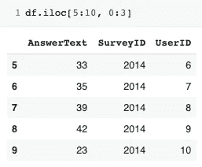

# 熊猫:第二部分

> 原文：<https://medium.com/analytics-vidhya/pandas-part-two-2973075d6484?source=collection_archive---------14----------------------->

## 预览数据、检查数据类型、更改数据类型和选择特定数据

好的，在我的 PANDAmonium 文章中，我们介绍了导入 pandas 以及两种类型的数据结构，那么我们从这里开始做什么呢？很好的问题，很高兴你问了。现在你已经知道了数据结构和如何导入它们，让我们确保你知道如何查看你上传的数据。


图片来自 unsplash via [@djmle29n](https://unsplash.com/@djmle29n)

# **预览数据:**

**df.head()** —这允许您查看数据帧的前五行。如果我在括号里插入一个数字，那么这就是可见的行数。请注意，第一个表下面显示了 df.head()，其中显示了五行。(记住在 python 中我们从零开始计数！)第二个表我在括号里加了一个 2，所以只显示了两行。


我的电脑截图

**df.tail()** —与 df.head 非常相似的是 df.tail，它不是显示数据的开头，而是显示结尾。同样的规则也适用。


我的电脑截图

# 检查数据类型:

检查列的数据类型有两种常用方法:df.dtypes 和 df.info()。请查看以下内容，找出主要差异，并提供更多信息。


我的电脑截图

注意，df.dtypes 严格地只提供数据类型。如果我刚刚开始研究我的数据，df.info()可能是一个更好的选择。info 提供了 RangeIndex、总列数、每列中非空的数量、每列的数据类型以及内存使用情况。这是许多有价值的信息，可以帮助我更全面地了解我的数据。


图片来自 [@rossf](https://unsplash.com/@rossf) 的 unsplash pic

# 更改数据类型:

有许多不同的策略可以用来改变数据类型。假设我有一个数据框架，其中的 AnswerText 列回答了问题“你的年龄是多少？”在这里，每个人都用数字输入他们的年龄，因此将我的数据保存为 int64 比将其保存为对象要有用得多。在下图中，你可以看到第一个 age.info()将 AnswerText 显示为一个对象。然后我跑了

```
age.AnswerText = age.AnswerText.astype(‘int64’)
```

这将整个 AnswerText 列转换为不同的 dtype，如最后一个 age.info()所示。


的。astype 方法可用于数据帧的系列或单个列。要一次更改多列，格式应该是

```
df.astype({"column1": np.float64, "column2": object})
```

___________________________________________________________________

如果您不确定使用 df.convert_dtypes()将数据转换成什么，这将是一个非常有用的工具。该函数将数据转换为最佳选项。转换一维对象数组或标量的其他方法是使用以下方法之一:

**to_datetime** :用于将对象转换为 datetime。转换为 datetime 列非常有用，因为它允许我们执行不同的操作，如果日期是字符串，这是不可能的。如果您不确定您当前的数据是什么，记得使用 df.info()查看一下。

```
pd.to_datetime(obj_to_convert)
```


我的电脑截图

** *有关 to_datetime 的更多信息，请点击* [*此处*](https://pandas.pydata.org/pandas-docs/stable/reference/api/pandas.to_datetime.html) *。*

___________________________________________________________________

**to_timedelta** :用于将参数从可识别的 timedelta 格式转换为 timedelta 类型。使用 to_timedelta，您可以更具体地将单位标识为天、小时、分钟、秒，一直到纳秒。这在确定非常具体的时间长度时非常有用。

```
pd.to_timedelta(obj_to_convert, unit)
```


我的电脑截图

** *有关 to_timedelta 的更多信息，请点击* [*此处*](https://pandas.pydata.org/pandas-docs/stable/reference/api/pandas.to_timedelta.html) *。*

___________________________________________________________________

to_numeric:将参数转换为数字类型。(通常是浮点 64 或整数 64)

```
pd.to_numeric(arg_to_convert)
```


pandas numeric 可用于将标量、列表、元组、一维数组或序列转换为 float64 或 int64，具体取决于给定的数据。需要指出的一点是，如果您的数据是十进制形式，使用 to_numeric 会将舍入到最接近的整数。

** *欲了解更多关于 to_numeric 的信息，请点击* [*此处*](https://pandas.pydata.org/pandas-docs/stable/reference/api/pandas.to_numeric.html) *。*

*参考文献:[1*

# 选择特定数据:

1.**按列选择:**使用心理健康数据集 [Kaggle](https://www.kaggle.com/anth7310/mental-health-in-the-tech-industry) 我可以选择我想要查看的特定行，方法是使用:

```
One Column:
df["col_name"]
```


```
Two or More Columns:
df["col_name", "other_name"]
```


2.**选择特定行:**有多个选项可用于选择数据集中的特定信息。也许我只想获取 QuestionID 为 2 的行。我可以通过使用

```
df[df["column_name"] == "answer"]
```


我的电脑截图

除了使用等号，我还可以指定大于(>)，小于(

___________________________________________________________________

Another useful function is pandas **)。isin** 。也许我需要抓住第二、五和七个问题。这些都是非常随机的数字，如果没有. isin 的帮助可能很难提取。代码与上面非常相似，但我添加的不是等号。isin([然后是所需的数字])]


使用 isin 的一个技巧是使用波浪号操作符(~)，它基本上将方法从 isin 切换到 isNOTin。为此，我们只需在第二个 df 前面添加 tildae(键盘的左上角)。看出区别了吗？


我现在已经抓取了数据集中的所有内容，除了第二、第五和第七个问题。

3.**利用。loc 或。iloc**

**。loc** 用于通过标签或布尔数组访问一组行和列。在这个例子中，我创建了一个名为 df1 的新数据集，这个数据帧包含了三种水果的信息，包括它们的颜色和数量。


使用。我可以使用标签描述来选择特定的列。为了只选择我想要的信息，我可以输入 df1.loc["label"]。让我们用樱桃来测试一下:


如果我想只选择商店中的樱桃和橙子数量，我可以更进一步，添加。


* *有关的更多信息。loc 查看熊猫文档[这里](https://pandas.pydata.org/pandas-docs/stable/reference/api/pandas.DataFrame.loc.html)！

___________________________________________________________________

**。iloc** 正在通过步进位置选择一系列行和/或列。也许我想看到个人对我的一个问题的回答的一个小的子样本。要做到这一点。iloc I 将根据索引位置选择行。


这里我选择了第五到第九行索引。当输入数字后。第一个数字是数据开始的行，最后一个数字是信息将到达的行，但不包括该行。更详细地说，假设我只关心 AnswerText、SurveyID 和 UserID。我可以加上。iloc 也只选择特定的列。0:3 表示我想要第一、第二和第三列的数据。



就这样，我得到了想要的行和列。作为另一个增加的技巧，如果您知道您想要除了前五行之外的所有行，您可以编写 df.iloc[5:]不要在冒号后面添加一个数字，这意味着转到末尾。这就是我们的第二个熊猫帖子！如果您有任何问题或要求，请随时联系我们！

参考资料:

[1]—[https://pandas . pydata . org/docs/user _ guide/basics . html # dtypes](https://pandas.pydata.org/docs/user_guide/basics.html#dtypes)