# 熊猫——从零到英雄——第三部分

> 原文：<https://medium.com/analytics-vidhya/pandas-zero-to-hero-part-3-129c417fabaf?source=collection_archive---------24----------------------->

*欢迎回到熊猫零到英雄第三部，如果你喜欢从头开始我会推荐你去浏览博客* [*第一部*](/analytics-vidhya/pandas-zero-to-hero-series-1-5f6ee546dc53?sk=9b8db77d53907295c4a8423b0d8a3a0b) *&* [*第二部*](/analytics-vidhya/pandas-zero-to-hero-part-2-9af4fe28cd65?sk=81987bd7d593626e8bf76a66ba000842) *。在本文中，我将介绍一些帮助我们实现数据管理的活动*

史蒂文·比诺托在 [Unsplash](https://unsplash.com/s/photos/coding?utm_source=unsplash&utm_medium=referral&utm_content=creditCopyText) 上拍摄的照片

如果你是数据工程的新手，那么你一定会说我从未听说过数据操纵或争论？

嗯，这是一种将原始数据转换成所需形状以便使用的艺术。很多时候，我们使用 excel 或使用取决于数据大小的代码来执行这些操作。

这是每个数据问题中重要的一步，所以我们必须学习新的数据操作方法。让我们开始吧，因为现在我们对我们正在做的事情有了一个公平的想法。

**加入** — [正式文件](https://pandas.pydata.org/pandas-docs/stable/reference/api/pandas.DataFrame.join.html)或**合并** — [正式文件](https://pandas.pydata.org/docs/reference/api/pandas.DataFrame.merge.html#pandas.DataFrame.merge)

SQL join 是如何工作的？我们都知道 join 是一个 SQL 子句，用于根据键将一个或多个表连接在一起。

我们如此习惯于执行 SQL 连接，以至于我们认为它在编程中以同样的方式工作，但事实并非如此。然而，为了使其兼容，以便执行类似连接的 SQL，我们使用 pandas merge，但让我们慢慢理解这些复杂的事情

在 SQL 表中，主键列必须是唯一的，也就是说，它唯一地定义了表中的一行，但是在数据框中，我们有标识行的索引，它可能是也可能不是唯一的。我们在数据帧索引上使用 loc 和 iloc 来访问一行。

现在，当熊猫想要基于数据帧的索引加入时，即当索引相同时加入，熊猫加入被有效地使用。让我们用一个例子来理解这一点:

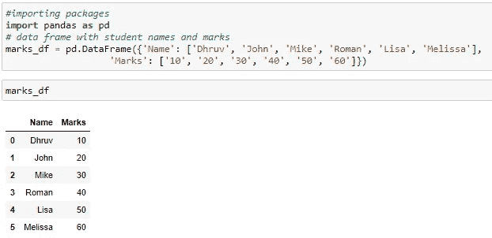

标记 _ 数据帧

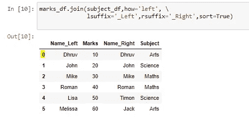

有两个数据框**标记**(包含每个学生的所有标记)和科目(包含每个学生的所有科目)。注意，在这个例子中，我们假设一个学生有一个科目。

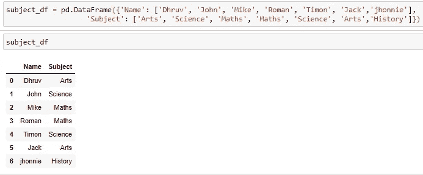

主题 _ 数据框架

# *如果你仔细检查，你会发现这两个数据框有共同点——名字和索引。对于连接，我们使用索引。让我们看看，如果我们应用连接，会输出什么*

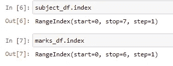

索引 _ 范围

两个数据帧具有两个不同的索引范围(0 到 6)表示 7 个值，而另一个具有(0 到 5)表示 6 个值。将根据索引中的值执行连接操作

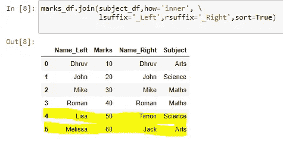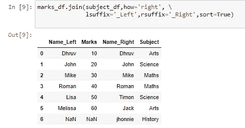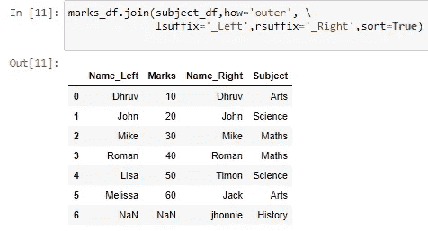

连接类型

> 如果你仔细观察，基于索引的连接并没有给出我们想要的结果，即每个学生的分数和科目。在上面的快照中，我用黄色突出显示了结果数据框中给出的错误信息。使用 pandas **merge** 解决了这个问题，它的表现类似于 SQL join(基于列的连接)。

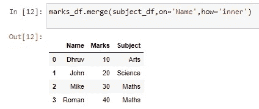

使用 merge 的内部联接

现在检查“使用合并的内部连接”图片，我们现在能够得到想要的结果。每个学生都有自己的分数和科目。

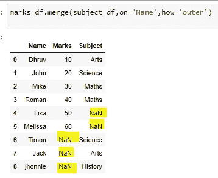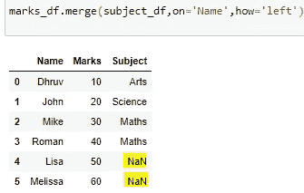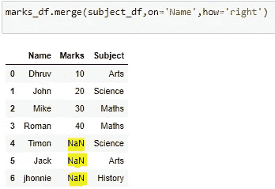

**熊猫种类合并**

大多数时候，开发人员、数据工程师和数据科学家在不知道方法用法的情况下使用方法。如果 join 不起作用，请使用 merge。根据上面的解释，你可以根据你的需求决定使用哪一个。

照片由 [krakenimages](https://unsplash.com/@krakenimages?utm_source=unsplash&utm_medium=referral&utm_content=creditCopyText) 在 [Unsplash](https://unsplash.com/s/photos/high-five?utm_source=unsplash&utm_medium=referral&utm_content=creditCopyText) 上拍摄

# 感谢你阅读这篇文章直到最后。在接下来的日子里，我会分享更多的文章。

请给我关于这篇文章的反馈，如果你想知道更多，请评论！！快乐编码和订阅:)