# 疫情、混乱和灵丹妙药 EDA

> 原文：<https://medium.com/analytics-vidhya/pandemic-pandemonium-and-the-panacea-an-eda-73c57c6ac58c?source=collection_archive---------18----------------------->

演职员表:[此处](https://www.cdc.gov/vaccines/covid-19/training-education/resources.html)

一年多前，我们的生活变得一团糟。礼貌:冠状病毒的意外到来。这是一场多米诺骨牌游戏，我们每个人过去和现在都受到这种长期以来被称为疫情的致命疾病的影响。截至 2021 年 5 月 15 日，[已确诊超过 1.61 亿例](https://en.wikipedia.org/wiki/COVID-19_pandemic_cases)，其中[超过 335 万例死亡](https://en.wikipedia.org/wiki/COVID-19_pandemic_deaths)归因于新冠肺炎，使其成为历史上[最致命的流行病之一](https://en.wikipedia.org/wiki/List_of_epidemics#Major_epidemics_and_pandemics_by_death_toll)。

感谢一线工作人员和更多的个人，我们成功地保持了人类的繁荣。话虽如此，我们也要感谢自己，感谢自己勇敢地面对这一切，战胜一切困难，塑造了我们的生活方式，适应了这种情况。为了帮助这一过程，疫苗被证明是冠状病毒的游戏规则改变者。疫苗一个接一个地在市场上推出，每一种都被证明能有效地减少活跃病例的数量。

我对 Kaggle 上的[*【1】*](https://www.kaggle.com/gpreda/covid-world-vaccination-progress)*和*[*【2】*](https://www.kaggle.com/josephassaker/covid19-global-dataset)*这两个数据集非常感兴趣，这支持了我说服人们接种疫苗的目的。*

*在这篇博文中，我想分享我在探索疫苗接种数据集时获得的一些关键见解，以及每次可视化得出的结论。随着数据每天都在更新，让我们希望看到这种情况的积极变化。*

*附上我在 Github [这里](https://github.com/Nidhi-Pai/Vaccination-Progress_EDA)或者 Kaggle [这里](https://www.kaggle.com/nidhipai99/pandemic-pandemonium-and-the-panacea-an-eda)的代码。在我的 Kaggle 代码中可以获得交互式版本的 chloropleth 和 tree 地图。我使用 python 作为编程语言，主要使用 numpy、pandas、matplotlib、seaborn 和 plotly 进行推理。*

*【covid 病例是如何加重的，目前是什么状态？*

*[https://www . ka ggle . com/nidhipai 99/疫情-pandemonium-and-the-pandemonium-an-EDA？rvi = 1&script version id = 62971205&cellId = 7](https://www.kaggle.com/nidhipai99/pandemic-pandemonium-and-the-panacea-an-eda?rvi=1&scriptVersionId=62971205&cellId=7)*

*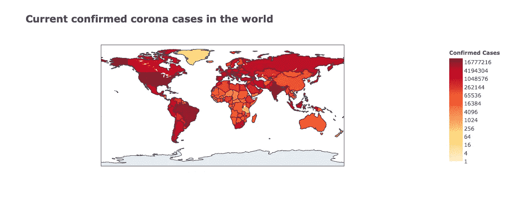*

*我们可以清楚地看到，几乎每个国家的病例都呈指数增长，但它们显示出改善的迹象，这种转变在两张氯普图中得到了明显的描绘。我有意避免深入这个数据集。这种情况感觉有点过于严峻，无法详细说明，因此，我将利用我们取得的小胜利，并利用这个机会深入研究疫苗接种数据集。*

# ***探索疫苗接种数据集***

*这个数据集相对较小，只有 15 列和 17607 行。这些数据每天从[我们的世界的](https://ourworldindata.org/) GitHub 数据库中为[新冠肺炎](https://github.com/owid/covid-19-data)收集，合并并上传。*

1.  ***每个国家有多少人接种疫苗？***

*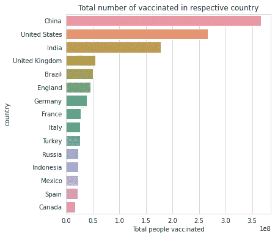*

*我们可以看到，中国、美国和印度是接种疫苗总人数的前 3 名竞争者。然而，目前还不清楚这是因为人口规模大，他们在图表上名列前茅，还是因为他们实际上在该国大多数人都接种了疫苗(密度方面)。*

***2。哪些国家完全接种疫苗的人数最多？***

*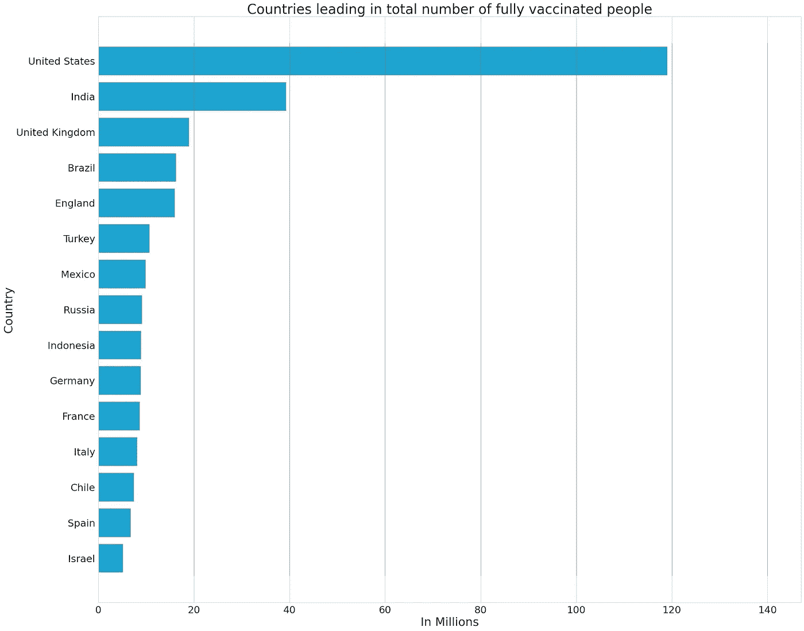*

*上面的柱状图表明，累计起来，每个国家至少有 500 万人已经完全接种了疫苗。如前所述，考虑到人口与疫苗接种的比例，我想这是显而易见的。*

***3。将日期与每日疫苗接种进行比较时，注意到了什么趋势？***

*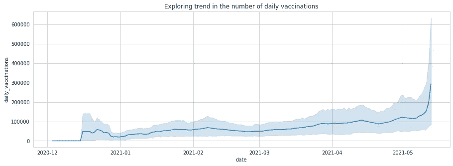*

*随着 2020 年 12 月第一剂疫苗的接种，从 2021 年 4 月开始，接种疫苗的数量急剧上升。这是一个积极的变化，因为这有助于我们推断，越来越多的人开始意识到疫苗的必要性和重要性，并且他们愿意注射疫苗。干得好！*

***4。印度的疫苗接种情况如何？***

*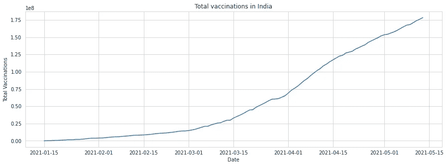**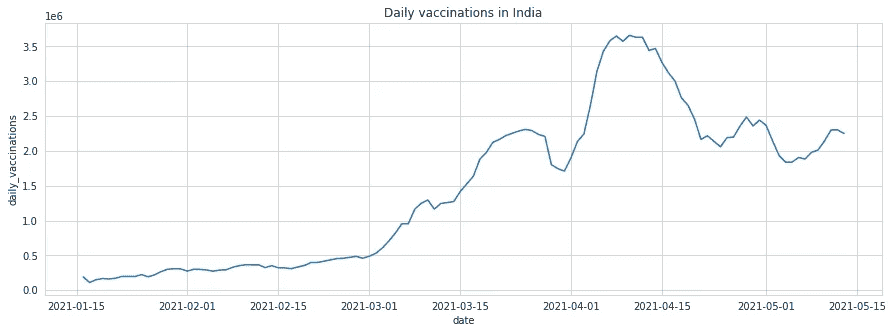*

*这确实是一个积极的变化！我希望这是一个越来越高的斜坡，我们能够让所有人都接种疫苗。*

***5。最常用的疫苗是哪一种？***

*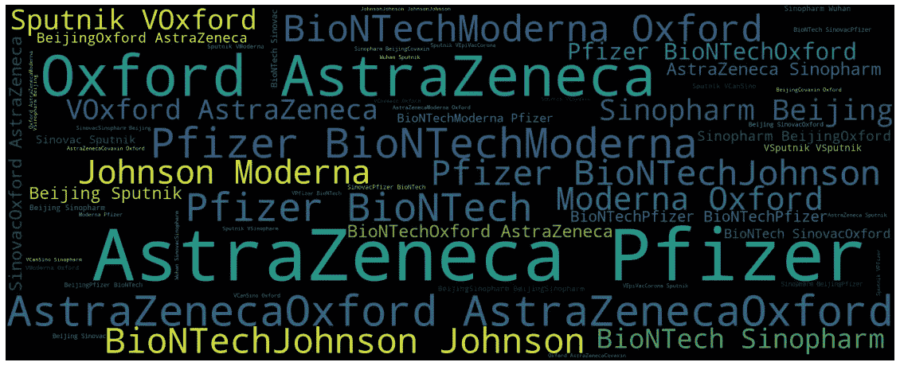**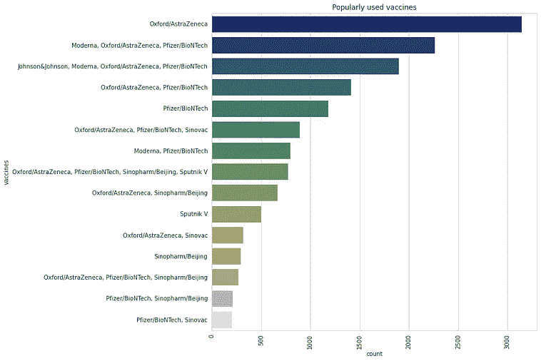*

*从 wordcloud 中，我们可以清楚地注意到，阿斯利康紧随其后，辉瑞和牛津似乎是最受欢迎的疫苗。柱状图中的可视化再次证实了这一点。像 BioNTech，Johnson&Johnson，Sinopharm 这样的疫苗似乎是下一个目标。也就是说，不要等待特定的疫苗出现。你有机会接种疫苗吗？抓住它。*

***6。哪个国家更喜欢什么疫苗？***

*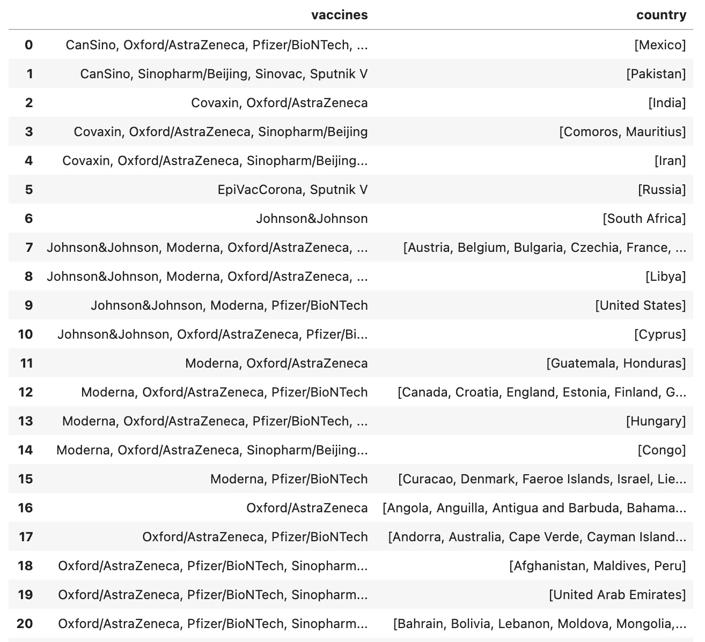**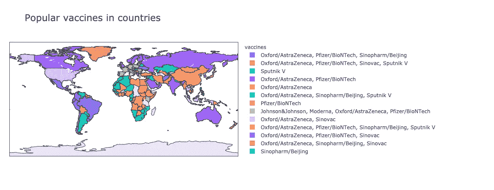*

*想了解更多信息吗？这里有一个树状图有更多信息:
[https://www . ka ggle . com/nidhipai 99/疫情-pandemonium-and-the-pandemonium-an-EDA？rvi = 1&script version id = 62971205&cellId = 43](https://www.kaggle.com/nidhipai99/pandemic-pandemonium-and-the-panacea-an-eda?rvi=1&scriptVersionId=62971205&cellId=43)*

# *为什么疫苗可以带来改变？*

*为了确保疫苗的有效性，让我们考虑一下前后的情况。考虑在美利坚合众国完全接种疫苗的人(每百人)。*

*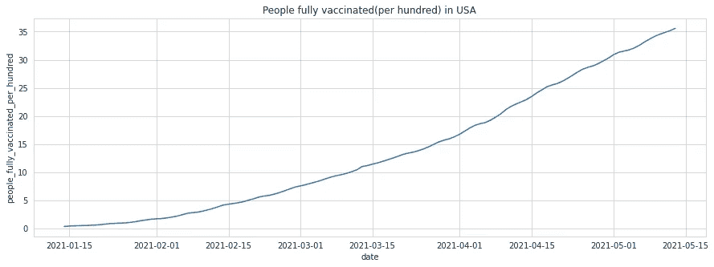*

*从按时间顺序排列的 chloropleth 中，让我们观察 2021 年 1 月 15 日和 2021 年 5 月 1 日的病例数并进行比较:我们注意到 2021 年 1 月 15 日的病例总数为 87，42，806。然而，截至 2021 年 5 月 1 日(即接种疫苗后)，病例数骤降至 65，89，842 例，因此，活跃病例数肯定有所减少。*

*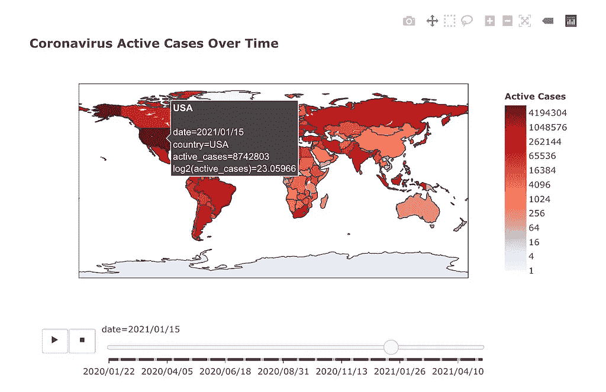**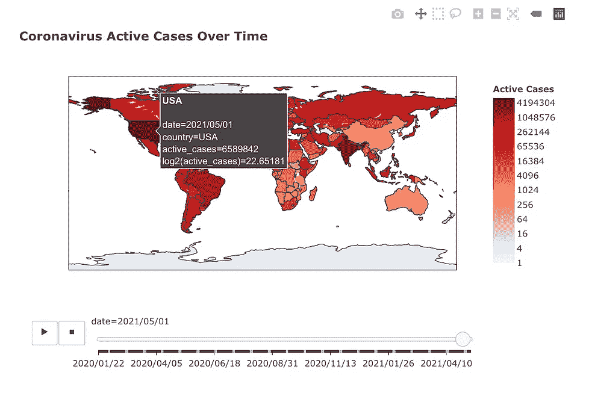*

*让我们考虑另一个国家来巩固这一观察。这次我们以 UAE 为例，按照同样的步骤。*

*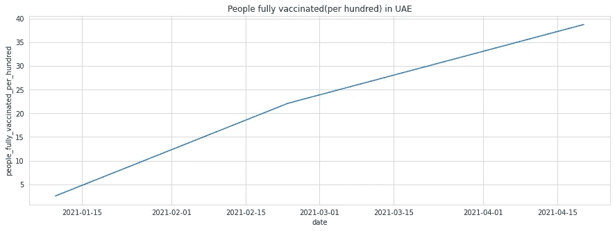*

*2021 年 1 月 15 日，活跃案件约为 26，655 起。截至 2021 年 4 月 15 日，活跃案件数量降至 14，866 起。这再一次证实了观察结果:是的，疫苗是有效的，它们在减缓病毒传播方面发挥了巨大作用。退后，反吸血鬼！*

*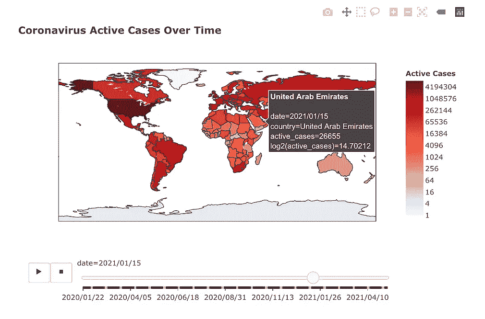**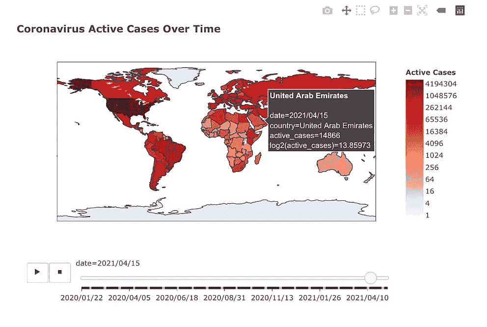*

# *要点*

*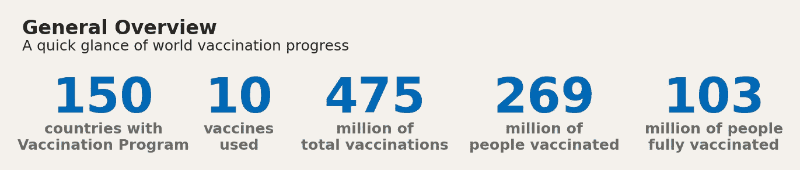*

# *结论*

*从数据集中提供的数据可视化的不同图表来看，我认为可以肯定地说，疫苗接种计划在增加，接种疫苗的人数也在增加。考虑到冠状病毒至少在过去一年半中达到顶峰，这一点至关重要。疫苗接种已经被证明是非常有效的，并且活跃病例的数量明显下降。也就是说，只吃一剂就心满意足对你或任何人都没有好处。如果一种特定的疫苗要分两次注射，就要两次注射。让我们尽自己的一份力量来减轻一线工人的负担，当然，也减少这种混乱和疫情。*

# *我们如何才能阻止新冠肺炎蹂躏国家？*

*没有办法知道疫情会持续多久。有许多因素，包括公众减缓传播的努力，研究人员更多地了解病毒的工作，他们对治疗方法的研究，以及疫苗的成功。请记住，最好的 covid 疫苗是您可以获得的疫苗。所以，等待你的机会，去尝试吧！帮助别人挨刺，如果他们看起来犹豫不决，尽你所能说服他们。戴上口罩(即使你已经完全接种了疫苗)，使用消毒剂，我猜现在你已经知道该怎么做了！希望能看到终点，让我们一起消灭病毒！我们能做到！*

**

*谢谢你读到这里。欢迎大家发表意见！*