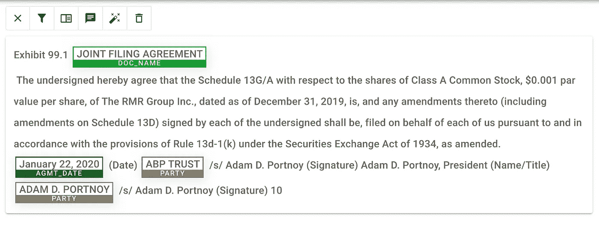
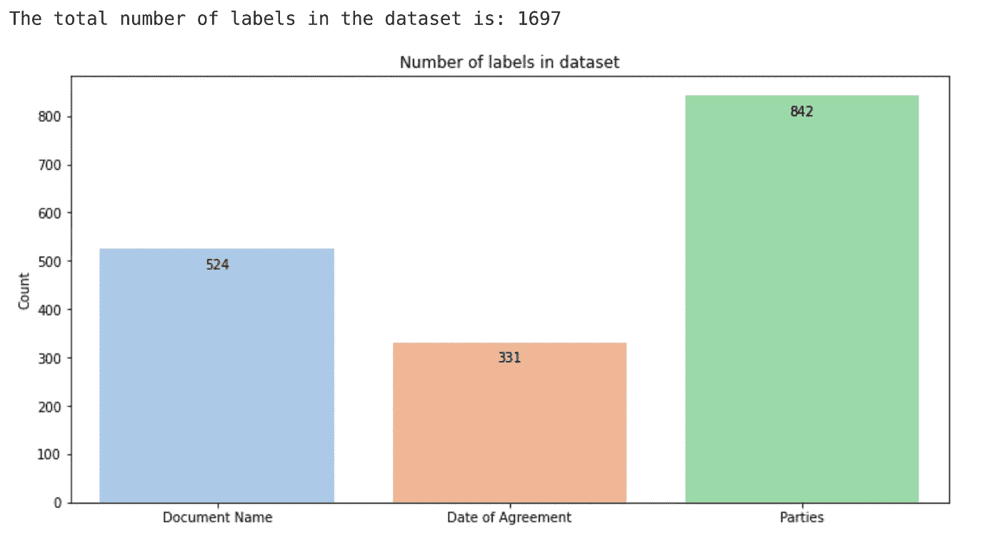
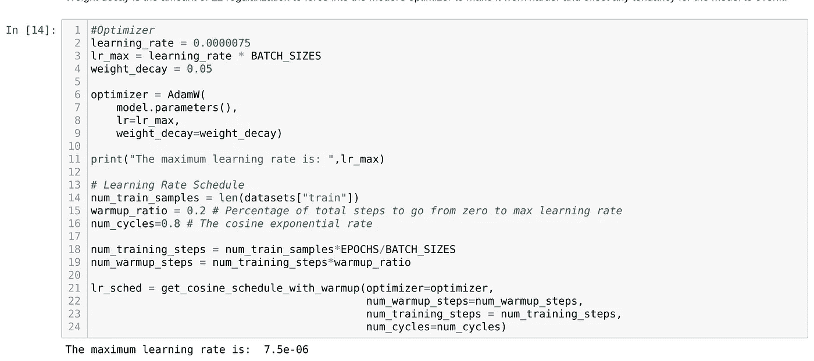
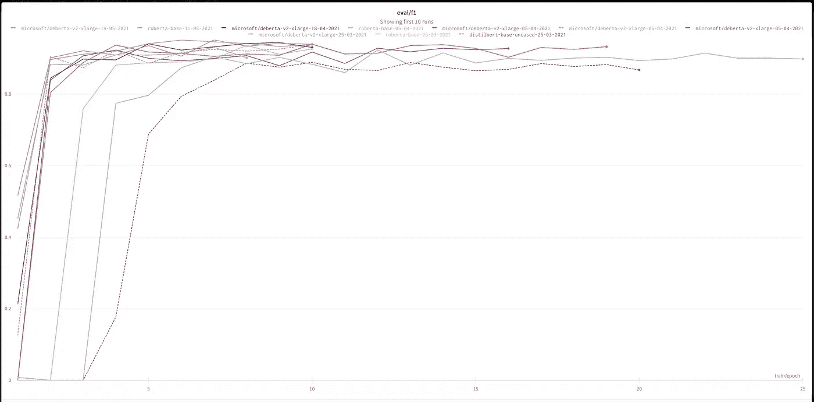
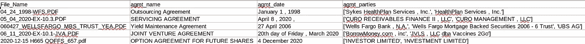

# 论文 2 数据-如何使用人工智能从法律合同中提取信息的示例。

> 原文：<https://medium.com/analytics-vidhya/paper-2-data-an-example-of-how-to-extract-information-from-legal-contracts-using-machine-learning-476fedd55592?source=collection_archive---------0----------------------->

使用最先进的自然语言处理(NLP)技术从法律合同中自动提取基本信息并将其转换为结构化数据的实际使用案例。

娜娜·斯米尔诺娃在 [Unsplash](https://unsplash.com?utm_source=medium&utm_medium=referral) 上的照片

# 摘要

随着机器学习的应用和实际实施越来越多地走出学术界和大型技术领域，许多行业和部门都出现了许多机会。

作为支持泽西岛国际金融服务部门参与者的社区项目的一部分，我们展示了一个从法律文件中提取基本信息的实际例子。

使用当前的自然语言处理(NLP)技术，我们构建了一个数据工作流，用于标记来自 pdf 文档语料库的新数据集，训练模型以将法律合同文本中的非结构化数据转换为格式良好的结构化数据，并在一组样本文档上演示这一点。

这篇文章解释了这个过程，所有使用的代码都可以在 Jupyter 的笔记本中找到，并且包含在[项目的 GitHub 资源库](https://github.com/JsyPhil/paper-2-data)中。此工作流程中的每个笔记本都链接在下面文本中每个部分的开头。

出于这个例子的目的，我们试图提取以下基本信息:

1.  协议的名称或标题，
2.  协议生效的日期。
3.  合同的所有当事人。

这可以用于流程管理、合同审查和分析等目的。

此外，完全相同的技术可以用于提取其他数据点的其他用例，例如贷款协议中的杠杆比率或有限合伙协议中的投资金额。

# 动机

使用机器学习分析法律文件的动机在过去五年左右发表的研究论文中得到了很好的解释，包括但不限于 Atticus 项目和主要来自雅典大学和希腊国家科学研究中心的各种研究论文(参见脚注参考文献 1–4)。

动机包括:

需要分析和监控各种任务合同的公司、律师事务所、监管机构和政府机构。

例如，当法律有修改或变更时，或者当客户需要他们审查现有合同时，律师事务所需要审查现有合同。

公司需要跟踪许多合同的日期、条款、金额和当事人。

在 M&A 活动和首次公开募股等公司交易过程中，公司及其法律顾问需要审查往往是数百份合同。

因此，在合同元素提取可以自动化的基础上，这将节省时间和金钱，最大限度地降低合同违约的风险，并提供有用的数据用于分析。

# 项目概述

在这个项目中，我们用多个最先进的预训练模型进行实验。我们使用[令牌分类下游任务](https://huggingface.co/transformers/custom_datasets.html#tok-ner)对这些进行微调，目的是识别我们希望提取的信息，并尝试确定最终模型的最佳模型和超参数，该模型可用于推理和结构良好的数据提取。我们使用“ [F1 的分数](https://scikit-learn.org/stable/modules/model_evaluation.html#precision-recall-f-measure-metrics)作为我们试图优化的指标。F1 分数使我们能够平衡召回率和精确度，最大限度地减少我们预测中的假阳性和假阴性。

我们将使用我们自己的预定义特征标签，并使用开源文档集作为我们的训练和验证数据集。具体来说，我们将使用[阿提克斯·CUAD 数据集](https://www.atticusprojectai.org/cuad)中的一些法律合同。

花费在项目上的大部分时间是为了确保文档被适当地和一致地注释，以创建一个带标签的数据集，我们可以放心地将它放入我们的模型中。值得强调的是，创建数据集的工作是这个项目成功的主要驱动力。

# 1.资料组

请看:[https://github . com/JsyPhil/paper-2-data/blob/main/F1-P2D-NER-CUAD-v1-Pre-Annotation-workflow . ipynb](https://github.com/JsyPhil/paper-2-data/blob/main/F1-P2D-NER-CUAD-v1-Pre-Annotation-Workflow.ipynb)

为了创建这样一个 NLP 项目的数据集，我们首先需要找到一个法律文档的语料库，将它们转换为文本，然后对它们进行适当的预处理，以与预训练模型的单词嵌入和标记化方法兼容。

幸运的是，CUADv1 法律协议数据集是由 Atticus 项目在 2021 年发布的，其中包含了从公开的 SEC 文件中获得的 510 份一般商业法律合同。

虽然 Atticus 项目已经创建了包含这些协议中 13，000 多个标签的数据集语料库，但鉴于我们的用例不同，我们需要构建自己的标签数据集。

## 文件长度

大多数 NLP 模型的当前限制是，它们对要进行预测的文本的长度有限制。通常是 512 或 768 个令牌，具体取决于型号及其结构。增加此值会对神经网络的大小产生指数效应，因此内存需求也是如此，因此通常会对模型有硬性限制。

法律合同通常会超过 512 个单词，标记化后会创建更多的标记(参见下面标签对齐下的解释)。

这在这个用例中很容易解决，因为要提取的大多数数据都在法律合同的顶部附近，所以只需要合同的开头。

如果要在一个模型中使用整个合同，那么就需要克服这个问题。有可用的技术，没有硬帽的模型，也有为长文档开发的模型，如 Google 的 [Big Bird](https://github.com/google-research/bigbird) 。

## 标记方案

出于本项目的目的，我们希望从法律合同中提取以下基本数据点:

a)协议日期
b)文件名称
c)当事人

我们将使用[内-外-始(IOB)](https://en.wikipedia.org/wiki/Inside%E2%80%93outside%E2%80%93beginning_(tagging)) 标记惯例来创建以下要素标签，用于标注和标记数据集中每个协议的文本:

0 B-AGMT _ DATE
1 B-DOC _ NAME
2 B-PARTY
3 I-AGMT _ DATE
4 I-DOC _ NAME
5 I-PARTY
6 O

IOB 约定将帮助模型理解和学习哪个单词是我们要提取的数据的一部分。如果我们需要提取的两个独立的数据片段在文本中是相邻的，那么 IOB 约定会处理这种情况。例如，在协议的首页上，协议名称和协议日期可能紧挨着。在这种情况下，特征标注看起来和翻译如下:

*贷款协议
2021 年 5 月 7 日*

*B 文件名称，I 文件名称，
B 文件日期，I 文件日期，I 文件日期*

*1，4，
0，3，3*

因此，我们能够为每个文档中的每个单词创建一个特征标签，其中大部分是“6”，对我们来说不是有用的数据，但同时我们能够训练一个模型来知道每个契约中的哪几个单词包含我们想要提取的数据，即特征标签“0”到“5”。

## 注释每个合同

当涉及到为 NLP 项目创建数据集的要素标注文本时，有许多不同的选项。其中一些是专有的商业软件选项，一些是开源的，可以根据许可免费使用。一个好的开源选项是 [Doccano](https://github.com/doccano/doccano) 。

Doccano —文本分类—标签和注释

为了将文档转换成可导入 Doccano 的格式，我们准备了一个初始工作流来导入文本、清理文本并根据 CUAD 数据集中的可用信息自动进行一些标记。

只有 CUAD 数据集中的一些文档适用于我们的用例，因为一些文档是模板，未注明日期或不包含交易对手信息。

我们用 Python 构建了一个工作流，在可能的情况下自动创建注释。如果自动化是不可能的，我们仍然能够识别这些合同，并在 Doccano 中手动审查文本。

Doccano 中的这个注释过程非常耗时。所有的证据都表明，对 NLP 模型可用的注释越多，模型的性能就越好。同样重要的是，注释在每个协议中都要一致地完成，以免混淆模型的训练。因此，每个注释在完成后都经过仔细检查。

按照这个工作流程，我们完成了包含 1，697 个标签的 314 个文档的数据集。

数据集中的标签数

# 2.预处理文本

请看:[https://github . com/JsyPhil/paper-2-data/blob/main/F2-P2D-NER-CUAD-v1-Dataset-preparation . ipynb](https://github.com/JsyPhil/paper-2-data/blob/main/F2-P2D-NER-CUAD-v1-Dataset-Preparation.ipynb)

使用多行 JSON 文件格式的 [JSONL](https://jsonlines.org/) 从 Doccano 导出文本和特征标签。然后，这些数据需要一些进一步的预处理，以创建进一步的 JSON 文件格式，为摄取到 NLP transformer 模型做好准备，并利用 handy Datasets 库(来自 Hugging Face)。

这是通过另一个 Python 工作流完成的，该工作流创建了从 Doccano 导出的每个契约中的每个单词的列表，并将其与从 0 到 6(如上所述)的相应标签列表进行匹配，这些标签与同样从 Doccano 导出的注释标签相关。然后以 JSON 文件格式导出。

数据集库可以利用和操作 JSON 数据，并与 Transformers 库很好地吻合，例如在创建训练和评估数据集时。

# 3.微调变压器模型

请看:[https://github . com/JsyPhil/paper-2-data/blob/main/F3-P2D-NER-CUAD-v1-Fine-Tune-transformer . ipynb](https://github.com/JsyPhil/paper-2-data/blob/main/F3-P2D-NER-CUAD-v1-Fine-Tune-Transformer.ipynb)

我们利用无处不在的[拥抱脸](https://huggingface.co)开源 NLP 库来获取和微调我们的模型。

拥抱脸已经成为当前最先进的 NLP 模型、数据集和其他资源(包括教程和支持良好的库)的事实上的去处。

来自[谷歌人工智能](https://huggingface.co/google)、[脸书人工智能](https://huggingface.co/facebook)、[微软](https://huggingface.co/microsoft)和许多其他包括大学在内的数据科学团队为拥抱脸提供了模型和库。

拥抱脸主持了谷歌人工智能从 2018 年开始的原始 [BERT](https://github.com/google-research/bert/) 模型的许多实现和进步。其中一些实现是针对特定用例的“微调”示例，而另一些是“预训练”示例，可以针对离散用例进行进一步训练。

为了这个项目的目的，我们感兴趣的是后者。预训练模型是一项了不起的创新，因为它们允许任何人使用通常已被训练到具有大量数据和大型计算资源的模型，通常只有“大型技术”和“学术界”才能使用这些模型。

这些预先训练好的模型可以用你自己相对少量的数据再多训练一点点，以达到很好的结果。

您必须接受一些限制，包括用于训练这些预训练模型的训练数据可能存在一些偏差。这种限制通常由预训练模型的开发者很好地解释。

## 模特们

为了微调我们的模型，我们试验了四种预训练的 BERT 变体:

[蒸馏瓶基本型号(无外壳)](https://huggingface.co/distilbert-base-uncased)

[蒸馏基准模型(装箱)](https://huggingface.co/distilbert-base-cased)

[罗伯塔基础型号](https://huggingface.co/roberta-base)

[德伯塔-v2 (xl)](https://huggingface.co/microsoft/deberta-v2-xlarge)

我们用来微调模型的工作流是基于拥抱脸提供的令牌分类基础工作流。对于我们的项目，我们只对“命名实体识别”实现感兴趣，以对文本中的实体进行分类，即文档名称、日期和当事人。

基础工作流适合我们的使用案例，包括:

1.  多个实验的配置设置
2.  定制要素标签
3.  Helper 函数专门用于对齐 DeBERTa-v2 (xl)模型中的标签预测(该模型没有 Hugging Face AutoTokenizerFast 类)。
4.  定制训练计划，包括热身和余弦计算学习率，以实现最佳调整。
5.  实施权重和偏差，方便实验和超参数跟踪。
6.  预测的抽样检查

## 标签对齐

值得特别注意的是，每个模型的符号化过程都可能导致复杂性。不同的模型将利用不同的定制标记器、字典和预先训练的单词嵌入。这些可以基于句子片段、单词片段或字节级 BPE(与 GPT2 相同)。这是当前所有模型中的创新领域。例如，微软开发的 DeBERTa 在几个月内就将其令牌化器从字节级 BPE 转换为跨越 v1 和 v2 的句子片段。拥抱脸很好地总结了各种记号赋予器的方法。

在一个工作流中容纳不同的模型和每个记号化器需要一些努力。

记号赋予器将添加记号来表示向量的开始和结束，这些记号和其他记号一起被称为“特殊记号”。此外，如果一个单词要通过模型，而该单词不在模型的预训练词典中，那么分词器会将该单词分解成单词的各个部分。

因此，通过模型传递的标记的数量将大于单词的数量。

当一个单词被分成两个或更多个标记时，分配给该单词的标签在这些标记之间重复。对于任何给定的句子，如何做到这一点在每个记号赋予器之间会有很大的不同。

当从模型中做出预测时，我们必须重新排列和重新完成单词，并删除或忽略特殊符号。

幸运的是，拥抱脸确实在平台上托管的一些预训练模型中适应了这一点，但在其他平台上没有。我们实现了处理这两种场景的代码，包括专门为 DeBERTa-v2 (xl)构建一个定制的助手函数。

## 学习率计划

我们发现，使用定制的学习率时间表对模型的性能有很好的影响。超参数可以在下面看到我们的最佳学习率时间表。

学习率计划—超参数

这有一个从 0 到最大值的预热，取决于批次的大小和余弦衰减。我们相信，定制的学习率计划可以优化性能，因为它可以很好地保持预训练的权重，同时针对我们的特定用例进行适当调整。

## 结果

我们在[体重与偏见网站](https://wandb.ai/native/'P2D-NER-2021'/reports/Paper-2-Data--Vmlldzo3MDQ5MjY?accessToken=bkdw23d3lsrhnu9s2wcptvq1cxaktghvoy3hl7kzalrbnd8v8i80a0svksze7awh)的主页上可以看到一些实验。

模型的性能—权重和偏差

我们发现，DeBERTa-v2 (xl)模型产生了最佳结果，F1 分数为 0.95，在大约 5 个时期和 1 或 2 的批量大小下持续实现，但非常消耗资源，因为即使是 2020 年的高端 GPU 硬件也无法运行该模型，原因是内存受限。我们不得不利用 NVIDIA 泰坦 RTX GPU 和 24GB 的 GPU 内存来运行这个模型。即使这样，根据 GPU 的数量和类型，批次大小也必须减少到每批次 1 或 2 个样本，否则运行将耗尽内存。这个模型有 9 亿个参数可以微调。

我们还在 RoBERTa base 上取得了良好的结果，F1 分数约为 0.92，经过约 5 或 6 个周期后，根据可用 GPU 的类型和数量，批量可达 16 个。这个模型有 1.25 亿个参数可以微调。

因此，RoBERTa base 是一个很好的折衷方案，对资源的需求要少得多，性能的降低也非常小。

这两个 DistiBERT 模型是让代码有效运行(包括精简和调试)的很好的模型。这是因为它们重量轻，运行速度快。然而，就推论而言，性能还不足以证明在 RoBERTa base 上使用它们是正确的。

DistilBERT 的未封装版本比封装版本性能更好。

我们认为，如果有更多的训练数据，更大的 DeBERTa-v2 和 RoBERTa 模型可能会表现得更好，这是经常发生的情况。

# 4.最终模型

请看:[https://github . com/JsyPhil/paper-2-data/blob/main/F4-P2D-NER-CUAD-v1-Final-Model-workflow . ipynb](https://github.com/JsyPhil/paper-2-data/blob/main/F4-P2D-NER-CUAD-v1-Final-Model-Workflow.ipynb)

我们使用实验中最有前途的超参数为 RoBERTa 和 DeBERTa-v2 xl 训练了最终模型。

在给定每个型号的 GPU 内存的情况下，我们使用了最大的批量。RoBERTa 和 DeBERTa-v2(x1)分别为 16 和 2。

所使用的优化器是 Adam，其学习率如上所述。

我们发现两种模型在 8 个时期后都有最佳性能。尽管如此，我们发现在大约 6 个时期到最多 10 个时期之后有相似的性能。

重要的是，建议对模型用于培训的任何法律合同使用相同的文本预处理。

# 5.推理

请看:[https://github . com/JsyPhil/paper-2-data/blob/main/F5-P2D-NER-CUAD-v1-推论. ipynb](https://github.com/JsyPhil/paper-2-data/blob/main/F5-P2D-NER-CUAD-v1-Inference.ipynb)

该单个笔记本的工作流程提供了以下实际过程:

1.  在定义的文件夹或位置中搜索任意数量的 PDF 格式的法律合同，并将其从 PDF 转换为文本。
2.  预处理此文本，以将其纳入微调后的最终模型。
3.  根据微调后的模型，可以准确预测协议名称、生效日期和合同各方。
4.  然后，这些预测被转换成结构化的表格格式，并作为 CSV 文件导出，与文档的全文一起供进一步使用。

从 NLP 模型导出表格数据。

# 结论

我们成功地展示了 NLP 如何应用于法律、专业和金融领域的一个具体而有价值的用例。我们希望这能激励技术专家、企业高管和经理们继续学习和利用这一重要技术，为他们的企业造福。

*特别感谢* [*马尔科姆·梅森*](https://www.linkedin.com/in/malcolm-mason-a901864/) *对整个项目的支持和了解。*

参考资料:

(1)伊利亚 Chalkidis，Ion Androutsopoulos，和 Achilleas Michos。2017.提取合同元素。《人工智能与法律国际会议论文集》，英国伦敦，2017 年 6 月 12 日至 15 日(ICAIL'17)，10 页。DOI:
[http://dx.doi.org/10.1145/3086512.3086515](http://dx.doi.org/10.1145/3086512.3086515)
【2】arXiv:2010.02559【cs。CL]
(3)arXiv:2101.04355【cs。CL]
(4)arXiv:2103.06268 v1【cs。CL]