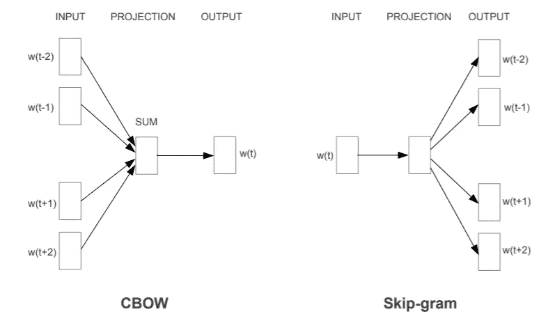
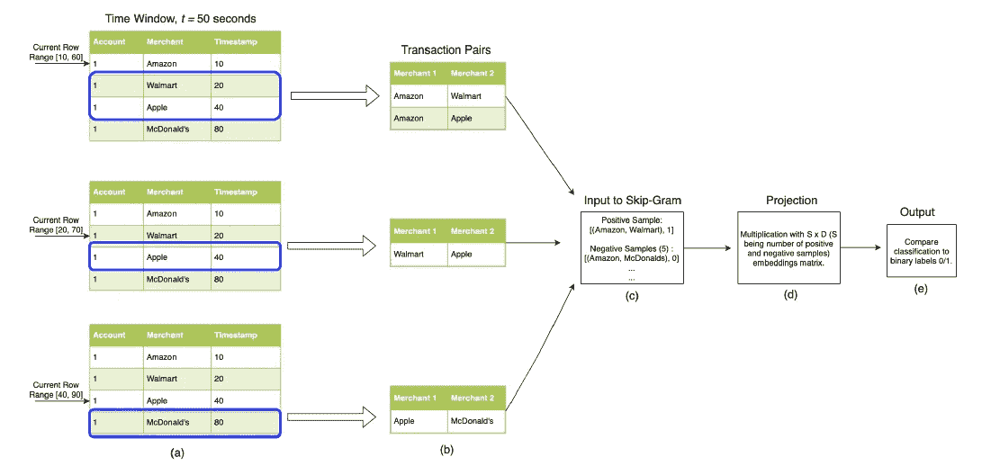
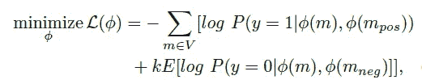
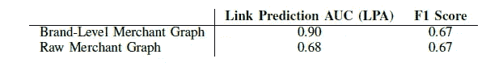
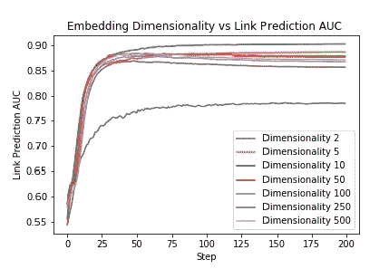
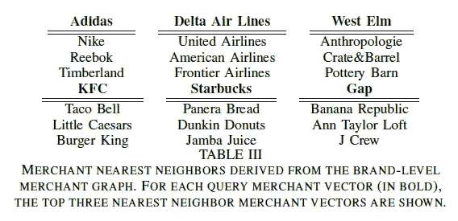
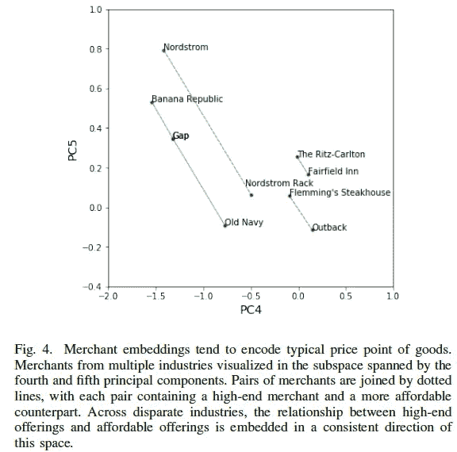

# 论文解释— DeepTrax:嵌入金融交易图

> 原文：<https://medium.com/analytics-vidhya/paper-explained-deeptrax-embedding-graphs-of-financial-transactions-3a9b6f5df1c0?source=collection_archive---------1----------------------->

## 嵌入在源自事务的二分图上训练，用于下游任务和可视化

来源:向量空间中单词表示的有效估计([https://arxiv.org/pdf/1301.3781.pdf](https://arxiv.org/pdf/1301.3781.pdf))

# 在本文中

*   二分图来源于信用卡交易。如果在特定时间窗口内，一个账户的两笔交易被表示为{商家，账户，商家}，那么这两个商家构成了二分图中的一条边。
*   该图用于训练跳格嵌入。
*   嵌入被发现将相似的商家聚集在一起。
*   对于下游任务，基于品牌的嵌入比原始的商家嵌入表现得更好。

这项研究是在第一资本完成的，全文可以在 https://arxiv.org/abs/1907.07225 的 T2 找到。

# 概述

*   介绍
*   数据
*   嵌入的 DeepTrax 方法
*   损失函数
*   性能指标
*   结果

# 介绍

客户和商家之间的交易创建了两个组的二分图；每条边代表一次交易。

一般来说，一个帐户或客户会在一段时间内与不同的商家进行多次交易。在合理的时间窗口内与多个商家的交易可能揭示这些商家之间的有意义的关系，或者揭示关于顾客本身的一些情况。这是使用事务派生嵌入的基本思想。

# 数据

按照上述思路，最简单的单位是一个账户在特定时间窗口内的一对交易。这可以表示为{Merchant_x，Account，Merchant_y}。在交易图中，这种序列可以通过从商家开始的两次跳跃来生成。从这些序列中的每一个，现在你可以得到一个同质的商人二分图，{Merchant_x，Merchant_y}代表一条边。

在实践中，您可以查询数据库中某个帐户在指定时间窗口内的所有交易，并创建与某个帐户交易的商户对。这是用于训练论文中的嵌入的数据。

DeepTrax 模型管道

# 嵌入的 DeepTrax 方法

如果您熟悉经典的 Word2Vec 技术，那么本文的其余部分就很简单了。上述数据用于训练跳格模型。训练两种类型的嵌入

1.  原始商户名称附加邮政编码
2.  品牌级别的商家名称，将所有特许经营汇总到同一名称

经过训练的跳格模型的亮点:

*   每天交易少于 50 笔的商户将被删除
*   针对线下和线上商家分别培训模型。这是合乎逻辑的，因为在线商家不受地理位置的限制，而线下商家则受地理位置的限制，因此线下购物在本质上可能会有很大的不同。
*   负样本是随机选取的，同时确保实际节点不存在采样案例。
*   该模型将捕捉商家之间的一阶邻近关系。如果仔细推导出较大的序列，就可以推导出更高阶的关系。

# 损失函数

优化问题和损失函数由下式给出

注意，这类似于交叉熵损失。 *k* 为阴性样本数。

# 性能指标

*   AUC 和 F1 分数被用作链路预测下游任务的性能度量。
*   嵌入通过二维 t-SNE 图进行定性分析

# 结果

## 数量的

*   基于品牌的嵌入性能在链接预测的下游任务中是优越的。

*   另一个有趣的观察结果是，对大量时期的训练可能会导致过度拟合和由下游任务定量建立的嵌入质量下降。

注意，对于更大的时期，链路预测 AUC 降低

*   随着嵌入维数的增加，可以更清楚地观察到嵌入维数的类似过拟合。

## 定性的

*   发现训练的嵌入将相似的商家聚集在一起。下面是一些例子

*   作者还发现，嵌入物在其中编码了价格信息，高端和低端品牌通过价格方向相关联。

# 参考

1.  DeepTrax:嵌入金融交易图(【https://arxiv.org/abs/1907.07225】T2)
2.  向量空间中单词表示的有效估计(【https://arxiv.org/abs/1301.3781】T4