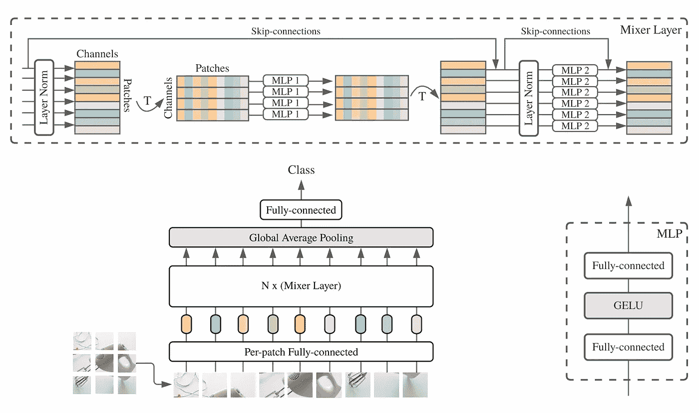
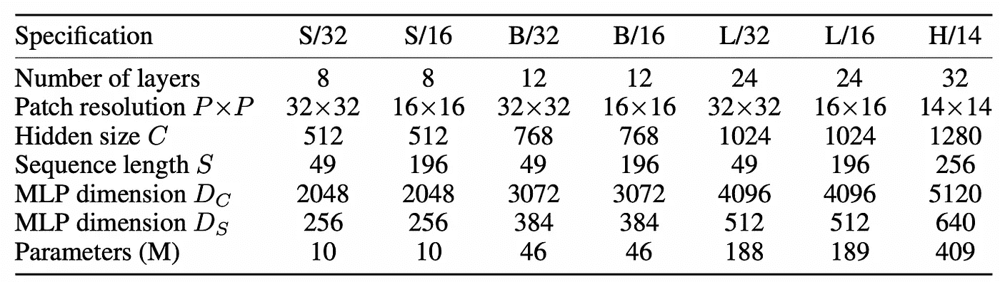
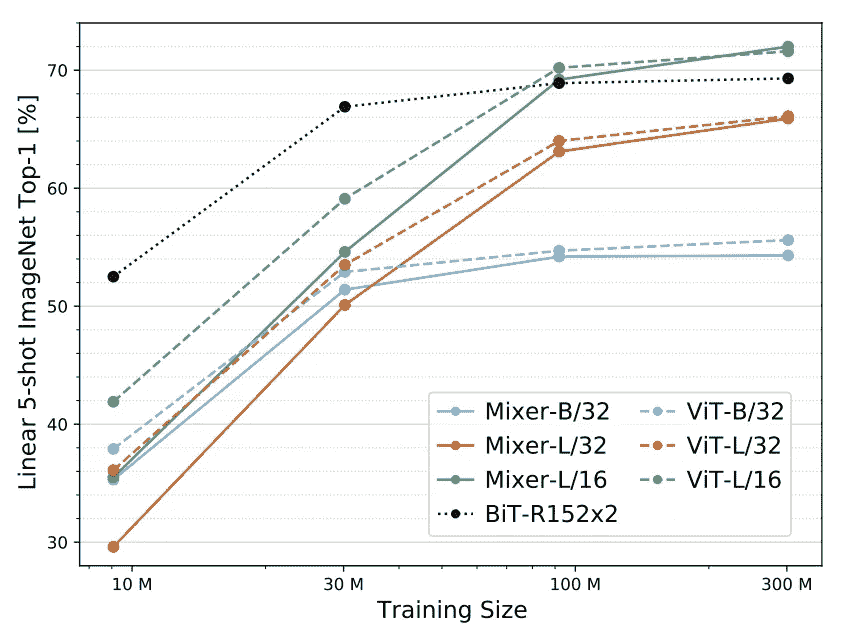

# 论文解释- MLP 混合器:MLP 建筑的视觉

> 原文：<https://medium.com/analytics-vidhya/paper-explained-mlp-mixer-an-mlp-architecture-for-vision-5e217ea8d287?source=collection_archive---------5----------------------->

MLP 混合器由每个面片的线性嵌入、混合器层和分类器头组成。混合器层包含一个令牌混合 MLP 和一个通道混合 MLP，每个都由两个全连接层和一个 GELU 非线性组成。其他组件包括:跳过连接、丢失、通道上的层规范和线性分类器头。图片取自[论文](https://arxiv.org/pdf/2105.01601.pdf)的第 2 页。

# 简介和概述

本文介绍了一个神经网络，它只是一个前馈多层感知器(MLP)，这意味着没有卷积，没有注意机制，没有λ层，什么都没有。只是矩阵乘法、非线性、归一化和跳过连接(改编自 ResNets’)。这篇论文类似于最近 SOTA 论文中阐述的抽象概念，被称为“[视觉变形金刚](https://openreview.net/pdf?id=YicbFdNTTy)”。我写了一个博客，详细地解释了视觉变形金刚，你可以在这里查看[。😌](/analytics-vidhya/vision-transformers-bye-bye-convolutions-e929d022e4ab)

# MLP 混频器架构

作者提出了一个分类体系结构。像在视觉变形器中一样，我们将输入图像分成小的小片(最好是 16✕16).大小的)图像尺寸必须能被碎片尺寸整除。现在，当我们在网络中传播时，我们只是对这些迷你补丁进行操作，不像在卷积神经网络中，我们通过制作特征图来缩小分辨率但增加通道，在这里，我们将有一个又一个层，所有层都具有相同的大小，并且**栈栈**直到结束。所以它很像一个变形金刚，当然这和变形金刚的区别在于各个层的外观。因此，就像在《变形金刚》中一样，首先，每个补丁都被馈送到一个完全连接的层，使其成为一个潜在的表示，也称为**潜在嵌入**。图像中的每个小块对应一个向量。使用相同的函数将每个面片投影到潜在空间中。

让我们试着理解什么是**混合器层**，这就是这个架构的核心。馈送到 MLP 架构的每个补丁被展开成一个向量，然后这些向量中的每一个被彼此堆叠，并且可以被解释为一个表。该表中的每一行代表一个具有 512 个通道的向量。有两种类型的 MLP 混合器层:**令牌混合 MLPs 和信道混合 MLPs。**

# 混合器层-解释

在令牌混合中，我们执行以下操作，我们以这样的方式转置表格，使得每一行都具有来自所有补丁的相同通道。因此，第一行表示，通道 1 的所有补丁在图像中，我们要饲料每一行相同的完全连接层(简单的 MLP 层)。事实上，您可以看到完全连接的层中的所有权重都是共享权重，这表示不同面片的相同通道之间的权重共享。令牌混合 MLP 允许不同空间位置(令牌)之间的通信；它们在每个通道上独立操作，并将表中的各个列作为输入。这有助于我们在逐个特征的基础上进行计算(512 个通道只不过是特征图)。该架构使用单通道深度卷积进行令牌混合。这也称为跨位置操作。

在通道混合中，因为权重是共享的，所以在元级别上，这意味着现在我们可以再次执行相反的操作，将表翻转回面片，然后对所有面片执行相同的共享计算。信道混合 MLP 允许不同信道之间的通信；它们独立地对每个令牌进行操作，并将表中的各个行作为输入。该架构使用 1✕1 卷积进行声道混合。这也称为每个位置的操作。**这两种类型的层是交错的，以实现两个输入维度的交互**。

最终，每个混合器层具有两个权重矩阵，一个矩阵是我们以相同的方式单独前向传播所有通道的矩阵。第二个矩阵是以相同的方式单独向前传播所有补丁的矩阵。

Mixer 的架构完全基于多层感知器(MLP ),这些感知器在空间位置或特征通道上重复应用。混频器架构仅依赖于基本的矩阵乘法例程、数据布局的改变(整形和转置)以及标量非线性。

# 混频器架构的规格

如果您看过《愿景转变》或《大转移》一书，所有这些在架构方面都非常相似。他们所做的是用不同的补丁分辨率建立一堆不同大小的模型。因此，分辨率始终是斜杠(/)后的数字。

表 1。图片取自[报纸](https://arxiv.org/pdf/2105.01601.pdf)的第 4 页。

与视觉转换器相比，由于注意力机制，当它们增加序列长度时(即，当它们降低分辨率时)，它们具有二次计算存储器需求。最终，图像中的碎片数量增加，因此，它们受到二次影响，而混合器仅受到线性影响。

# 规模效应

让我们在论文中提到的一个任务上对此进行分析。它们是许多提到的任务。我们将看看线性 5 镜头图像网络分类。

图片摘自[论文](https://arxiv.org/pdf/2105.01601.pdf)的第 6 页。

让我们看看 5 镜头线性影像网络分类的最高精度。以下是他们对 5 镜头分类器的定义:“我们报告了通过解决图像和标签的冻结学习表示之间的 L2 正则化线性回归问题而获得的少镜头精度。这是它如何工作的，你训练一个线性分类器在模型给你的冻结的表示上，你以最高的准确度评估它。这是一项非常特殊的任务。我们可以清楚地看到，在这个框架中，这个模型比其他模型更容易扩展。因此，BiT-R152 擅长小数据集，但随着训练规模的增加，它会停滞不前，不会有太大改善。然而，混音器模型的伸缩性非常好。

# 结论

这种模式受益于更大的规模，它是一种更简单的体系结构，具有更高的吞吐量(每秒每核的图像数量)，并且计算效率更高。这篇论文并不复杂，其简单的结构是它的卖点。准确性和计算之间权衡是公平的。从研究的角度来看，它提出了许多关于归纳偏差的问题，规模如何表现，以及是否可以在只有 SDG 和大量 TPU 的情况下让一切都工作。😶‍🌫️

**如果你喜欢这篇文章并获得了真知灼见，可以考虑** [**给我买杯咖啡** ☕️ **点击这里**](https://www.buymeacoffee.com/nakshatrasinghh) **。🤤**

# 参考

1.  [MLP 混合器:一个全 MLP 架构的愿景](https://arxiv.org/pdf/2105.01601.pdf)。

如果你喜欢这个帖子，请一定要鼓掌👏。💬连接？让我们来看看社会:[**http://myurls.co/nakshatrasinghh**](https://myurls.co/nakshatrasinghh)**。**