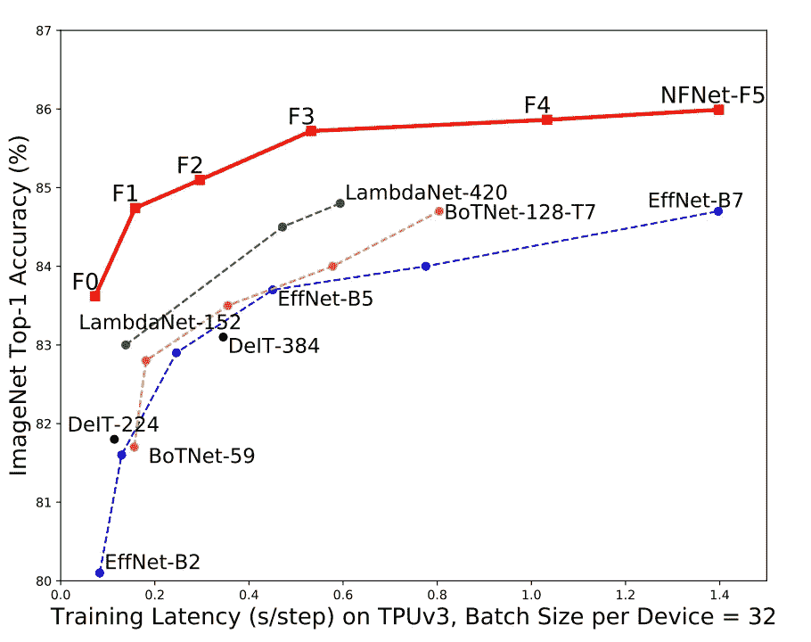
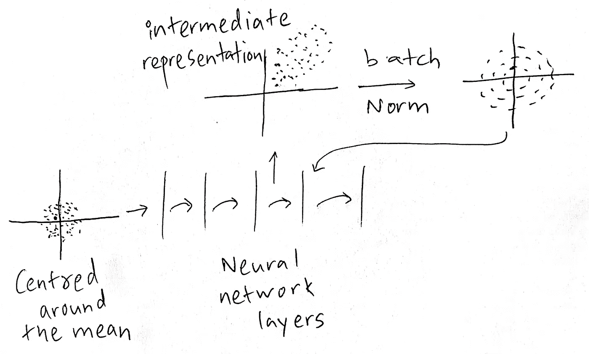
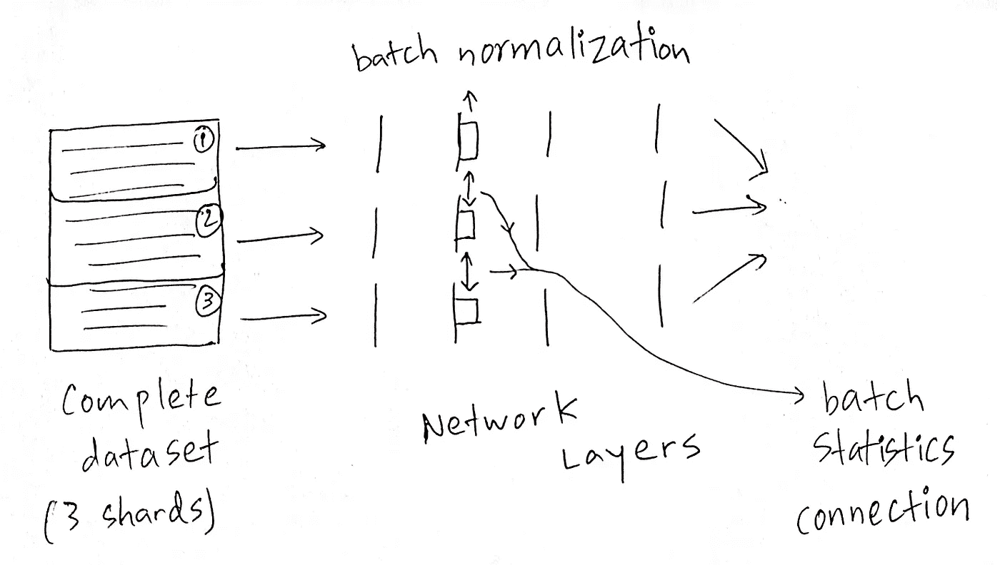
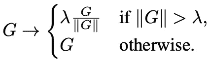
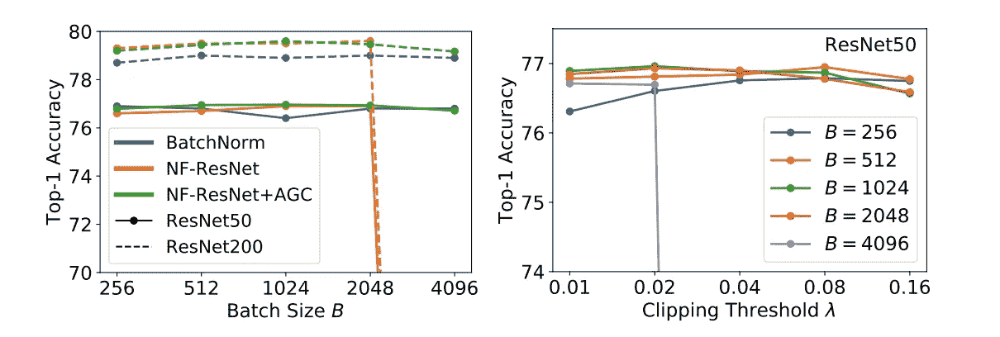

# 论文解释-规格化自由网(NFNETS):无需规格化的高性能大规模图像识别

> 原文：<https://medium.com/analytics-vidhya/paper-explained-normalizer-free-nets-nfnets-high-performance-large-scale-image-recognition-75518978b1fe?source=collection_archive---------6----------------------->

NFNet-F1 模型实现了与 EffNet-B7 相当的准确性，同时训练速度快 8.7 倍。图片取自[论文](https://arxiv.org/pdf/2102.06171.pdf)的第 1 页。

# 简介和概述

因此，本文的重点是在这种情况下构建网络，具体来说，**卷积残差风格网络**，其中没有批量归一化构建。但是，如果没有批量标准化，这些网络通常不会执行得很好，或者无法扩展到更大的批量，然而，本文在这里构建的网络可以**扩展到更大的批量**，并且**比以前最先进的方法**更有效(就像[λnets](/analytics-vidhya/lambdanetworks-modeling-long-range-interactions-without-attention-337771f42b6f)，我也写了一篇关于它的详细文章，[点击这里](/analytics-vidhya/lambdanetworks-modeling-long-range-interactions-without-attention-337771f42b6f)查看！！！🤞).训练延迟与准确度图显示，对于在 [ImageNet](http://www.image-net.org/) 上训练的同样的前 1 准确度分数，**nfnet 比 EffNet-B7** 快 8.7 倍。该模型是一种**新的最先进的**模型，没有任何额外的训练数据，也是一种新的最先进的迁移学习模型。**nfnet 目前在全球排行榜上排名第二**，落后于使用半监督预训练和额外数据的方法。

# 批量归一化有什么问题？

如果你有一个数据点通过一个网络，它将经历各种各样的转换，然而，如果你以错误的方式建立网络，其中的一些转换是非常不幸的。在机器学习中，一个好的做法是将数据集中在平均值周围，并将其缩放到单位变量，但是当你在各层中前进时，特别是如果你有 ReLU 这样的层，它们只会提取信号的积极部分。因此，随着时间的推移，可能会发生更下面的层之间的中间表示非常偏斜和不居中的情况。如果你的数据有一个很好的条件数(即，以平均值为中心，不是非常倾斜，等等)，那么机器学习的当前方法会工作得更好。

如何在神经网络中使用批范数转换数据的基本说明。

**批量标准化有 3 个明显的缺点**。**首先，它是一个非常昂贵的计算原语**，这会导致内存开销。你需要计算均值，标度，你需要把它们存储在内存中，用于反向传播算法。这增加了在一些网络中评估梯度所需的时间。

**其次，它在训练期间** **和推理时**的模型行为之间引入了一个差异，这是真的，因为在推理时你不希望这种批量依赖，你希望能够提供单个数据点，并且结果应该总是相同的。

**第三，批量归一化打破了小批量**中训练样本之间的独立性。这意味着，现在批次中的其他示例很重要。

这有两个主要后果。**首先，批量大小将关系到批量标准化**。如果你有一个小批量，均值将是一个非常嘈杂的近似值，而如果你有一个大批量，均值将是一个很好的近似值。我们知道，对于某些应用，大批量有利于训练，它们可以稳定训练，减少训练时间等等。

**其次，分布式训练变得非常麻烦**因为，例如，如果你进行数据并行，这意味着，你有一批数据，这批数据被分成 3 个不同的部分/碎片，这 3 个碎片被前向传播到一个神经网络中，这对于用于训练的所有 3 个不同的机器是相同的。现在想象一下，如果在所有 3 个网络中都有一个批次范数层，从技术上来说，您必须将信号正向传播到批次范数层，然后您必须在批次范数层之间交流批次统计数据，否则您将无法获得输入的整个批次的均值和方差。这使得网络能够**‘欺骗’**某些损失函数。

概述数据并行性如何使用批处理规范层之间的统计连接来工作。

# 论文投稿

1.  作者提出了**自适应梯度裁剪(AGC)** ，它基于梯度范数与参数范数的单位比来裁剪梯度，他们证明了 AGC 允许我们用更大的批量和更强的数据扩充来训练无规格化器的网络。
2.  作者设计了一系列无规格化器的 ResNets，称为 NFNets，它在 ImageNet 上为一系列训练延迟设置了新的最先进的验证精度。NFNet-F1 模型实现了与 EfficientNet-B7 类似的准确性，同时训练速度快 8.7 倍，最大的模型在没有额外数据的情况下创下了 86.5%的顶级准确性的新的整体水平。
3.  作者表明，在对 3 亿张标记图像的大型私人数据集进行预训练后，在 ImageNet 上进行微调时，NFNets 实现了比批量标准化网络高得多的验证准确性。最佳模型在微调后达到 89.2%的 top-1。

# 自适应梯度削波(AGC)

梯度裁剪通常用于语言建模以稳定训练，最近的工作表明，与梯度下降相比，它允许以更大的学习速率进行训练。梯度裁剪通常通过约束梯度的范数来执行。具体而言，对于梯度向量 G = ∂L/∂θ，其中 l 表示损失，θ表示具有所有模型参数的向量，标准裁剪算法在更新θ之前裁剪梯度，如下所示:

公式片段摘自[论文](https://arxiv.org/pdf/2102.06171.pdf)的第 4 页。

在训练期间，对于优化者来说，采取巨大的跳跃来达到全局最小值并不是很好，所以梯度裁剪只是说，每当任何参数的梯度非常大时，我们就简单地裁剪该梯度。如果梯度是好的，我们肯定会再次看到它，但如果是坏的梯度，我们希望限制其影响。问题是它对削波参数λ非常敏感，原因是它不是自适应的。

AGC 所做的是缩放梯度，但它不仅将梯度缩放到自己的范数，而且**将梯度限幅到** **比率(梯度有多大/梯度作用的权重有多大)。**乍一看可能会令人困惑，但我鼓励你看一看这篇文章并通读第 4 页，以便更清晰地理解 AGC。

限幅阈值λ是一个必须调整的标量超参数。根据经验，作者发现，虽然这种裁剪算法使他们能够以比以前更高的批量进行训练，但训练稳定性对裁剪阈值的选择极其敏感，需要在改变模型深度、批量或学习速率时进行精细调整。作者通过选择与梯度范数成反比的自适应学习速率来忽略梯度的比例。

注意，最佳削波参数λ可能取决于优化器、学习速率和批量大小的选择。根据经验，作者发现 **λ对于更大的批量应该更小。**

# 用于自适应梯度削波(AGC)的烧蚀

图像取自[论文](https://arxiv.org/pdf/2102.06171.pdf)的第 4 页。

例如，如果您比较图 1 中的批次范数网络，( **NF-ResNet 和 NF-ResNet + AGC** )您可以看到，在某个批次大小(2048)之后，非 AGC 完全崩溃，而 AGC 占优势。这似乎是提高批量的秘诀。作者抱怨限幅阈值λ非常苛刻。在图 2 中，您可以看到λ对批量大小有着至关重要的依赖关系，您可以看到，在小批量下，您可以在相当大的阈值下进行削波。在批量较大的情况下，你必须将阈值保持得非常低，因为如果你将它削波得更高，它就会崩溃。

**如果你喜欢这篇文章并获得了真知灼见，可以考虑** [**给我买杯咖啡** ☕️ **点击这里**](https://www.buymeacoffee.com/nakshatrasinghh) **:)**

# 参考

1.  [无需归一化的高性能大规模图像识别，2021 年 2 月 11 日。](https://arxiv.org/pdf/2102.06171.pdf)

如果你喜欢这个帖子，请一定要鼓掌👏。💬连接？让我们来看看社会:[**http://myurls.co/nakshatrasinghh**](https://myurls.co/nakshatrasinghh)**。**