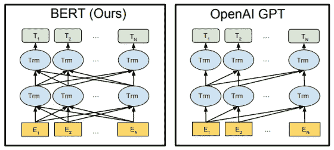
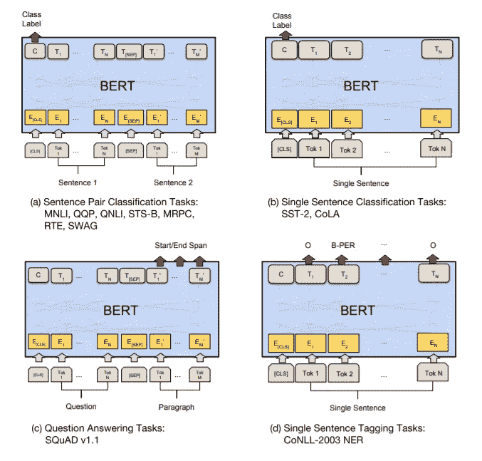

# 论文摘要——BERT:语言理解的双向转换器

> 原文：<https://medium.com/analytics-vidhya/paper-summary-bert-pre-training-of-deep-bidirectional-transformers-for-language-understanding-861456fed1f9?source=collection_archive---------4----------------------->

Jacob Devlin 等人的 [BERT](https://arxiv.org/abs/1810.04805) 论文是在大型 NLP 模型兴起期间，第一个 [GPT](https://openai.com/blog/language-unsupervised/) 模型发表后不久的 2018 年发表的。在发表的时候，它在许多重要的 NLP 基准上取得了显著的进步，比如 GLUE。从那时起，他们的想法影响了许多语言理解的最新模式。

这篇论文摘要的目的是让你对 BERT 论文中最重要的观点有一个概述，这样你就可以自己决定是否要阅读所有的细节。

# 简短的历史

2018 年是真正的 NLP 年，与 2012 年随着 AlexNet 的发布而成为计算机视觉年非常相似。最初的 [GPT](https://openai.com/blog/language-unsupervised/) 论文是第一个非常成功地在无监督的情况下预训练大型变压器网络，然后对其进行微调以达到 NLP 基准的最先进水平的模型。GPT 模型由原始变压器的堆叠解码器块组成，他们在一个大型文本数据集上进行预训练，任务是根据前一个单词预测下一个单词。在 GPT 发表后不久，BERT 基于相似的想法发表了他们的模型，他们一起改变了 NLP 研究的许多方面。

# 为什么伯特与 GPT 相比是独一无二的？

有两个主要的想法使得伯特论文如此成功。首先，它建立在 GPT 提出的想法之上，即在一个巨大的文本语料库上预先训练一个转换器模型，然后针对特定的 NLP 任务对其进行微调。第二个重要的想法是，它使用了双向转换器架构，将原来的[转换器](https://arxiv.org/abs/1706.03762)中的编码器堆叠在一起。

与为特定语言任务训练的传统模型不同，伯特和 GPT 都在大型文本数据集上半监督地预训练了他们的模型，如维基百科或总字数超过 30 亿的图书语料库。然后，BERT 在带标签的数据集上进行微调，用于 NLP 任务，如情感分析、问题回答或命名实体识别，并在许多著名的基准测试中远远超过了以前的 SOTA。

在 GPT 模型中，他们使用原始[转换器](https://arxiv.org/abs/1706.03762)的解码器层来执行自回归任务，其中每个令牌都是从文本中的先前单词生成的。该模型经过预训练，可以在大量文本数据上，根据给定的前一个单词预测下一个单词。在 BERT 中，他们使用了相同的预训练方法，但他们认为，通过让模型拥有感兴趣的单词之前和之后的上下文，可以大大提高许多 NLP 任务的性能。因此，他们使用双向变压器来构建他们的模型。他们所说的双向变压器实际上是原始变压器的编码器部分，输入端没有任何屏蔽。

# 模型和预培训

BERT 由堆叠的变压器编码器组成，他们在论文中为不同的变化提出了不同的层数。然而，重要的是要明白，使用编码器意味着像 GPT 那样预先训练伯特会导致目标泄漏。如下图所示，GPT 架构与输入文本中的未来单词和先前单词没有任何联系。由于 BERT 使用本质上是双向的编码器-变换器架构，然而，如果我们训练模型来预测输入文本中的下一个模型，将会有来自未来单词的目标泄漏。BERT 的作者通过使用两种不同的预训练方案来解决这一问题:训练以预测句子中间的屏蔽词，训练以预测两个输入句子是否连续。

图来自伯特[论文](https://arxiv.org/abs/1810.04805)。BERT(左)中使用编码器模块，GPT(右)中使用解码器模块。

第一种类型的预培训在出版时没有广泛用于变压器。举一个例句:*那边的草更绿*，他们会用以下方法之一屏蔽 15 %的单词:屏蔽标记(80 %)、随机单词(10 %)或原始单词(10 %)，其中指定的概率是他们发现最成功的。然后，模型的输入可以例如看起来像:*草在另一侧被掩蔽*，然后他们将训练模型在其词汇表中正确地分类被掩蔽的单词。

# 微调伯特

预训练的伟大之处在于，它允许模型使用几乎无限的数据资源来加深对语言结构的理解。尽管训练前的任务本身并不十分有用。相反，GPT 和伯特的目的是在特定的语言任务上进行微调。本文将简要描述如何将预训练的 BERT 模型用于分类、问答和命名实体识别任务，这些任务涵盖了测试 BERT 的大多数数据集。

图来自 BERT [论文](https://arxiv.org/abs/1810.04805)

# 句子分类任务

该任务涉及具有一个或几个输入句子的数据，其中模型应该进行分类，例如情感分析或判断两个句子是否同义。对于这种类型的任务，BERT 的输入是结构化的，如上图所示，用 SEP-token 分隔每个输入句子。在 BERT 的预训练期间，他们总是在输入的开始使用一个 CLS 令牌以及一个相应的输出节点，该输出节点意在聚集用于分类任务的输入的上下文。如果您要微调用于句子分类的 BERT，那么您将从该节点获取输出，并通过一个线性层将其传递给数据集中的多个类。

# 问题回答

我一直认为问答的任务是指一个模型可以像聊天机器人一样对一个提出的问题产生一个现实的答案。然而，在这种情况下(以及大多数其他情况下),这意味着给定一个问题和一个包含答案的参考文本，模型将识别参考段落中给出答案的位置的开始和结束索引。为了为此任务训练 BERT，您将添加两个线性层，一个用于预测开始索引，另一个用于预测结束索引，并输入来自与段落的输入标记相对应的 BERT 模型的最后一个编码器块的输出。然后，您将使用交叉熵损失(w. softmax)来训练开始和结束索引的分类。

# 命名实体识别

NER-任务包括将单词分类，如人，组织，时间等。为了对 NER 任务进行微调，你可以通过一个线性层将与输入句子中的每个单词相对应的 BERT 输出映射到类别数。

# 伯特的局限性

在许多方面，BERT 可以说是彻底改变了 NLP，但是这个体系结构有一些限制。通常，对于自回归任务(在推断期间一次预测一个表征)，没有训练 BERT 的明确方法，因为它是双向的，并且在训练期间输入目标会导致目标泄漏。为了保持它的细微差别，有论文提出了解决方法，但是 BERT 架构在这些任务中的任何一个都不是 SOTA(据我所知)。

对于上面提到的微调任务以及其他 NLP 分类或理解任务，类似 BERT 的模型在今天(2021 年 5 月)仍然是一些最先进的模型。

# 结论

除了展示当时 SOTA 的结果，伯特还为 NLP 研究中的许多后续模型铺平了道路。与 GPT 模型一起，BERT 还传播了在极其庞大的数据集上训练大型变压器模型的想法，这个基本上改变了 NLP 中进行研究的方式。

我希望这个总结能让你对 BERT 模型的基本原理有所了解。如果你有什么想法或者你认为我遗漏了什么重要的东西，请留下你的评论！