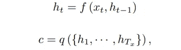

# [论文解释]—使用 Bahdanau 注意力的神经机器翻译

> 原文：<https://medium.com/analytics-vidhya/papers-xplained-neural-machine-translation-using-bahdanau-attention-7e3274c41e14?source=collection_archive---------1----------------------->

*******************************************************************

***【论文解释系列】:这一系列帖子背后的直觉是解释著名深度学习研究论文的主旨。***

*******************************************************************

杰弗里·布兰德杰斯在 [Unsplash](https://unsplash.com?utm_source=medium&utm_medium=referral) 上拍摄的照片

# 论文:联合学习对齐和翻译的神经机器翻译，2014

# 论文的重要性:

正在讨论的论文是**【联合学习对齐和翻译的神经机器翻译】**作者 *Dzmitry Bahdanau，kyung hyun Cho&Yoshua beng io*。

来源:原文：<https://arxiv.org/pdf/1409.0473.pdf>

这篇论文在 2014 年介绍了现在著名的 ***【注意机制】*** 。尽管注意的概念有了一些发展，但本文介绍的机制仍然被称为“ ***【巴丹瑙注意】或“附加注意”*** 。

## 论文链接:[https://arxiv.org/pdf/1409.0473.pdf](https://arxiv.org/pdf/1409.0473)

# 论文要点:

*   神经机器翻译(NMT)是使用神经网络将句子从源语言翻译成目标语言的概念。
*   在这篇论文之前，这样的 NMT 模型使用了多个网络，分别对它们进行训练。
*   本文提出建立和训练一个单一的大型神经网络，该网络读取句子并输出正确的翻译。这是当今使用的编码器-解码器架构的所有序列到序列模型的基础。
*   机器翻译，从概率的角度来看，类似于寻找一个使`p(y|x)`的条件概率最大化的目标句`y`，其中`x`是源句。
*   ***NMT 任务的目标:*** 使用平行训练语料库最大化句子对的条件概率。将使用参数化模型来模拟这种关系，并且该模型将使用反向传播来学习参数权重。
*   NMT 任务利用编码器-解码器模型(由 Sutskever 等人介绍，2014；Cho 等人，2014 年 a)。编码器和解码器组件都是神经网络。

## 编码器-解码器架构:

*   编码器接收源句子并将其编码成固定长度的向量。
*   解码器输出来自编码向量的翻译(目标句子)。
*   编码器-解码器系统被联合训练以最大化给定源-目标句子对的正确翻译的条件概率。

资料来源:Seq2Seq 文件—[https://arxiv.org/abs/1409.3215](https://arxiv.org/abs/1409.3215)

## 编码器-解码器架构的局限性:

*   解码器仅依赖于最后编码的固定长度向量来获得关于源句子的信息。
*   特别是当源句子相当长时，编码器很难将所有信息压缩到一个向量中。
*   经验证明，随着源句子长度的增加，基本编码器-解码器的性能会迅速恶化(Cho 等人(2014 年 b))。

那么，论文提出了什么来克服这些局限性呢？

## 学会联合调整和翻译:

*   该论文提出了对编码器-解码器模型的扩展，该模型学习联合“对齐”和“翻译”。
*   每当 NMT 模型生成一个翻译单词时，它将软搜索源句子中的一组位置，并寻找最相关信息集中的位置。这类似于挑选对最终翻译更有意义的单词。
*   这违背了将整个源句子编码成单个固定长度的上下文向量的概念。
*   然后，NMT 模型基于与这些源位置相关联的上下文向量以及先前生成的翻译输出来预测目标翻译。
*   和之前的方法有什么不同？这种方法将源句子编码成一系列向量，然后解码器在输出翻译时选取这些向量的子集。
*   那么好处是什么呢？它使 NMT 模型能够避免将所有信息压缩到一个向量中，而是允许模型理解长句并基于上下文重要性进行选择性搜索。

## 编码器-解码器框架背后的数学原理:

编码器将源句子作为向量序列`x = (x1, · · · , xTx )`处理成上下文向量`c`。

在哪里，

*   `h` 是潜州，
*   `c`是从隐藏状态序列中生成的上下文向量
*   `f, q` 是非线性函数

然后，在给定上下文向量`c`和所有先前预测的单词`{y1,y2....yt-1}`的情况下，训练解码器来预测下一个单词`yt`

这不过是给定`y`输出向量和`c`上下文向量的预测`yt`的最大似然估计。那么`p(y)` 给出为

使用递归神经网络，每个条件概率被建模为，

在哪里，

*   `g`是一个非线性的、潜在的多层函数，它输出`p(yt)`，
*   `st`是 RNN 的隐藏状态。

# 该论文中提出的编码器-解码器结构:

*   编码器模块是双向 RNN。
*   解码器是“搜索和对齐”模型的组合，该模型考虑来自源序列的所有隐藏状态，然后挑选最相关的向量。

来源:原文:【https://arxiv.org/pdf/1409.0473.pdf 

这里，

*   `X1, X2,…. XT`是源句标记。
*   指向隐藏状态两个方向的箭头— `h1, h2, h3`表示 RNN 块的双向性质。
*   然后，每个隐藏状态连同相应的权重`αt1, αt2..αtT`一起被传递给一个 ***【加法】*** 函数。

## ***为什么巴赫达瑙注意力被称为“加法注意力”？***

由于注意力上下文向量是通过将源句子的所有隐藏状态相加得到的，因此 Bahdanau 注意力也被称为“加法注意力”。

# Bahdanau 注意力机制背后的数学原理:

现在，让我们从数学的角度来看—

解码器模块负责预测序列中的下一个目标字，这由给定先前预测`yi-1`和输入字`x`的下一个预测`yi`的条件概率给出。

根据由附加注意机制计算的上下文向量`ci`，`p(yi|y1,...yi-1, x)`是以下的函数—

*   先前预测→ `yi-1`
*   当前 RNN 隐藏状态(或简称为当前状态)→ `si`
*   由附加注意机制导出的上下文向量→ `ci`

用数学的方式表达出来，

其中`si`是 RNN 隐藏状态，

即，概率取决于每个目标单词`y`的不同上下文向量`ci` 。

*   上下文向量`ci` 取决于编码器将输入句子映射到的注释序列`(h1, · · · , hTx )`。
*   然后，上下文向量`ci` 被计算为这些注释`hj`的加权和，

每个注释`hj` 的权重`αij` 计算如下:

这个等式有印象吗？是的，这与在所有多类分类问题中广泛使用的“Softmax”激活相同。

使用 softmax 进行额外关注可以确保以下几点-

*   考虑“所有”隐藏状态有助于计算上下文向量`ci`
*   它充当对齐模型，对位置`j`周围的输入单词和位置`i`处的输出单词的匹配程度进行评分。该分数基于 rnn 的隐藏状态。

## 训练 Bahdanau 注意力模型:

*   对齐模型(这是作者最初提到的注意力模型)是一个参数化的前馈神经网络。
*   使用反向传播机制，它与系统的所有其他组件一起被联合训练，即，成本函数的梯度将被用于重复地更新权重向量，直到收敛。
*   因此，除了 RNN 权重之外，甚至与每个隐藏状态相关联的注意力权重也将被“学习”。
*   权重将以这样的方式更新，即在翻译中具有最大重要性的单词将具有最大的权重值，这意味着在上下文向量中有更多的表示。

我们可以理解将所有注释的加权和作为计算期望注释的方法，其中期望在可能的比对之上。

# 注意机制如何有利于翻译质量？

如前所述，上下文向量`ci`作为所有隐藏状态`hj`的加权和给出。

其中权重`αij`由下式给出

假设`αij` 是目标单词`yi` 与源单词`xj` 对齐或从源单词`xj` 翻译的概率。

然后，第`i`个上下文向量`ci` 是所有具有概率`αij` 的注释中的预期注释。

概率`αij` 或其相关能量`eij` 反映了注释`hj` 相对于前一隐藏状态`si−1` 在决定下一状态`si` 和生成`yi` 中的重要性。

*直观地说，这在解码器中实现了一种注意机制。*

> 解码器学习决定源句子中需要注意的部分。通过让解码器具有注意机制，编码器从必须将源句子中的所有信息编码成固定长度向量的负担中解放出来。

因此，注意机制使解码器能够从源句子中进行“选择性检索”,而不考虑序列长度。到目前为止，我们已经看到了加法注意力机制背后的数学原理，以及编码器和解码器模块的内部工作原理。让我们继续理解并向涉众解释模型的预测(或翻译)。这是使用一个名为“ ***注意力地图*** ”的可视化概念来完成的。

# 可视化注意力地图:

注意力地图是一种可视化的方法，可以让解码器“注意”源句子中的哪些单词。两个词之间的关注度越高，单元格值越高，反之亦然。它在视觉上类似于热图矩阵，其中相关的词对以较高的颜色梯度突出显示。

来源:原文：<https://arxiv.org/pdf/1409.0473.pdf>

# 在我们结束之前…

Bahdanau 注意也称为“附加注意”,是注意机制的一种类型，自从本文介绍以来，已经取得了一些进展。

## 几个有用的链接:

*   注意机制的类型(Bahdanau & Luong 注意)→[https://blog.floydhub.com/attention-mechanism/](https://blog.floydhub.com/attention-mechanism/)
*   变形金刚原纸——注意力是你所需要的→[https://arxiv.org/pdf/1706.03762.pdf](https://arxiv.org/pdf/1706.03762.pdf)

***感谢关注:-)***