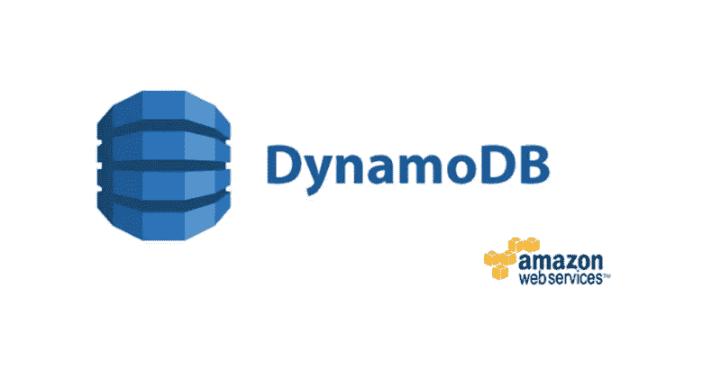
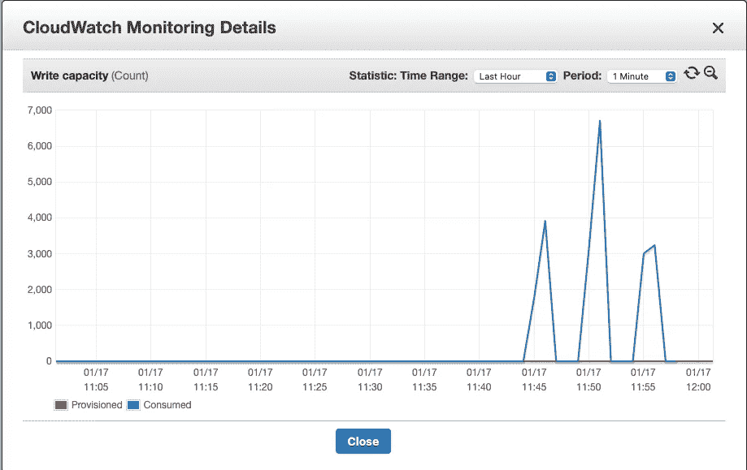
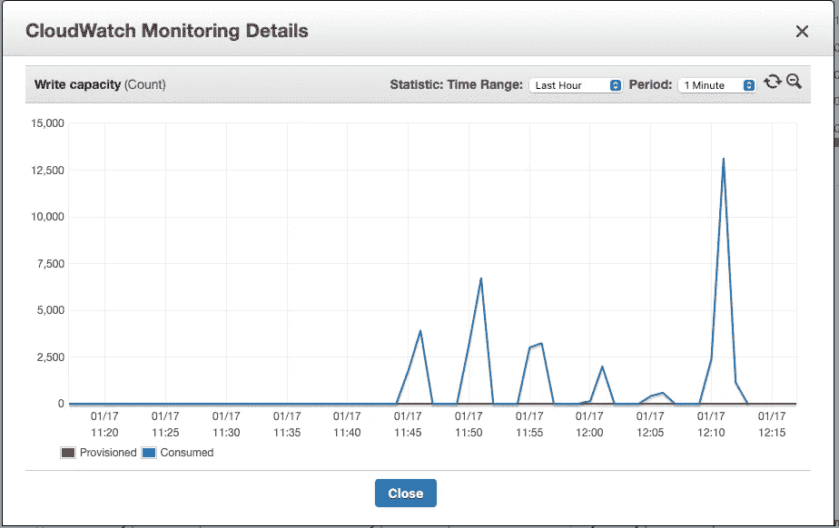

# Lambda 并行 DynamoDB 加载

> 原文：<https://medium.com/analytics-vidhya/parallel-dynamodb-loading-with-lambda-7737deba673f?source=collection_archive---------12----------------------->



我最近读了一篇非常有趣的博客文章(链接如下),其中谈到了一个将大量数据快速加载到 DynamoDB 的解决方案。受此启发，我想“我要建造它”，看看我们能做些什么。

[](https://towardsdatascience.com/dynamo-exports-may-get-your-data-out-but-this-is-still-the-fastest-way-to-move-data-in-5bcd9748cc00) [## 在 30 分钟内将 1 亿多条记录导入 DynamoDB！

### AWS 上周发布了一个新功能，只需点击几下就可以导出一个完整的发电机表，但也值得了解如何…

towardsdatascience.com](https://towardsdatascience.com/dynamo-exports-may-get-your-data-out-but-this-is-still-the-fastest-way-to-move-data-in-5bcd9748cc00) 

# **设置**

你可以在我的 GitHub 上找到所有的源代码(包括设置基础设施的 Terraform)。

[](https://github.com/CloudySnake/parallel-dynamo-loads) [## 云计算/并行发电机负载

### 通过在 GitHub 上创建一个帐户，为 CloudySnake/parallel-dynamo-loads 开发做出贡献。

github.com](https://github.com/CloudySnake/parallel-dynamo-loads) 

在我们进行的过程中，我将复制一些代码片段，但对于整个代码库，请查看顶部的 GitHub 链接。

我的设置非常简单，我将创建一个简单的 DynamoDB 表，并创建一百万行测试数据，我希望将这些数据放入 is 中。在这个过程中，我将看一下将数据加载到 Dynamo 的几个选项，这样我们就可以感受一下它们的运行速度。我的测试数据假装我有一个想要加载的客户记录负载，它由 customer_id (uuid)、客户获取日期、记录创建时间戳和最后更新时间戳组成。

你会看到我正在使用 PynamoDB 与 Dynamo 对话，我是这个库的忠实粉丝，因为它使对 Dynamo 的读写比直接使用 boto3 容易得多。当您进行更复杂的更新或查询时尤其如此，尽管在本文中我们不会进行复杂的查询。

# 本地加载数据

我们首先创建少量的记录，然后使用 Pynamo 来写记录。有两种方法可以做到这一点，单记录写入和批量写入。

**单记写道**

```
**def write_to_datastore**(customer_id: **str**, acquisition_date: **str**) -> **None**:
    current_time = datetime.now().strftime("%Y-%m-%d %H:%M")

    customer_record = Datastore(
        hash_key=f"CUST#**{**customer_id**}**",
        range_key=**None**,
        customer_acquisition_date=acquisition_date,
        created_timestamp=current_time,
        last_updated_timestamp=current_time,
    )
    customer_record.save()

**@timeit
def load_records**():
    **"""
    10,000 records - 256s (4.2m)
    """
    with open**("src/testing_data/outputs/load_file.txt", "r") **as** f:
        csv_reader = csv.reader(f, delimiter=",")
        **for** row **in** csv_reader:
            write_to_datastore(customer_id=row[**0**], acquisition_date=row[**1**])

**if** __name__ == "__main__":
    load_records()
```

这段代码将遍历测试文件，一次一条记录，并将数据写入 Dynamo。您将从我的 docstring 注释中看到，这样做大约需要。一万张唱片四分钟。在这种速度下，我们的一百万行可能需要 7 个多小时来加载。

**批记录写着**

Dynamo 提供批量写入功能，可以一次写入 25 条记录。Pynamo 通过 batch_write 上下文管理器使这变得特别容易。

```
**def create_record**(customer_id: **str**, acquisition_date: **str**) -> Datastore:
    current_time = datetime.now().strftime("%Y-%m-%d %H:%M")

    customer_record = Datastore(
        hash_key=f"CUST#**{**customer_id**}**",
        range_key=**None**,
        customer_acquisition_date=acquisition_date,
        created_timestamp=current_time,
        last_updated_timestamp=current_time,
    )
    **return** customer_record

**@timeit
def load_records**():
    **"""
    10,000 records - 13.61s
    50,000 records - 65.39s
    """
    with open**("src/testing_data/outputs/load_file.txt", "r") **as** f:
        csv_reader = csv.reader(f, delimiter=",")
        **with** Datastore.batch_write() **as** batch:
            **for** row **in** csv_reader:
                customer_record = create_record(row[**0**], row[**1**])
                batch.save(customer_record)

**if** __name__ == "__main__":
    load_records()
```

现在速度加快了，我们可以在 13 秒内载入一万张唱片。那还不错，但是一百万张唱片仍然需要大约二十分钟。我想做得更好。

# 带有 Lambda 的并联负载

理论很简单，如果我可以在大约一分钟内加载 50，000 条记录，那么 Lambda 也可以——如果我可以同时运行 20 条 Lambda，我就可以在一分钟内加载一百万条记录。

Lambda 处理器

```
**def handler**(message, context):
    s3 = boto3.resource('s3', region_name=os.environ["AWS_REGION"])

    body = json.loads(message["Records"][**0**]["body"])
    bucket = body["s3BucketName"]
    key = body["s3Key"]

    content = get_key_content(s3, bucket, key)

    **try**:
        **with** Datastore.batch_write() **as** batch:
            **for** record **in** content:
                customer_record = create_record(
                    record["customer_id"], record["acquisition_date"]
                )
                batch.save(customer_record)
        remove_s3_data(s3, bucket, key)
    **except Exception as** e:
        **print**(e)
        **raise**
```

有几点需要注意:

*   我最初用 Cloudwatch 事件尝试过，但是一个 cloudwatch 事件的大小被限制在 256KB。这是一个很大的数据，但对我们的目的来说还不够。
*   相反，我把东西推到 sqs 队列中，并且我正在利用 SQS 扩展库([https://github . com/timothymugayi/boto 3-SQS-extended-client-lib](https://github.com/timothymugayi/boto3-sqs-extended-client-lib))，它通过把东西推到 S3，在 256KB 的 SQS 限制附近工作。

我肯定还有其他方法可以做到这一点(例如，我可以让一个 Lambda 读取整个文件，并向下游 Lambda 发出指令，指示要处理文件的哪些部分)。但这是一个合理的开端。

**约束**

我使用了一个新的 DynamoDB 表，可以按需计费。首次创建 dynamo 表时，其写入容量限制为每秒 4，000 次写入。如果我们尝试将表推得比这更快，我们会看到写错误。

粗略地说，这不是一个问题，任何失败都将重试三次，如果不起作用，一旦可见性超时，消息将返回到 SQS 队列进行重新处理。就我们的目的而言，我没意见。值得指出的是，如果一个 Pynamo 批处理写入失败，那么我们将强制重新处理整个 20k 批处理，我确信我们可以更高效，并且只重新提交失败的批处理(25 个记录)进行处理，这将加快重新处理的速度，但是因为我们的目标是不出现错误，所以我不太担心这一点。

因为我们使用的是按需分配表，AWS 将在后台增加表的容量。这意味着，随着我们的表负载增加，我们可以执行的写入次数将会增加，错误也会越来越少。如果您在已经满负荷的现有表上执行此操作，那么您应该很少看到错误。

**加载尝试**

**每批运行 1–20，000 条记录**

运行 1 有许多发电机故障(正如所料)。当 Lambda 重试完成时，我能够加载大约 75 万条记录，其余的放回 SQS 队列。总的来说，这花了大约 25 分钟。我仍然认为一旦桌子变暖，这个速度会加快。这仍然是从本地机器发送数据的一个改进，因为 SQS &λ重试应该确保所有的数据都被处理，即使我们必须等待。这比我们的第一种方法更“一劳永逸”。

这是运行 1 的发电机指标



我们看到最初的写入上限为 4k，但是在第二次运行时(为了重试),我们看到每秒 7k 的新上限。

**每批运行 2–20，000 条记录**

有了一个稍微热一点的表，我们再启动一百万行，看看会发生什么。



现在我们在谈话。每秒 13，122 次写入的巨大峰值在大约两分钟内加载了整个一百万记录数据集(基于 cloudwatch 日志)。在这一点上，瓶颈不是 dynamo db——而是我在本地遍历文件并将 SQS 消息发送到队列的速度。

**成本**

DynamoDB 的按需计费模式意味着你要为你消耗的资源付费，所以花一个小时加载一百万条记录或在一分钟内完成将花费 DynamoDB 成本的节省。当然，这里有λ和 SQS 的“成本”,但这是如此之小，我甚至不会考虑它。

对于我这个非常简单的例子，加载一个 uid 和一些日期意味着我正在编写一个 150 字节的对象，每行消耗 1 个 WCU。在爱尔兰，一百万个写请求单元的成本是 1.4135 美元，或者换句话说“非常便宜”。

**结论**

通过使用 SQS 和 Lambda 并行地将数据加载到 DynamoDB 中，您可以显著地加快速度，一旦您的表达到最大容量，您就可以在几分钟内加载数百万行数据。