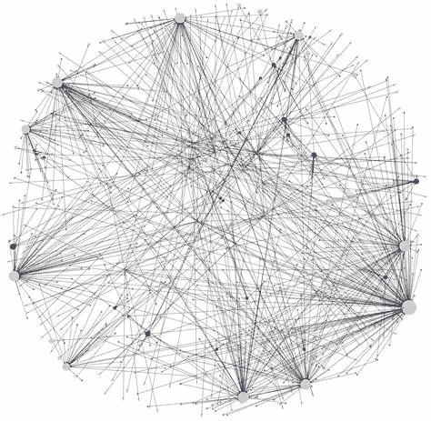
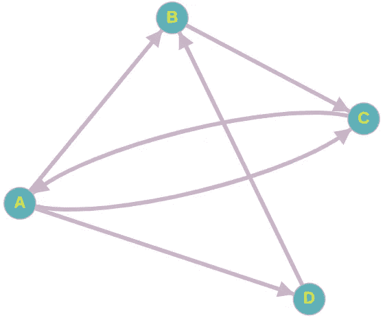
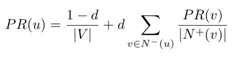
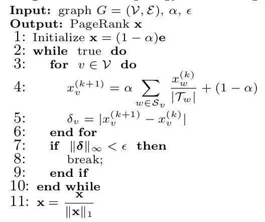
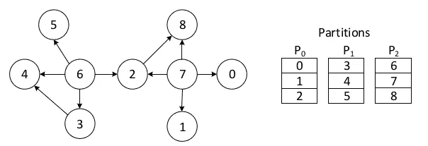
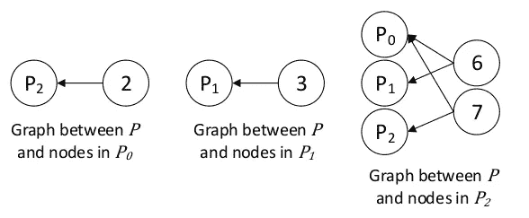
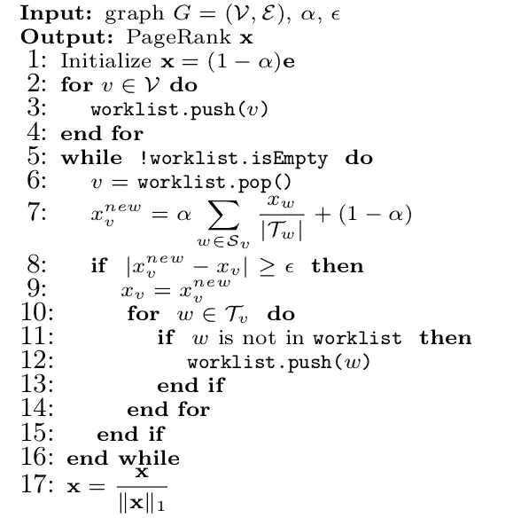
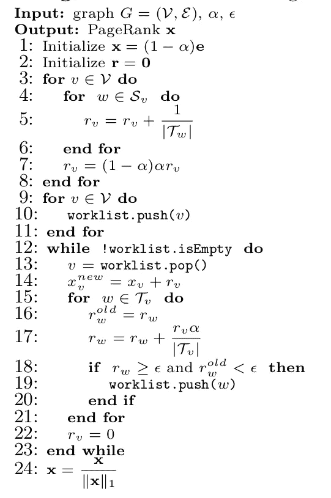

# 并行 PageRank:算法及其性能综述

> 原文：<https://medium.com/analytics-vidhya/parallel-pagerank-an-overview-of-algorithms-and-their-performance-ce3b2a2bfdb6?source=collection_archive---------4----------------------->

如果你过去研究过图算法，很可能你听说过一个叫做 PageRank 的算法。它是由谷歌的联合创始人拉里·佩奇和谢尔盖·布林在 1999 年开发的！他们需要一种新的算法来对不断增长的被谷歌索引的网页进行排名，PageRank 就是他们在这方面努力的成果。

注:各位极客想钻研原文的都可以在这里找到:[http://ilpubs.stanford.edu:8090/422/1/1999-66.pdf](http://ilpubs.stanford.edu:8090/422/1/1999-66.pdf)

互联网是完全开放和民主的，这对我们这样的人来说很好，但对像谷歌这样的搜索引擎来说却很头疼。由于任何人都可以在互联网上建立一个网站，因此它充满了低质量的内容、假新闻甚至访问起来很危险的网站。谷歌如何确保你的顶级搜索结果包含最新的、原创的、高质量的内容？

虽然谷歌目前的搜索算法肯定要比 PageRank 复杂和微妙得多，但 PageRank 算法确实为如何将互联网视为一个图形提供了一个精彩的视角。该算法将互联网设想为具有未加权边的有向图。图中的每个节点代表一个网页，两个网页之间的链接由一个链接表示。每个节点都会收到一个基于其“重要性”的分数。具有高质量内容的页面应该比具有低质量内容的页面获得更高的分数。

有两个关键因素决定了网页的重要性:

1.  包含链接的网页数量
2.  包含链接的网页的重要性

有时一个网页只有很少的链接，但它们来自可信的网页。例如，纽约时报网站上新发表的文章将只包含一个来自纽约时报主页的链接。但由于纽约时报主页是一个重要的网页，新文章的 PageRank 得分会很高，并会显示在搜索结果中。

其他时候，一个页面会包含许多较小的、不太知名的网站的链接。例如，在过去的几天里，许多博客作者写了 r/WallStreetBets 上的 redditors 如何从投资 GameStop 中获得巨额收益。他们的博客文章包含一个子编辑的链接。这增加了 r/WallStreetBets 页面的重要性，使其更有可能出现在搜索结果中。

# 了解 PageRank 公式

我们来借助上图了解一下 PageRank 是如何计算的。

PR(A) = PR(C) / out(C)

PR(B) = PR(A)/ out(A) + PR(D) / out(D)

PR(C) = PR(A) / out(A) + PR(B) / out(B)

PR(D) = PR(A) / out(A)

其中 PR(X)是顶点 X 的 PageRank 得分，out(X)是顶点 X 的出度。

概括地说，顶点的 PageRank 分数是它所接收的顶点的 PageRank 分数之和除以它们的 out 度。

最初，每个顶点的 PageRank 被初始化为(1/图中的顶点数)。标准串行算法在迭代中进行，对迭代中的每个顶点计算 PageRank，直到迭代中顶点的 PageRank 值的变化小于某个称为容差的阈值。请注意，顶点在迭代中的处理顺序是不相关的，因为在计算过程中，我们总是考虑在前一次迭代中计算的 PageRank。

以上是对 PageRank 的简单描述。实践中更常用的 PageRank 公式是:

来源:[1]

v 是图的顶点集，N+(v)是从 v 接收边的顶点集，N-(v)是从 v 接收边的顶点集。d 称为传送因子，通常设置为 0.85。(1-d)是一个冲浪者可能从当前网页随机导航到一个不包含链接的网页的概率(就像我有时开始阅读一篇关于图形算法的文章，但忍不住想查看板球比赛:D 的比分)。

# 并行 PageRank

目前为止 PageRank 看起来很简单，对吗？问题是互联网上有超过 500 亿个网站(来源:谷歌快速搜索)。如果我们在一个有 500 亿个顶点的图上运行 PageRank 的串行算法，当它完成执行时，我们可能都已经死了(除非埃隆·马斯克找到了一种将我们的意识上传到计算机的方法，但这是另一天的主题)。有什么解决办法？为什么，当然是平行 PageRank！

在大型图上并行执行 PageRank 有三种模式:内存中、内核外和分布式。内存计算将整个图形加载到服务器的主内存中(拥有 1 TB 主内存的最先进的服务器并非闻所未闻)。核外计算将图形保存在磁盘上，并根据需要将部分图形加载到主存中。分布式计算在多个服务器之间分割图形，并在服务器之间协调 PageRank 的执行。在本文中，我们将关注内存中并行 PageRank，因为它是最快的。我们将考虑这种算法的两种主要类型:拓扑驱动和数据驱动。

# 拓扑驱动与数据驱动算法

拓扑驱动算法是一种在一次迭代中处理图的所有顶点的算法。在加权图中寻找最短路径的 Bellman-Ford 算法是拓扑驱动算法的一个典型例子。在这个算法中，我们在一次迭代中松弛一个图的所有顶点的边，而不管一个特定顶点的边是否需要松弛。

另一方面，数据驱动算法只处理图中的“热”顶点，即。那些需要处理的。广度优先搜索是这种算法的一个很好的例子。在这个算法的每一步中，我们从工作列表中提取一个顶点，如果它的邻居没有被发现，就把它们添加到工作列表中。

与拓扑驱动的算法相比，数据驱动的算法往往更难进行理论分析，并且可能具有更差的最坏情况时间界限。然而在实践中，精心设计的数据驱动算法已被证明优于拓扑驱动算法，因为它们不执行多余的工作[2]。

# 拓扑驱动的 PageRank

拓扑驱动的 PageRank(来源:[4])

我知道这个看起来有点复杂，但它是 PageRank 的矢量化版本。x 是 PageRank 向量，e 是单位向量，α是‘d’或我们上面讨论的传送因子，ε是容差。在第 4 行，Sv 是顶点 v 接收边的顶点集合。Tw 是从顶点 w 接收一条内边的顶点集。它基本上与我们之前讨论的算法相同。

该算法的瓶颈是访问顶点的邻居会导致随机的 DRAM 访问，因为邻居可能位于 DRAM 中的任何地方。这导致数据访问的空间局部性较差，从而导致缓存效率低下，大部分时间都花在尝试从 DRAM 获取数据上。注意，数据访问的时间局部性也非常差，因为顶点的邻接数据一旦被访问，将仅在下一次迭代中被再次访问。

这个问题的潜在解决方案是应用收集-应用-分散模型(GAS)并重写算法。这将计算分为三个阶段:

1.  收集:在这个阶段，每个顶点从内存中的一个专用位置读取其邻居的 PageRank 值的更新，这些更新是由邻居写入的
2.  应用:在这个阶段，顶点更新它自己的 PageRank 值，因为它已经从它的邻居接收到更新的值
3.  分散:在这个阶段，顶点将其新的 PageRank 值写入其外部邻居的专用内存位置，以便它们在下一次迭代中进行处理。

这样做的好处是，在收集阶段，更新是串行存储的，这提高了数据访问的空间局部性。

虽然这是一种改进，但几年前有人提出了一种叫做分区中心处理方法(PCPM)的进一步优化[3]。在 PCPM 中，图的顶点被分组到分区中，如下图所示。

分区大小为 3 的示例图(来源:[3])

对于每个分区，记录从其接收 in-edge 的分区。连续空间被分配给每个分区，用于从其他分区获取更新。例如，P2 是 P0 将从其接收更新的唯一分区，因为 6->2、7->0、7->1 和 7->2 是它仅有的入边缘。因此，我们可以为这两个更新预分配连续的空间(即从顶点 6 和 7)，甚至在算法开始执行之前。

在简单的 GAS 方法中，更新沿着散布阶段的每个边缘发出。这导致大量冗余、随机的 DRAM 写入。使用上述方法可以消除这些问题。在该算法的并行实现中，一个线程一次聚集或分散在一个分区的所有节点上。在所有分区的收集阶段完成之前，不允许开始任何分区的分散阶段，反之亦然。

但是，仍然会发生对 DRAM 的随机访问，因为一个分区的节点可能包含多个分区的边，并且在分散阶段，更新可能会在所有这些分区之间交叉进行。为了防止这种情况，每个分区的二分图如下所示。

每分区二分图(来源:[3])

现在，在分散阶段，一个线程收集一个分区应该接收的所有更新，并串行写入它们。这仍然会导致对更新值的随机读取，但是因为二分图比实际的图小得多，所以随机读取对缓存更友好。

# 数据驱动 PageRank

数据驱动 PageRank 的工作方式就像拓扑驱动 PageRank 一样，只是它会计算顶点的 PageRank，然后将其邻居推入工作列表(就像 BFS 一样)。下图显示了相同的伪代码:

数据驱动的页面排名(来源:[4])

这里使用的符号术语与拓扑驱动算法的前一幅图像中的术语完全相同。

但这并不是实现数据驱动 PageRank 的唯一方式。这就是所谓的“拉”实现。这是因为无论何时从工作列表中弹出一个顶点，它都会提取或读取其相邻顶点的值，然后更新自己的值。另一种方法是将一个顶点更新后的 PageRank 推送给它的邻居。这称为“推送”实现，其伪代码如下所示:

基于推送的数据驱动页面排名(来源:[4])

正如我们所看到的，这里我们有一个额外的向量 r，它包含了 V 个元素。这个向量叫做剩余向量。当它的 PageRank 更新时，它存储每个顶点对其邻居的贡献(也称为残差)。先前已经证明，该算法收敛，并且最终所有残差变为 0。

在之前的研究[4]中观察到，就执行时间而言:

**基于推的数据驱动<基于拉的数据驱动<简单拓扑驱动**

虽然拓扑驱动和基于拉的数据驱动算法的主要读取实现比基于推的算法更缓存友好，但推时需要完成的工作量要少得多。这是因为在推动时，顶点可以选择性地激活其残差大于容差的相邻顶点，因此需要对其进行处理。另一方面，其他两种算法在处理大量顶点时会执行更多的工作。

一个有趣的未来工作可能是比较拓扑驱动 PageRank 的 GAS 和 PCPM 实现与基于推送的数据驱动版本。与推送版本相比，GAS 和 PCPM 增加的缓存友好性是否有助于他们补偿花费在额外工作上的时间？另一个有趣的问题是如何进一步优化推送版本？

这些是我正在探索的问题，是我在 UT Austin 教授 Vijay Chidambaram 博士指导下的研究的一部分。我的大部分工作都是使用 UT Austin([https://iss.oden.utexas.edu/?p=projects/galois](https://iss.oden.utexas.edu/?p=projects/galois))内部开发的伽罗瓦图形分析框架完成的。我会推荐感兴趣的读者去看看。

如果有任何进一步的问题或反馈，我希望收到您的来信。你可以到 chinmayvc@gmail.com 找我。

参考资料:

1.  http://www.scottbeamer.net/pubs/beamer-ipdps2017.pdf
2.  [https://www . cs . ute xas . edu/~ roshan/massivegraphanalyticsoptane . pdf](https://www.cs.utexas.edu/~roshan/MassiveGraphAnalyticsOptane.pdf)
3.  [https://www . usenix . org/system/files/conference/ATC 18/ATC 18-lakho TIA . pdf](https://www.usenix.org/system/files/conference/atc18/atc18-lakhotia.pdf)
4.  [https://www . cs . ute xas . edu/~ inder JIT/public _ papers/scalable _ page rank _ europar 15 . pdf](https://www.cs.utexas.edu/~inderjit/public_papers/scalable_pagerank_europar15.pdf)