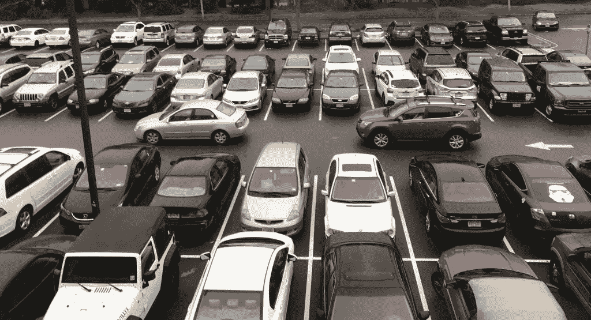
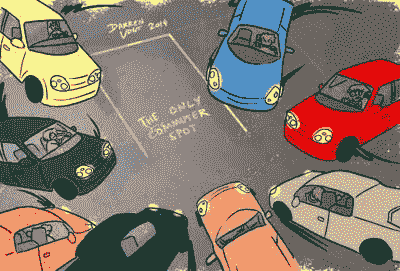
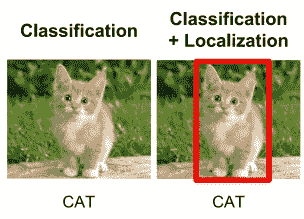
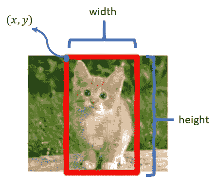
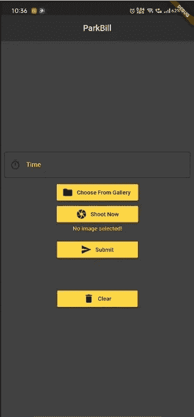
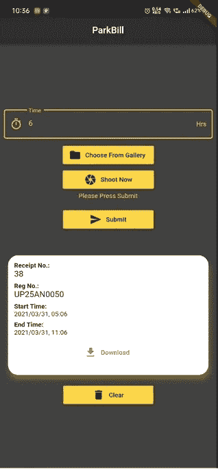

# 帕克比尔

> 原文：<https://medium.com/analytics-vidhya/parkbill-369bacee9a92?source=collection_archive---------10----------------------->

## 触手可及的停车收据生成器！

是的，你没看错。一个易于访问和使用的停车收据生成器。

## **简介:**

在过去的几年里，全世界(尤其是印度)的汽车数量急剧增加。无论是私人交通工具，如汽车、自行车，还是公共交通工具，如公共汽车、卡车、人力车。作为一个门外汉，任何人都可以得出这样的结论:人口越多，这个国家的汽车数量就越多。与此相应，巨大的停车面积需求也开始出现。

车辆停放已经成为该国面临的一个严峻挑战。为了解决这个问题，政府或一些私人机构已经设计了不同类型的停车场，例如海湾停车场、多层停车场等。但由于人力不足或管理系统中存在的一些技术故障，人们在某种程度上面临着问题。停车收据排长队或停车收费不公平就是可以考虑的最好例子。这不仅会给一个人带来身体上的不便，还会带来精神压力，有时还会导致焦虑。

考虑到各种不便，我们的项目旨在提供一个更好的现代解决方案来产生停车收据。

## 工作:

整个系统的设计是这样的，客户可以在任何时间内生成自己的停车收据，因此相应地收费。为此，用户必须安装一个可以在 android 和 iOS 平台上使用的移动应用程序。这个想法很简单，普通人会花很多时间在智能手机上，那么为什么不使用这项杰作技术来停车呢？无论如何，使用这个应用程序，一个人可以捕捉他/她的车辆牌照，也可以从画廊上传图像，确保牌照清晰可见。此外，停车的时间段需要事先选择提出请求，然后用户将只需一个按钮就可以获得停车收据，即“提交”。将生成相应的收据，可以下载为 PDF 格式，或者用户也可以对其进行截图。

## 技术细节一瞥:

或许，让我们深入研究一下你们都在等待的技术方法吧！

> **目标检测:**开发的模型首先从图像中检测车牌部分，然后裁剪整个部分以供进一步处理。
> 
> **OCR(光学字符识别):**该模型成功地从裁剪部分提取出车辆的注册号码，并进一步保存在数据库中。
> 
> **数据库:**需要维护已获得收据的车辆的记录，以便客户的历史可以与服务一起维护，从而在不久的将来为他/她提供一些金钱利益。
> 
> 该系统使用 Python 实现，并部署在 AWS 服务器上，支持实时检测。

似乎很有趣？准备好弄脏你的手，因为这里是它的工作原理的简要说明。一步一步的澄清一定会让你一直感觉良好。

## **物体检测:-**

利用定位对目标进行分类的任务被称为目标定位，而当一幅图像中包含不止一个目标时，则被称为目标检测。听起来很奇怪？等等，让我解释一下。

它基本上是检测输入图像中对象的存在，即该对象位于图像的哪个部分，然后在该对象周围创建边界框(矩形框)。所以这整个过程被称为目标检测。

分类 v/s 检测

## **如何进行物体定位:-**

使用[锚框预测](https://towardsdatascience.com/anchor-boxes-the-key-to-quality-object-detection-ddf9d612d4f9)来执行对象检测，锚框预测有助于预测输入图像中存在的类别。输出是(4 + 1 +类的数量)值的列表，其中 4 个值表示边界框的坐标，即 bx，by，bh，bw。

> (bx，by):边界框中心点的 x，y 坐标。
> 
> bh:边界框的高度。
> 
> bw:边界框的宽度。

接下来是使用的算法。

## **YOLOv3: -**

YOLOv3 是一个实时的单阶段对象检测模型，它建立在 YOLOv2(它的前身)的基础上，并做了一些改进。需要注意的几点是

> 使用改进的主干网络 darknet-53。
> 
> 使用跳过连接来克服梯度递减问题，称为残余块。
> 
> 大小为 52×52、26×26 和 13×13 三个缩放矢量用于检测并馈入检测器。

既然你已经了解了细节，让我们来谈谈基本原理。

这里的工作分为两部分，即前端和后端部分。前端或简单的客户端部分是一个跨平台的应用程序，即 android 和 IOS(如你所知)。而后端由服务器端脚本组成。所有的处理部分都由服务器处理。那么，进一步向大家介绍这两个专业。

## **客户端:-**

这个想法非常简单，用户必须在他们的智能手机上安装这个应用程序，以便为他们的车辆生成停车收据。这个过程非常简单方便，首先，客户必须输入他们想要租赁停车场的时间段，然后他们必须从移动设备的图库中上传图像，或者他们可以选择在停车后随时点击车牌的 pic。随后只需点击提交按钮，他们将能够生成收据。

应用程序的初始视图

一旦收据生成，客户可以拍摄收据的快照，或者他们也可以选择下载收据，无论哪一个适合他们。底部还提供了另一个名为 clear 的选项，以便将应用程序重置为默认设置，但请注意，如果收据尚未保存，则您可能会丢失它，并且一旦完成就无法撤销。

收到响应后的应用程序

## **服务器端:-**

该应用程序部署在一个实时使用场景的 EC2 实例上的 RHEL8 (Red Hat Enterprise Linux 8)上。该应用程序是使用 flask 通过 WSGI (Web 服务器网关接口)部署的。整个服务器端作业进一步分为 3 个子作业。

**工作 1: -**

这里，首先，检测包含车辆注册号码细节的图像部分。为了做到这一点，迁移学习已经用于 YOLOv3 模型，这是默认情况下在 COCO 数据集上预先训练的。因此，我们在包含车辆图像的自定义数据集上开发了一个模型，这样它们的车牌就清晰可见。成功执行该迁移学习后，将获得最终的权重文件。获得的权重文件和配置文件一起用于检测图像中的对象，并以与我们在上面的对象检测中讨论的相同方式提取其坐标。当成功检测到包含牌照的部分时，该部分被剪切并用于进一步处理。

**工作 2: -**

从之前的作业中获得的注册/车牌的裁剪图像被考虑在内，并使用名为 [OCR.space](https://ocr.space/ocrapi) 的 API 进行进一步处理。使用 OCR 空间是首选，因为这样获得的准确性比大多数其他 OCR 工具好，如 tessera CT&Microsoft vision API(在我的用例场景中)。为了执行 OCR 并从图像和 api 中提取文本，需要生成密钥，该密钥可用于执行任务。使用 POST 请求和 api 密钥发送裁剪后的图像，作为响应，获得包含提取的文本的文件。

**工作 3: -**

从先前作业中提取的文本被获得，并与停车的开始时间和结束时间一起被进一步存储在数据库中。使用提出停车请求时的当前时间加上客户在提出请求时提到的小时数来计算结束时间。这些数据输入数据库后，将为我们提供收据号码，该号码是随请求一起生成的。生成的收据号码连同注册号和停车的开始-结束时间被发送回客户端应用程序并显示在那里。

因此，每当客户端发出任何请求时，整个服务器端流程都会开始工作，并向客户端提供适当的结果。此外，如果发生任何错误，如客户端忘记选择图像或服务器端的某些错误，则会向客户端显示适当的错误消息。

这就是我们的收据生成系统。当我们到达终点时，我想说这整个想法之所以成为可能，仅仅是因为我们都有智能手机。否则，用户使用这种服务就不够方便。每种技术都有各自的优点和缺点，但问题是如何使用它们来使人们的日常生活变得更容易。

感谢你们带着浓厚的兴趣阅读我们的博客。特别感谢西达尔特·夏尔马，他对我来说就像罗恩对哈利一样，谢谢你，伙计。

此外，这是我们 GitHub 资源库的链接。你可以从[这里](https://github.com/a19singh/ParkBill)查看代码。

## **快速演示:-**

请务必观看这段 2 分钟的演示视频，以便更好地理解所有这些*羽加迪姆·勒维奥萨*。