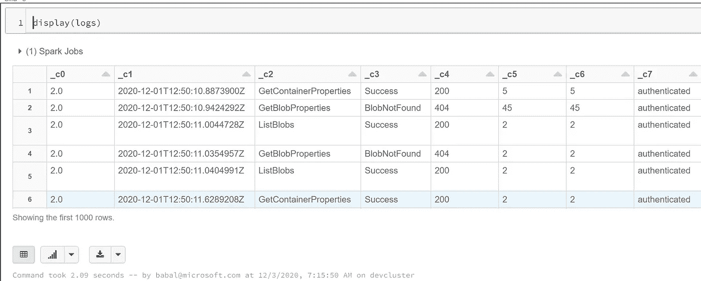
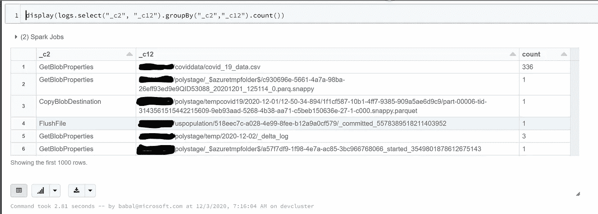

# 使用 Spark 解析 Azure ADLS Gen2 审计日志

> 原文：<https://medium.com/analytics-vidhya/parse-azure-adls-gen2-audit-logs-using-spark-8fcf61c45f3a?source=collection_archive---------13----------------------->

Azure Data Lake gen2 存储的挑战之一是记录审计日志的能力。对于大多数 Azure 服务，我们有发送到日志分析的选项。由于这是存储，我们没有该选项，但我们可以将详细信息记录在同一存储中的$logs 文件夹中。

接下来是我们如何解析日志并进行分析或故障排除。本文更倾向于向您展示我们如何查看日志并进行简单的聚合。

使用案例:

*   对于审计和法规遵从性，我们需要查看审计日志。
*   Azure ADLS gen2 不发送到日志分析
*   ADLS gen2 改为写入名为 logs 的容器
*   想要查看日志并对日志进行分析

# 先决条件

*   Azure 帐户
*   创造蔚蓝 ADLS 第二代
*   创建 Azure 数据块
*   创建 Azure 密钥库
*   为运行时创建具有最新版本的集群
*   将 Azure 数据块连接到范围的密钥库
*   现在是创建笔记本的时候了

# 代码步骤

让我们从 Azure Keyvault 获取存储秘密

```
val accbbstorekey = dbutils.secrets.get(scope = "scopename", key = "storagekey")
```

*   现在配置存储规范

```
spark.conf.set(
  "fs.azure.account.key.storageaccountname.blob.core.windows.net",
  accbbstorekey)
```

*   现在让我们读取日志文件

```
val logs = spark.read.format("csv")
  .option("header", "false")
  .option("delimiter", ";")
 .load("wasbs://$logs@storageaccountname.blob.core.windows.net/blob/2020/12/*/*/*.log")
```

*   显示日志

```
display(logs)
```



*   显示模式

```
logs.schema
```

*   现在让我们做一些汇总
*   下面我根据对特定文件的操作进行分组，并做一个统计，看看对哪些文件的哪些操作用得很多。

```
display(logs.select("_c2", "_c12").groupBy("_c2","_c12").count())
```



从这一点来看，想象力是你的极限。我们可以研究每一列的含义和谁各种分析，以找到使用，登录和其他更多的细节。

更多详情请点击

[](https://docs.microsoft.com/en-us/azure/storage/common/storage-analytics-logging?toc=%2Fazure%2Fstorage%2Fblobs%2Ftoc.json&tabs=dotnet) [## Azure 存储分析日志记录

### Storage Analytics 记录有关对存储服务的成功和失败请求的详细信息。此信息…

docs.microsoft.com](https://docs.microsoft.com/en-us/azure/storage/common/storage-analytics-logging?toc=%2Fazure%2Fstorage%2Fblobs%2Ftoc.json&tabs=dotnet) 

原文可以在这里找到