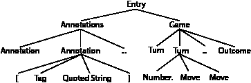

# 用 Python 解析 PGN 象棋游戏

> 原文：<https://medium.com/analytics-vidhya/parsing-pgn-chess-games-with-python-68a2c199665c?source=collection_archive---------5----------------------->

我脑子里有几个分析国际象棋比赛位置的项目。它们都需要将大量的棋局收集成结构化的数据。[本周国际象棋](https://theweekinchess.com/twic)每周提供数千场比赛的记录。每周由一个文件组成，该文件采用[便携式游戏符号](https://en.wikipedia.org/wiki/Portable_Game_Notation) (PGN)，一种记录国际象棋游戏的纯文本格式。

我想分析成千上万的游戏，所以第一步是收集纯文本文件，并使用 PGN 文件的语法解析它们。

如果你只是想让代码解析 PGN，你可以跳到 GitHub repo 。否则，请继续阅读。


照片由 Sarah Pflug 拍摄，用于 CC0

## PGN 文件的语法

包括 PGN 在内的许多文本数据都遵循一种“语法”。PGN 的语法包括成对的标签和字符串、游戏的移动和结果。重要的是，文本的外观是有规则的。例如，2021 年芒努斯·卡尔森和乔丹·范·福雷斯特之间的比赛:

```
[Event "83rd Tata Steel Masters"]
[Site "Wijk aan Zee NED"]
[Date "2021.01.19"]
[Round "4.1"]
[White "Van Foreest,Jorden"]
[Black "Carlsen,M"]
[Result "1/2-1/2"]
[WhiteTitle "GM"]
[BlackTitle "GM"]
[WhiteElo "2671"]
[BlackElo "2862"]
[ECO "C78"]
[Opening "Ruy Lopez"]
[Variation "Archangelsk (counterthrust) variation"]
[WhiteFideId "1039784"]
[BlackFideId "1503014"]
[EventDate "2021.01.16"]1\. e4 e5 2\. Nf3 Nc6 3\. Bb5 a6 4\. Ba4 Nf6 5\. O-O b5 6\. Bb3 Bb7 7\. d3 Be7 8\. Nc3 O-O 9\. a3 Nd4 10\. Nxd4 exd4 11\. Ne2 c5 12\. Bg5 d5 13\. Bxf6 Bxf6 14\. Bxd5 Bxd5 15\. exd5 Qxd5 16\. Ng3 c4 17\. Re1 Rae8 18\. a4 Rxe1+ 19\. Qxe1 cxd3 20\. cxd3 bxa4 21\. Qd1 Qb5 22\. Ne4 Be7 23\. Qc2 Rb8 24\. Rxa4 Qxb2 25\. Qxb2 Rxb2 26\. g4 Rb6 27\. Rxd4 Kf8 28\. Rd7 Rg6 29\. Kf1 Rxg4 30\. Ra7 f5 31\. Ng3 g6 32\. Rxa6 Rh4 33\. Kg2 Rd4 34\. Ne2 Rxd3 35\. Ng1 Rd7 36\. Nf3 Kg7 37\. h3 Bf6 38\. Kg3 Rb7 39\. Kg2 Re7 40\. Ra5 Rc7 41\. Rd5 Ra7 42\. Rb5 Be7 43\. Nd4 Rd7 44\. Nf3 Rd6 45\. Rb7 Kf6 46\. Ra7 h6 47\. Nh4 Bd8 48\. Rh7 Rd2 49\. Rxh6 Kg7 50\. Rxg6+ Kh7 51\. Nf3 Rxf2+ 52\. Kxf2 Kxg6 53\. Kg2 Kh5 54\. Nd4 f4 55\. Ne6 Bg5 56\. Nxg5 Kxg5 57\. Kf3 Kh4 58\. Kxf4 Kxh3 1/2-1/2
```

注释出现在括号中，以标记开始，后跟带引号的字符串。在注释之后，棋步按棋步编号列出，后面是白棋步，然后是黑棋步(代数符号中的[)。最后一个文本宣布结果，`1-0`为白棋获胜，`0-1`为黑棋，`1/2-1/2`为平手。](https://en.wikipedia.org/wiki/Algebraic_notation_(chess))

我们将获取一个 PGN 条目的文件并解析它们。在计算机科学中，解析器组合子是一个高阶函数，它接受多个解析器并返回一个解析器。[这个主题很深奥](https://en.wikipedia.org/wiki/Parser_combinator)，但是要点是解析器组合子允许我们写出一个语法的解析树，并通过组合简单的解析器迭代地构建复杂的解析器。对于这个项目，我使用了由我的一个同事编写的用于解析的开源 python 库。

从上面的文件中写出解析树非常简单。文件中的“条目”由两个块组成:“注释”块和“游戏”块。注释块是序列`[`、`TAG`、`"`、`STRING`、`"`、`]`的新行分隔列表。游戏是一个`NUMBER.`、`MOVE`、`MOVE`的列表，后面跟着一个`OUTCOME`。最后一步棋有些棘手，因为白棋可能比黑棋多走一步，但我们稍后会处理这个问题。最好把我们的语法想象成一棵树:



PGN 解析树(作者图片)

## 解析简单文本

现在我们已经了解了语法，让我们试着解析底层的一个节点。我们将从注释开始，因为它们更简单。我们的目标是获取注释列表，并将它们转换成 Python 字典。

我们将遍历这段代码的每一行:

```
# Parse the " token
quote = lit(r'"')# Parse a sequence of unicode characters excluding spaces
tag = reg(r'[\u0021-\u0021\u0023-\u005A\u005E-\u007E]+')# parse a sequence of unicode characters including spaces
string = reg(r'[\u0020-\u0021\u0023-\u005A\u005E-\U0010FFFF]+')# An annotation is combines a tag, and a quoted string delimited
# by other characters. We only care about the tag and string.
annotation = '[' >> tag << ' ' & (quote >> string << quote) << ']'# Function to take a list of parsed annotations and convert to a
# dictionary
def formatannotations(annotations):
    return {ant[0]: ant[1] for ant in annotations}# The annotation block is a list of 0 or more annotations.
annotations = repsep(annotation, '\n') > formatannotations
```

Parsita 使用文字解析器和正则表达式解析器来完成繁重的工作。最简单的解析操作是匹配单个字符，即文字。我展示了两种方法:`lit(r'"')`匹配一个引用；或者，parsita 将接受一个 Python 字符串到解析器中，并将其作为文字处理。使用第二种技术解析括号。

parsita 的强大功能来自我们在上面使用的五个解析器:

*   `A & B`:顺序解析器。匹配`A`的解析器和`B`的解析器。在列表中返回两者。
*   `A >> B`:丢弃左侧解析器。匹配同`&`。仅返回`B`。
*   `A << B`:丢弃右解析器。反之亦然。
*   `A > function`:转换解析器。匹配解析器，然后将结果传递给函数。
*   `repsep(A)`:重复解析器。从 0 到 N 次匹配`A`并返回匹配列表。

因此，扩展定义注释的行:

```
annotation = '[' >> tag << ' ' & (quote >> string << quote) << ']'
```

注释按顺序排列:

*   一个支架(丢弃)，
*   没有空格的字符串，
*   一个空格(丢弃)，
*   一个报价(丢弃)，
*   一根绳子，
*   一个报价(丢弃)，
*   一个括号(丢弃)。

```
# Call the parser --> results in Success or Failure.
# .or_die() either gives the value of the success or raises an errorprint(annotation.parse('[parsing "is cool"]').or_die())
> ['parsing', 'is cool']# Annotations block converts the text to a dict
text = '''[parsing "is cool"]
[second "line"]'''print(annotations.parse(text).or_die())
> {'parsing': 'is cool', 'second': 'line'}
```

## 解析更复杂的文本

游戏形式比较复杂。它重用了注释解析的思想，但是需要两个额外的解析器:

*   `A|B`:备选解析器。尝试匹配解析器`A`，如果失败，则尝试解析器`B`。
*   `opt(A)`:可选解析器。尝试匹配解析器`A`，如果成功，返回长度为一的列表中`A`的值。如果失败，返回一个空列表。

我们使用另一种解析器来简化移动的定义:

```
nullmove = lit('--') # Illegal move rarely used in annotations
longcastle = reg(r'O-O-O[+#]?')
castle = reg(r'O-O[+#]?')
regularmove = reg(r'[a-h1-8NBRQKx\+#=]+') # Matches more than just chess moves
move = regularmove | longcastle | castle | nullmove
```

我们用正则表达式解析器匹配“正则”移动。移动的代数符号引用 1 或 2 个方块，a-h 是它们的文件，1-8 是它们的等级。每件作品都有一个字母名称。对于捕获(`x`)、检查(`+`)、将死(`#`)和提升(`=`)还有额外的符号。其他的，非常规的移动是长城堡，城堡，和无效移动(很少遇到，但由于各种原因出现)。

所以，一个移动尝试匹配常规移动，如果失败，尝试匹配长城堡，然后城堡，最后无效移动。

```
def handleoptional(optionalmove):
    if len(optionalmove) > 0:
        return optionalmove[0]
    else:
        return Nonedef formatgame(game):
    return {
        'moves': game[0],
        'outcome': game[1]
    }whitespace = lit(' ') | lit('\n')movenumber = (reg(r'[0-9]+') << '.' << whitespace) > intturn = movenumber & (move << whitespace) & (opt(move << whitespace) > handleoptional)# Potential game outcomes
draw = lit('1/2-1/2')
white = lit('1-0')
black = lit('0-1')
outcome = draw | white | blackgame = (rep(turn) & outcome) > formatgame
```

我们需要可选的解析器，因为游戏可能会在白棋移动后终止。当这种情况发生时，在 PGN，文件有一个最终的移动号码，然后列出一个单一的移动。所以，我们语法的最后一个“转折”是可选的。如果返回的可选列表不为空，我们将它解析成对 Python 更有用的形式，否则返回`None`。

## 把所有的放在一起

剩下的工作就是下载一个 PGN 文件，并使用上述代码解析它。

```
from parsita import *
from parsita.util import constant
import json# Conversion functions
def formatannotations(annotations):
    return {ant[0]: ant[1] for ant in annotations}def formatgame(game):
    return {
        'moves': game[0],
        'outcome': game[1]
    }def formatentry(entry):
    return {'annotations': entry[0], 'game': entry[1]}def handleoptional(optionalmove):
    if len(optionalmove) > 0:
        return optionalmove[0]
    else:
        return None# PGN Grammar
quote = lit(r'"')
tag = reg(r'[\u0021-\u0021\u0023-\u005A\u005E-\u007E]+')
string = reg(r'[\u0020-\u0021\u0023-\u005A\u005E-\U0010FFFF]+')whitespace = lit(' ') | lit('\n')annotation = '[' >> (tag) << ' ' & (quote >> string << quote) << ']'
annotations = repsep(annotation, '\n') > formatannotationsnullmove = lit('--') # Illegal move rarely used in annotations
longcastle = reg(r'O-O-O[+#]?')
castle = reg(r'O-O[+#]?')
regularmove = reg(r'[a-h1-8NBRQKx\+#=]+') # Matches more than just chess moves
move = regularmove | longcastle | castle | nullmovemovenumber = (reg(r'[0-9]+') << '.' << whitespace) > int
turn = movenumber & (move << whitespace) & (opt(move << whitespace) > handleoptional)draw = lit('1/2-1/2')
white = lit('1-0')
black = lit('0-1')
outcome = draw | white | blackgame = (rep(turn) & outcome) > formatgameentry = ((annotations << rep(whitespace)) & (game << rep(whitespace))) > formatentryfile = rep(entry)# Parse the file
with open('twic1368.pgn', 'r') as f:
    parsedoutput = file.parse(f.read()).or_die()
```

解析后的输出是一个游戏列表。每个游戏的结构都是一样的:

```
{
  'annotations': {
    'Event': 'Lozovatsky Mem A 2021',
    'Site': 'Chelyabinsk RUS',
    'Date': '2021.01.18',
    'Round': '5.18',
    'White': 'Mischuk,D',
    'Black': 'Bryakin,M',
    'Result': '1-0',
    ...
  },
 'game': {
   'moves': [
      [1, 'd4', 'd5'],
      [2, 'c4', 'c6'],
      [3, 'Nc3', 'Nf6'],
      ...
   ],
   'outcome': '1-0'
  }
}
```

现在，我要去寻找数以千计的象棋游戏的乐趣。