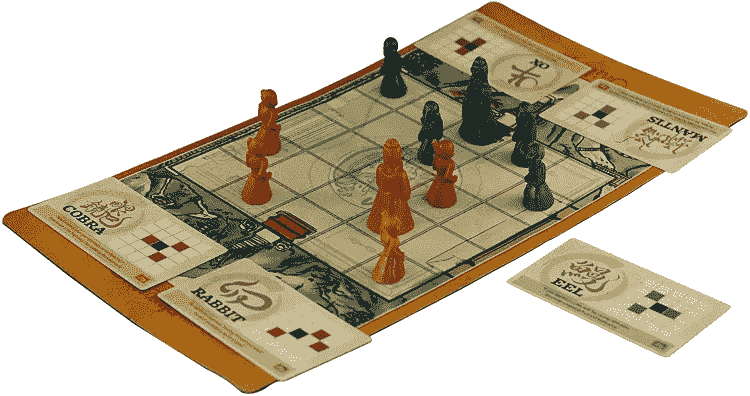
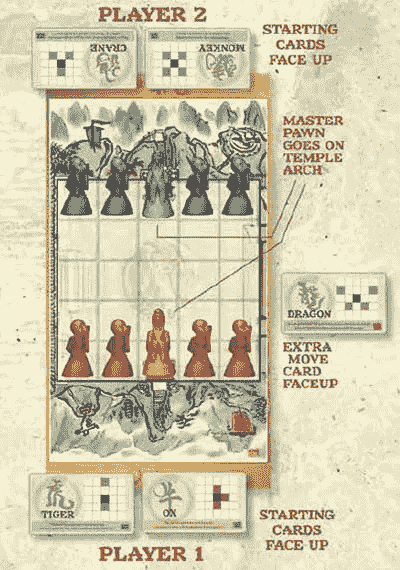
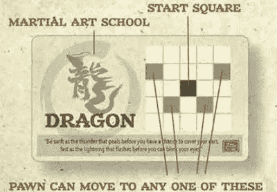
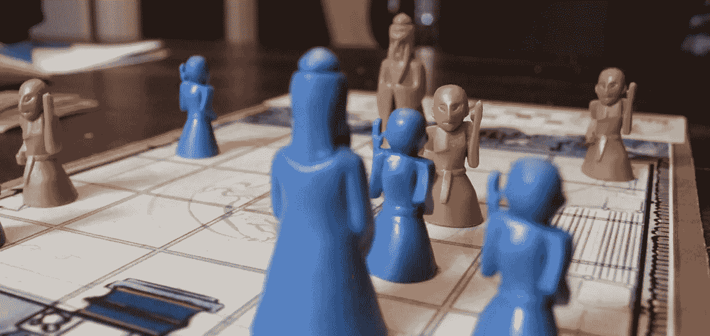
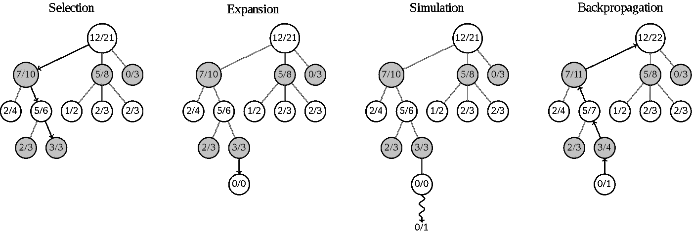
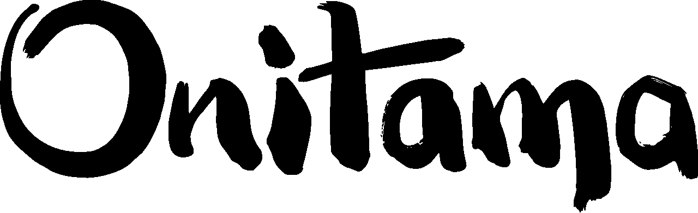

# 第 1 部分:Onitama 游戏的 AlphaZero 实现

> 原文：<https://medium.com/analytics-vidhya/part-1-alphazero-implementation-for-the-game-onitama-370afb1259e6?source=collection_archive---------1----------------------->

AlphaZero 怎么才能学会玩游戏？游戏 Onitama 的实现！

*   第二部分:很快
*   第三部分:很快

在本文中，我们将了解游戏 Onitama，以及 AlphaZero 的主要思想。alpha zero 是一种深度强化学习算法，能够在没有人类信息的情况下学习玩游戏！

我为 Onitama 游戏实现的 AlphaZero 可以在我的 [Github](https://github.com/Nicolas-Maurer/Onitama_AlphaZero) 上找到。

# 奥尼塔玛是什么？

Onitama 是一个 2 人棋盘游戏，具有完美的信息和随机启动。棋盘大小为 5x5，每个玩家以 5 枚棋子开始游戏(4 枚棋子和一枚主棋子)。

在游戏中，总共有 16 张卡片定义了棋子可能的移动。游戏开始时，从 16 张牌中抽出 5 张，每位玩家 2 张，剩下一张放在棋盘的一边。

来源:https://www.ultraboardgames.com/onitama/game-rules.php

每回合，每位玩家可以根据他们牌上的移动次数移动他们的兵。

来源:https://www.ultraboardgames.com/onitama/game-rules.php

一旦选择了一张牌并开始移动，这张牌与旁边的那张交换，然后下一个玩家开始它的回合。

## 要赢得游戏，你有两个选择:

*   占领对手的主卒
*   将你的主卒移动到对手的神殿

既然我们知道了这个游戏的玩法，那就来看看 AlphaZero 算法是如何工作的吧！

# AlphaZero 的主要思想:神经网络和 MCTS。

AlphaZero 是一种强化学习算法，从**自我游戏**中学习，除了游戏规则之外**没有人类信息**。

2016 年，DeepMind 推出了 AlphaGo，这是第一个能够在围棋比赛中击败人类的算法。2018 年，他们发布了新版本的 AlphaGo Zero，通过从空白中学习除规则之外的一切，超越了 AlphaGo。几个月后，他们将 AlphaGo Zero 推广到其他游戏，如国际象棋或日本象棋，他们称之为 AlphaZero。

让我们来理解这个不可思议的算法的主要思想。这是我对《神奇的纸》 [*用通用强化学习算法*](https://arxiv.org/pdf/1712.01815.pdf)【silver et al . 2017】通过自我对弈掌握棋和 Shogi》的理解

## 除了规则，AlphaZero 可以自学所有东西，但是怎么学呢？

AlphaZero 由两个主要部分组成，一个**神经网络和一个蒙特卡罗树搜索(MCTS)** 。这两个部分用于生成自玩游戏，即训练集。然后用训练集训练神经网络，循环再开始。

为了产生自我游戏，神经网络和 MCTS 一起工作。神经网络用于评估位置、游戏状态，MCTS 执行 N 次模拟以选择下一步棋。

## 生成自玩游戏。

神经网络拥有**两个头**，一个给出棋盘的**值**，一个给出**所有可能走法**的输出**策略**。那么所有的非法移动都被过滤掉，并且策略被重新规范化以具有等于 1 的总和。

然后 MCTS 会选择最好的一步棋。为此，MCTS 执行 **4 个步骤:**

*   **选择**:从根节点开始，依次选择最佳子节点，直到到达叶子节点。
*   **展开**:从选中的节点开始，为所有可能的移动创建子节点。
*   **模拟**:通常模拟由玩随机移动组成，直到游戏结束，但在我们的情况下，神经网络将预测棋盘的值。
*   **反向传播**:模拟的结果，用于更新父节点的信息。

来源:[维基百科](https://en.wikipedia.org/wiki/Monte_Carlo_tree_search)

**选择是 MCTS** 最重要的部分，最好的孩子是利用 UCT ( *置信上限* 1 *应用于树木)*公式相继选出的。这就是神奇的地方，通过足够的训练，AlphaZero 只会考虑最好的移动。

> 主要的困难是在勘探和开采之间选择正确的平衡。

在论文中，他们提到每个 MCTS 执行 800 次模拟。此外，树不会在移动之间重置，只会在游戏之间重置。

## 培养

在训练期间，AlphaZero 移动在**中被**选择**与根访问计数**成比例，他们根据合法移动的平均数量将狄利克雷噪声添加到这些概率中。

训练神经网络以适应棋盘的值和 MCTS 给出的移动策略。随着时间的推移，它会学会避免非法和糟糕的举动。

# **总之:**

AlphaZero 是一种深度强化学习算法，能够通过自我游戏学习玩许多不同的游戏，而无需事先的人类信息！这是可能的，因为神经网络和 MCTS 的结合正在一起工作。

# 希望你喜欢这个故事！

仅此而已！我希望你对这个帖子感兴趣，如果你想在接下来的部分得到通知，别忘了关注我！

