# 第 1 部分:深度学习时间序列和预测

> 原文：<https://medium.com/analytics-vidhya/part-1-deep-learning-times-series-forecasting-cf0090441774?source=collection_archive---------17----------------------->

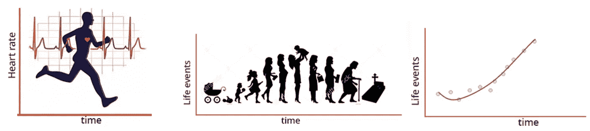

# **时间序列介绍**

时间序列通常被定义为一个有序的值序列，这些值通常在时间上等距分布。例如，在每日天气预报中，每个时间步长都有一个值，称为单变量。如果我们遇到在每个时间点有多个值的时间序列，你可能已经想到了，是的，多元的。请看下图，该图显示了全球气温与二氧化碳浓度的关系。作为一个单变量图表，这可能会显示一个趋势，但当结合起来时，很容易看到相关性，为数据增加了更多的价值。

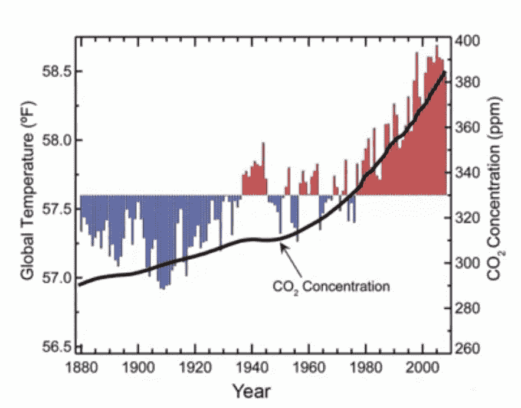

现在你可能在想，随着时间的推移，我们可以用机器学习做什么样的事情。显而易见是正确的，根据我们给定的数据进行预测。在许多情况下，我们可能希望回溯到过去，看看我们是如何走到现在这一步的，这一过程称为插补。**插补**就是简单地从已经不存在的数据中填补我们数据中的漏洞。我们为什么要这样做，可能有些年份没有记录数据，有些年份有数据。

时间序列也可以用来检测异常。例如，我们可以分析时间序列，找出决定序列本身的模式。这方面的一个经典例子是分析声波以找出其中的单词，这可以用作语音识别的神经网络。

机器学习在时间序列中的应用

时间序列可以有各种形状和大小。第一个是趋势，时间序列有一个特定的移动方向。另一个概念是**季节性**，当模式以可预测的间隔重复时可以看到。例如，看看这个图表，它显示了软件开发人员网站的活跃用户。它遵循一种非常独特的规律下降模式。你能猜出它们是什么吗？

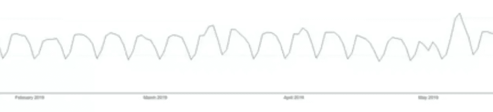

时间序列中的常见模式

如果我告诉你它上升了五个单位，然后下降了两个单位呢？然后你可以看出，在周末工作的人少的时候，它明显下降，因此它显示出季节性。其他季节性系列可能是在周末达到峰值的购物网站或在全年不同时间达到峰值的运动网站。时间序列可以结合趋势和季节性，如下图所示。总体趋势是上升的，但也有局部的高峰和低谷。但是当然，也有一些可能根本不可预测，只是一组完整的随机值，产生通常所说的**白噪声**。你无法预测下一次什么时候会发生，或者时间序列会有多强。但是很明显，整个系列不是随机的。在尖峰之间有一个非常确定的衰变类型。我们可以看到，每个时间步长的值是前一个时间步长值的 99 %,外加一个偶然的峰值。这是一个自相关时间序列。也就是说，它与自身的延迟拷贝相关，这种延迟拷贝通常被称为**滞后**。不可预测的峰值通常被称为创新。换句话说，它们不能根据过去的值来预测。

我们在现实生活中看到的时间序列通常都有一些这样的特征:趋势、季节性、自相关和噪声。这就是为什么时间序列问题非常适合机器学习，机器学习模型被设计用来发现模式，当我们发现模式时，我们可以做出预测。在很大程度上，这也适用于时间序列，除了不可预测的噪声。但我们应该认识到，这是假设过去存在的模式当然会延续到未来。虽然我们知道现实生活并不总是那么简单，但行为会随着时间的推移而发生巨大变化。例如， [TSLA](https://neeva.com/search?q=tsla+stock&src=nvobar) 的股票有一个积极的趋势，但后来发生了一些事情改变了它的行为，可能是新闻发布、金融危机或丑闻，可能是颠覆性的技术突破引起了巨大的变化，或者是特斯拉在全球遇到了[麻烦的消息](https://investorplace.com/2021/05/tesla-stock-has-a-big-china-problem/?mod=mw_quote_news)。然后我们开始看到没有任何季节性的下降趋势，通常称为**非平稳**时间序列。

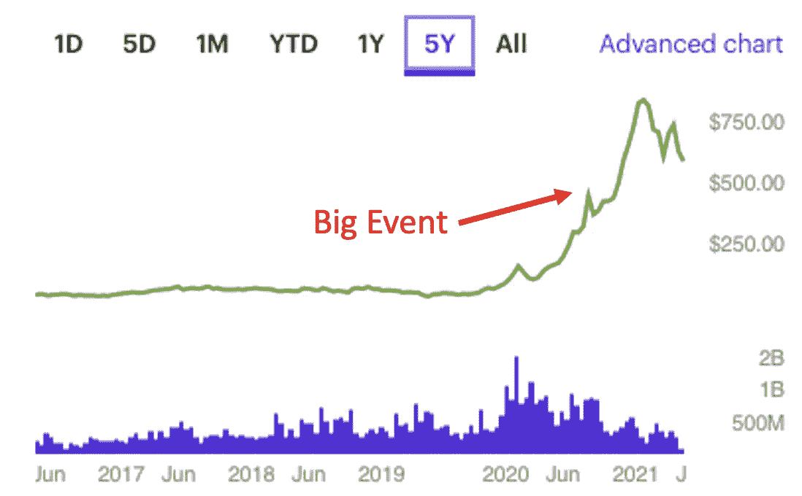

现在来预测非平稳时间序列。我们可以只训练有限的一段时间。例如，在这里我可以只取最近 100 天。比起在整个时间序列上训练，我可能会有更好的表现。但这打破了典型机器学习问题的模式，我们总是假设数据越多越好。但是对于时间序列预测，它确实依赖于时间序列。如果它是静止的，也就是说。它的行为不会随着时间而改变，那就太好了。我们拥有的数据越多越好！

# **趋势和季节性**

让我们用 [Python](https://www.python.org/) 来看看时间序列和时间序列的各种属性。好了，让我们创建一个上升趋势的时间序列:

在这种情况下，x 轴是时间，y 值是当时的函数值。

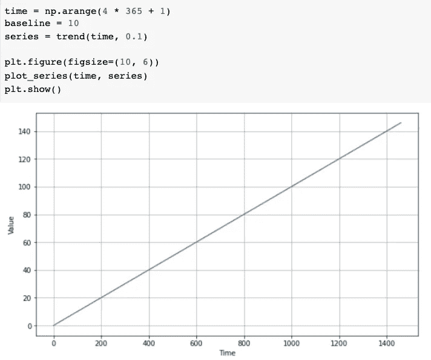

现在让我们生成一个具有季节模式的时间序列:

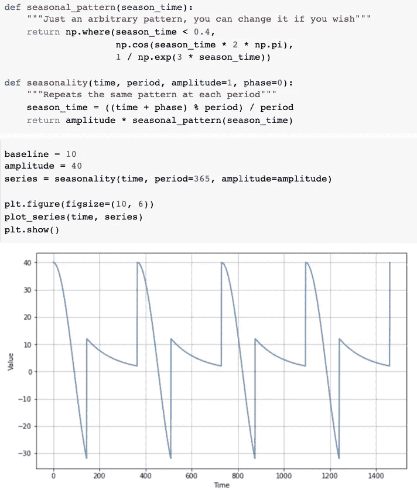

给我们的时间序列添加一个季节模式。

当我们研究上面的图表时，我们可以看到清晰的波峰和波谷。但除此之外，还有更小的，规则的尖峰。这可以看作是对季节价值的粗略模拟。例如，也许在商店关门的那天，葡萄酒商店的利润是负的，第二天达到峰值，在一周内下降，然后在周末再次达到峰值——因为你知道这是葡萄酒时间！！！

现在让我们创建一个具有趋势和季节性的时间序列:

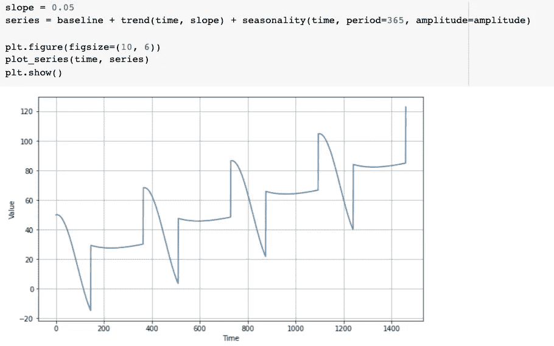

如果我们现在添加一个趋势，使季节性数据在遵循模式的同时随着时间的推移而增加，会怎么样？也许模拟一个成长中的企业，所以当我们绘制它时，我们会看到相同的模式，但整体呈上升趋势(假设他们卖的葡萄酒很好&价格也不错)。

# 噪音

现在我们再增加一个时间序列中常见的特征，噪声？这是一个函数，它给一个序列添加了一些噪声，当我们调用这个函数并绘制结果以及它们对我们的时间序列的影响时，我们现在得到了一个非常嘈杂的序列，但它遵循了我们之前看到的相同的季节性。

让我们生成一些白噪声:

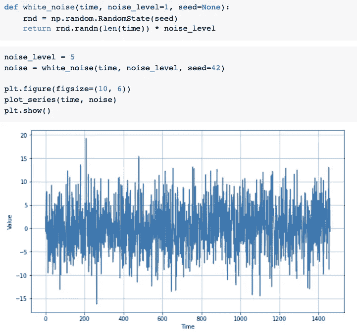

在这一点上有趣的是，人眼可能会错过许多季节性数据，但计算机将有望发现它。

现在让我们把这个白噪声加到时间序列上:

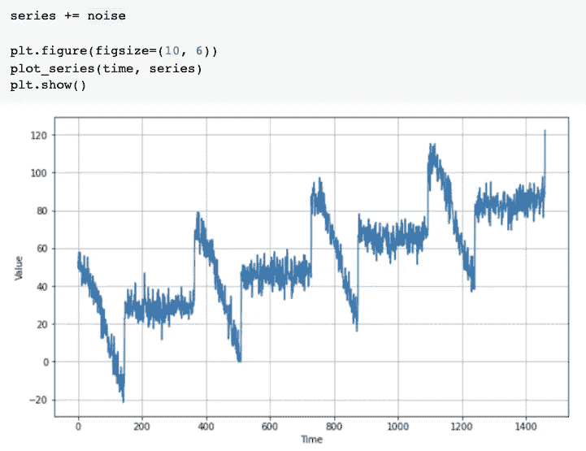

好了，现在看起来够现实了。让我们试着预测一下。

接下来，我们可以探索一点自相关，但首先这里有几个函数可以为您添加自相关。在这里，我们将自相关添加到序列中并绘制出来。有两种不同的自相关函数，我会把它们都画出来，这样你就可以看到各自的影响。

我们将把它分成两个阶段:培训阶段和验证阶段(在许多情况下，您可能还希望有一个测试阶段)。分割将在时间步长 1000 处进行。

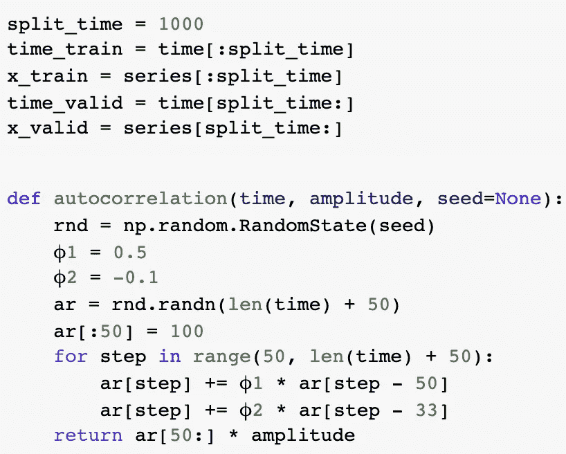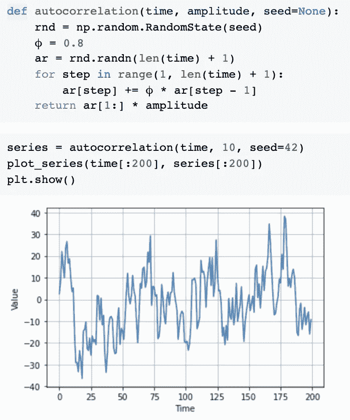

尽管尺度不同，你还是可以看到重复的模式。

有一个模式，然后急剧下降，接着是同样的模式，在较小的规模上有同样的下降，然后缩小，等等。如果我改变自相关函数并再次运行，我们可以看到另一个函数。

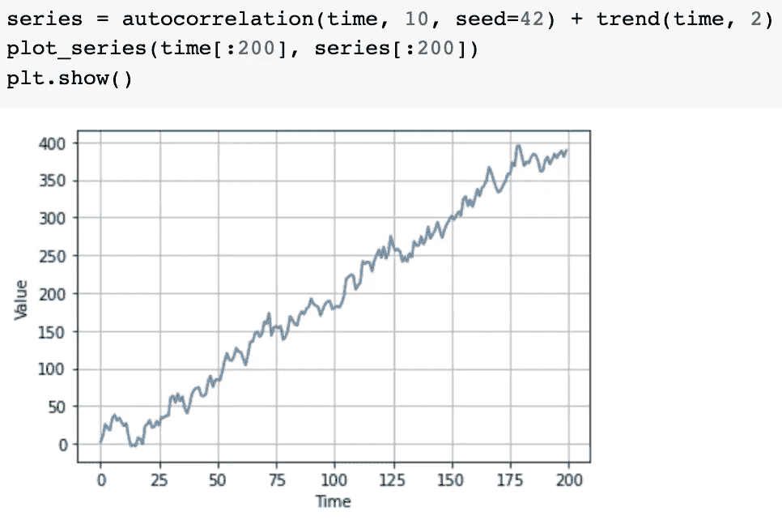

现在，让我们添加它们来模拟季节性时间序列:

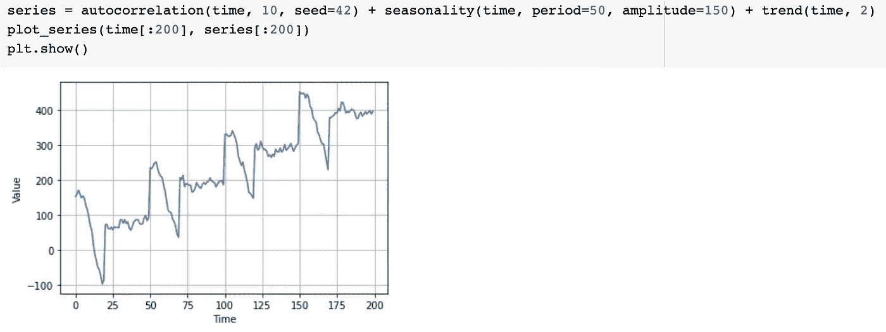

# 天真的预测

我们可以，取上一个值，假设下一个值也是这个值，这叫做**天真预测**。那么，你如何衡量绩效呢？

为了衡量我们的预测模型的性能，我们通常希望将时间序列分为训练期、验证期和测试期。这被称为**固定分区**。如果时间序列具有一定的季节性，您通常希望确保每个周期都包含整数个季节。

接下来，您将在培训阶段培训您的模型，并在验证阶段对其进行评估。您可以在这里进行试验，找到适合培训的架构。和您的超参数，直到您获得所需的性能，使用验证集测量。但你为什么要这么做？这是因为测试数据是最接近当前时间点的数据。因此，它通常是决定未来价值的最强信号。如果您的模型也没有使用该数据进行训练，那么它可能不是最佳的。由于这个原因，完全放弃一个测试集实际上是很常见的。而只是训练，用一个训练期和一个验证期，测试集在未来。

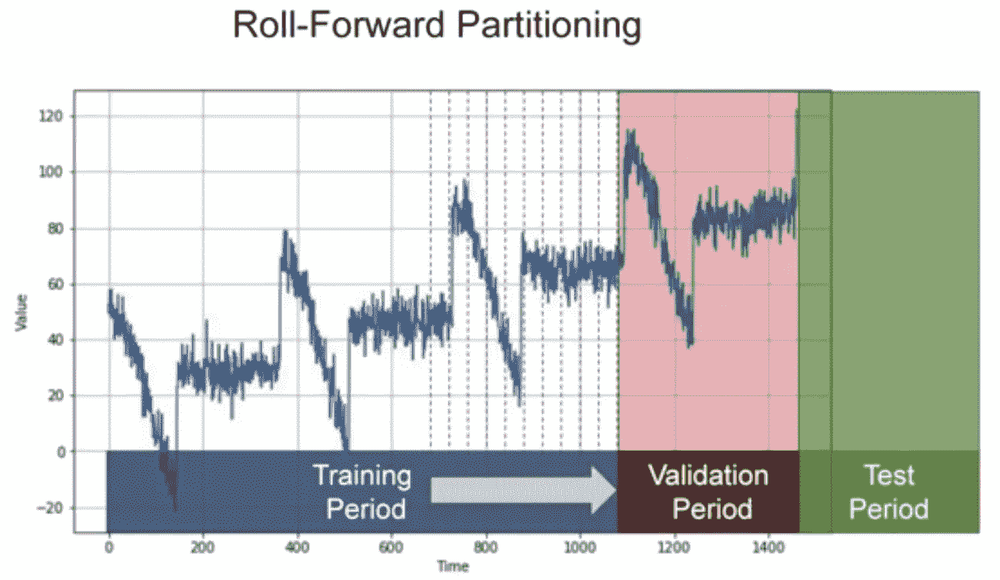

deeplearning.ai 序列、时间序列和预测

像这样的固定分区非常简单和直观，但是还有另一种方法。我们从短期训练开始，然后逐渐增加，比如一天一次，或者一周一次。在每次迭代中，我们在一个训练周期内训练模型。在验证阶段，我们用它来预测第二天或下一周的天气。这称为前滚分区。您可以将它看作是多次进行固定分区，然后像这样不断地改进模型。

# 评估绩效的标准

一旦我们有了一个模型和一个周期，我们就可以在它上面评估模型

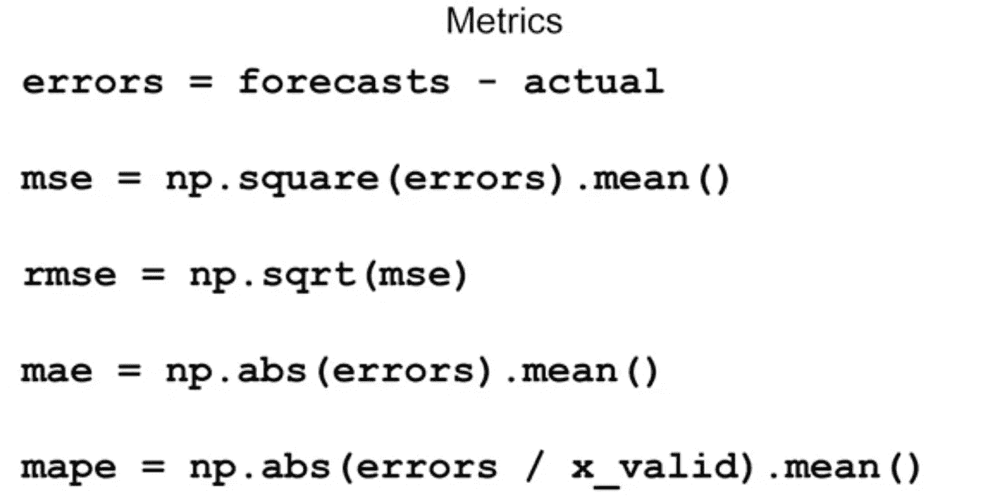

1.  **误差**:让我们简单地从计算误差开始，误差是我们模型的预测值和评估期间的实际值之间的差异。
2.  **MSE** :评估模型预测性能的最常见指标是均方误差或 MSE，我们将误差平方，然后计算它们的平均值。但是，我们为什么要把它平方呢？好吧，这样做的原因是为了摆脱负值。举个例子，如果我们的误差比数值高 2，那么它就是 2，但是如果它比数值低 2，那么它就是负 2。这些误差可以有效地相互抵消，这是错误的，因为我们有两个误差，而不是没有。但是，如果我们在分析之前对值的误差进行平方，那么这两个误差的平方就是 4，不会相互抵消，实际上是相等的。
3.  **RMSE** :如果我们希望误差计算的平均值与原始误差的大小相同，那么我们只需得到它的平方根，就能得到均方根误差或 RMSE。
4.  **MAE** :平均绝对误差或 MAE，也叫主绝对偏差或 mad。在这种情况下，不是平方来去掉负数，而是使用它们的绝对值。这不会像 mse 那样惩罚大错误。根据您的任务，您可能更喜欢 mae 或 mse。例如，如果大错误有潜在的危险，并且比小错误花费更多，那么你可能更喜欢 mse。但是如果你的收益或损失与误差大小成正比，那么 mae 可能更好。
5.  **MAPE** :平均绝对百分比误差或 MAPE，这是绝对误差和绝对值之间的平均比率，它给出了相对于数值的误差大小的概念。

让我们继续这个对话…下一个！

# 移动平均和差分

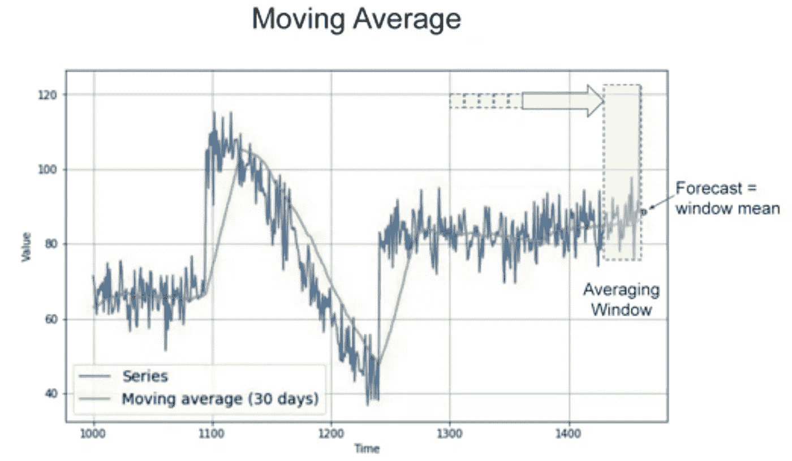

一种常见且非常简单的预测方法是计算移动平均线。这里的想法是，黄线是一段固定时间内蓝色值的平均值图，称为平均窗口，例如 30 天。现在，这很好地消除了许多噪声，给了我们一条大致模拟原始序列的曲线，但它没有预测趋势或季节性。根据当前时间，也就是你想要预测未来的时间段，它实际上会比一个天真的预测更糟糕。

避免这种情况的一种方法是用一种叫做差分的技术从时间序列中去除趋势和季节性。因此，我们不是研究时间序列本身，而是研究时间 T 的值和更早时期的值之间的差异。根据我们数据的时间，这段时间可能是一年、一天、一个月或其他时间。有了这种方法，我们就离最佳状态不远了。在你匆忙进入深度学习之前，请记住这一点。简单的方法有时可以工作得很好。

# 预测

下一个代码块将建立带有季节性、趋势和一点噪声的时间序列。

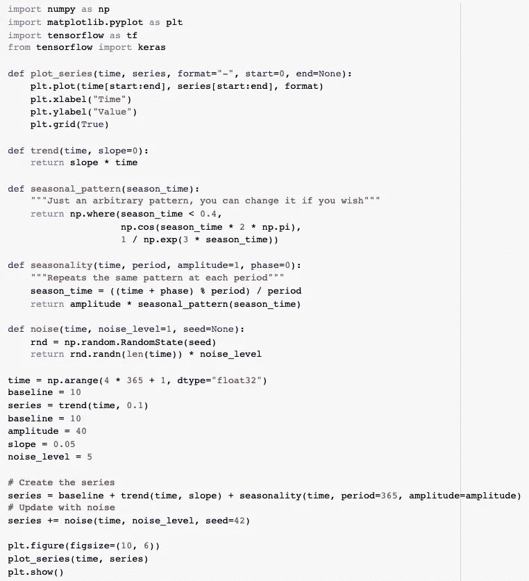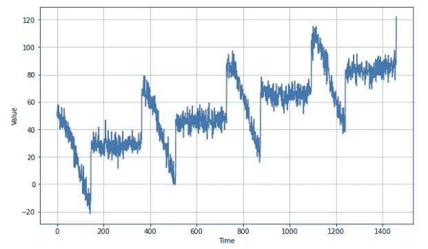

现在我们有了时间序列，让我们分割它，这样我们就可以开始预测

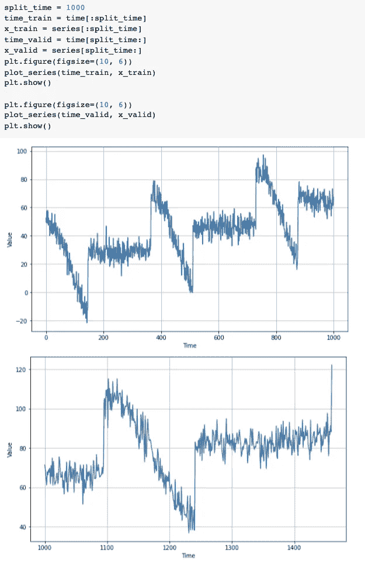

# 天真的预测

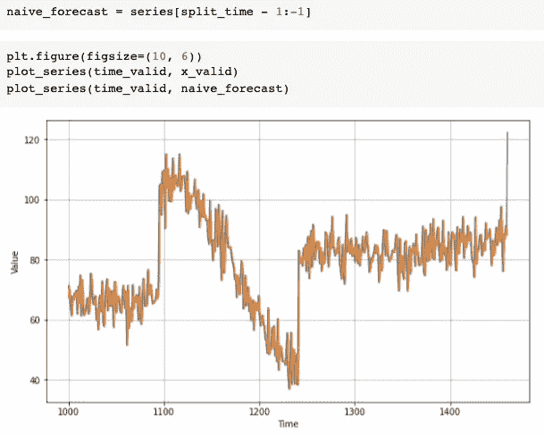

让我们放大到验证期的开始:

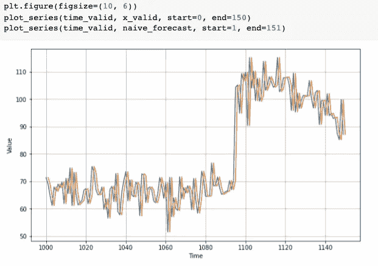

您可以看到，简单的预测落后于时间序列 1 步。现在，让我们计算预测和验证期预测之间的均方误差和平均绝对误差:

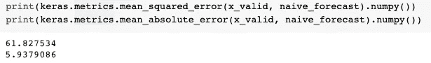

这是我们的基线，现在让我们试试移动平均线:

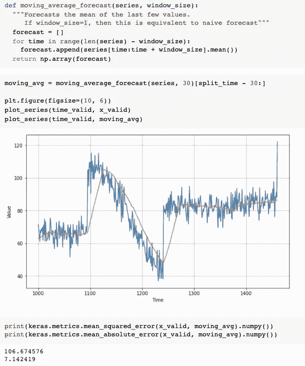

那比天真的预测还要糟糕！

移动平均线不能预测趋势或季节性，所以让我们试着用差分法去掉它们。由于季节性周期是 365 天，我们将从时间 **t** 的值中减去时间 **t** — 365 的值。

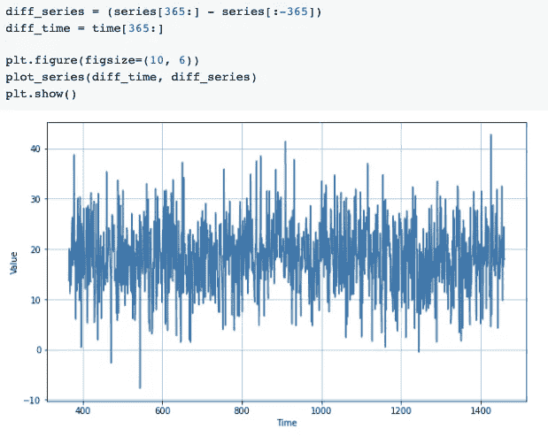

太好了，趋势和季节性似乎消失了，所以现在我们可以使用移动平均线:

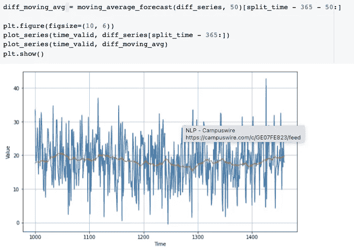

现在，让我们通过添加 t-365 的过去值来恢复趋势和季节性:

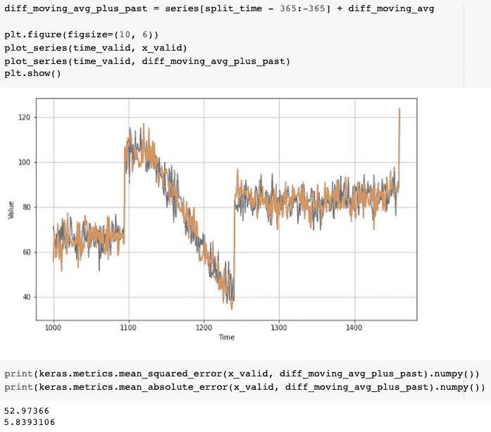

比天真的预测要好，很好。然而，预测看起来有点太随机，因为我们只是添加了过去的值，这是有噪声的。让我们对过去的值使用移动平均来消除一些噪声:

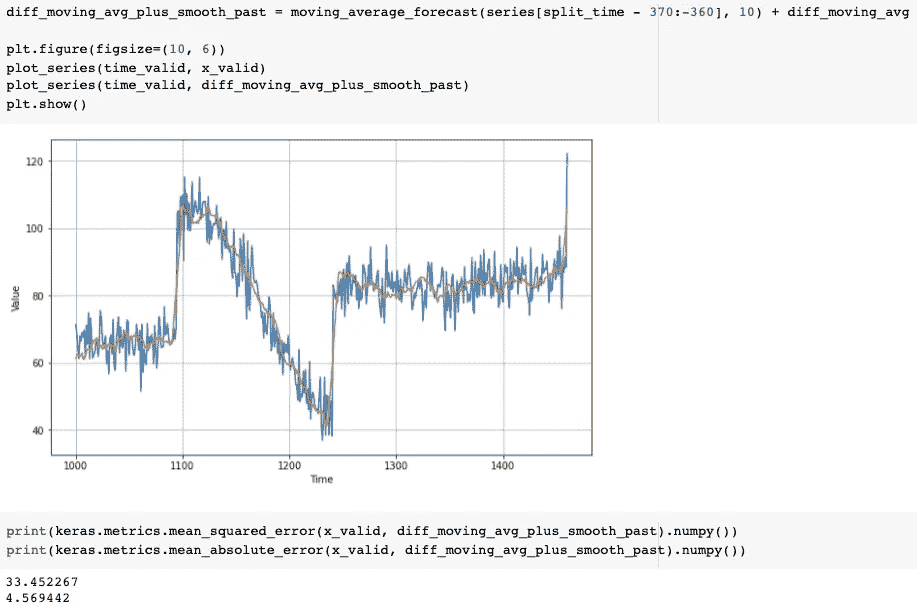

# 结论

因此，我们探索了时间序列数据的本质，我们看到了它们的一些更常见的属性，包括季节性和趋势等。我们还研究了一些预测时间序列数据的统计方法。等等，深度学习在哪里？请收听第 2 部分，在这里我们开始慢慢深入 DNNs 进行时间序列分类等等！！！

# 参考

本帖所有笔记摘自:[https://www . coursera . org/professional-certificates/tensor flow-in-practice](https://www.coursera.org/professional-certificates/tensorflow-in-practice)，如果你对深度学习& AI 感兴趣，我强烈推荐你选修这门课程。

TensorFlow API 文档:[https://www.tensorflow.org/api_docs](https://www.tensorflow.org/api_docs)