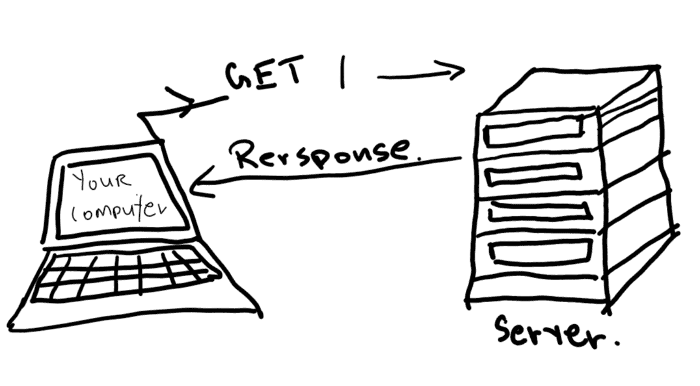
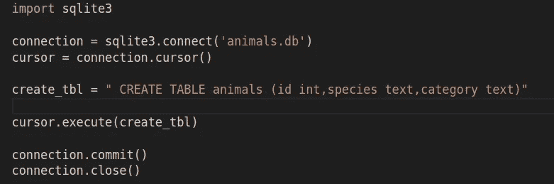
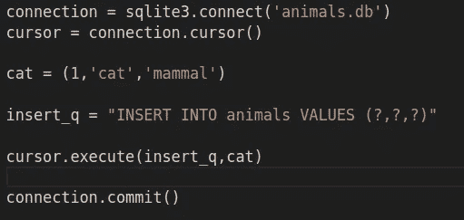
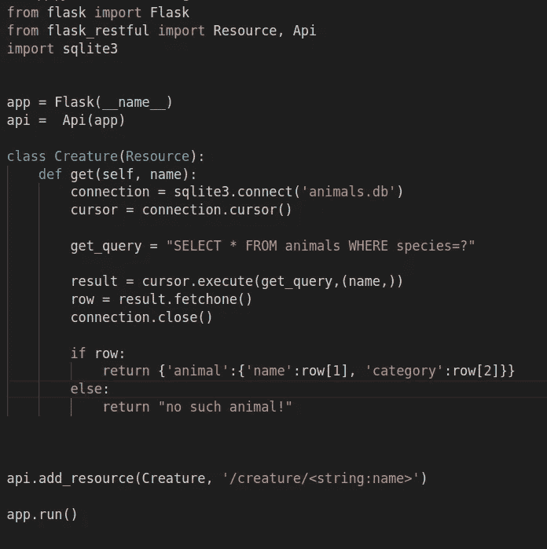
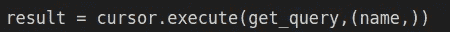

# [第 2 部分]使用 Flask 的 RESTful API:HTTP 动词、无状态 REST 范式。

> 原文：<https://medium.com/analytics-vidhya/part-2-restful-apis-using-flask-http-verbs-statelessness-the-rest-paradigm-853de8d7164e?source=collection_archive---------8----------------------->

让我们后退一步，重新回顾一下互联网是如何工作的。

当你在浏览器中输入“www.facebook.com ”,它就会通过互联网到达服务器。服务器是运行在专用计算机上的程序，它可以响应浏览器的请求并向用户提供内容。这些请求和响应是使用超文本传输协议(HTTP)传输的，这实际上只是计算机通过互联网交换数据的一种标准化方式。

HTTP 定义了方法(也称为 HTTP 动词),浏览器和程序使用这些方法来发出请求，这些请求由服务器接收和执行。这些包括 GET、POST、PUT、DELETE 和其他。GET 是最常用的动词。当您将浏览器指向一个 URL 时，它会向注册接收该 URL 请求的服务器发送一个 GET 请求。GET 请求告诉服务器传递该 URL 的数据(包含文本图片和其他内容的网页)。当您去 facebook.com 时，您的浏览器向脸书服务器发送一个 GET 请求，该请求到达与基本 URL 相关联的端点。当请求被发送到该端点时，服务器被告知传递登录页面，这就是您所看到的。

然后，API 利用这些相同的 HTTP 动词接收来自用户的请求，并在响应中传递数据或修改它的数据存储。在上一篇文章中，我们在资源类中添加了一个 get 方法，让服务器知道如何处理用户向服务器上的端点发送的 GET 请求。我们同样可以使用我们的 API 向服务器添加数据或删除数据。我们只需要写出我们的端点，与这些端点相关联的资源，资源可以处理什么样的请求，以及它们最终将如何处理它们。

使一个 API 成为 REST api 的是它对某些原则和惯例的遵守，这些原则和惯例是 REST 范式的核心。REST 认为 API 是一组可以交互的资源，可以检索或修改数据。我们在应用程序中看到了这一点，我们创建了一个资源对象，将它与端点相关联，并将资源添加到 flask_restful 中。部署应用程序时，对端点的调用将由服务器接收，服务器将把它提交给 flask_restful，后者将获取指定端点的资源，并运行其中的任何代码来生成正确的响应。

另一个关键的方面是 REST API 应该是无状态的(REST 代表**RE**presentational**S**tate**T**transfer)。状态是 CS 的一个完整的研究领域，很难进入。本质上，REST 上下文中的无状态意味着服务器对请求的响应不应该依赖于任何先前的请求。这归结起来就是将数据存储从处理和交付中分离出来，并让我们的 API 充当数据库的网关。

我们停止了前一篇文章，在本地服务器上运行一个有效的 API。然而，这个 API 的记录是运行脚本中定义的一个简单的 python 列表，存储在短期内存(RAM)中。以这种方式在脚本中声明的变量只在脚本运行时存在，如果程序终止，变量就会丢失。此外，RAM 内存是有限的，并不意味着要保存大量不经常使用的信息。

但最重要的是，它违反了“无国籍”的条件。假设我的 API 中有一个端点返回一个位置中所有记录的列表，另一个端点允许我添加到这个列表中。如果我像在我的示例脚本中那样将所有这些都存储在内存中，那么所有记录的列表将取决于先前发送给它的 POST 请求。

所以我们必须将 API 使用的数据存储在磁盘的某个地方。存储数据以供检索的首选方法是在数据库中。每当用户向我们的 API 提交请求时，它要么从我们的数据库中检索数据，要么向我们的数据库中添加数据。SQL 是标准的选择，尽管像 Mongo-DB 这样基于 JSON 的非 SQL 平台已经变得越来越流行。在本教程中，我们将建立一个 SQLite 数据库，并让我们的 API 使用它将请求的数据发送回用户。

在我们的数据存储和可能想要使用我们的数据和服务的最终用户之间添加 API 层有很多好处。首先，有这样一个数据库中介会更安全。它提供了一个干净、统一的界面，任何程序都可以轻松地与之交互。它是模块化的，因为我们可以在 API 中而不是在客户端应用程序中包含许多功能，所以我们可以在一个地方进行更改，而消费应用程序可以继续照常运行，因为它们可以从预期的 API 中获得输出。

所以让我们建立一个 SQLite 数据库来使用我们的 API。在您的根文件夹中，创建一个新的 python 文件(如果您愿意，可以将其命名为“db_setup.py”)。这是该文件的外观:

让我们走一遍。我们导入 sqlite3，它内置于 python 中，所以我们不需要安装任何东西。使用 SQLite 的第一步包括设置我们的连接对象；这就是我们的 Pyython 脚本连接到数据库的方式。我们在这里指定数据库文件的路径和名称，如果我们输入一个不存在的文件名，sqlite3 实际上会在那个位置创建一个同名的数据库文件。

然后，我们从连接对象中捕获光标。这个对象用于向我们的数据库提交查询，它存储从提交的查询返回的结果。现在，我们可以简单地继续编写 SQL 表达式，并将它们传递给游标对象的 execute 方法。

在上面的例子中，我们编写了一个查询，在数据库中创建了一个表，并向其中添加了列。animals 后面的 tuple 包含我们希望在表中使用的列的名称，以及要存储在那里的数据的类型。然后我们简单地将它传递给 execute 方法，这将创建一个表。最后，确保在连接对象上调用 commit 方法，以实际保存对数据库的更改，并关闭连接。

下面是我们向数据库添加记录的方法:

在连接到数据库并实例化了一个游标之后，我们首先定义了一个 tuple，其中包含了我们想要的记录值。记得我们做了三个专栏，第一个有 integeres，第二个有 text。为了将该记录插入到数据库中，我们创建了如上所示的查询。然后，我们将查询和带有实际记录的元组传递给 execute，它知道替换“？”用元组的值按顺序排列。

好的，我们知道如何将数据输入我们的数据库。很容易看出我们如何使用 API 从数据库中检索数据。我们只需将检索代码添加到与端点相关联的资源中，就这样！

请注意，我们再次实例化了一个连接、一个游标，并像以前一样将一个查询传递给游标。只是这一次，我们编写了一个 select 查询，将用户传入的变量传入我们的端点，然后从该查询中检索结果。

我想指出一件事。仔细看看这条线:

请注意当我们将 name 变量传递给游标时。传入只有一个值的元组似乎有些奇怪。不幸的是，这只是 SQlite 的一个怪癖:它要求变量以元组的形式传入，即使只有一个。之后，我们通过对结果调用 fetchone，将执行查询的结果捕获到“row”中。Fetchone 将只返回一条记录，如果我们只想得到一条记录，那么它是很有用的。这会得到一个列表。如果在数据库中找到一条与用户输入相匹配的记录，我们通过切分列表以 JSON 格式返回该记录。如果没有找到，我们返回一个错误消息。

一点也不难，对吧？向前去建造吧！