# 第 2 部分什么是 KPI？如何构建 KPI Tableau 仪表板

> 原文：<https://medium.com/analytics-vidhya/part-2-what-is-kpi-how-to-build-a-kpi-tableau-dashboard-929dd2e39890?source=collection_archive---------4----------------------->

你可以在这里查看我的教程第一部分。

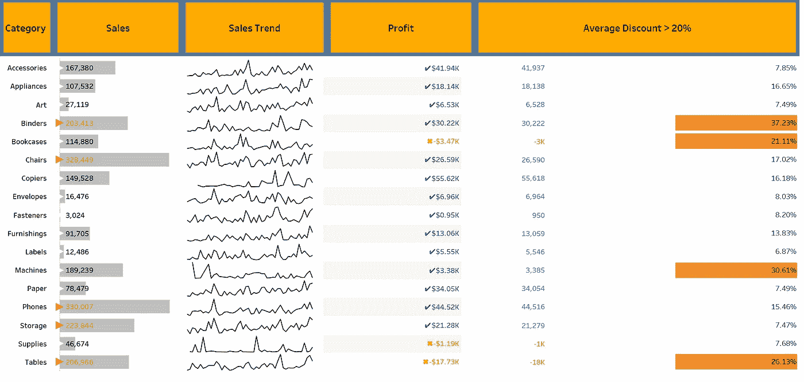

## 介绍

您现在看到的这个特定的表有几个元素，这个 sales 列在背景中有一个模糊的条形图，以及三角形指示器，它告诉子类别是否达到或超过阈值。“销售趋势”列有一个迷你图，这是一个没有标签或坐标的非常小的折线图，用于显示一段时间内的一般活动或趋势。“利润”列显示条件文本调用方，其中负值为橙色，正值为蓝色。折扣列有一个条件列，它基于达到或超过阈值的折扣。

我们将介绍如何创建一个阈值和如上图的条件格式。

## 在这篇文章中，我们将回答剩下的问题

> ***1。有多少产品达到当年销售额和利润的门槛？***
> 
> ***2。每个品类的销售趋势都不一样吗？***
> 
> ***3。20%以上的折扣是增加利润吗？***

# 第一部分

# KPI 内嵌条: ***当前销售额是否超过上年销售额？***

> 欺骗
> 
> 1.条形/形状双轴
> 
> 2.每种颜色/形状的计算字段

将子类别拖放到行中，将销售额拖放到列中，使图表从自动变为条形。请注意，我已经创建了三个参数，我们可以在本文中进一步使用。一个参数用于利润阈值，一个用于销售，一个用于折扣阈值。

在处理这个阈值之前，让我们创建如下图所示的参数

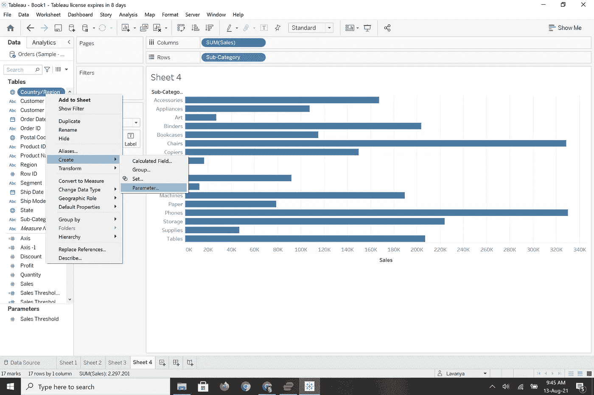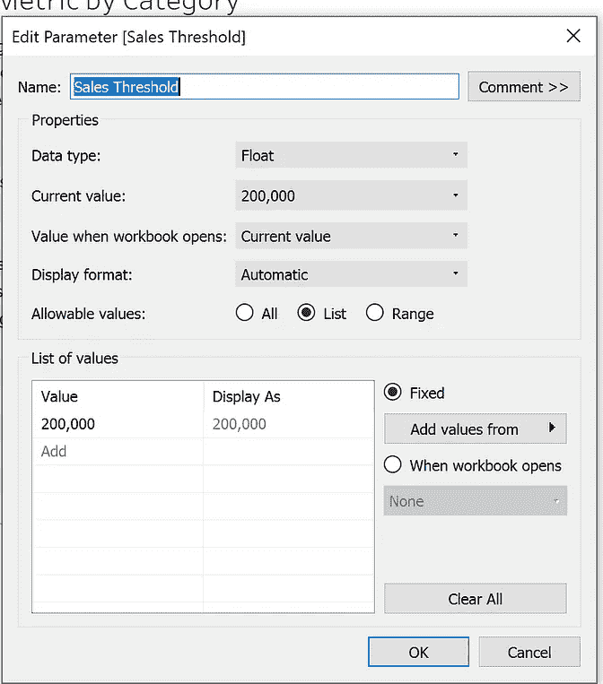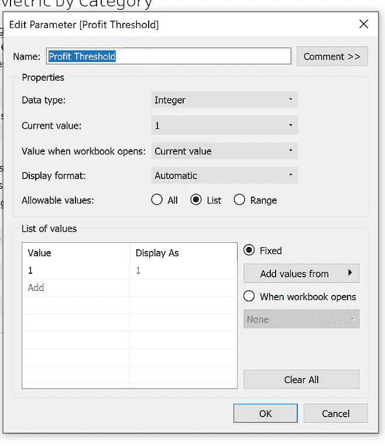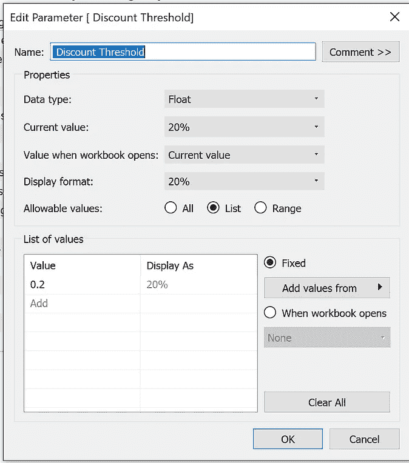

如何创建 Tableau 参数

对于第一个问题，我们只是想确定是否有任何子类别的销售额达到或超过了销售阈值，那么我们该如何做呢？

1.  如果销售额超过销售阈值，则创建计算字段，并将其命名为“高于销售阈值”

> 如果 SUM([销售])> =[销售阈值]
> 那么 SUM([销售])
> 结束

2.如果销售额低于销售阈值，则创建计算字段，并将其命名为“低于销售阈值”

> 如果求和([销售额]) < [Sales Threshold]
> 那么求和([销售额])
> 结束

3.创建带有三角形或圆形指示器的计算字段，并将其命名为“阈值指示器”

> 如果 SUM([销售])> =([销售阈值以上])
> 那么“▲”
> 结束

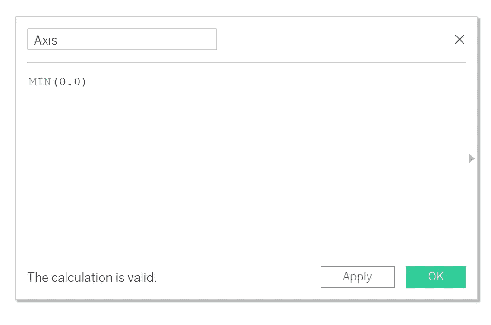

创建计算字段**轴**

**轴**当您必须在单个图形中处理多个度量时，一种流行的方法是创建我们自己的轴，当我们为行或列添加轴时，我们会得到每个轴的标记卡，这意味着我们可以独立管理我们的度量。下面我们创建一个轴；命名为“**轴**

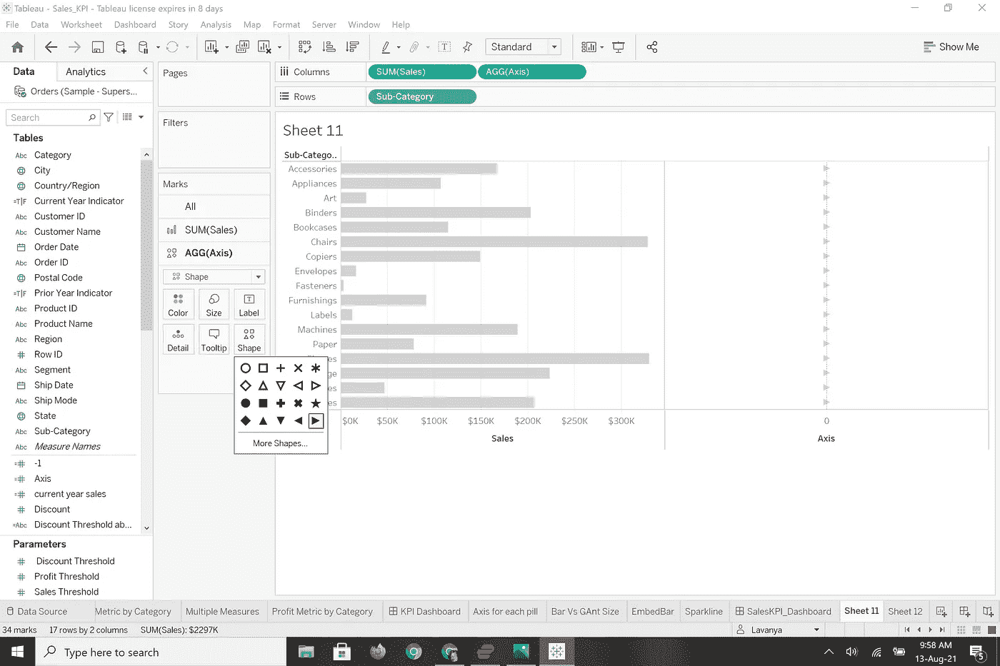

在列中添加轴之前，将条形颜色更改为灰色。轴标记卡将如下所示。选择形状，然后选择您想要的形状。我选择了三角形。

删除轴卡颜色中的“阈值指示器”计算字段。删除标签中的“低于销售阈值”和“高于销售阈值”。

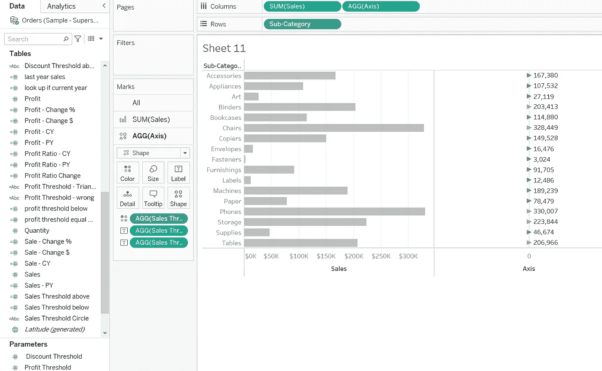

放到各自的地方后，页面应该是这样的。

格式化图表，按照数字如下。隐藏所有的标题。

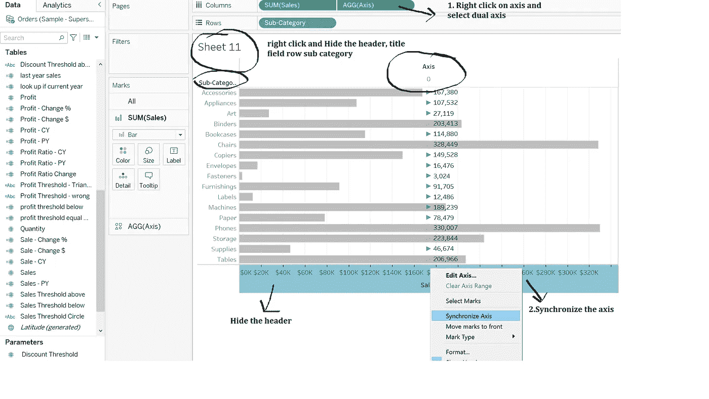

双击蓝色三角形，将蓝色调色板指定为白色，橙色保持原样。现在嵌入的图形应该如下所示:

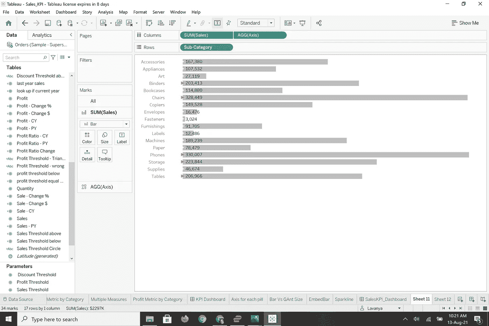

# b)简单 KPI 表:本期利润是否超过上年利润？

> 对于第二个问题，我们已经创建了利润阈值(参数)，现在创建计算字段，就像我们为销售创建的一样。用利润代替销售。不是将销售额放在列中，而是将利润放在颜色和标签中，并在标签中添加计算字段。图表如下所示。(我没有使用三角形，而是使用了勾号和错误的符号)

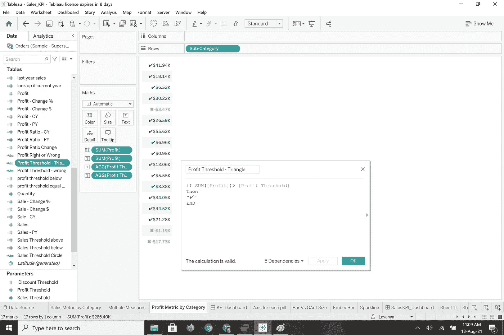

# 第 2 部分如何创建展示销售趋势的迷你图？

遵循图像中的步骤和格式，如下所示:

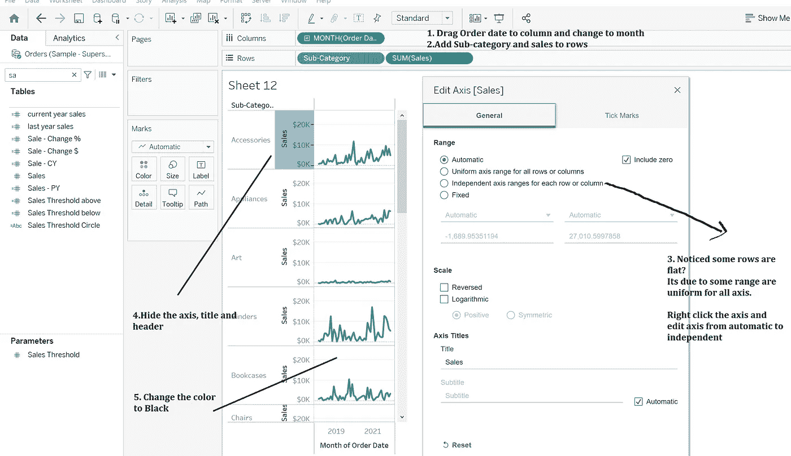

1.  将订单日期拖到列中，并更改为月
2.  向行中添加子类别和销售额
3.  一旦完成，你会看到折线图，但有些类别可能有平坦的范围，这是由于所有子类别的统一轴。右键单击并更改为独立

# part-3***20%以上的折扣是增加利润吗？***

我们已经在一开始就设定了折扣的门槛。因为我们要比较折扣和利润。我们将采取多种措施。您是对的，我们将再次使用安讯士药丸，不是一粒而是两粒。

创建一个轴计算字段，并将其命名为-1

> 最小值(-1.0)

我们将创建计算字段，对超过 20%的折扣进行计数，并将其命名为“高于或低于折扣阈值”

> 如果 AVG([折扣]) >= [折扣阈值]
> 则“等于或高于”
> 否则
> “低于”
> 结束

现在让我们创建图表和格式

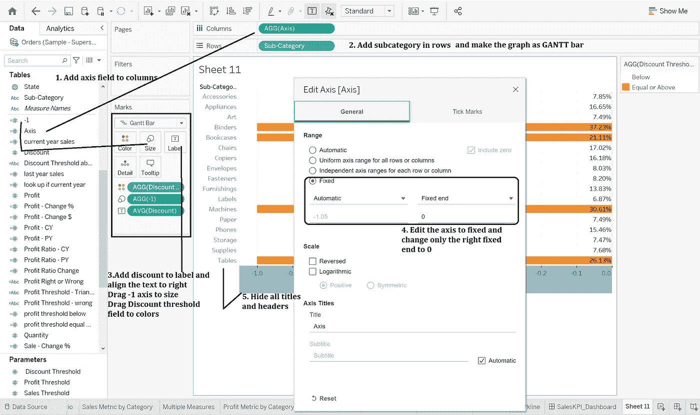

1.  将轴添加到列和行中的子类别。将图表制作成甘特图。
2.  将折扣拖到标签上，并向右对齐。将-1 拖到大小，将“折扣阈值高于或低于”拖到颜色。
3.  右键单击图表上的轴，并将固定值编辑为 0

隐藏标题和轴标题后，图表应该如下所示

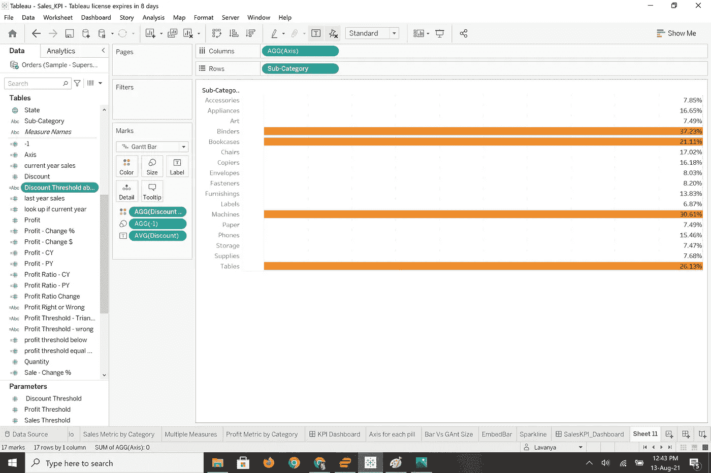

创建一个 Sales_KPI_Dashboard，并将[文章 1](https://lavan1320.medium.com/what-is-kpi-and-how-to-build-kpi-in-tableau-a5c652b41fd6) 和文章 2 的所有结果添加到您的 Dashboard 中。

# 总结和调查结果

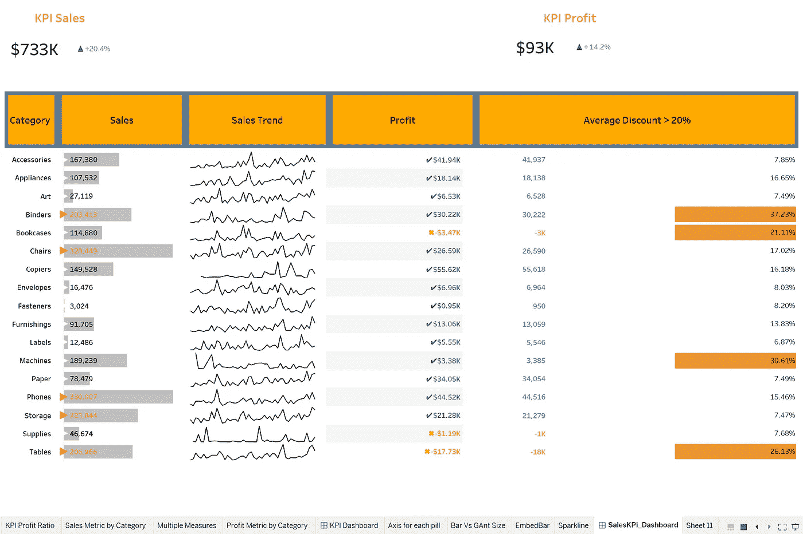

1.  ***本期利润是否超过上年利润额？***

> 是的，与去年相比，利润增加了 14.2%

***2。目前的销售额是否超过了上一年的销售额？***

> 是的，与去年相比，销售额增加了 20.4%。

***3。有多少产品达到当年销售额和利润的门槛？***

> 利润阈值:在 17 个类别中，有 3 个类别低于利润阈值
> 
> 销售阈值:在 17 个类别中，有 5 个类别高于销售阈值

***4。每个品类的销售趋势都不一样吗？***

> 每个类别的销售趋势各不相同，这有助于组织制定未来的预算和财务分析方法

***5。20%以上的折扣是增加利润吗？***

> 有 4 个品类的折扣超过 20%，其中 2 个品类的利润为负。

# 建议

数据显示折扣可以促进销售，但利润却受到影响。折扣越低，销售额也越低。为了增加销售额和利润，中值折扣可以在 10%到 20%之间。

这个折扣率对于提高每个类别的利润和销售额来说是理想的。

在 tableau public 查看我的 [Sales_KPI_Dashboard](https://public.tableau.com/app/profile/lavanya4954/viz/Sales_KPI_Dashboard/SalesKPI_Dashboard)