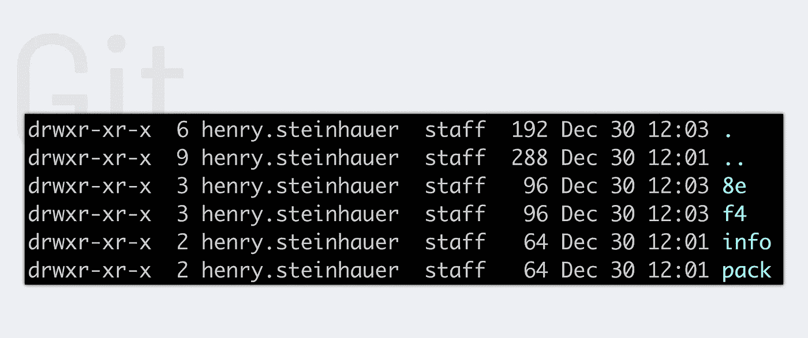
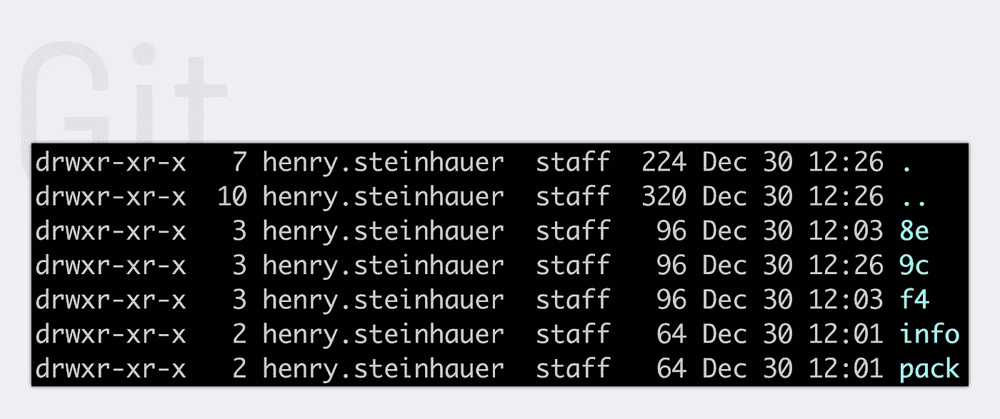
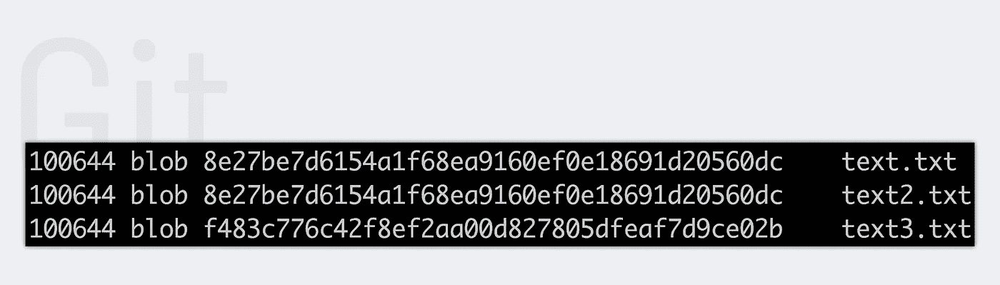
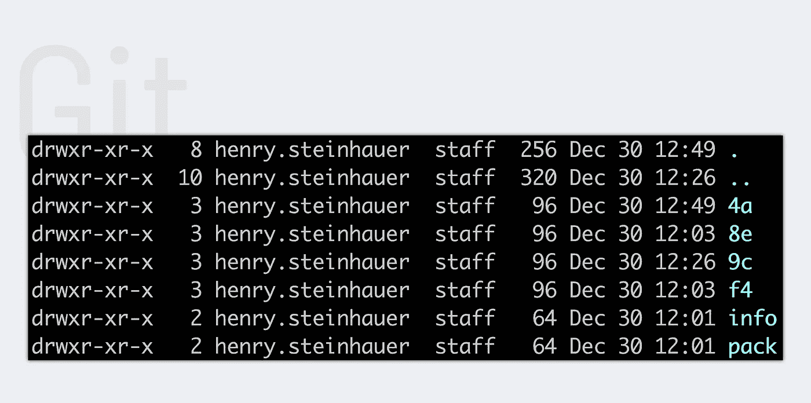
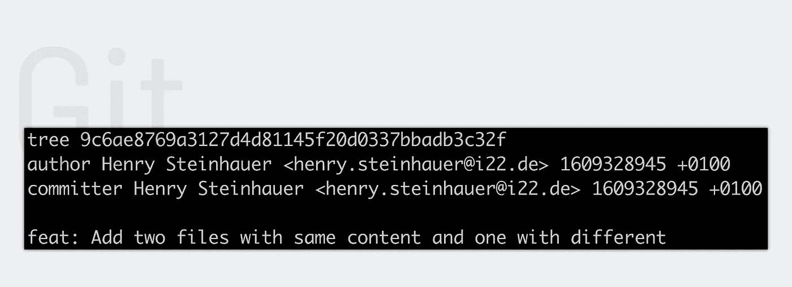

# 第 4 部分:Git 的内存功能

> 原文：<https://medium.com/analytics-vidhya/part-4-memory-functionality-of-git-5890e3d26ca3?source=collection_archive---------27----------------------->

今天，我们深入探讨 git 存储系统。


由[约书亚·索蒂诺](https://unsplash.com/@sortino?utm_source=unsplash&utm_medium=referral&utm_content=creditCopyText)在 [Unsplash](https://unsplash.com/@sortino?utm_source=unsplash&utm_medium=referral&utm_content=creditCopyText) 拍摄的照片

git 的内存功能没有你想象的那么难，但暂时还是很难理解。在我看来，最好的理解方式不是使用电梯，而是步行。这意味着我们将手动创建散列和提交。但首先要做的是。☕️，喝杯咖啡，我们开始吧。

> 今天我们将手动创建各种散列。我在上一篇文章里给他们都解释过了。所以在这里，我将只研究 git 如何将更改存储到 git 数据库中。如果你不清楚 blob 树或提交是什么，我强烈建议你先阅读我的文章->[git-part-3-discover-the-git-folder](/analytics-vidhya/git-part-3-discover-the-git-folder-ca3e828eab3d)。

# 议程

*   一滴
*   三
*   犯罪
*   结论

# 一滴

首先，我们需要一个新的 git 存储库。接下来，我们必须做出一些改变。因此类型

```
echo 'text' >> text.txt; echo 'text' >> text2.txt; echo 'text2' >> text3.txt
```

在你的终端里。在那之后，我们有东西要上演。现在，激动人心的部分开始了。要将我们的更改转换成 blobs，我们必须编写`git hash-object *filename`。在我们的例子中，我们需要用 *text.txt、text2.txt 和 text3.txt 替换文件名，或者我们可以使用通配符** 。该命令创建一个 **160 位散列**，并在控制台中显示为一个 **40 十六进制数**。但实际上，我们不只是想看到斑点。我们想要的是将它们存储在数据库中。为此，我们需要在命令的 hash 对象和文件名之间添加-w。

```
git hash-object -w *
```

之后，我们坚持保存我们的更改。但仅仅是内容。blob 不关心文件/文件夹名称或其他附加信息。下面我们看到生成的斑点。你可能想知道为什么只有两个斑点。这是因为我们的两个变化是相同的。你还记得 blobs 只存储内容吗？因此，我们有一个 blob 来存储两个不同文件的内容。



下一步是创建我们的提交。这家店的更重要的信息是关于我们的变化。我们已经知道，当我们正常生成提交时，git 会创建一棵树和一个提交散列。让我们做那个手册。然而，我们需要先做一些事情。几个步骤前，我们将 blobs 存储在本地 git 数据库中。现在我们需要将更改添加到索引中，也称为临时区域。通常这是用`git add`命令自动完成的，但现在我们已经手动保存了我们的更改。因此，我们必须用命令`git update-index --add *`将我们的更改附加到索引上。我们需要追加 **-添加**，因为通常情况下，**更新索引**会忽略新文件。之后，我们准备创建树。

# 树

```
git write-tree
```

上面的命令创建了一个树散列，其中整个索引的所有条目都是树项目。



要检查我们的树，键入`git cat-file -p 9c...`。在我们的例子中，我们有三个条目。



**100644** 表示文件的种类。在我们的例子中，它是一个**普通文本文件**。其他可能是 **100755** 这意味着它是一个**可执行文件**或 **120000** 来指定引用为一个**符号链接**。我认为 blob 应该是不言自明的。十六进制数字是对我们保存的更改的 blob 的引用，在末尾，text.txt、text2.txt 和 text3.txt 是相应的文件名。您可能想知道为什么三个条目中的两个具有相同的引用。如上所述，这是因为两个文件具有相同的内容，并且这导致相同的 blob 被引用。现在你应该知道 git 树存储了什么。简而言之，git 树包含哪个文件或目录与哪个 blob 相关联。

# 犯罪

最后，该树允许我们创建一个提交对象。为此，您需要输入以下内容:

```
echo 'feat: Add new test.txt file with content test' | git commit-tree *tree-hash.
```



现在让我们检查一下提交对象。



在顶部，我们看到对我们的树散列、作者和提交代理的引用，以及日期和提交消息。但是第一次提交是特殊的。通常我们也会看到对前一次提交的引用，但实际提交是第一次。一个提交也可能有多个父提交。

# 结论

今天，您简要回顾了 git 如何存储内容。此外，您现在应该知道 git 的数据库(文件系统)是如何工作的。我希望这次旅行有趣且有帮助。如果你有什么要提的或有问题，请在评论区留言。再见😃。