# 数据仓库建模概念

> 原文：<https://medium.com/analytics-vidhya/part-i-i-data-warehouse-modelling-concept-962f286d1566?source=collection_archive---------2----------------------->

[TOC](/@williamong1400/project-1-solving-problem-in-e-commerce-with-data-ac7ed38d7b4) | [第一至第二部分](/@williamong1400/part-i-ii-data-warehouse-modelling-implementation-fb80f0cb7127) *👉*

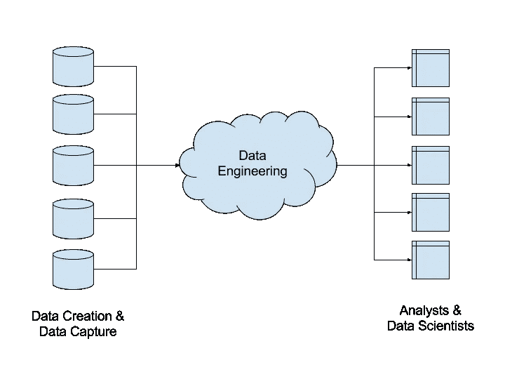

数据工程概念

> 数据工程是以可用格式向数据分析人员和数据科学家提供数据的过程，数据分析人员和数据科学家运行查询以执行分析，并针对信息应用算法以进行预测分析、机器学习和数据挖掘应用。

## 背景

为什么我们需要将数据载入数据库？为什么不将我们的数据存储在文件中而不是数据库中，并从文件中进行分析呢？

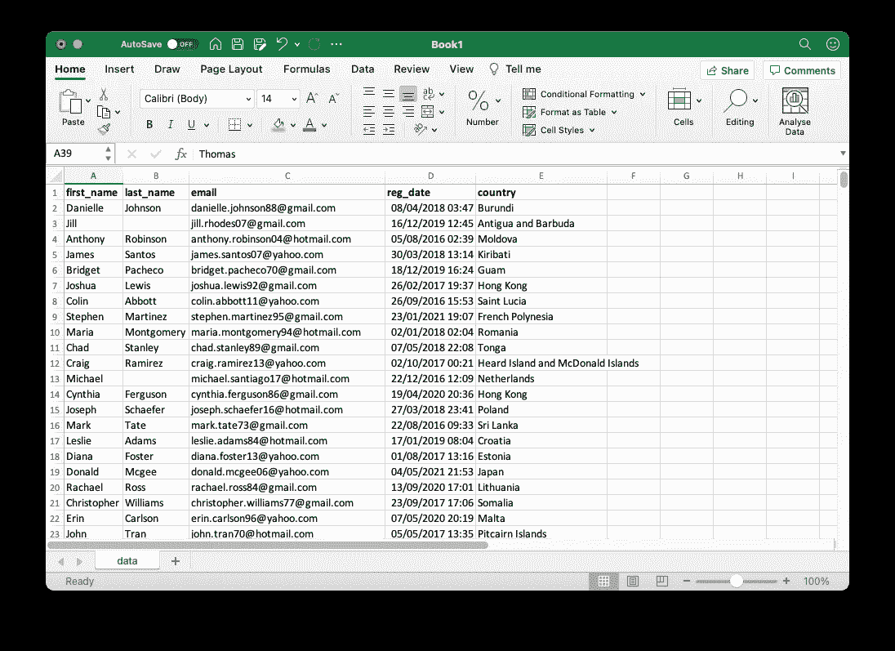

平面文件示例(excel)

为了从电子商务中复制业务流程，我们需要数据库**充当**来存储日常交易流程的数据，而仓库**将充当**来存储用于分析我们的电子商务的历史数据集合。

不仅如此，大部分时间数据并不处于分析的最佳状态。如果没有数据工程过程，我们将不得不花费更多的时间来准备数据分析，以解决复杂的业务问题。因此，该部分(**第一部分**)是使数据准备好&可用于分析(**第二部分**)和建模(**第三部分**)的过程

在这一部分，我们将讨论如何将`csv`格式的数据集加载到数据库服务器(PostgresSQL)中，并从中设计数据仓库。

简而言之，我们将讨论:

1.  **识别**:寻找数据集之间的关系
2.  **设计**:设计 OLTP & OLAP 加载&分析数据
3.  **实现**:如何使用 ETL 过程将数据从 csv 加载到数据库并处理到仓库(下一篇博文！！)

ps:该文档提供了我为**零件 1** 创建和使用的管道的过程和结果。💪

# 目录

*   先决条件
*   体系结构
*   数据库ˌ资料库
*   数据仓库
*   ETL 管道

# 先决条件

首先，本项目使用的所有数据都是由我们的导师**给出**(**原始数据**)。数据集由 7 个`csv`文件组成。

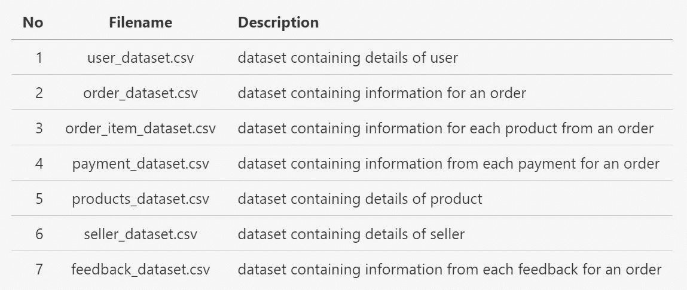

数据集详细信息

对于项目环境，请使用:

*   [PostgreSQL v 10.0](https://www.postgresql.org/docs/10/tutorial-install.html)
*   [Python 3.8+ (pip)](https://blog.devgenius.io/python-for-beginners-how-to-install-python-3-8-3-for-windows-pc-a84f5d237c19)

# 体系结构

这个项目的**管道结构**是什么？

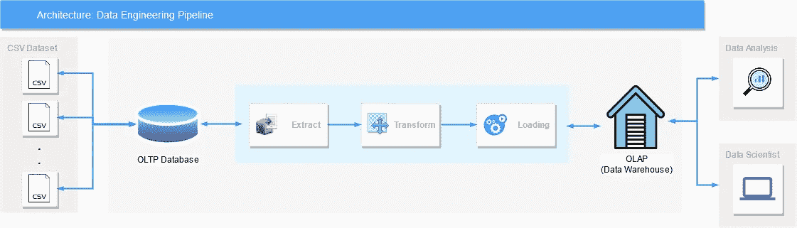

管道简化

上图显示了我们将要做的设计和建模数据仓库的轮廓，我们将用于**第二部分** & **第三部分**。

# 数据库ˌ资料库

再来说说**数据库**。数据库中使用的数据结构称为关系模型。它将数据表示为表格以及这些表格之间的关系。

表中的每一行称为一条**记录**，每一列称为一个**字段**。

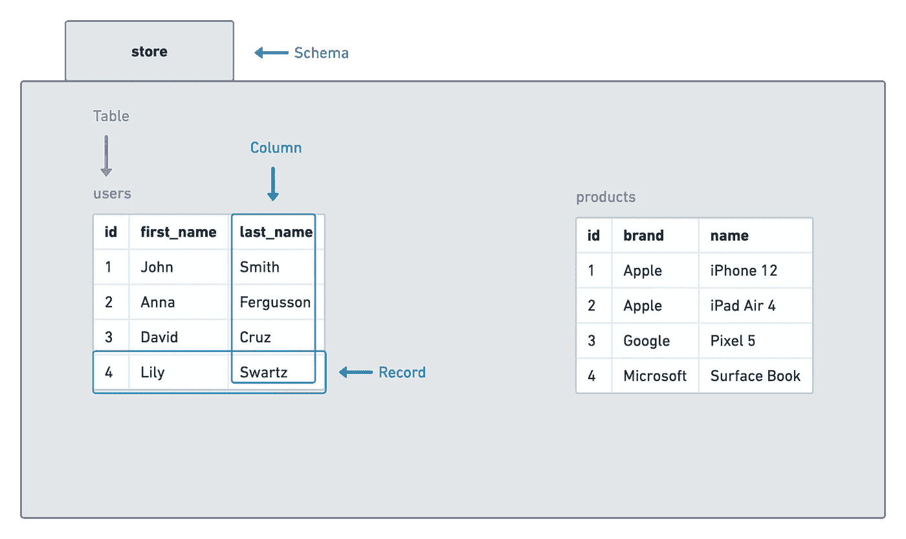

数据库属性的图示

列的数据类型定义了该列可以容纳什么值:**整数、字符、日期和时间、二进制等等**。数据库表中的每一列都需要有一个**名称**和一个**数据类型**。作为基础，我将尝试回顾一下我们项目中使用的数据类型。

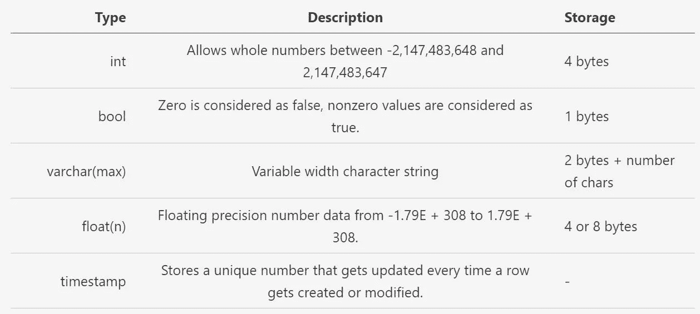

项目中使用的数据类型(SQL)

将`.csv`数据集加载到数据库后，我们需要**识别数据之间的关系**。之间的关系可以从下面看出

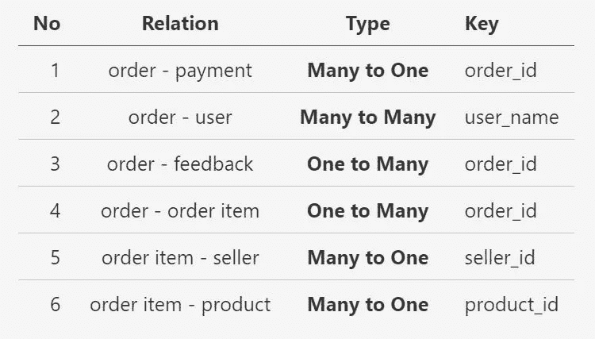

实体间的关系

映射关系后，我们可以创建数据并将其加载到数据库中。下面是我们将用作数据库模式的**模式**。

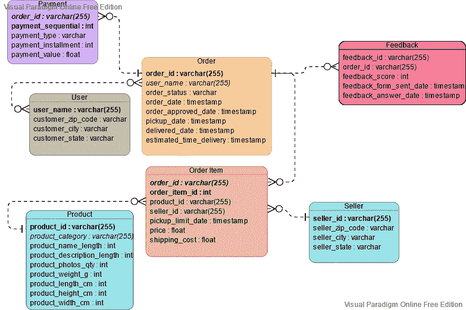

事务数据库模式

# 数据仓库

> **数据仓库**是一个特定的基础设施元素，它为包括数据分析师和数据科学家在内的线下用户提供对数据的访问，这些数据已经过整形以符合业务规则，并以易于查询的格式存储

数据必须符合验证质量的特定业务规则。然后，它被存储在一个非规范化的结构中— *,这意味着将可能被一起查询的信息存储在一起*。这有助于通过降低从仓库中获取数据所需的查询的复杂性(即，通过减少数据连接的数量)来提高性能。

为了回答我们的业务问题(将在**第二部分**中解释)，我们需要创建一个数据仓库模式，它可以提供我们将用于**第二部分** & **第三部分**的信息。我们将使用**星型模式**作为我们的仓库。我们仓库的粒度是**每个订单**1 个产品，这意味着*事实订单条目*中的每一行都有一个订单中 1 个产品的详细信息。

在我们开始之前，我想概述一下我们将用来对数据仓库建模的概念:

星型模式是一种成熟的数据仓库建模方法，它要求建模者将他们的模型表分类为维度或事实。

**维度表**描述业务实体——您建模的事物。实体可以包括产品、人、地点和包括时间本身在内的概念。星型模式中最一致的表是日期维度表。维度表包含作为唯一标识符的一个键列(或多个列)和描述性列。

**事实表**存储观察或事件，可以是销售订单、库存余额、汇率、温度等。事实数据表包含与维度表相关的维度键列和数值度量列。维度键列决定事实表的维度，而维度键值决定事实表的粒度。

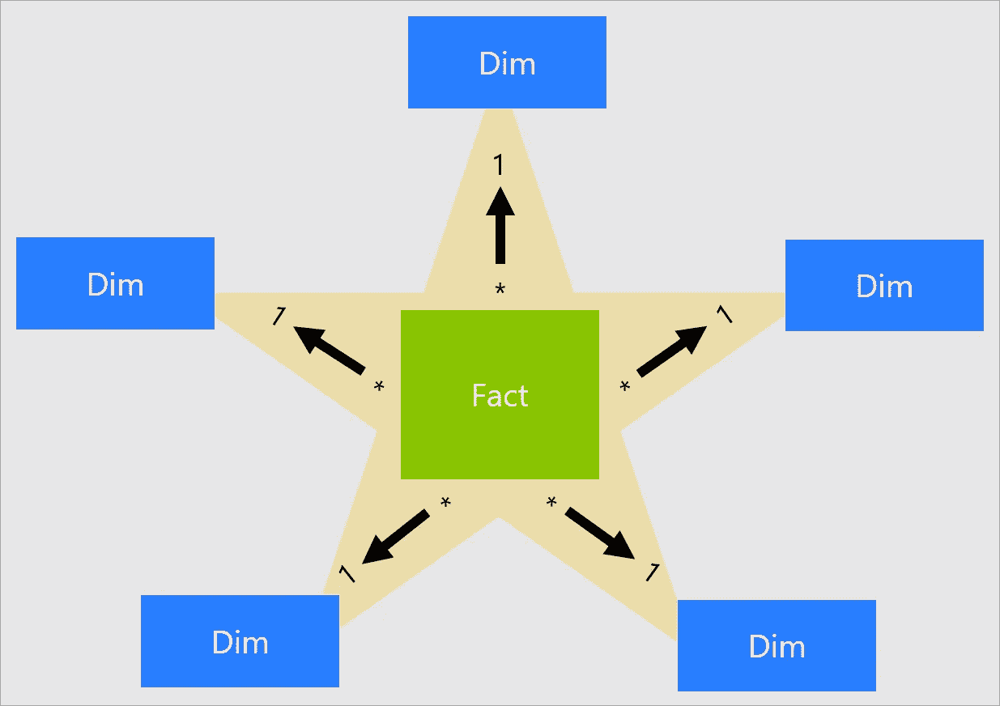

星形图解说明

一个**缓慢变化的维度** (SCD)是一个适当管理维度成员随时间变化的维度。它适用于业务实体的价值随时间以特定的方式发生变化的情况。一个*缓慢*变化维度的好例子是客户维度，特别是它的联系信息列，如电子邮件地址和电话号码。相反，当维度属性经常变化时，某些维度被认为是快速变化的，如股票的市场价格。在这些情况下，常见的设计方法是将快速变化的属性值存储在事实表度量中。

星型模式设计理论指的是两种常见的 SCD 类型:类型 1 和类型 2。维度类型表可以是类型 1 或类型 2，或者对于不同的列同时支持这两种类型。但是在这里，我们只使用类型 2 SCD(或者像对于时间维度一样根本不使用 SCD)。

## 2 型 SCD

a**Type 2**SCD 支持维度成员的版本化。如果源系统不存储版本，那么通常是数据仓库加载过程检测到更改，并适当地管理维度表中的更改。在这种情况下，维度表必须使用代理键来提供对维度成员的*版本*的唯一引用。它还包括定义版本的日期范围有效性的列(例如，**开始日期**和**结束日期**)和可能的标志列(例如，**是当前的**)，以便于根据当前维度成员进行筛选。

因此，要创建具有星型模式的数据仓库，我们需要**维度**和**事实表**

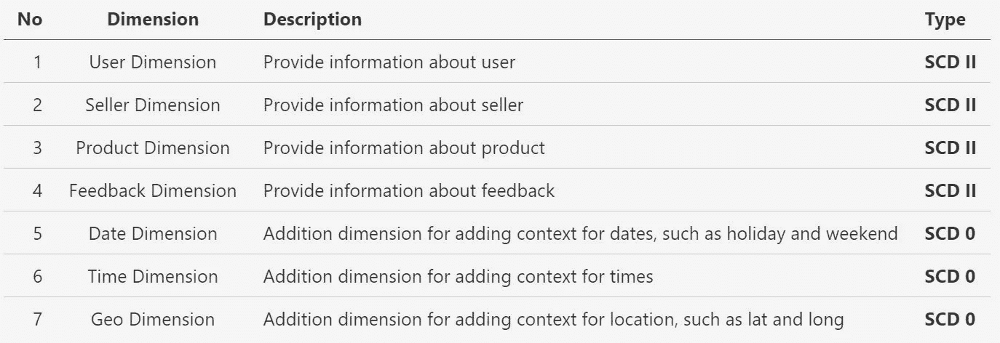

维度表详细信息

在**星型模式**设计中，**度量**是一个事实表列，存储要汇总的值。在这里，我们事实表存储了来自**的 5 种不同类型的度量，每个产品来自一个订单**:

*   价格
*   运输费用
*   支付价值
*   用户终身消费
*   用户生命周期顺序

为了连接事实表和维度表之间的数据，我们需要一个代理键。**代理键**是添加到表中的惟一标识符，用于支持星型模式建模。根据定义，它没有被定义或存储在源数据中。通常，代理键被添加到关系数据仓库维度表中，以便为每个维度表行提供唯一的标识符。

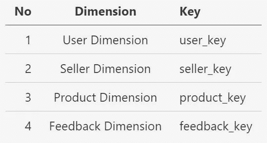

每个维度表的代理键

在我们准备好所有的维度和事实表之后，这里是我们的数据仓库建模的最终结果(模式)。

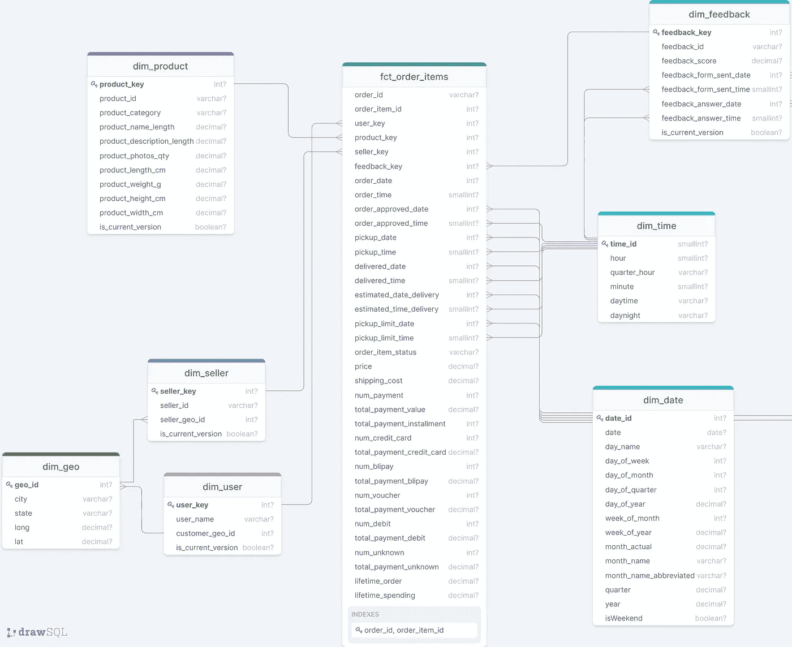

数据仓库模式(简化)

# ETL 管道

为了将数据从我们的 **OLTP** (数据库)加载到 **OLAP** (数据仓库)，我们需要一个用于 ETL 的管道。为此，我们需要为每个维度和事实表创建一个 ETL 过程。

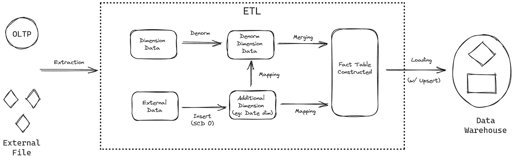

ETL 管道草图

上图展示了我们的 etl 管道的处理结构。此外，我们使用**PostgreSQL**进行数据存储，我们将数据从 **A (OLTP)移动到 B(OLAP)** 的转换逻辑是使用 **SQL 和 Python** (没有第三方工具)执行的。

对于数据源，我主要使用两种类型的数据源:

*   数据库(OLTP)
*   外部数据(平面文件)，如 excel 中的[城市地图](https://simplemaps.com/data/id-cities)和[日期时间](https://blog.crossjoin.co.uk/2015/06/26/automatically-generating-date-dimension-tables-in-excel-2016-power-pivot/)

这就是我们在实现数据工程部分时使用的概念的结尾。对于实现本身，请查看第 I-II 部分:数据仓库建模实现。保持安全，继续努力🔥！！