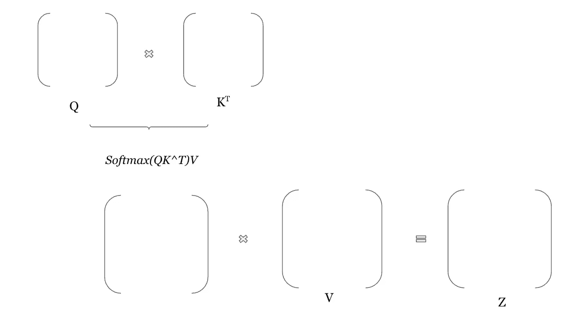

# 第二部分:什么是注意力？

> 原文：<https://medium.com/analytics-vidhya/part-ii-what-is-attention-ba89f1bf79f1?source=collection_archive---------2----------------------->

这是第二部分[*“注意力是你所需要的全部”但是为什么呢？*](https://zreelakshmiq.medium.com/why-do-we-need-attention-42bb99fe938d) *系列，*如需提前了解，请随时查看内容*什么是注意事项？也许你不需要它，不管怎样，让我们开始吧！*

gertrda valasevi it 在 [Unsplash](https://unsplash.com/s/photos/artificial-intelligence?utm_source=unsplash&utm_medium=referral&utm_content=creditCopyText) 上拍摄的照片

一个星期五的晚上，由于我晚上没有任何计划，我决定和我的虚拟朋友卫莱谈谈，她是一个简单的语言模型。

我:“我爱河流。我可以永远坐在它的岸边，听着它流动的旋律”

卫莱:“是的，我同意。但是，如果你的账户里没有钱，去银行会很累。”

也许我应该开始制定周五晚上的计划，而不是和卫莱聊天。

重点是，一个词或一个句子的上下文仍然是一个问题。银行这个词到底是怎么回事？

我给大家介绍两个新问题，*词义歧义* *和*词义发现*。考虑这个句子，*

“因为下水道漏水，我几乎不需要给长在我院子里的植物浇水。”

*植物*这个词有歧义。作为名词，它可以用来表示一种植物的生命形式或一座工业建筑。它还有更罕见的含义，如演员假装是观众的一部分，以及各种口头含义，如放在地上。这里，在句子中，根据上下文的单词意味着一种植物的生命形式，但是当语言模型试图理解句子时，它可能不理解为下一句预测准确选择什么意思。这是词义歧义。词义发现被定义为学习一个词在不同的上下文中可能有什么意义的任务，为了实现这些属性，语言模型需要一些机制。

*(如果对本文* [*词义消歧:概述*](https://onlinelibrary.wiley.com/doi/full/10.1111/j.1749-818X.2009.00131.x#:~:text=Word%20sense%20disambiguation%20(WSD)%20is,the%20word%20plant%20is%20ambiguous.) *感兴趣，可以阅读关于该主题的更详细信息。)*

# 注意力

它是一个额外的层，让模型关注给定输入序列中的重要内容。为了能够正确地对齐单词，您需要添加这一层来帮助解码器了解输入中的哪个单词对确定其预测更为重要。为了做到这一点，我们给每个单词向量一个注意力分数。对序列中某个单词的较高注意分数表明该单词将强烈影响预测。现在我们如何计算这个注意力分数呢？

Jaye Haych 在 [Unsplash](https://unsplash.com/s/photos/keys%2C-queries%2C--values?utm_source=unsplash&utm_medium=referral&utm_content=creditCopyText) 上的照片

键、查询、值是与注意力相关的三个主要术语。让我们这样来看，你把钱包忘在家里了，你出门后才意识到。所以你回去开始寻找。你知道它在房子里面，你可能会把钱包放在某些地方。所以你会看到这些地方，在某个地方，瞧，你找到了！注意力在某种程度上也是如此。您有一个与某个值相关联的查询。因此，通过查看键-值关系，您将找到查询的答案，在键-值关系中，您有更多的机会找到值。

注意功能可以描述为将查询和一组键-值对映射到输出，其中查询、键、值和输出都是向量。输出被计算为值的加权和，其中分配给每个值的权重由查询与相应键的兼容性函数来计算。

注意力使用输入或编码器隐藏状态和解码器隐藏状态输出的编码表示。N 维键值对来自编码器隐藏状态，其中 N 是输入序列的长度，而查询来自解码器隐藏状态。计算关键字和查询的点积，以找到它们之间的相似性度量。*值*的加权和由关键字匹配查询的概率确定。这就是发生在简单的点积注意力内部的事情，之所以这么叫是因为 Q x K^T 的点积计算，其中 q 是查询矩阵，K^T 是关键矩阵的转置。

# 标度点积注意力

简单地说，成比例的点积注意力本质上是点积注意力的标准化版本。通常，当点积产生大的结果时，它表明 Q 和 K 非常相似。我们要求结果的值在 0 到 1 的范围内。这很重要，因为我们需要这些值作为概率。这可以在 Softmax 功能的*的帮助下轻松完成。它将所有分数标准化为概率分布。这样，获得了良好的概率注意力权重。但是对于非常大的向量维数，当传递到 softmax 函数时，大的幅度将导致非常小的梯度，因此我们需要预先调整值，其中 scale=1/√ d，*

*注意力= Softmax(Q* x *K^T)V.*

其中 Z 是最终的注意力矩阵

根据手头的任务，注意力可以用不同的方式来实现。简单看一下会是这样的:

*(一)编码器/解码器注意——一句话看另一句话进行预测，例如:翻译*

*(ii)自我注意(因果注意)——单句中的单词查看前一个单词寻找可能的关系，例如:摘要生成*

*(iii)双向注意——在一个句子中，单词既看前面的单词，也看后面的单词，以进行预测。*

现在我们知道注意力是什么了。但是促使我们说注意力是我们所需要的。本系列的下一篇也是最后一篇文章将让您得出我们一直预言的结论。