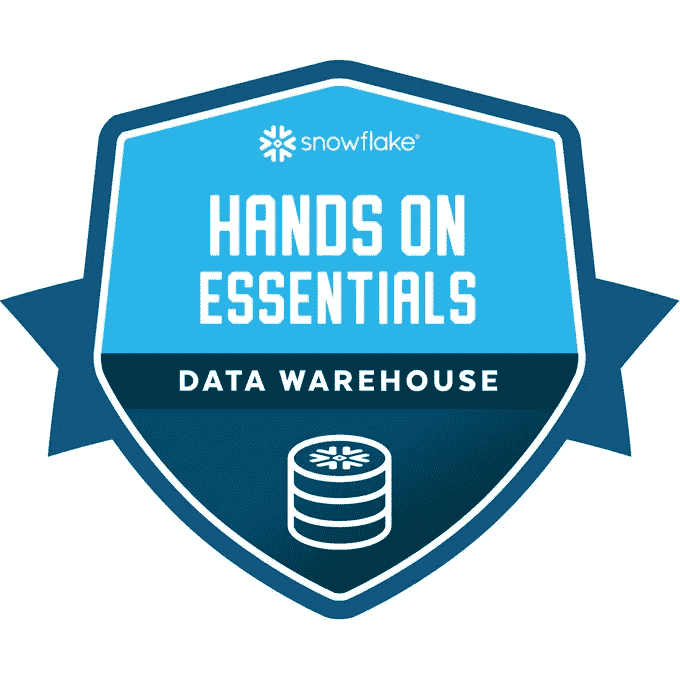

# 免费认证:传递雪花实践精华—数据仓库

> 原文：<https://medium.com/analytics-vidhya/passing-snowflake-hands-on-essentials-data-warehouse-bf2e8fdaaa7a?source=collection_archive---------0----------------------->

雪花实践精华—数据仓库徽章

这个博客是关于免费完成**snow flake Hands On Essentials-Data Warehouse**并获得著名徽章**的提示和技巧。**对于那些刚刚接触雪花的人，在开始之前，让我先为你们澄清几个问题。如果你认为你已经知道了，请跳过它。😅

**什么是雪花？**

雪花是一家提供*云数据仓库*服务的公司。它现在与许多流行的工具结合在一起，如 *tableau、taland、QlickSence、Dataiku* ，并被许多公司广泛使用。

**为什么要学雪花？**

有一些特性使得雪花非常有用:

*   计算可以轻松地纵向和横向扩展，从而确保更快的数据加载。你只需要为你使用的计算机付费。
*   结构化和半结构化数据的存储和支持。它自带类似 sql 的语法来处理 XML、JSON 和其他类似的数据格式。
*   雪花的架构支持雪花用户之间的数据共享。它还允许组织与任何数据消费者无缝共享数据
*   它旨在持续运行，并容忍组件和网络故障，对客户的影响最小。
*   它确保数据安全，并在默认情况下保持数据压缩以进行优化。

TL；DR——鉴于当前围绕数据的趋势，雪花似乎是一个很有前途的学习工具。

**这款雪花手办的 Essentials —数据仓库能够提供什么？**

通过 11 章有很多东西要学。基本上，我认为重点领域是:

*   雪花建筑
*   数据仓库、角色、模式的概念
*   文件格式
*   阶段创建和从阶段导入数据
*   数据库和表的概念——关系、规范化。
*   导入结构化和非结构化数据
*   读取和查询 XML、JSON 数据
*   读取嵌套数据

**我对评估的建议**

因此，为了完成这个徽章，你必须有点勤奋，因为犯了一个错误，你不能重新回答一个问题，直到 5 分钟。你在章节中遇到的挑战或评分者通过一个叫做 DORA 的 API 集成进行评估。因此，当你试图完成挑战时，要小心谨慎，否则你的进步将不会被计算在内。我不会说这很难，但对于一些对 SQL 知之甚少的人来说，这可能有点困难。确保您完整地观看了视频，并正确回答了所有问题。

**如何带动手？**

请按照以下步骤进行动手操作和评估。

1.  在[https://learn . snow flake . com/courses/course-v1:snow flake+ESS _ DWW _ 101+2021/关于](https://learn.snowflake.com/courses/course-v1:snowflake+ESS_DWW_101+2021/about)报名

2.完成后，您将收到一个雪花帐户的链接。

3.激活你的账户，记得选择 **AWS** 作为云账户。

4.然后按照第 1 点中学习门户的说明进行操作。

您的进度将被跟踪使用您的帐户 ID，这将是在您的雪花帐户网址。一旦你完成了实际操作，大约需要一个小时才能拿到证书。仔细按照说明，你显然会赢得这个徽章只是投资 10 个小时。

万事如意！如果你有任何疑问，请评论🤞💬