# 通过 TensorFlow 开发者考试

> 原文：<https://medium.com/analytics-vidhya/passing-the-tensorflow-developer-exam-c1b0ede20240?source=collection_archive---------1----------------------->

## 分享我从准备到认证的旅程

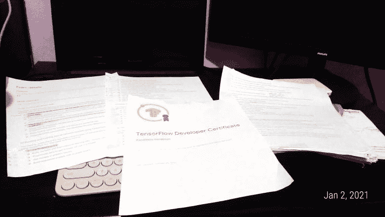

善后照片:考完两天。作者照片。

在我完成了对大学的要求后，我重新评估了自己，并开始了为期 4 个月的学习人工智能的旅程，使用我购买的书籍和一些课程，遵循自下而上的课程。回想起来，这是我做过的最好的决定之一。

向帮助我在这项研究中负起责任的 slack 社区大喊——来自 AI Network 的 Udacity 人员和来自前 AI 研究小组 PH 的菲律宾人，以及 twitter 人员。

我的课程中包含的一个检查点是通过 TensorFlow 开发者认证考试。我决定参加它，因为它对我有挑战性，因为它是一个动手考试，它促使我积极学习 TensorFlow。

在这个博客中，我将分享一些对我有帮助的考试信息，以及我是如何准备的。

您现在还可以在下面查看本文的视频版本:

# 设定期望值

首先，我们必须设定正确的预期。这是一个不同的考试，因为它是**动手型**，可以在线**参加**，并且需要在 **5 小时的时限**内完成。这句话太压缩了，还是细说一下吧。

## 动手型和在线考试

你将被要求准备好你的环境，不要着急，有一个为考试设置环境[的详细说明。紧紧跟随**，**仔细检查，** ***特别是需要安装的依赖*** 版本，然后呼吸。实际上，我已经数不清自己做过多少次了。**](https://www.tensorflow.org/extras/cert/Setting_Up_TF_Developer_Certificate_Exam.pdf)

**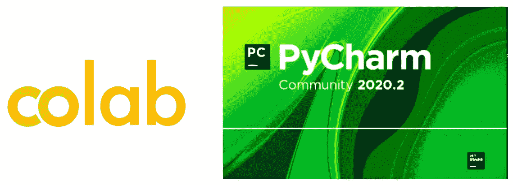**

**Colab 和 PyCharm 2020.2 是我用过的两个平台。作者截图。**

**我使用的主要平台是 **Google Colab** 和 **PyCharm 2020.2** 。使用谷歌的 Colab 不是强制性的，但建议利用 GPU 的优势。该信息也在指南中。这也成为我的一个需要，因为我的笔记本电脑挂了，需要一些时间来训练神经网络。另一方面，用于 PyCharm IDE 的特定版本非常重要。确定写这篇文章的时候是 2020.2。通过严格遵循说明，我在参加考试时没有遇到任何问题或错误。**

## **5 个问题 5 个小时，不延期**

**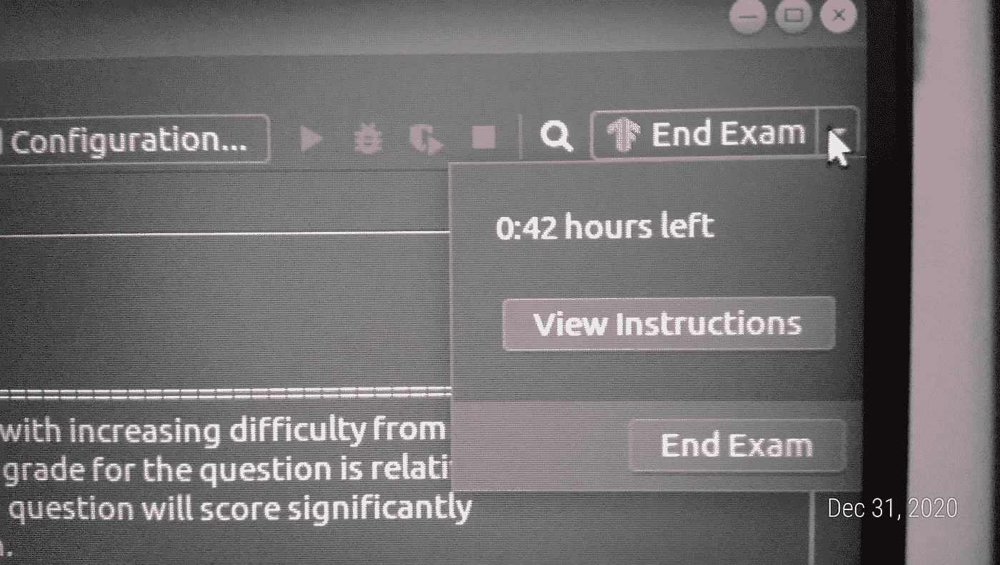**

****“妈妈，我快好了！”我给我妈妈发了一张照片，因为我们晚些时候会在除夕夜举行家庭庆祝活动。是的，我是去年 2020 年 12 月 31 日拍的。作者照片。****

**这些问题以及其他信息，足以让你知道你必须做什么，将在考试环境中给出，安装在 PyCharm 中。有两种情况可以结束考试。第一，如果还有时间，可以选择点击**结束考试**按钮。最后，如果你没有时间了，考试会自动结束，你的所有进步都会被考虑。在我的例子中，我在剩下几分钟的时候结束了它，因为我在那个数字(最后一个数字)上花了 2 个多小时，因为我想得到 5/5 而不是 4/5。关于前四个问题，我花了不到 1.5 个小时完成了，对 5/5 感到满意。所以是的，你会知道到目前为止你的模型有多好。**

## **考试费用和报名**

**考试费用 100 美元，准备好有效身份证件。你可以付钱，以后再参加考试。不过，要注意支付后访问权限的到期。点击网站上的**开始考试**按钮，即可找到流程。**

**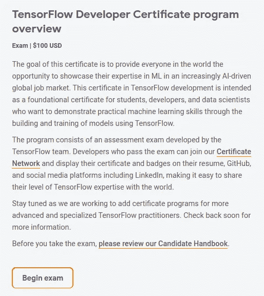**

**TensorFlow 考试网站截图**

**别担心，点击那个按钮不会让考试开始计时，因为你实际上还没有付钱。它会将您重定向到:**

**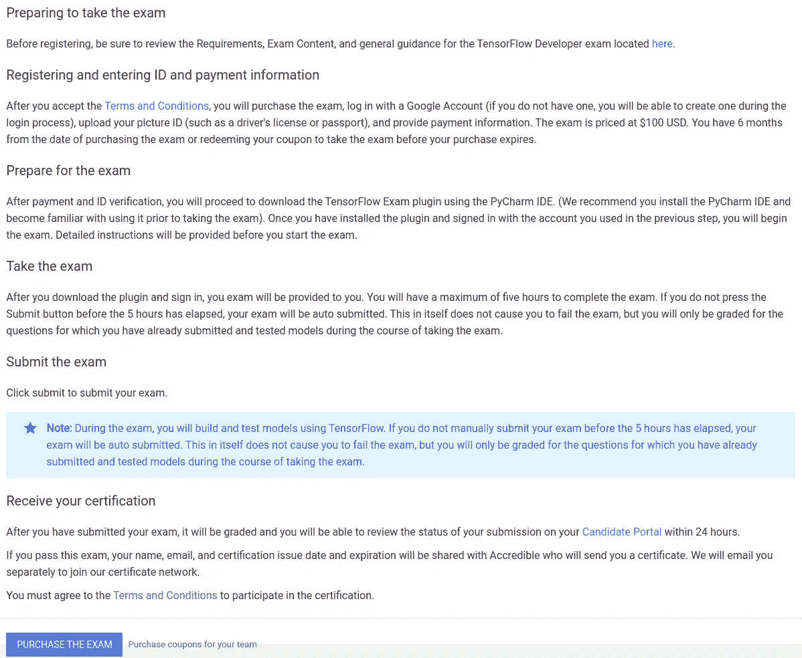**

**点击“开始考试”按钮后。作者截图。**

**您还可以获得 **TensorFlow 教育津贴**。这项津贴提供了各种你可以利用的帮助。第一个是考试津贴，给你 50%的折扣(50 美元)。另一个选择是利用 deeplearning.ai 的 TensorFlow 开发者证书和考试津贴。你可以通过 Coursera 访问所有包含的课程。尽管如此，考试津贴仍然像第一种选择一样只提供 50%的折扣。**

**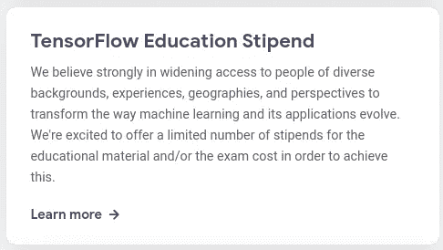**

**来自 [tensorflow 考试网站](https://www.tensorflow.org/certificate)的信息。作者拍摄的快照**

**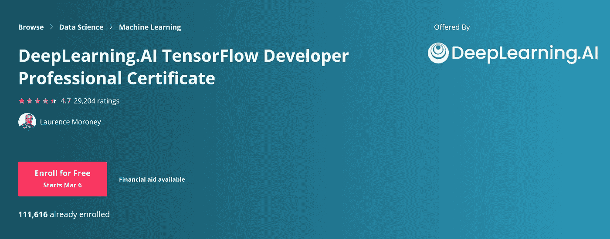**

**【Coursera 的 TensorFlow 开发者专业证书**

**请注意，你应该尽早申请这项津贴，因为需要 4-6 周才能得到你的津贴申请结果。是的，**结果**，因为这将取决于你的申请，如果你会得到津贴或**而不是**。在申请表中，你将回答各种问题，他们将根据这些问题做出决定。如果您成功了，您还必须注意访问的到期时间。点击此处查看此产品的更多详情[。](https://www.tensorflow.org/extras/cert/TF_Education_Stipend.pdf)**

# **你是怎么准备的？**

**了解考试覆盖面的最好方法是通过[专门的考试网站](https://www.tensorflow.org/certificate)。里面有很多东西，但我会强调一些我用过的。**

## **[**考生手册**](https://www.tensorflow.org/extras/cert/TF_Certificate_Candidate_Handbook.pdf)**

**这是最重要的。我不能进一步强调这一点。这个**我已经看了很多遍**了，在开始的时候，准备的时候，甚至就在考试之前。这就像是交给你的作战计划，因为它包含了**技能清单**。**

**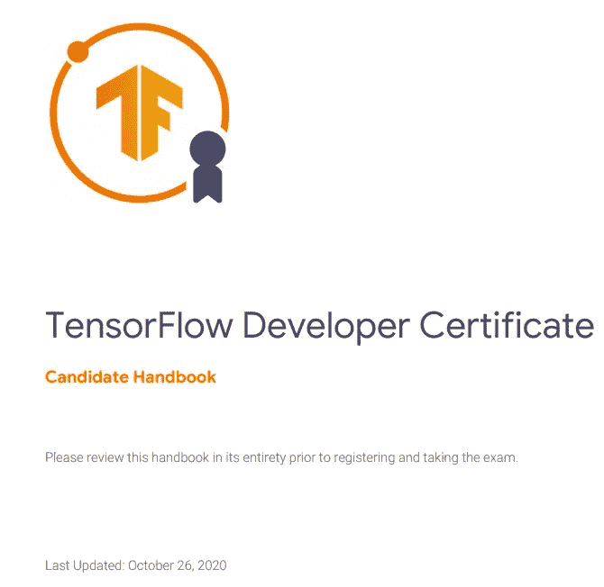**

**候选人手册的标题页**

**这份候选人手册以及其他材料会不时更新，所以请确保您使用的是他们网站上的最新版本。我这么说是因为你可能会发现其他博客实际上使用了旧版本。所以在写这篇文章的时候，这是 2020 年 10 月 26 日更新的。我读过其他博客，到目前为止，我注意到的新部分是 TensorFlow 开发者技能，这是第一部分。**

**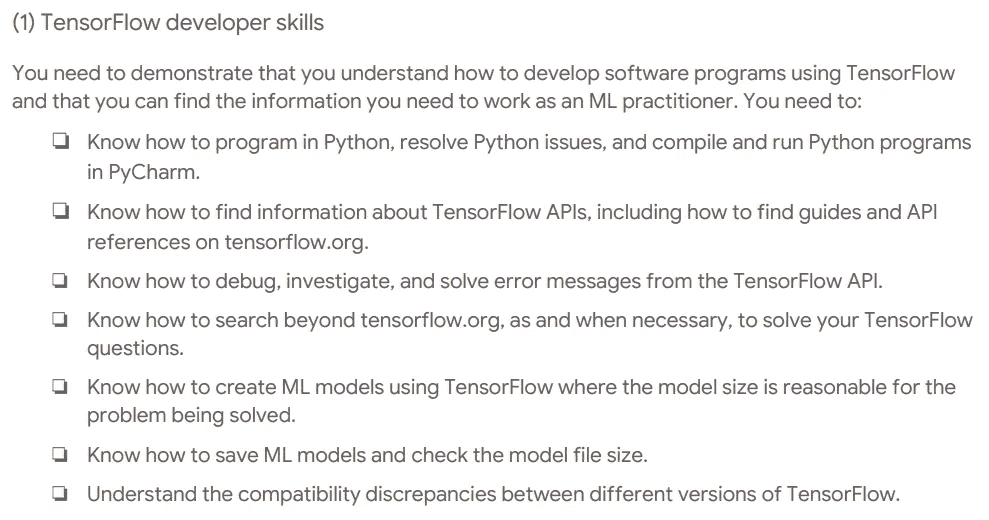**

**截至本文撰写时，添加了新章节**

## **deeplearning.ai 的 TensorFlow 开发者专业证书**

**如果候选人手册是你的作战计划，这就是你的作战计划细节。相信我，如果你完成了这个，编码了这个，虔诚地研究了这个或者真的知道这个，你一定会通过考试。**

**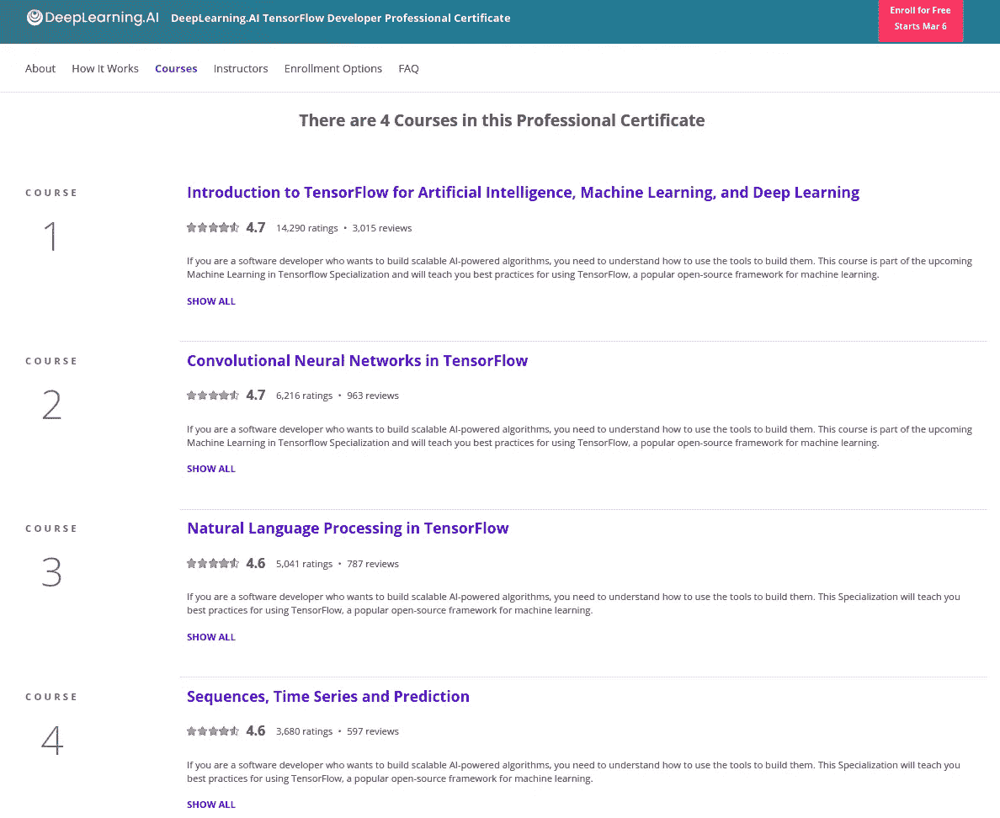**

**TensorFlow 开发者专业证书覆盖范围。照片快照来自 Coursera**

**我附议这张用 Coursera 写的纸条:**

> **这个项目可以帮助你准备 [**Google TensorFlow 证书考试**](https://www.tensorflow.org/certificate) ，让你离获得 Google TensorFlow 证书更近一步。**

**我不断重复这一点，因为我想强调，真的。如果你没有太多的时间，并且你知道简单回归、计算机视觉、自然语言处理和时间序列的深度学习的概念，并且只需要学习 TensorFlow 部分，就拿这个。**

## **Jetbrain 的 PyCharm 教程**

**要完成考试的圣杯，你必须知道 PyCharm。我们不想参加考试，也不想对将要使用的环境感到惊讶。那将是一场灾难。**

** [## 学习 PyCharm

### 具有重构、调试器、代码完成、动态代码分析和编码效率的智能 Python IDE

www.jetbrains.com](https://www.jetbrains.com/pycharm/learn/) 

使用 PyCharm 需要成为专业人士吗？ **当然不需要**但是如果你想，没有人会阻止你。实际上，我在考试前还没有使用过 PyCharm，所以我只是列出了我需要知道的事情。我列出了在 PyCharm 中设置环境(这就像一个内置的 venv 一样酷)，知道如何在其中运行程序，并让自己感觉使用它很舒服。如果你像我一样是黑暗模式的爱好者，他们也有很酷的黑暗主题！

为了便于安装，我用 Ubuntu 软件安装了它。据我所知，任何版本(社区，专业或 edu)都可以，但请回到 TensorFlow 网站确认最新的指示。我考试的时候用的是 PyCharm CE(社区版，2020.2 版)。

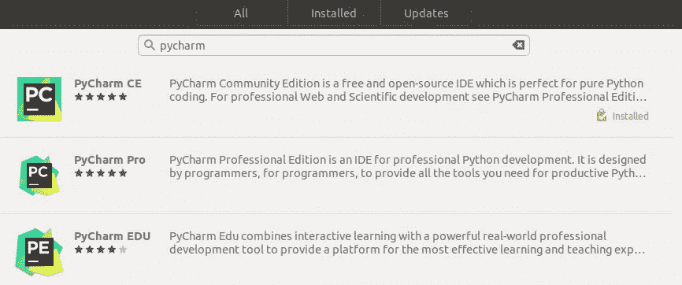

## 辅助材料

1.  使用 Scikit-Learn、Keras 和 TensorFlow 第二版进行机器实践学习

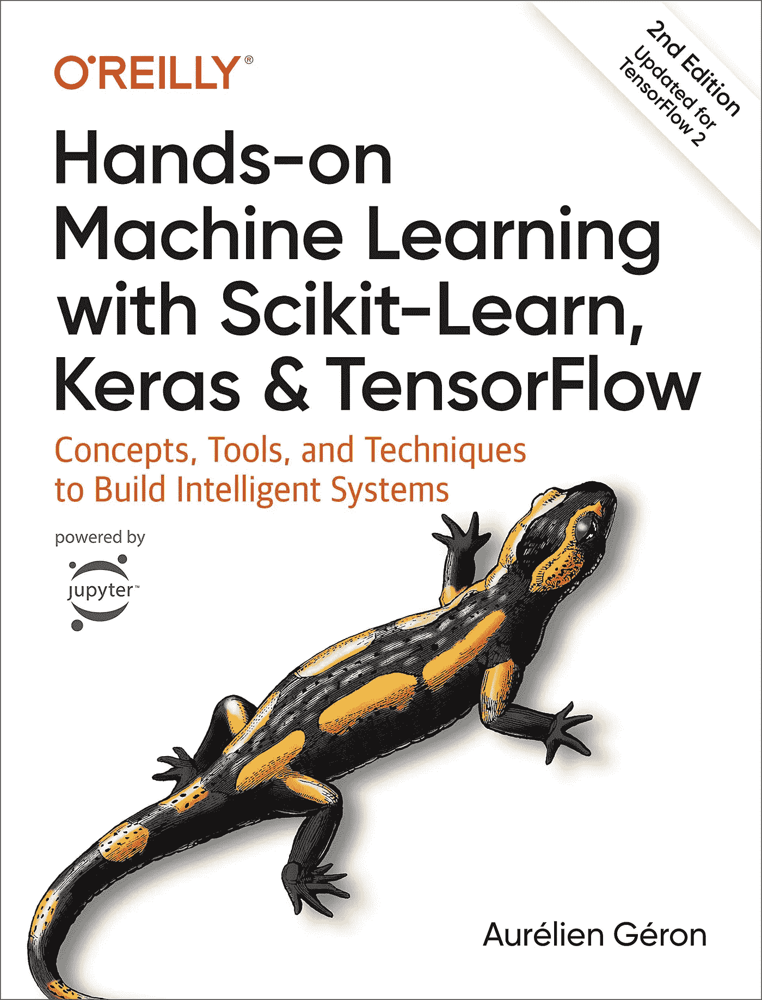

图片来自亚马逊

这本书太棒了。如果你想用一本书从经典的机器学习学到神经网络，请选择这本书。

这是我去年在亚马逊打折时买的。我实际上是用这本书来学习经典的机器学习算法，但对于考试来说，我只是把它作为一本参考书。我可以说，书的第二部分所写的内容涵盖了比考试更多的内容。所以如果你想先把重点放在考试上，你可能只是想把这个作为补充材料。当然，考试后，如果你想知道更多，回到这个作为你的主要材料。绝对值得。这就简单解释了亚马逊的 5 星评级。

[2。麻省理工深度学习 6。S191](http://introtodeeplearning.com/)

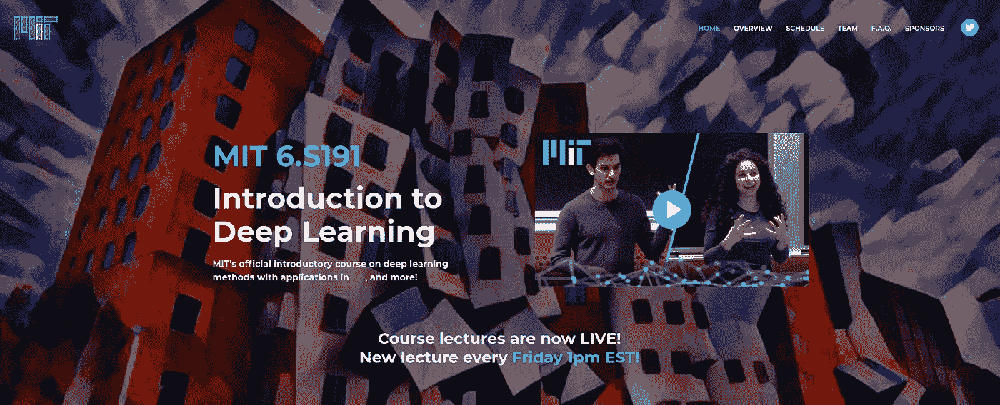

麻省理工深度学习 S.191 网站截图

鉴于我前几个月学习深度学习概念的经历，我只将此作为一个回顾，并且只挑选了相关的内容。

## 看博客(喜欢你！)

去过那里，做过那个。学习和倾听做过考试的人是一件非常重要的事情。以下是一些我觉得很有帮助的博客文章(排名不分先后):

1.  **我如何通过 Daniel Bourke 的 TensorFlow 开发人员认证考试**

 [## 我如何通过 TensorFlow 开发人员认证考试

### 你也可以

towardsdatascience.com](https://towardsdatascience.com/how-i-passed-the-tensorflow-developer-certification-exam-f5672a1eb641) 

**2。如何通过 Harshit Tyagi 的 TensorFlow 开发者证书考试**

 [## 如何通过 TensorFlow 开发者证书考试

### 今年 3 月 12 日，TensorFlow 团队推出了 TensorFlow 开发者证书考试。切到 6 月 13 日，我…

www.freecodecamp.org](https://www.freecodecamp.org/news/how-i-passed-the-certified-tensorflow-developer-exam/) 

**3。第二部分:Viren Radhakrishnan 的 TensorFlow 开发者证书**

 [## 我的 ML- TensorFlow 认证之旅| virenlr

### 第一部分:从人工智能开始第二部分:TensorFlow 开发者证书第三部分:云专业 ML…

virenlr.com](https://virenlr.com/2020/10/my-journey-with-ml-part-2-tensorflow-developer-certificate/) 

除此之外，我还试着看了看不同的论坛和 reddit 上的帖子。当然，这应该合乎道德，在某种程度上，它只是帮助你准备，而不是作弊！首先，你这样做不仅仅是为了获得证书，而是为了挑战自己和学习。

## 练习，练习，练习(重复)

这是一件比其他任何事情都更能增加你机会的事情。我推荐使用 Google Colab 和 PyCharm 练习 TensorFlow 开发人员专业证书中的练习和编程作业。我还在每门课程后都练习了一次，并且在完成所有课程后都练习了一遍。

考试前，我留出一周时间再次练习，增加我对不同部分工作流程的熟悉程度，如计算机视觉、自然语言处理和时间序列。可能会出现不同的数据和用例，但如果您理解并知道所有这些课程中的给定用例，这是向前迈出的一步。我甚至为每个用例制作了流程图，并给出了不同的数据，看看我是否能很好地回忆起来。我使用的所有东西都被组织在下面我的 github 库中。

 [## lbleal 1/tensor flow-开发-考试-准备

### 这个存储库包含我在参加 TensorFlow 开发人员认证考试时使用的练习和材料。大多数…

github.com](https://github.com/lbleal1/TensorFlow-Dev-Exam-Preparation) 

没有必要按照我的方法去做。只要有办法让它足够粘就行了。考试的时候，我感谢自己那样准备。成功了！

# 瞧，我通过了考试

在你按下**结束考试**按钮后，你会得到一个你是否通过考试的确认。下图显示了我收到的电子邮件的快照。

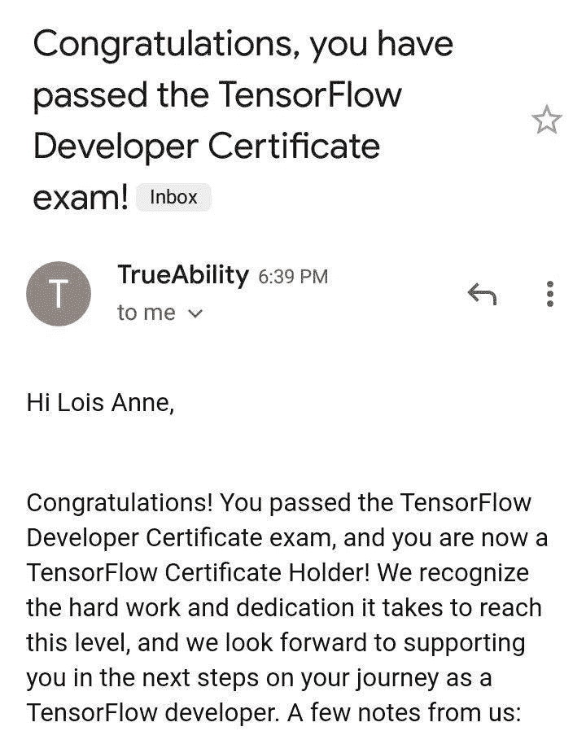

确认电子邮件的快照。作者照片

不到 2 周后，我收到了我的证书，我看到我的个人资料被添加到了 [TensorFlow 证书网](https://developers.google.com/certification/directory/tensorflow)。这是一个有趣的地方，找 TensorFlow 开发者的人可以在这里找到你。

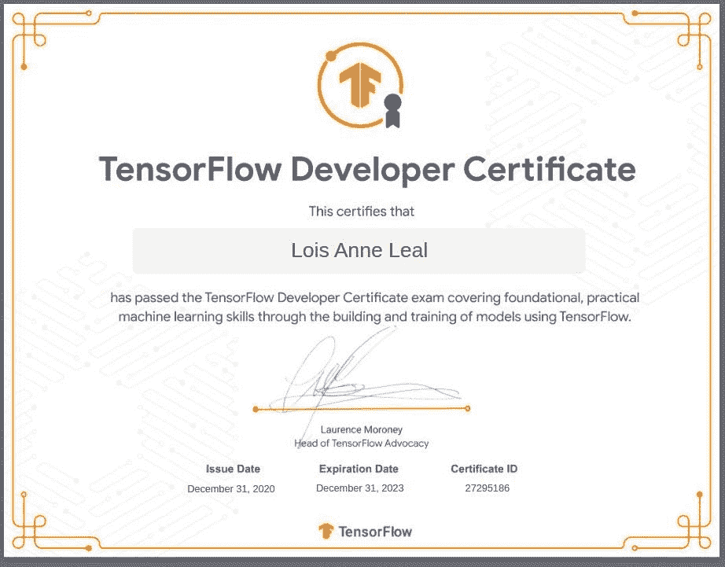

作者拍摄的快照

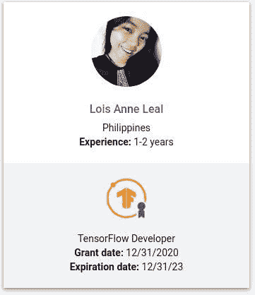

作者拍摄的快照

# 总的来说，

在新年前夕通过考试增加了周围的兴奋和庆祝。这是一个美好的一年，从那以后，我开始了 2021 年的新篇章。写这篇文章的时候，我正在从事人工智能和计算机视觉项目，同时也是其他 impact 项目的志愿者。**学习永远不会停止。****