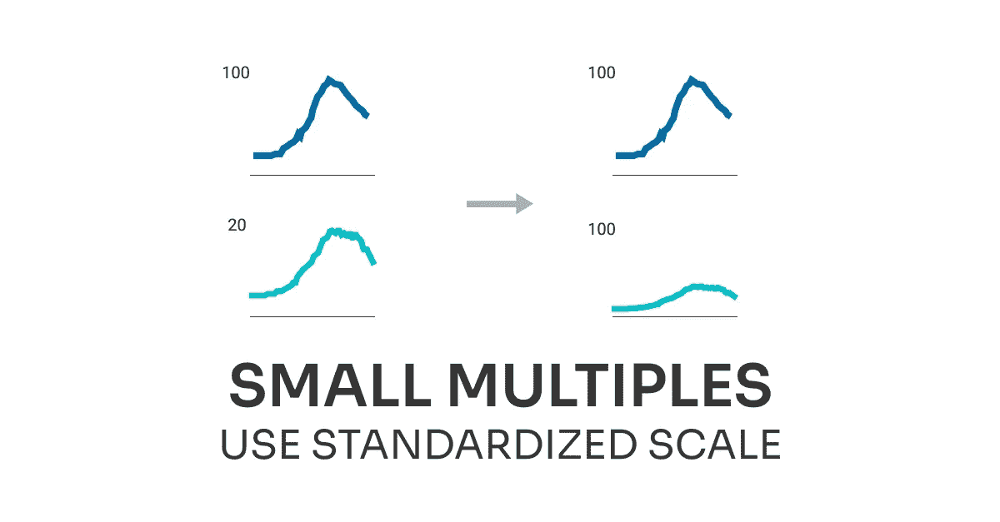

# 你很容易避免的错误

> 原文：<https://medium.com/analytics-vidhya/path-dependence-by-the-economist-ab8b0bff3430?source=collection_archive---------17----------------------->

## 增量改进#01:小倍数

这是一系列关于**增量改进**的帖子的开始，为了让一个好的设计变得更好，可以这样做。在每篇文章中，我将分析数据可视化，看看什么有效，什么无效，以及如何改进它。

# 经济学家[原创图表](https://medium.com/u/bea61c20259e?source=post_page-----ab8b0bff3430--------------------------------)