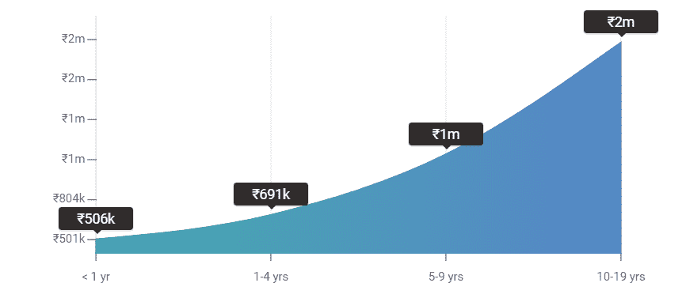
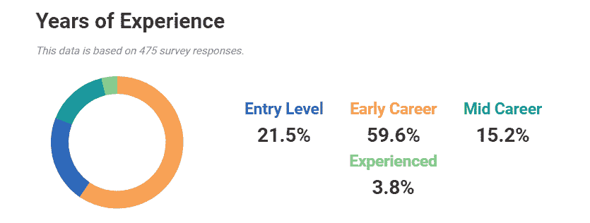
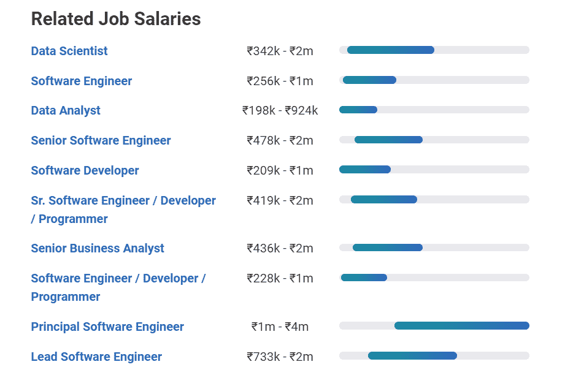
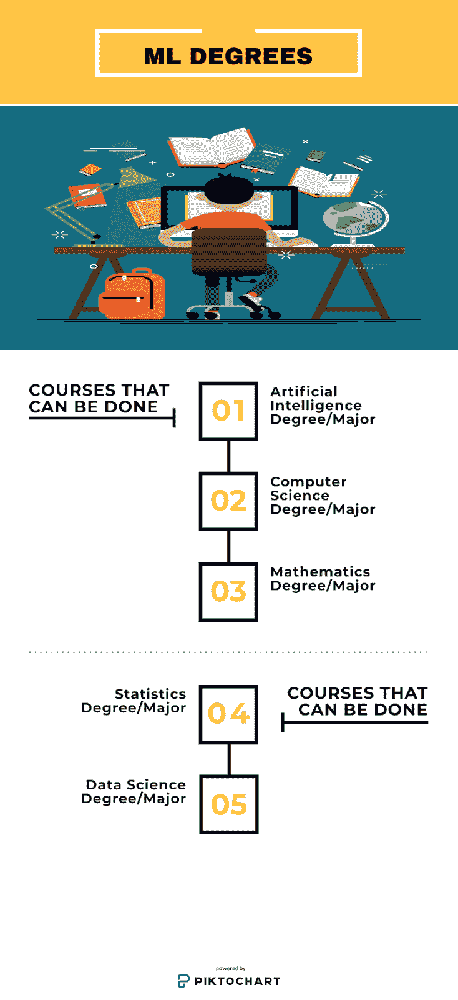
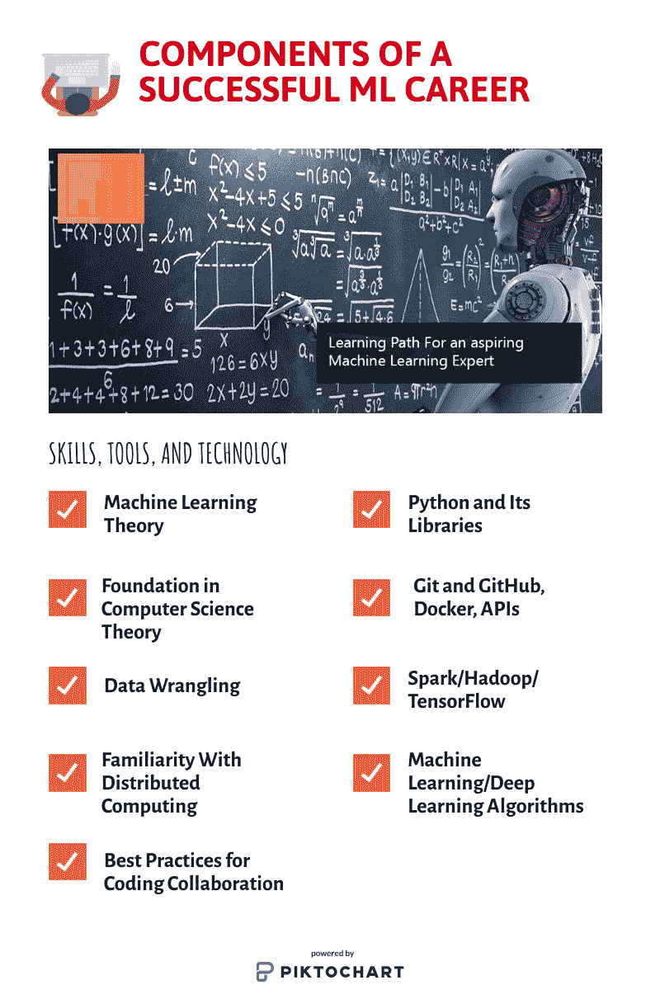

# 机器学习的成功之路

> 原文：<https://medium.com/analytics-vidhya/path-to-succeed-in-machine-learning-c751f8182348?source=collection_archive---------9----------------------->

1.  **工作描述**

一个不了解数据的人可能想知道这个“基于数据的工作”是关于什么的。首先能想到的是数据这个词的含义。数据通常是收集和解释的任何字符的集合，通常出于某种原因进行分析。它可以是任何字符，包括数字和文本、图像等。如果数据不放在上下文中，人或机器就什么也接收不到。

**那么到底什么是机器学习工程师呢？**

**机器学习(ML)工程师:** ML 工程师在处理大量结构化或非结构化数据以及设计和实现机器学习算法方面发挥着主要作用。一个 ML 工程师应该能够开发和构建高质量的、制造就绪的代码，这些代码可以被云平台的用户在一个组织内使用。他/她应该对 Python、R 等数学语言有丰富的经验。并且了解 ML 的概念，应该能够处理大量的数据集和分布式计算，还应该具备数据挖掘技术的描述等。

**2。薪水**

一个工作经验不到 1 年的入门级机器学习工程师，根据 102 的工资，预计平均整体工资(包括小费、激励和加班费)最高可达 505，561 英镑。一个具有 1-4 年工作经验的早期职业机器学习工程师的平均总工资约为 6690，815 英镑，基于 283 份工资。一个拥有 5-9 年经验的职业生涯中期的机器学习工程师，根据 72 份工资计算，平均总工资约为 1150496 英镑。一个有 10-19 年经验的机器学习领域的资深工程师，基于 18 份薪水，平均累计薪水为 1999619 英镑。

在卡纳塔克邦班加罗尔，拥有机器学习工程师头衔的员工平均收入比全国平均水平高出 22.6%。在泰米尔纳德邦钦奈，这些职位也大大高于平均工资(高出 4.3%)。新德里、德里(低 27.8%)、马哈拉施特拉邦浦那(低 13.1%)和马哈拉施特拉邦孟买(低 11.8%)的工资最低。

印度的平均工资:卢比。9,50,000

美国的平均工资:14.6 万美元

**3。成为机器学习工程师的步骤**

**学习技能**

使用 Python 或相关语言学习代码。要成为一名机器学习工程师，你需要知道如何阅读、开发和编辑计算机代码。Python 仍然是机器学习应用程序最常用的语言，但现在越来越多的工程师使用 R、C、C++、Java 和 JavaScript 等脚本格式。努力掌握几种语言，这样你就能成为一名更成功的求职者。

通过在线课程探索信息。在学习机器学习特有的技能之前，有一个强大的数据分析基础很重要。它包括统计学和特征工程等主题，统计学将帮助您理解数据集，特征工程将帮助您创建基于数据的算法。一些关于这些话题的高质量网络课程。

完成机器学习相关的课程。一旦你知道如何编码并理解数据探索背后的基本原理，就开始深入机器学习的世界。这包括创建算法、实现神经网络和设计机器学习系统等主题。

获得有助于你找到工作的资格或学位。许多没有受过正规教育的人正在获得高质量的工程工作。认证也将使你成为一个更有吸引力的工作申请人，在某些情况下，将是满足一个组织的工作要求的唯一途径。努力提高你获得机器学习的机会。

**获得经验**

执行关于个人机器学习的项目。当你第一次开始时，尝试回顾和重新创建由 Scikit-learn、Awesome Machine Learning、PredictionIO 和类似工具支持的简单项目。如果你对机器学习在实践中是如何工作的有很好的理解，寻求拿出你的可以公开发布或在数据库上描述的项目。因此，你不必浪费时间收集数据，考虑使用来自 UCI 机器学习知识库和 Quandl 等网站的公开数据集。如果你不能为一个项目想出一个主意，尝试在 GitHub 等网站上寻找灵感。

参加有关 Kaggle 信息的竞赛。Kaggle 是一个数据集网站，包含了机器学习中的一系列问题。其中一些是提供金钱奖励的官方比赛，其他的是提供简单体验的免费比赛。首先，寻求完成泰坦尼克号:灾难机器学习竞赛的初学者。

注册机器学习实习。尽管个人项目和比赛令人愉快，在简历上看起来也很棒，但它们无法教会你许多企业需要的企业特定的机器学习技能。所以你可以获得这种经验，搜索与以机器为中心的商品学习相关的实习或入门级工作。

**4。毫升度&浓度**

**人工智能最佳学位/专业**

以下是人工智能的最佳学位/专业:

人工智能学位/专业

计算机科学学位/专业

数学学位/专业

统计学学位/专业

数据科学学位/专业

**人工智能学位/专业**

在对人工智能职业感兴趣的人中，最常见的一个问题是:“有人工智能学位吗？”事实上，有一个人工智能学位，但目前很少有大学提供它。人工智能学位是人工智能职业追求的最高学位/专业。传统的本科课程包括计算机科学、计算机工程、机器学习、统计学和数学。一些大学现在在线提供人工智能研究生学位课程以及技术资格课程。

理想情况下，这可能是最好的，因为你主要从第一天开始就准备好发现人工智能。与其他相关学位/专业相比，人工智能更受重视。就目前而言，人工智能学位唯一的一个大缺点是，没有多少大学在本科阶段提供这一学位。美国卡内基梅隆大学正式提供人工智能的全日制本科学位。有影响力的大学已经多次尝试建立人工智能学院和学位项目。麻省理工学院预计在 2018 年为一所人工智能学院投资 50 亿美元，而其他大学也在采取类似举措。人工智能学位/专业在许多大学变得普遍和发展只是时间问题，特别是在美国、加拿大、英国、法国、德国和印度。人工智能学位旨在为本科生和研究生在人工智能开发/研究的实施中扮演核心角色做准备。

因此，无论你的目标是帮助建立人工智能，还是在现有人工智能技术的实施中发挥作用，人工智能学位都涵盖了你。

**计算机科学学位/专业**

几所大学目前没有全人工智能学位。但几所大学也有一个跟踪项目，允许计算机科学专业的学生在人工智能/机器学习方面获得更大的专业知识。

鉴于人工智能在很大程度上依赖于计算机科学中的许多概念，这可能是人工智能学位的下一个最佳选择。

拥有人工智能/人工智能轨道的计算机科学专业将为你在人工智能行业的职业生涯奠定坚实的基础。

即使没有 AI / ML 的赛道，计算机专业本身也足够强大，可以帮助你展开 AI 生涯。如果你在 Python、R、Matlab / Octave、C / C++或 Java 等编程语言方面有所发展，这将非常重要。在主修计算机科学时，熟悉标准的人工智能和机器学习技术也非常重要。计算机科学学位将使你更适合从事人工智能职业，尤其是在人工智能实施领域，而不是人工智能研究/开发领域。

然而，如果你对人工智能研究/开发感兴趣，你可能需要在计算机科学学位的基础上攻读人工智能研究生学位。

这样做，你在人工智能工作市场的就业状况将会显著改善。许多在人工智能行业取得巨大进步的人通常拥有人工智能或密切相关领域的研究生学位。

一般来说，人工智能中更高级的角色需要某种研究生学位。因此，我的坦率建议是，在获得计算机科学本科学位后，寻求人工智能文凭。

**数学学位/专业**

人工智能严重依赖数学，因此，人工智能工作的一个常见要求是数学学位。

不过，如果你决定选择数学专业作为通往人工智能的道路，它与计算机科学的辅修专业有关。一些大学提供数据科学和数学学位，这也将是一个可以考虑的好选择。

甚至在 1956 年作为一个研究领域建立之前，数学就已经是人工智能的基石。

人工智能的两位创始人和的教育基础完全是数学，他们获得了数学学士、硕士和博士学位。

迄今为止，数学仍然是人工智能不可或缺的一部分，随着人工智能对大数据的依赖，数学学位继续保持其作为人工智能行业入门要求的高地位，特别是在人工智能研究/开发领域。

应用数学专业会让你接触计算方法和在计算机上实现算法，这将让你在人工智能实现领域更好地进入人工智能。

务必掌握编程语言的知识，如 Python、R、Java、C/C++和/或 Matlab/Octave。并且尽可能深入地探索标准的人工智能和机器学习技术。

对于人工智能行业中更高级的角色，人工智能、计算机科学或任何其他相关学位的研究生学位将是相关的。

数学很有趣，无论从短期还是长期来看，它都将继续是人工智能的核心:无论是理论数学还是应用数学。

**统计学学位/专业**

从事人工智能职业最重要的专业之一是统计学专业。人工智能模型通常是数学模型，因此大统计数据非常重要。

你会成为人工智能市场上的抢手货，主修统计学，辅修计算机科学。虽然你只需要一个统计学专业就可以轻松获得一份人工智能的工作，但计算机科学的专业知识是无价的。

如果你想把你的职业生涯建立在人工智能科学的基础上，统计学的学位/专业会更合适。但是在实现 AI 的时候也会很好用。

人工智能行业最常见的入职要求之一是统计学学位:这并不奇怪。

今天机器学习驱动 AI(深度学习)的新兴子领域非常依赖统计。机器学习和深度学习的大多数技术都依赖于统计理论，这使得统计成为当前人工智能实践中与人工智能最相关的领域之一。

然而，没有计算机科学背景的统计学专业/学位会让你在人工智能的就业市场上处于不利地位。

有几种方法可以做到这一点，无论你是主修统计学，辅修计算机科学，还是统计学和计算机科学的双学位，或者是统计学专业的毕业生，以及人工智能、计算机科学或任何相关领域的毕业生。

人工智能的传播没有放缓，越来越多的企业变得高度依赖人工智能，因此有许多高薪的人工智能工作。

随着人工智能越来越依赖于统计数据分析来使数据有意义并将其用于人工智能的生产和实施，统计数据的需求也在上升。

**数据科学学位/专业**

数据科学专业相对较新。它与统计学密切相关，但又截然不同。它更侧重于使用计算机/编码来访问广泛的数据库记录，操作数据，并以数字格式可视化数据。

人工智能系统的增长和进一步发展高度依赖于数据，这使得数据科学专业对于人工智能职业生涯来说非常宝贵。

通过攻读数据科学学位，你将能够探索统计学、数据挖掘、机器学习、计算机科学、数学和信息技术等主题。

从事人工智能职业是最充实的学位之一。毫不奇怪，在今天的人工智能行业，对数据科学家的需求正在上升。

看看顶级科技公司(包括谷歌、脸书、亚马逊、苹果和微软)目前是如何实施人工智能的，可以看出它们严重依赖数据科学。这些公司正在将“数据收集和分析”作为其人工智能开发和实施之旅的首要任务。

没有数据，人工智能将不复存在，而数据科学是数据处理的先驱，使其成为人工智能生产和实施的核心。

数据科学学位会让你在该行业从事人工智能职业的时机成熟。对于你来说，改变/适应一个以人工智能为中心的研究生项目来获得一个高级职位是相当容易的。

一些实践人工智能的科学家认为，与统计学一样，数据科学是最接近人工智能学位的等级。

如果你选择数据科学专业/学位，这是人工智能职业生涯的一个很好的选择。因为人工智能的数据岩石和数据科学让你探索和操纵这些结果。

**5。成功的职业生涯的组成部分:技能、工具和技术**

**机器学习理论**

你需要了解如何使用机器学习算法，它们的目标是什么，以及如何在数据规模上使用它们。研究机器学习中最广泛使用的算法的基础，从线性回归到 k 均值聚类。

**计算机科学基础理论**

为了创建高性能的数据管道，您需要了解机器学习算法如何运行，以及它们处理不同数量的数据所需的时间和空间。通过了解如何最小化空间和时间约束，您将能够构建能够处理数 Pb 数据的机器学习管道——这是一项重要的技能。

**数据角力**

要开始机器学习生涯，你需要知道如何管理数据集并使用它们。数据争论是指计算机专业人员清理数据集，并使用机器学习模型来处理它们。在实践中，该过程涉及大量清理错误值、验证数据，然后将数据处理到所需状态，以便不同的算法可以优雅地转换或处理数据。

对于实践来说，Kaggle 部分有大量的数据集可供您使用，它带有方便的 upvote 功能和以前的项目，因此您可以看到哪些是最受欢迎的数据集，以及人们过去是如何与它们斗争的。

**熟悉分布式计算**

您可能需要熟悉分布式计算和应用程序，它们可以帮助您利用基于云的服务器上的数据处理，或者通过您拥有的各种服务器传播数据。事实上，在非常大的数据集上运行最先进的机器学习算法只会在你需要成为机器学习技术的规模上非常有效。

**编码协作的最佳实践**

你需要学习如何与不同的代码库一起工作，以及如何在众多的团队中工作。这就是为什么您想要回顾代码审查的最佳实践，并学习创建对代码和实例的直观访问的不同方法，从 Docker 容器到 Flask 作为 API 构建器。

**Python 及其库**

Python 是大多数与数据科学和数据工程相关的框架的基础。你会想在不同的图书馆里掌握它，从 Pandas 到 sci-kit-learn，以及它的应用。幸运的是，就基础知识而言，Python 语言具有非常简单的语法，并且与大多数其他编程语言非常相似。它也非常灵活，具有帮助实现各种不同功能的库，并且可以包含多种编程范式，从面向对象到更实用的编程范式。一个很好的第一步是通过这条免费的交互式学习路线来学习 Python 中的机器学习。

**Git 和 GitHub，Docker，API**

您将希望掌握如何有效地使用 Git 和 GitHub，以便跨各种代码库和不同模型与各种团队轻松地进行交流。这个 Git 指南将作为这个主题的复习资料。

Docker 容器将允许您共享打包了所有依赖项的应用程序，并且是协作软件创建的重要工具。你会想要得到一个 Docker 的句柄，并使用它来帮助共享你构建的应用程序。

您还想知道如何快速创建和访问 API:它们是规则的结构化集合，既可以获取数据，也可以让其他人获取数据。

**Spark/Hadoop**

你会希望用分布式数据编程框架来帮助你处理大数据集的负载，这些大数据集可能达到 Pb 级。这篇来自 Hadoop vs. Spark 的博客文章将帮助您选择在哪个系统中工作，并提供一些初步步骤来解决这两个问题。

Python 中有一个名为 PySpark 的 Spark 实现，如果您想开始使用 Spark，还有大量涉及 Spark 的文档和教程，尤其是 Databricks。SparkML 是一个流行的机器学习平台，叫做“大规模”。可以说 Spark 是未来，Hadoop 是过去。如果你这么认为，那就集中精力发展你的火技能吧。

**机器学习/深度学习算法**

现在，你应该对如何应用机器学习和深度学习算法有了相当清晰的了解。将介绍传统的机器学习算法，如线性和逻辑回归、随机森林和集成。你将能够处理新的集成算法，如 XGBoost 和 Catboost，以及深度学习的常见架构。

**张量流**

学习 TensorFlow 框架和其他深度学习库，如 Keras，将使您能够利用神经网络的力量，增强学习。

**数据存储和管道**

当您掌握了大规模吸收数据所需的工具，然后用各种机器学习方法进行实验时，您会希望将各种不同的任务联系在一起，以创建一个连贯的数据管道。想想 Spotify 的 Luigi 系统。它让你处理低级管道，这样你就可以专注于你希望机器学习管道在高级策略中做什么。

**6。ML 职业趋势**

随着现代化和技术的发展，机器学习在未来几年得到了发展。机器学习或计算机了解、解释和继续理解问题的逻辑和统计的能力是解决技术问题的现代方式。机器学习是迄今为止领先的技术，它不仅让人类的工作变得更简单，还为卓越提供了更好的方式。最终，这个时代的新技术为最新的趋势铺平了道路，并以更好、更准确的方式帮助人们摆脱困境。

机器学习是技术人员普遍喜欢的创新之一。这项研究使用的未来预测和统计数据相对来说是具体的和说明性的。当设计软件或技术工作时，开发人员追求几种结构。基于他所拥有的知识或经过几天的研究和回顾后他所掌握的事实/数据，他被证明是他进一步深入研究该领域的基准。

因此，时不时地更新技术几乎成了当今的一种趋势。这种转变是如此之快，以至于在技术和数字化方面，每一秒钟，世界都在发生变化。除了我们今天在日常生活中使用的技术，我们现在还应该关注这些技术未来的好处。

正是这些技术如此热情地改善了我们的生活。我们应该感谢我们所面临的技术领域的进步。而且，从各种意义上来说，任何一点科技的影响力都是可以想象的。人们只需要远见和方法来补充其内容将带来进步的各种方式。

说到已经取代人类机械力量的最新技术“机器学习”机器学习被认为是阅读、研究和解释算法，然后预测相同答案的能力。

因此，对于高级版本的其余部分，机器学习是用作阶梯的因素之一。

机器学习的广度可以从以下事实来理解:大多数行业已经在进行许多实验，以使自己在这个过程中变得非常先进和现代。这项技术的最佳应用在于为现在的年轻人和学生提供各种工作选择。无论是数据分析师还是数据开发人员，还是数据架构师或者云架构师；每个人都和机器学习的内容有这样或那样的关系。

因此，机器学习为开发人员和分析师提供了一个大而安全的论坛来阅读、理解和运用计算机理论，并突然提高了人力资源的参与度。因此，许多研究所和公司也在尽最大努力教育人们，通过给他们正确的知识和指导，让他们了解这个领域的重要性。

7 .**。ML 工程师的工作前景**

根据求职网站 Indeed 的一项调查，由于需求上升和高薪，机器学习工程师是 2019 年的最佳工作。该职业拥有高达 146，085 美元的年薪，去年的增长率为 344%。总的来说，与技术相关的工作仍然是赢家。

**8。招聘 ML 工程师的公司**

有许多初创公司和跨国公司参与雇用机器学习的工程师/数据工程师。

下面列出了一些公司:

1.分形分析

2.潜在视图分析

3.直播卫星

4.绝对数据

5.数据狗

6.数据数学

7.因塞多

8.创新者

9.快乐时光

10.Bridgei2i

11.蛋黄

12.高盛

13.曲波勒

14.布鲁姆里奇

15.德勤分析

16.Expedia

17.维萨公司

18.万事达卡

19.贝宝

20.穆迪分析及更多

**9。获取机器学习作业**

在网上寻找关于机器学习的研究。目前的工作空缺可以在分类网站上找到，如 zipcreacher、Glassdoor 和 Indeed。虽然有几家公司使用机器学习工程师的头衔，但有些公司可能会使用其他头衔，如:

数据科学家

人工智能工程师

大数据工程师

深度学习工程师。

1.  写一份简历，展示你在机器学习方面的技能。当设计一份机器学习工作的简历时，专注于与领域相关的项目，比如你的职业经历和教育认证。一定要提到你在以前的工作中做过的关于机器学习的独特项目。如果你完成了任何与工作相关的个人项目，请用简短的描述把它们列在你的简历中。如果可能的话，与项目建立联系，以便公司能够看到。
2.  为您申请的每个角色创建一份自定义的随函。在求职信中列出你的工作经历、学历和相关经验。用一两句简短的话来个性化你的信，说明你将会给你申请的公司带来什么。你的求职信不应该超过 3 页。

**10。如何在 ML 找工作**

如果你想获得一份机器学习方面的工作，并开始一个领域的职业生涯，你需要考虑如何找到各种工作，如何面试，以及一旦你被录用，如何与你的新团队建立联系。

**接近和研究**

在一般的工作板上，你不太可能找到机器学习的角色——它们往往是大型财富 500 强公司或较小的科技创业公司中的特定角色。基于网络是在太空中寻找工作机会的最佳方式:通过对现有机器学习工程师的信息采访来了解他们的团队和招聘实践，或者参加机器学习的特定活动，如 O'Reilly Strata 系列。

如果你想在网上搜索机器学习方面的工作，AngelList 是最好的去处之一，那里往往有高密度的初创和技术工作，有助于你直接与招聘经理或招聘人员联系。如果你想更努力地工作，但获得更高质量的联系，招聘经理会经常在黑客新闻上发帖，特别是在每月的“谁在招聘”帖子上。后者还会收到一堆发给招聘经理的不请自来的电子邮件。

**面试流程**

当你赢得一次面试时，你会想要为此做好准备。由于这是一个广泛的主题，并且有许多不同的机会来应用机器学习，您应该会收到一些关于机器学习理论的一般性问题(例如，内核和非内核方法之间的区别是什么？)，机器学习实现(一个常见的场景是走过 K-means 聚类这样的典型算法，让你隔着床垫说话。

此外，行为和历史问题将在这个过程中得到解决。确保你有一个清晰的叙述，关于你的工作在哪里，机器学习和你申请的角色如何适应这个叙述，以及你以前在 ML 的经验如何让团队现在受益。

**融入你的新团队**

最后，如果你得到了这份工作，你会想知道你的抱负是什么，你在团队中的位置是什么。由于机器学习任务似乎是软件任务，所以您会想要创建高性能、易读的代码，并学习如何与数据和软件团队进行交互。这一系列关于机器学习工程师在 Quora 上的日常生活的回答可能会在这方面有所帮助。