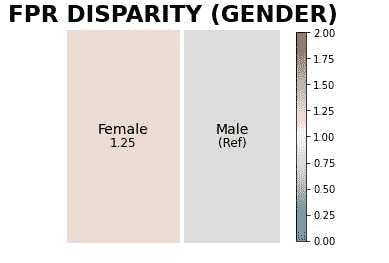

# 使用 EHR 为糖尿病临床试验选择患者

> 原文：<https://medium.com/analytics-vidhya/patient-selection-for-diabetes-clinical-trial-using-ehr-c21c24d30aa?source=collection_archive---------9----------------------->

根据维基百科，电子健康记录(EHR)是以数字格式电子存储的患者和人群健康信息的系统化集合。这些记录通过联网的或其他信息网络和交换来共享。EHR 可能包括一系列数据，从人口统计、病史、药物和过敏到免疫状态、实验室测试结果、放射图像、生命体征、年龄和体重等个人统计数据以及账单信息。

这个项目是一个数据科学家与 EHR 一起为糖尿病患者选择工作的假设案例，它是我在人工智能医疗保健纳米学位项目中的一个项目。该项目旨在通过对关键医疗代码集进行适当的过滤和预处理/特征工程，证明在遭遇层面构建正确数据表示的重要性。还要求学生分析和解释他们的模型对关键人群的偏见。

**利益相关方:**

制药行业和监管机构。

# 任务:

建立一个回归模型，该模型可以预测患者的预计住院时间，并使用该模型来选择/筛选您的研究患者。

# 数据集:

这个项目是用来自 [UCI 欧文](https://archive.ics.uci.edu/ml/datasets/Diabetes+130-US+hospitals+for+years+1999-2008)的数据集完成的，该数据集已经过修改。

我通过比较记录的数量和遇到的数量来确定数据集的级别。记录的数量大于遇到的数量，使其成为线数据集级别。

接下来，我分析了数据集，发现:

**a .具有大量缺失/零值的字段:**

重量

a1c 结果

医学 _ 专业

付款人 _ 代码

**b .数值场具有高斯/正态分布**

数量 _ 药物

数量 _ 实验室 _ 程序

住院时间

**c .具有高基数的字段**

其他 _ 诊断 _ 代码:19374

主诊断代码:716

ndc_code: 251

这些字段具有较高的基数，因为它们是代码，并且是基于与所教授的课程相关的诊断和药物治疗而创建的。

**d .人口分布。**

**年龄:**人口的年龄分布在 40-90 岁之间，最大值为 70-80 岁。

**性别:**女性人口高于男性人口。

我们还注意到，0-40 岁和 70-100 岁年龄组的女性人口较多，而 40-70 岁年龄组的男性人口较多。

然后我降低了 NDC 码特征的维数。

然后，我简化了模型的数据聚合，以防止未来患者遇到的数据泄漏，并通过只选择患者的第一次遇到来降低数据转换和建模步骤的复杂性。然后将数据聚集到正确的级别进行建模。

**功能选择:**

我排除了 payer_code 和 weight 字段，因为它们大部分都缺少数据。

**数据拆分:**

我将数据分成 60%、20%、20%的训练、验证和测试，然后可视化人口统计学的分割。

我也分析了这些分裂，并把它们形象化。

然后，我将分割数据转换为 Tensorflow 数据集，为转换后的数据集构建词汇表，并使用 Tensorflow 特征列 API 创建分类特征。接下来，我用 Tensorflow 特征列创建了数字特征。

# 模型构建:

我做了两个模型。具有 relu 激活的顺序模型和糖尿病模型，RMSprop 作为优化器，MSE 作为具有早期停止和 10 个时期的损失度量。

# 预测:

我检查了预测输出，通过向测试数据框架添加二元预测，将回归输出转换为用于患者选择的分类输出。

# 模型评估:

我使用 AUC、recall、precision 和 F1 评分评估了该模型，准确率为 73%。

**偏倚评估:**

我使用 Aequitas 偏差工具包评估了潜在偏差，并选择了参照组。

**偏差分析:**

我分析了患者选择的种族和性别领域的偏见，结果显示性别似乎缺乏偏见，而在种族方面，高加索人的 PPR 高于其他任何群体。白种人的高精度意味着它的假阳性会更少。这也意味着在这个模型中，白种人比其他群体更容易达到预期。

**公平性分析:**

我做了一个相对于参照组的公平性分析，参照组是性别，发现每个性别之间没有太大的差异。

# 结论:

这个项目有助于加强我在医疗保健领域的人工智能知识，专注于在临床试验中使用 EHR 进行人口统计选择。代码可以在[我的回购](https://github.com/Nwosu-Ihueze/Udacity/tree/main/diabetes_testing)中找到，你可以调整超参数以获得比我更好的分数。您可以通过 [LinkendIn](https://www.linkedin.com/in/rosemary-nwosu-ihueze/) 与我联系，寻求建议和修改。感谢您的阅读。