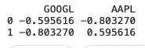

# PCA 以及如何用 Python 解释它

> 原文：<https://medium.com/analytics-vidhya/pca-and-how-to-interpret-it-with-python-8aa664f7a69a?source=collection_archive---------2----------------------->

主成分分析用于降维，找出变量协变的方式。

在机器学习(ML)和人工智能(AI)领域，有两种处理数据的基本方法:有监督的和无监督的机器学习。与监督学习相反，在监督学习中，我们用数据来训练模型，而在非监督学习中，我们不用。因此，监督技术主要是为预测而设计的。对于无监督学习，由于没有基础事实/标签，我们主要使用它进行描述性分析。换句话说，无监督学习用于知识发现。


[来源](https://www.spiria.com/en/blog/artificial-intelligence/face-recognition-by-principal-component-analysis/)

无监督学习可以用来实现不同的目标。在某些情况下，它可用于在没有标记反应的情况下创建预测规则[1]。在其他情况下，目标可能是*将数据的维度*减少到一组更易于管理的变量。减少的数据然后可以被馈送到用于预测目的的监督学习算法中。

# 主成分分析

主成分分析作为一种无监督的方法，主要用于发现数值变量协变的方式。它用于线性组合不同的特征。因此，以类似方式变化的特征/变量可以用一个组合变量来表示。通过这种方式，我们降低了数据维度，这可能会导致清晰的解释和预测目的的低复杂性。通过主成分分析，我们实际上找到了变量的加权线性组合形式


加权线性组合

其中 *i* 的范围从 1 到变量总数。重量称为部件载荷。这些将原始变量转换成主要成分。第一个主成分， *Z* 1，是最佳解释总变异的线性组合。第二个主成分，Z*2，与第一个主成分正交，并尽可能多地解释剩余的变化。(如果有额外的组件，每个额外的组件将与其他组件正交)[1]。*

# PCA 的 Python 实现

为了展示主成分分析在现实世界问题中的应用，我们将主成分分析应用于一个股票市场数据集。完整的数据集可以从 [Kaggle 网站](https://www.kaggle.com/szrlee/stock-time-series-20050101-to-20171231)下载。它由 30 家 DJIA 公司中的 29 家的多种股票价格组成(不包括“V ”,因为它没有完整的 12 年数据)。我们将利用 *Sci-kit Learn* 包来实现股票回报的 PCA。完整的代码可以在[这里](https://www.kaggle.com/vahidnaghshin/pcacorrespondenceanalysis)找到。

作为第一步，我们将计算所有公司每只股票的每日回报率。

```
dic_stock_return = defaultdict(int)
for dirname, _, filenames in os.walk('/kaggle/input'):
    for filename in filenames:
        print(os.path.join(dirname, filename))
        df = pd.read_csv(os.path.join(dirname, filename))
        df['return'] = (df.Close - df.Open) / df.Open
        dic_stock_return[df.Name[0]] = df['return']df_stock_return = pd.DataFrame(dic_stock_return)
df_stock_return.head()
```

该数据帧的前 5 行如下:


```
#drop last row since it is NaN
tech_px = tech_px.drop(3019)pcs = PCA(n_components=2)
pcs.fit(tech_px)
loadings = pd.DataFrame(pcs.components_, columns=tech_px.columns)
print(loadings)
```

负载将为



古尔和 AAPL 的五氯苯甲醚负荷

*如何解读这个*？第一个主成分基本上是谷歌和 AAPL 的平均值，反映了两家能源公司之间的相关性。第二个主要因素衡量谷歌和 AAPL 的股价何时出现分歧。为了可视化主成分分析，我们可以使用以下 python 代码。

```
def abline(slope, intercept, ax):
    """Calculate coordinates of a line based on slope and intercept"""
    x_vals = np.array(ax.get_xlim())
    return (x_vals, intercept + slope * x_vals)ax = tech_px.plot.scatter(x='GOOGL', y='AAPL', alpha=0.3, figsize=(14, 14))
ax.set_xlim(-0.2, 0.2)
ax.set_ylim(-0.2, 0.2)
ax.plot(*abline(loadings.loc[0, 'AAPL'] / loadings.loc[0, 'GOOGL'], 0, ax),
        '--', color='C1')
ax.plot(*abline(loadings.loc[1, 'AAPL'] / loadings.loc[1, 'GOOGL'], 0, ax),
        '--', color='C1')plt.tight_layout()
plt.show()
```

输出将是


虚线表示的 PCA

对于所有公司，五氯苯甲醚的成分含量可通过以下方式获得

```
#remove rows with at least one NaN values
nan_rows = df_stock_return[df_stock_return.isnull().T.any()]
df_stock_return = df_stock_return.drop(list(nan_rows.index))syms = sorted(['MMM', 'AXP', 'AAPL', 'BA', 'CAT', 'CVX', 'CSCO', 'KO', 'DIS', 'XOM', 'GE',
               'GS', 'HD', 'IBM', 'INTC', 'JNJ', 'JPM', 'MCD', 'MRK', 'MSFT', 'NKE', 'PFE',
               'PG', 'TRV', 'UTX', 'UNH', 'VZ', 'WMT', 'GOOGL', 'AMZN', 'AABA'])
top_df = df_stock_return[syms]sp_pca = PCA()
sp_pca.fit(top_df)explained_variance = pd.DataFrame(sp_pca.explained_variance_)#showing the first value
ax = explained_variance.head(10).plot.bar(legend=False, figsize=(8, 4))
ax.set_xlabel('Component')plt.tight_layout()
plt.show()
```

组件的前 10 个解释差异如下


解释了前十个组件的差异

对于前 5 个组件的加载，我们有

```
loadings = pd.DataFrame(sp_pca.components_[0:5, :], 
                        columns=top_df.columns)
maxPC = 1.01 * np.max(np.max(np.abs(loadings.loc[0:5, :])))f, axes = plt.subplots(5, 1, figsize=(15, 10), sharex=True)for i, ax in enumerate(axes):
    pc_loadings = loadings.loc[i, :]
    colors = ['C0' if l > 0 else 'C1' for l in pc_loadings]
    ax.axhline(color='#888888')
    pc_loadings.plot.bar(ax=ax, color=colors)
    ax.set_ylabel(f'PC{i+1}')
    ax.set_ylim(-maxPC, maxPC)plt.tight_layout()
plt.show()
```

前 5 种成分的载荷可以表示为


前五个组件的加载

# 如何解读 PCA？

第一个主成分的负荷具有相同的符号:这对于所有列共享一个公共因子(在这种情况下，是整个股票市场趋势)的数据是典型的。第二个组成部分捕捉科技股相对于其他股票的价格变化。第三个因素主要是摩根大通(JP Morgan)和高盛(Goldman Sachs)的走势对比。第四部分对比了联合健康(UNH)和其他能源股的走势。最后，第五个组成部分主要由非科技公司主导。

# 参考

[1]布鲁斯、彼得、安德鲁·布鲁斯和彼得·格德克。*数据科学家实用统计学:使用 R 和 Python 的 50 多个基本概念*。奥莱利媒体，2020。