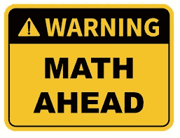
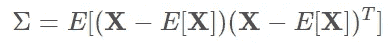
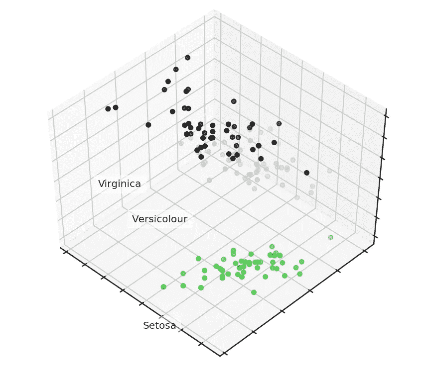
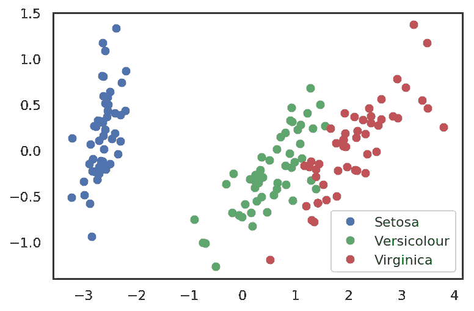
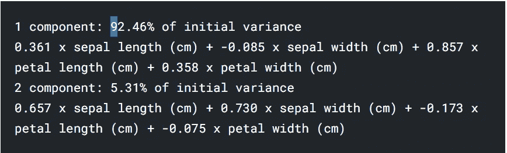

# 埃隆·马斯克解释的 PCA

> 原文：<https://medium.com/analytics-vidhya/pca-explained-by-elon-musk-b019717a60e3?source=collection_archive---------6----------------------->


如果你点击了这篇文章，很可能你要么对机器学习算法着迷，要么像我一样也是埃隆·马斯克的忠实粉丝。不管怎样，我想你会喜欢读这篇文章的。正如我所承诺的，你将会看到 Elon 解释 PCA。现在，就像 Elon 说的几乎所有其他事情一样，一开始听起来可能很神秘或令人困惑，一旦你理解了他所指的基础和首要原则，事情就会变得更清楚。所以在埃隆解释之前。我们先把 Pca 的基础知识弄下来。

# 什么是 PCA？

主成分分析(PCA)是一种降维方法，通常用于降低大型数据集的维数，方法是将一个大型变量集转换为一个较小的变量集，该变量集仍包含大型数据集中的大部分信息。减少数据集的变量数量自然会以牺牲准确性为代价，但降维的诀窍是用一点准确性换取简单性。因为较小的数据集更容易探索和可视化，并使机器学习算法分析数据更容易和更快，而无需处理无关变量。主成分分析通过将数据几何投影到更低的维度上来减少数据，这些维度又被称为主成分(PC)。该方法的目标是通过使用最少的主成分找到我们数据的最佳摘要。通过选择我们的主成分，我们最小化原始数据与其在主成分上的投影值之间的距离。作为最小化距离的结果，我们最大化投影点的方差，我们类似地对所有其他主分量这样做，同时这样做我们的主分量不应该与先前的分量相关。通过不相关，我们确保主成分的数量等于数据集的变量或特征的数量，以较小者为准。


数据点在主成分上的投影。来源:[栈交换](https://stats.stackexchange.com/questions/2691/making-sense-of-principal-component-analysis-eigenvectors-eigenvalues)

**综上所述，PCA 的思想很简单——减少数据集的变量数量，同时保留尽可能多的信息。**

# 警告:数学和代码在前面



现在，如果你对数学或代码方面还不熟悉，可以跳到[这部分](#76a3)，这是 PCA 的更高级别。

**一个例子**

现在假设你想预测美国 2017 年的国内生产总值(GDP)是多少。你有很多可用的信息:2017 年第一季度的美国 GDP，2016 年全年的美国 GDP，2015 年等等。你有任何公开可用的经济指标，如失业率、通货膨胀率等等。你有 2010 年的美国人口普查数据，估计每个行业中有多少美国人工作，以及在每次人口普查之间更新这些估计的[美国社区调查](https://www.census.gov/programs-surveys/acs/about.html)数据。你知道每个政党有多少名众议员和参议员。你可以收集股票价格数据，一年中发生的[首次公开募股](https://en.wikipedia.org/wiki/Initial_public_offering)的数量，以及[有多少 CEO](https://www.nytimes.com/2017/03/09/business/bloomberg-iger-business-executives-president.html?_r=0)[似乎正在准备竞选公职](http://www.latimes.com/business/technology/la-fi-tn-zuckerberg-president-20170120-story.html)。尽管有大量的变量需要考虑，但这个*只是触及了表面*。

关键是你要考虑很多可变因素。

你可能会问这样一个问题，“我如何把我收集的所有变量集中在其中的几个上？”用专业术语来说，你想要“减少你的特征空间的维数”通过减少特征空间的维度，您需要考虑的变量之间的关系更少，并且您不太可能过度拟合您的模型。(注意:这并不立即意味着过度拟合等。不再令人担忧，但我们正朝着正确的方向前进！)

不出所料， ***降维*** 特征空间的*称为 ***降维*** 有许多方法可以实现降维，但这些技术大多属于以下两类之一:*

*   *特征消除*
*   *特征抽出*

***特征消除**顾名思义:我们通过消除特征来减少特征空间。在上面的 GDP 例子中，除了我们认为最能预测美国国内生产总值的三个变量之外，我们可能会放弃所有变量，而不是考虑每一个变量。特征消除方法的优点包括简单性和维护变量的可解释性。*

*然而，作为一个缺点，你不能从你丢弃的变量中获得任何信息。如果我们只使用去年的国内生产总值、根据最新的美国社区调查数据计算的制造业就业人口比例以及失业率来预测今年的国内生产总值，我们就错过了任何可能对我们的模型有所贡献的变量。通过消除功能，我们也消除了这些变量可能带来的任何好处。*

***特征提取**不过，不会碰到这个问题。假设我们有十个独立变量。在特征提取中，我们创建十个“新”独立变量，其中每个“新”独立变量是十个“旧”独立变量的组合。然而，我们以特定的方式创建这些新的自变量，并根据它们预测因变量的程度对这些新变量进行排序。*

*你可能会说，“降维在哪里发挥作用？”好吧，我们保留尽可能多的新的独立变量，但我们放弃了“最不重要的”因为我们根据新变量对因变量的预测程度对它们进行了排序，所以我们知道哪个变量最重要，哪个最不重要。但是——这就是问题所在——因为这些新的独立变量是旧变量的组合，所以我们仍然保留旧变量中最有价值的部分，即使我们放弃了一个或多个“新”变量！*

*主成分分析是一种用于*特征提取*的技术——因此它以一种特定的方式组合我们的输入变量，然后我们可以丢弃“最不重要”的变量，同时仍然保留所有变量中最有价值的部分！*一个额外的好处是，PCA 之后的每个“新”变量都是相互独立的。*这是一个好处，因为线性模型的[假设要求我们的独立变量相互独立。如果我们决定用这些“新”变量拟合一个线性回归模型(见下面的“主成分回归”)，这个假设必然会得到满足。](http://people.duke.edu/~rnau/testing.htm)*

*让我们来看看这个过程的数学公式:*

*为了在 k≤n 的情况下将数据的维度从 n 减少到 k，我们按照离差递减的顺序对轴列表进行排序，并取其中最高的 kk 个轴。*

*我们从计算初始特征的离差和协方差开始。这通常用协方差矩阵来完成。根据协方差定义，两个要素的协方差计算如下:*

**cov(Xi，Xj)= E[(XiμI)(Xjμj)]= E[XiXj]μIμj**

*其中，μiμi 是第 I 个特性的期望值。值得注意的是，协方差是对称的，向量与自身的协方差等于其离差。*

*因此，协方差矩阵是对称的，对角线上对应特征的分散。非对角线值是相应特征对的协方差。就矩阵而言，其中 **X** 是观察值的矩阵，协方差矩阵如下:*

**

*快速回顾:矩阵作为线性算子，有特征值和特征向量。它们非常方便，因为它们描述了我们的空间中不旋转的部分，当我们对它们应用线性算子时，它们只会拉伸；特征向量保持相同的方向，但是被相应的特征值拉伸。形式上，一个特征向量为 wiwi，特征值为λi 的矩阵 MM 满足这个方程:Mwi=λiwi。*

*样本的协方差矩阵 **X** 可以写成**X**T**X**的乘积。根据[瑞利商](https://en.wikipedia.org/wiki/Rayleigh_quotient)，我们样本的最大变化沿着这个矩阵的特征向量，并且与最大特征值一致。因此，我们旨在从数据中保留的主成分只是对应于矩阵的前 k 个最大特征值的特征向量。*

*接下来的步骤更容易消化。我们将数据矩阵 **X** 乘以这些分量，得到数据在所选分量的正交基上的投影。如果组件的数量小于初始空间维度，请记住，在应用此转换时，我们将丢失一些信息。*

*让我们看看代码中的一个例子。*

```
*import numpy as np
import matplotlib.pyplot as plt
import seaborn as sns; sns.set(style='white')
%matplotlib inline
%config InlineBackend.figure_format = 'retina'
from sklearn import decomposition
from sklearn import datasets
from mpl_toolkits.mplot3d import Axes3D

*# Loading the dataset*
iris = datasets.load_iris()
X = iris.data
y = iris.target

*# Let's create a beautiful 3d-plot*
fig = plt.figure(1, figsize=(6, 5))
plt.clf()
ax = Axes3D(fig, rect=[0, 0, .95, 1], elev=48, azim=134)

plt.cla()

for name, label **in** [('Setosa', 0), ('Versicolour', 1), ('Virginica', 2)]:
    ax.text3D(X[y == label, 0].mean(),
              X[y == label, 1].mean() + 1.5,
              X[y == label, 2].mean(), name,
              horizontalalignment='center',
              bbox=dict(alpha=.5, edgecolor='w', facecolor='w'))
*# Change the order of labels, so that they match*
y_clr = np.choose(y, [1, 2, 0]).astype(np.float)
ax.scatter(X[:, 0], X[:, 1], X[:, 2], c=y_clr, 
           cmap=plt.cm.nipy_spectral)

ax.w_xaxis.set_ticklabels([])
ax.w_yaxis.set_ticklabels([])
ax.w_zaxis.set_ticklabels([]);*
```

**

*现在，让我们看看 PCA 将如何改进一个简单模型的结果，该模型不能正确地拟合所有的训练数据*

```
*from sklearn.tree import DecisionTreeClassifier
from sklearn.model_selection import train_test_split
from sklearn.metrics import accuracy_score, roc_auc_score

*# Train, test splits*
X_train, X_test, y_train, y_test = train_test_split(X, y, test_size=.3,stratify=y,random_state=42)

*# Decision trees with depth = 2*
clf = DecisionTreeClassifier(max_depth=2, random_state=42)
clf.fit(X_train, y_train)
preds = clf.predict_proba(X_test)
print('Accuracy: **{:.5f}**'.format(accuracy_score(y_test, 
                                                preds.argmax(axis=1))))**Accuracy: 0.88889***
```

*让我们再试一次，但是，这一次，让我们把维度减少到 2 维:*

```
**# Using PCA from sklearn PCA*
pca = decomposition.PCA(n_components=2)
X_centered = X - X.mean(axis=0)
pca.fit(X_centered)
X_pca = pca.transform(X_centered)

*# Plotting the results of PCA*
plt.plot(X_pca[y == 0, 0], X_pca[y == 0, 1], 'bo', label='Setosa')
plt.plot(X_pca[y == 1, 0], X_pca[y == 1, 1], 'go', label='Versicolour')
plt.plot(X_pca[y == 2, 0], X_pca[y == 2, 1], 'ro', label='Virginica')
plt.legend(loc=0);*
```

**

```
**# Test-train split and apply PCA*
X_train, X_test, y_train, y_test = train_test_split(X_pca, y, test_size=.3, 
                                                    stratify=y, 
                                                    random_state=42)

clf = DecisionTreeClassifier(max_depth=2, random_state=42)
clf.fit(X_train, y_train)
preds = clf.predict_proba(X_test)
print('Accuracy: **{:.5f}**'.format(accuracy_score(y_test, 
                                                preds.argmax(axis=1))))Accuracy: 0.91111for i, component **in** enumerate(pca.components_):
    print("**{}** component: **{}% o**f initial variance".format(i + 1, 
          round(100 * pca.explained_variance_ratio_[i], 2)))
    print(" + ".join("**%.3f** x **%s**" % (value, name)
                     for value, name **in** zip(component,
                                            iris.feature_names)))*
```

**

***激动人心的部分***

*既然你已经了解了 PCA 是什么，让我们来谈谈大脑是如何执行 PCA 的，或者至少是它的一种变体。我们的感官每天都在接收如此多的信息。就像如果我们认为我们的大脑是一个处理单元，如果我们没有一种过滤器来处理它，我们每天接受的信息量就会太大而难以理解。这就是为什么我相信大脑执行一种降维技术，使我们能够处理它认为对我们有用的信息，这些信息反过来是我们感官接收的信息的一小部分，这在某种程度上似乎类似于主成分算法所做的。*

***埃隆详细解释的时间到了***

*在视频中，Elon 解释了人工神经网络如何使用 PCA 等压缩算法来降低数据集的维度，以将生成的数据集应用于机器学习算法，从而在训练算法的同时减少计算时间。他用我们的大脑将现实还原为一个向量空间或一种与我们相关的形式的过程作为类比，让我们能够执行日常决策，而不会被我们感官每天遇到的其他事情所困扰。*

*埃隆解释的 PCA*