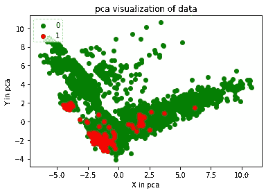
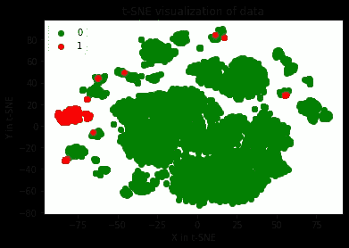

# 真实数据上的主成分分析与 t-SNE

> 原文：<https://medium.com/analytics-vidhya/pca-vs-t-sne-on-real-data-20983936331d?source=collection_archive---------19----------------------->

真实世界的数据可视化

当试图确定天气数据可分为两类时，通常最好将其绘制出来。

我要用两种降维技术来观察-

**PCA**

```
from sklearn.decomposition import PCA#only 2 components 
pca = PCA(n_components=2, random_state=0)x_test_2d = pca.fit_transform(df)#plotting the scatter plot for both classescolor_map = {0:'green', 1:'red'}plt.figure()for idx, c in enumerate(np.unique(y)):plt.scatter(x = x_test_2d[y==c,0],y = x_test_2d[y==c,1],col = color_map[idx],label = c)plt.xlabel('X in pca')plt.ylabel('Y in pca')plt.legend(loc='upper left')plt.title('pca visualization of data')plt.show()
```



**t-SNE**

```
from sklearn.manifold import TSNE#only 2 components 
tsne= PCA(n_components=2, random_state=0)x_test_2d = tsne.fit_transform(df)#plotting the scatter plot for both classescolor_map = {0:'green', 1:'red'}plt.figure()for idx, c in enumerate(np.unique(y)):plt.scatter(x = x_test_2d[y==c,0],y = x_test_2d[y==c,1],col = color_map[idx],label = c)plt.xlabel('X in pca')plt.ylabel('Y in pca')plt.legend(loc='upper left')plt.title('t-SNE visualization of data')plt.show()
```



**结论-**

PCA 显示了重叠的类，看起来没什么用。

t-SNE 中的一大团红色是数据可分离的好迹象。