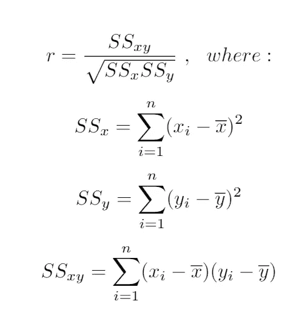

# 皮尔逊相关

> 原文：<https://medium.com/analytics-vidhya/pearsons-correlation-5664e86cf829?source=collection_archive---------3----------------------->

## 使用 Excel、Python、R 和 SPSS 进行皮尔逊相关的详细信息和计算

[图像参考](https://www.displayr.com/what-is-correlation/)

# 什么是皮尔逊相关？

皮尔逊相关或皮尔逊积矩相关(PPMC)或双变量相关是统计学中相关的标准度量。它显示了两组数据之间的线性关系。它用简单的术语回答了这个问题:我能画一个线图来表示数据吗？

皮尔逊相关由两个字母表示:希腊字母 rho (ρ)表示人口，字母“r”表示研究。

为了找出数据中变量之间的关系，使用了相关系数公式。这些公式返回范围从-1 到 1 的值，其中:

1 暗示乐观的良好关系。
-1 表示明显的负相关关系。
没有任何关系意味着结果为零。

不同的相关性。[参考](https://www.statisticshowto.com/probability-and-statistics/correlation-coefficient-formula/)

相关系数为 1 意味着一个变量每增加一个正值，另一个变量也增加一个固定的比例。

零意味着没有任何积极或消极的增长。这两者显然没有关系。

相关系数为-1 意味着一个变量每增加一个正值，另一个变量就减少一个特定的比例。相关系数的绝对值给了我们关系的力量。数字越大，伙伴关系越牢固。例如|-.75| = .75，它比. 65 有更好的关系。

# 相关性并不意味着因果关系！

相关 V/s 因果关系

相关 V/s 因果关系

相关 V/S 因果关系

相关性是两个变量之间线性相关的程度。在双变量数据分析中，这是重要的一步。二元数据中两个随机变量之间的任何统计关联，不管是不是因果关联，基本上都是最广泛意义上的相关。需要注意的一条重要规则是，相关性并不能说明任何原因。
让我们来理解它真正含义的两个例子。
在夏季的几个月里，冰淇淋的消费量增加了。冰淇淋单位的销售之间存在着密切的相关性。在这个特殊的案例中，我们看到了一种因果关系，因为炎热的夏季推高了冰淇淋的销量。
在这个具体案例中，随着炎热的夏季推动了冰淇淋的销售，我们看到了因果联系。冰淇淋的销售也与鲨鱼的攻击有明显的联系。
从这里我们可以清楚地看到，鲨鱼袭击绝对不是由冰淇淋引起的。所以，这里没有因果关系。
因此，我们可以理解**相关性并不总是意味着因果关系！**

# 皮尔逊相关的推论

只有两个连续变量之间的线性关系可以通过皮尔逊相关进行测试(只有当一个变量的变化与另一个变量的成比例变化相关时，关系才是线性的)
例如，皮尔逊相关可以用于确定年龄的增加是否导致血压的增加。
下面给出了皮尔逊相关系数(r)如何随两个变量之间关系的强度和方向变化的示例。注意，当不能形成线性关系时，皮尔逊系数产生零值(参考第三列中的图表)。

# **系数有什么相关性？**

两个变量的相对运动之间的关系的频率的统计估计是相关系数。这些值分别在-1.0 和 1.0.0 之间变化。相关性为-1.0 时存在完全负相关，而相关性为 1.0 时表示完全正相关。相关性为 0.0 表示两个变量的运动之间没有线性关系。

来自 Youtube 的引用

# 散点图

首先来看看我们的数据集，一个好的开始方式是绘制成对的连续变量，每个坐标一个。图上的每个点对应于数据集的一行。

散点图让我们了解两个变量之间的总体关系:

*   方向:正相关还是负相关，当一个变量增加时，第二个变量增加还是减少？
*   强度:第二个变量增加时，一个变量增加多少。
*   形状:关系是线性的，二次的，指数的…？

使用散点图是一种快速检测异常值的技术。如果某个值与其余值相差很大，则检查该个体的值将非常有用。

在研究机器学习时，我们将使用最常用的数据框架 iris，这是一个包含有关 Iris 植物花朵信息的数据集，这个数据集的目标是将花朵分为三组:(setosa，versicolor，virginica)。

两个 iris 数据集变量的散点图

iris 数据集的目标是使用我们拥有的数据对不同类型的 iris 进行分类，为了提供解决此问题的最佳方法，我们希望分析我们拥有的所有变量及其关系。

在最后一个图中，我们有花瓣长度和宽度变量，并用颜色区分不同的鸢尾类，我们可以从该图中提取:

*   两个变量之间存在正线性关系。
*   花瓣长度增加的速度大约是花瓣宽度的 3 倍。
*   使用这两个变量，各组在视觉上是可区分的。

# 散点图矩阵

要在同一时间和同一张图上绘制所有关系，最好的方法是提供一个配对图，它只是一个包含所有变量的矩阵，包含所有可能的散点图。

如你所见，最后一部分的图在这个矩阵的最后一行第三列。

两个 iris 数据集变量的配对图

在这个矩阵中，对角线可以显示不同的图，在这种情况下，我们使用每个虹膜类的分布。

作为一个矩阵，每个变量组合有两个图，总有一个图组合相同的变量(列，行)的倒数，对角线的另一边。

使用这个矩阵，我们可以很容易地获得数据集中所有连续变量的所有信息。

# 皮尔逊相关系数

散点图是分析关系的重要工具，但我们需要检查变量之间的关系是否显著，要检查变量之间的线性相关性，我们可以使用 **Person's r** ，或皮尔逊相关系数。

该系数的可能结果范围为 **(-1，1)** ，其中:

*   0 表示无相关性。
*   1 表示完全正相关。
*   -1 表示完全负相关。

为了计算这一统计数据，我们使用以下公式:

皮尔逊相关公式

# 相关系数的显著性检验

我们需要检查相关性对于我们的数据是否显著，因为我们已经讨论过假设检验，在这种情况下:

*   **H0** =变量无关，r = 0
*   **Ha** =变量相关，r ≠ 0

该统计具有(n-2)个自由度的 **t-student** 分布，n 是值的数量。

t 值的公式如下，我们需要将结果与 [t-student](https://en.wikipedia.org/wiki/Student%27s_t-distribution#Related_distributions) 表进行比较。

皮尔逊相关 t-学生公式

如果我们的结果大于表中的值，我们拒绝零假设，说变量是相关的。

# 决定系数

为了计算一个变量的变化对另一个变量的变化有多大影响，我们可以使用**决定系数**，计算为 **r** 。这种方法在回归模型中非常重要。

# **如何在 Excel 中进行皮尔逊相关运算:**

# 如何在 Python 中执行皮尔逊相关:

# 如何在 R 中执行皮尔逊相关:

# 如何在 SPSS 中进行皮尔逊相关分析:

# 皮尔逊相关的优点和缺点:

## 优势:

1.  这种方法表明任何两个变量之间存在或不存在相关性，并确定它们相关的确切范围或程度。
2.  根据这种方法，我们还可以确定相关性的方向，即两个变量之间的相关性是正还是负。
3.  这种方法使我们能够通过回归方程，根据自变量的特定值来估计因变量的值。
4.  这种方法有许多代数性质，相关系数的计算，以及许多其他相关因素，即。决心系数，变得容易了。

## 缺点:

1.  由于它的计算涉及复杂的代数计算方法，所以计算起来比较困难。
2.  它很大程度上受不必要项目的价值影响。它基于大量的假设，即线性关系、因果关系等。，这可能并不总是成立的。
3.  它很可能被误解，尤其是在同质数据的情况下。
4.  与其他方法相比，要花很多时间才能得出结果。
5.  它可能会有误差，它的创立者自己也承认这一点，因此，在解释它的结果时，计算它的可能误差总是明智的。

## 结论:

在这篇文章中，我试图使用不同的工具收集所有关于皮尔逊相关性、用途、理论和应用的信息。

通过 [Linkedin](https://www.linkedin.com/in/sureshhp/) 和 [Medium](https://hpsuresh12345.medium.com/about) 与我联系，获取新文章和博客。

— — — *— — — * — — — * — — — * — — — *— — — *— — — * —

*“培养学习热情。如果你这样做了，你将永远不会停止成长*

— — — * — — — * — — — * — — — * — — — * — — — * — — — * —