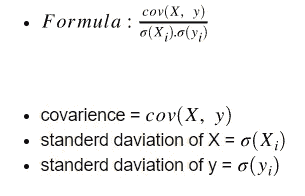
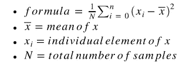
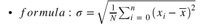
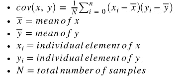
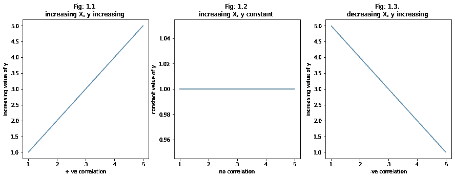
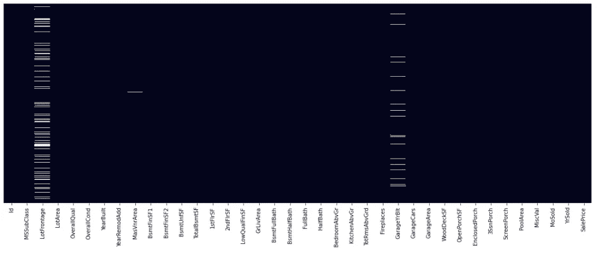
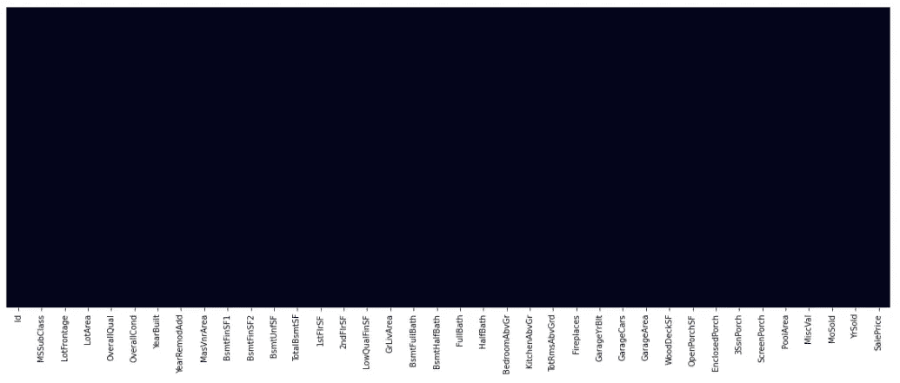
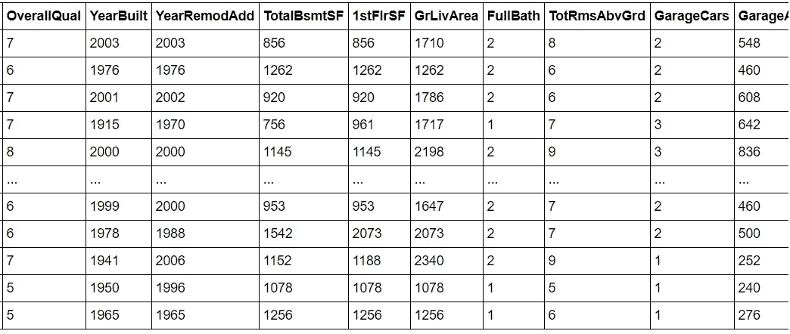

# 皮尔逊相关

> 原文：<https://medium.com/analytics-vidhya/pearsons-correlation-b6ea5cb0eb24?source=collection_archive---------9----------------------->

*   **皮尔逊相关**是特征选择方法。
*   它显示了因变量和自变量之间的方向和强度。
*   当从属和独立之间存在线性关系时，这种方法最合适。
*   其值范围从 **-1 到 1** 。

1.  -1 表示受抚养人和独立人之间有很强的关系。
2.  0 表示从属和独立之间没有任何关系。
3.  1 表示依赖者和独立者之间有很强的+ve 关系。
4.  当相关值越来越接近 0 时，这种关系就越来越弱。

# **皮尔逊关联背后的数学**

*   皮尔逊相关是 **x** 和 **y** 之间的协方差与 **x** 和**y**的标准偏差的乘积之比
*   首先我们要明白什么是**方差**、**标准差、**和**协方差**。
*   下面是皮尔逊相关的公式。



# 1)差异:

*   **方差**衡量数据与其均值的差异。



# 2)标准偏差:

*   **标准差**是方差的平方根。



# 3)协方差:

*   **协方差**衡量变量之间的线性关系。



*   让我们开始实施皮尔逊相关。

```
**# importing libraries****import** **numpy** **as** **np**
**import** **pandas** **as** **pd**
**import** **matplotlib.pyplot** **as** **plt**
**import** **seaborn** **as** **sns**
%matplotlib inline
```

*   以下是确定因变量和自变量之间关系的三种方法。

## 1)如果 X 在增加，y 也在增加:

*   我们可以说，因变量和自变量之间存在**强+ve 关系**。

## 2)如果 X 增加而 y 不变:

*   我们可以说，因变量和自变量之间根本没有关系。

## 3)如果 X 在减少，y 在增加:

*   我们可以说，因变量和自变量之间存在着强相关关系。

# 数据创建

1.  我们正在创建一些原始数据来理解这两者之间的关系。
2.  为了更好地理解，我们还将绘制线性图。

```
# X is increasing and y is also increasing 
X1 = [1,2,3,4,5]
y1 = [1,2,3,4,5]# if X is increasing and y is constant
X2 = [1,2,3,4,5]
y2 = [1,1,1,1,1]# if X is decreasing and y is increasing
X3 = [5,4,3,2,1]
y3 = [1,2,3,4,5]
```

现在，想象一下上面的数据

```
# plot for X is increasing and y is also increasing
plt.figure(figsize=(15,5))
plt.subplot(1,3,1)
plt.plot(X1, y1)
plt.title('Fig: 1.1 **\n**increasing X, y increasing ')
plt.xlabel('+ ve correlation')
plt.ylabel('increasing value of y')# plot for if X is increasing and y is constant
plt.subplot(1,3,2)
plt.plot(X2, y2)
plt.title('Fig: 1.2 **\n**increasing X, y constant ')
plt.xlabel('no correlation')
plt.ylabel('constant value of y')# plot for if X is decreasing and y is increasing
plt.subplot(1,3,3)
plt.plot(X3, y3)
plt.title('Fig: 1.3, **\n**decreasing X, y increasing ')
plt.xlabel('-ve correlation')
plt.ylabel('increasing value of y')

plt.show()
```



*   在图 1.1 中，我们可以观察到，如果 X 的值增加，y 的值也增加，这意味着这两者之间有很强的+ve 相关性。
*   在图 1.2 中，我们可以观察到，如果 X 的值是增加的，y 的值是不变的，这意味着根本没有相关性。
*   在图 1.3 中，我们可以观察到，如果 X 的值减少，y 的值增加，这意味着这两者之间有很强的相关性。

现在，是时候应用皮尔逊相关性了。

```
*# import dataset*
*# here we are using housing dataset.*train_data = pd.read_csv('/content/drive/MyDrive/My Datasets/House Price/train.csv')train_data.shapeoutput:(1460, 81)
```

*   这里，我们没有进行任何类型的特性工程，所以我们只选择整数列，删除具有 null 值的行，以应用 Pearson 相关性。

```
*# getting only integer columns.*

train_data.drop(train_data.select_dtypes(include='object').columns, inplace=**True**, axis=1)*# dropping columns which have missing value percentage greater than 60*

train_data.drop(train_data.columns[train_data.isnull().mean()>0.60], inplace=**True**, axis=1)
train_data.shapeoutput:(1460, 38)
```

*   此热图显示数据集中有多少空值。

```
plt.figure(figsize=(20, 7))
sns.heatmap(train_data.isnull(), yticklabels=**False**, cbar=**False**)
plt.show()
```



具有空值的热图

```
*# dropping rows which have missing values.*train_data.dropna(inplace=**True**, axis=0)train_data.shapeoutput:(1121, 38)plt.figure(figsize=(20, 7))
sns.heatmap(train_data.isnull(), yticklabels=**False**, cbar=**False**)
plt.show()
```



没有空值的热图

*   到目前为止，我们已经清理了数据集。是时候使用皮尔逊相关性了。

```
**from** **sklearn.feature_selection** **import** f_regression, SelectKBest

*# f_regression method used for pearson's correlation.*
*# SelectKBest method used to select top k best features.*
```

*   将因变量赋给变量 X 和。
*   将自变量赋给变量 y。

```
X = train_data.drop(['SalePrice'], axis=1)
y = train_data['SalePrice']
```

*   这里我们用 k 值为 10 的得分函数 **f_regression** 创建一个 **SelectKBest** 类的对象。

```
skb = SelectKBest(score_func=f_regression, k=10)
```

*   现在，用变量 X 和 y 来拟合我们的模型。

```
*# fit meathod used to fit model on dataset using our score function.*

skb.fit(X, y)
```

*   上面的代码返回下面的输出。

```
SelectKBest(k=10, score_func=<function f_regression at 0x7fded4e704d0>)
```

*   **get_support()** 方法返回真值和假值的布尔列表。我们可以使用这个列表从数据集中获取我们的列。如果为 True，则考虑该列，否则不考虑要返回的列。

```
*# get_support() returns the boolean list of columns .*

col = skb.get_support()
coloutput:array([False, False, False, False,  True, False,  True,  True, False,
       False, False, False,  True,  True, False, False,  True, False,
       False,  True, False, False, False,  True, False, False,  True,
        True, False, False, False, False, False, False, False, False,
       False])
```

*   get _ support(indexes = True)返回表示特定列的编号(位置)的整数列表。

```
*# get_support(indices=True) returns the list of k columns indices which have high pearson's correlations.*

col = skb.get_support(indices=**True**)
coloutput:
array([ 4,  6,  7, 12, 13, 16, 19, 23, 26, 27])*# scores_ returns correlation values of every feature.*
skb.scores_output:array([2.49023403e+00, 8.73950826e+00, 1.50458329e+02, 1.10639690e+02,
       1.96036658e+03, 1.75866077e+01, 4.26662160e+02, 4.17465247e+02,
       3.51021787e+02, 2.01096191e+02, 8.79325850e-01, 5.32479989e+01,
       6.82869769e+02, 6.56137887e+02, 1.16337572e+02, 2.45763523e-03,
       1.10672093e+03, 6.64373624e+01, 1.49381397e+00, 5.29173583e+02,
       8.69809362e+01, 3.20295557e+01, 2.25333340e+01, 4.77935018e+02,
       3.03445055e+02, 3.82561158e+02, 8.05838393e+02, 6.96288859e+02,
       1.43226582e+02, 1.49551920e+02, 2.74886917e+01, 1.06092031e+00,
       1.38136215e+01, 9.65457023e+00, 1.45543888e+00, 2.98365208e+00,
       1.57654584e-01])*# this is our final dataset after using pearson's correlation*X.iloc[:, col]
```



*   这是我关于皮尔森相关性的完整笔记本。 [点击这里](https://colab.research.google.com/drive/1YLNN54xU9FpU3rLcxvDagnFeBDhCKhSJ?usp=sharing)

**概要:**

*   我们已经学习了如何使用 Pearson 的相关性，以及如何使用 Sklearn 库来实现。
*   我们还看到了如何使用 SelectKBest 方法从数据集中选择 K 要素。