# 视频中特定数量帧的行人检测和计数

> 原文：<https://medium.com/analytics-vidhya/pedestrian-detection-and-count-for-certain-number-of-frames-in-a-video-f6563309ef78?source=collection_archive---------6----------------------->

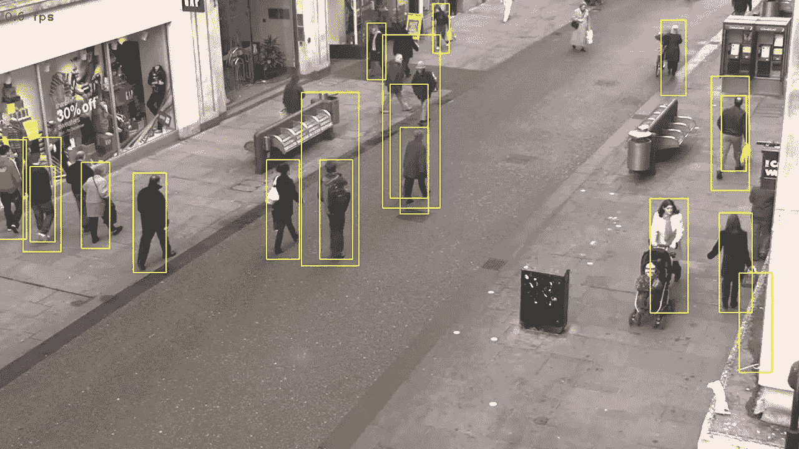

# 内容:

1.  *文献调查*
2.  *工作管道*
3.  *数据准备*
4.  预处理
5.  *型号*
6.  *使用定制数据集上的预训练模型进行训练*
7.  *评估在定制数据集上训练的模型*
8.  *为模型进行砂箱展开*
9.  输出
10.  未来的工作
11.  参考

# 文献调查:

这个问题有许多解决方案，包括数据准备到模型部署在内的基本工作流程很大程度上取决于我们使用的数据类型和模型类型，这就是我将*“文献调查”*作为开始本问题陈述的第一步的原因。

## ***了解物体检测和物体分割的区别:***

***物体分割*** *:*

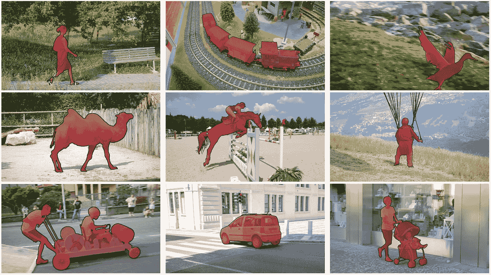

对象分割

在数字图像处理和计算机视觉中，图像分割是将数字图像分割成多个片段(像素组，也称为图像对象)的过程。分割的目标是简化和/或改变图像的表示，使其更有意义，更易于分析。

***物体检测:***

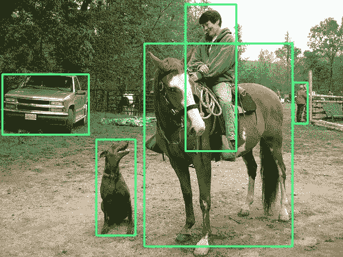

目标检测

对象检测是一项与[计算机视觉](https://en.wikipedia.org/wiki/Computer_vision)和[图像处理](https://en.wikipedia.org/wiki/Image_processing)相关的计算机技术，处理在数字图像和视频中检测某类语义对象(如人、建筑物或汽车)的实例，并自动在这些对象上创建边界框。

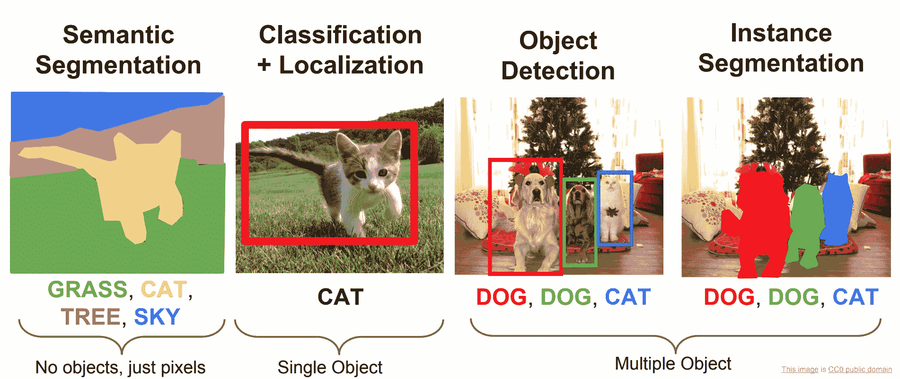

分割和检测的区别

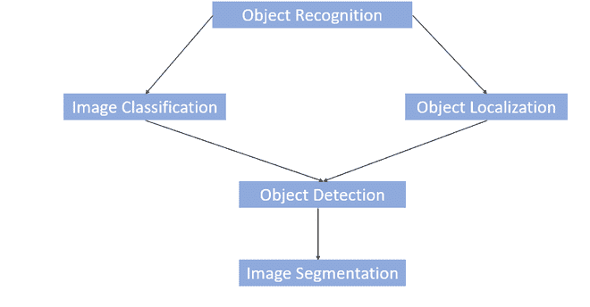

图像处理中检测与分割的关系

## FPS 与精度

当处理对象检测问题时，任何人都应该考虑的前两个约束是模型的每秒帧数(FPS)和准确性。每一个预先训练好的模型要么在准确性上很好，要么在 FPS 上很好，这归结为选择哪个模型的问题陈述和部署方法。

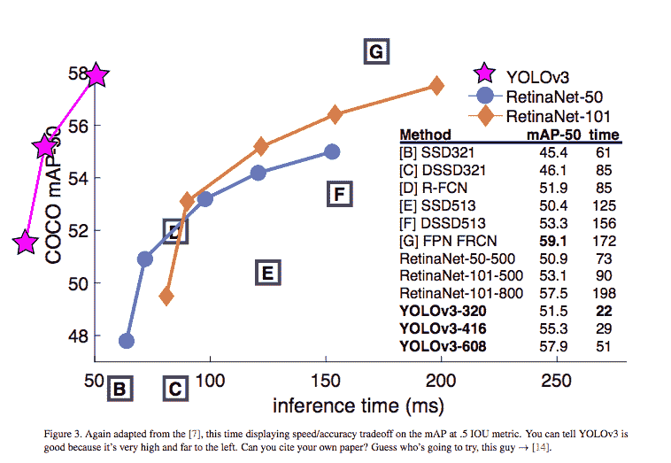

FPS 与精度

在上图中，该图显示了三个模型的比较，即 YOLOv3、RetinaNET-50、RetinaNet-101，以及它们在 coco-dataset 上的推理时间(ms)和平均精度(MAP)方面的差异。

## 我的问题陈述:

“ “

在这个案例研究中，我将研究行人检测问题，并将使用深度学习模型来实时设置阈值，以便如果某个区域的行人数量增加，输出将是“违规”，如果人数少于阈值，则输出将是“未违规”。

” ”

因此，根据我的问题陈述，我必须制作一个模型，并在视频镜头上运行它，并给出每一帧中检测到的行人数量。

这里要注意的是，如果有一个行人行走的镜头，在一定数量的帧之后，行人的数量只会发生变化，在这些特定的帧中，我需要尽可能精确。

因此，根据问题陈述和我对模型部署的忽略，我需要比 FPS 更高的精度，根据上图中的图表，YOLOv3 是最佳选择。

这就是 FPS 和准确性在决定我们的工作流程中扮演重要角色的原因。

([链接到我的文献调查](https://drive.google.com/file/d/18QZYmHS6WMwtlatrIS4VwUmkzapLxDIN/view?usp=sharing))

# 工作管道

## 整个过程可以总结为三个阶段:

1.  数据准备
2.  训练模型
3.  推理

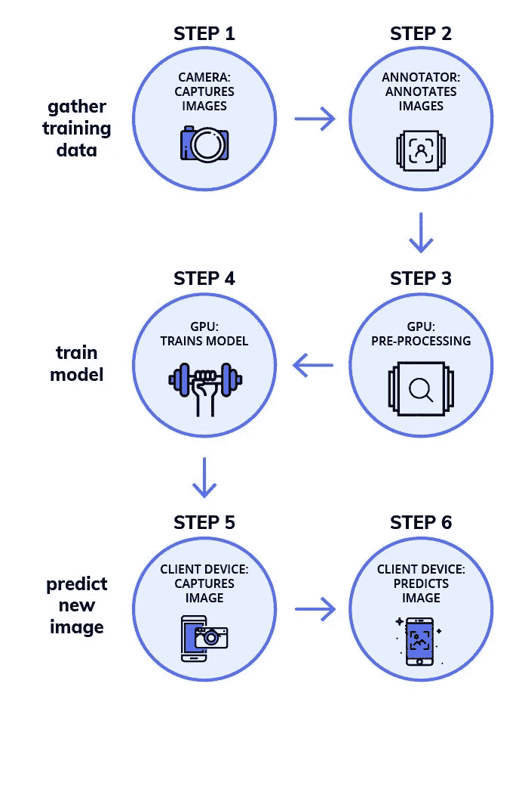

工作用管道(参考:[链接](https://nanonets.com/blog/how-to-automate-surveillance-easily-with-deep-learning/)

> ***我的数据*** *:城镇中心数据集(* [*链接*](https://academictorrents.com/details/35e83806d9362a57be736f370c821960eb2f2a01) *)*
> 
> ***我训练的机型*** *: Mobilenet-SSD，Centrenet-Hourglass，YOLOV3-Darknet。*
> 
> ***我的预测-推理*** *:在 flask app 里，视频和预测都在 flask 服务器上运行。*

# **数据准备**

*城镇中心*数据由两部分组成，

*   TownCentreXVID.mp4:这是一个 4 分钟的关于市中心行人行走的视频。
*   TownCentre-groundtruth:这是一个 CSV 格式的注释，用于 3090 帧，带有(x1，y1)，(x2，y2)边界框。(注意:(xmin，ymin) & (xmax，ymax)未指定)。

Mp4 视频:

O/p

总帧数:7502

Dummy_image 的大小(1920，1080)= = = = = = = = = = = = = = = = = = = = = = = = = = = = = = = = = =

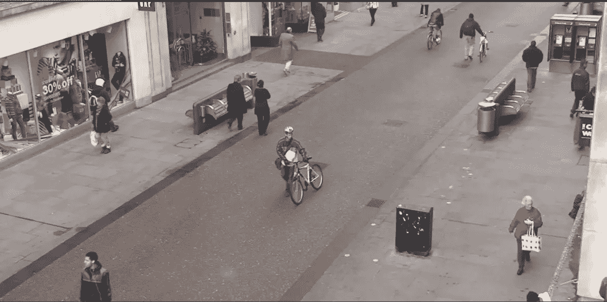

市中心-地面真相

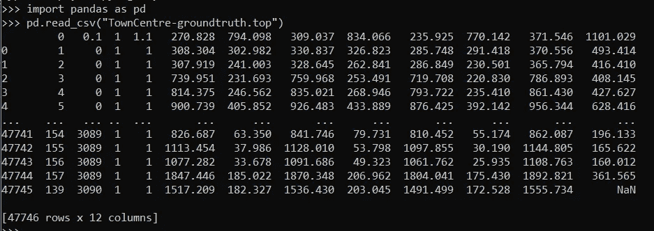

```
Observation on Annotation :

    In the raw data the annotations are given in csv format.

    column[1] --> frame_number
    column[8] --> x1_point_bb
    column[11]--> y1_point_bb
    column[10]--> x2_point_bb
    column[9] --> y2_point_bb
```

正如在数据集注释中一样，我们有 7502 帧中的 3090 帧的基本事实，因此我们可以使用这些帧来创建 train 和 val 图像，其余的用于测试图像。

***存储列车和 val 的图像:***

***存储注释:***

我们将以两种格式存储注释，(为什么在对数据进行预处理和建模时会共享注释)

1.  XML 格式
2.  逗号分隔值（csv）文件格式

XML 格式:

转换为 XML 格式后，我们可以轻松地将其转换为 CSV 格式:

检查每帧的行人数量:

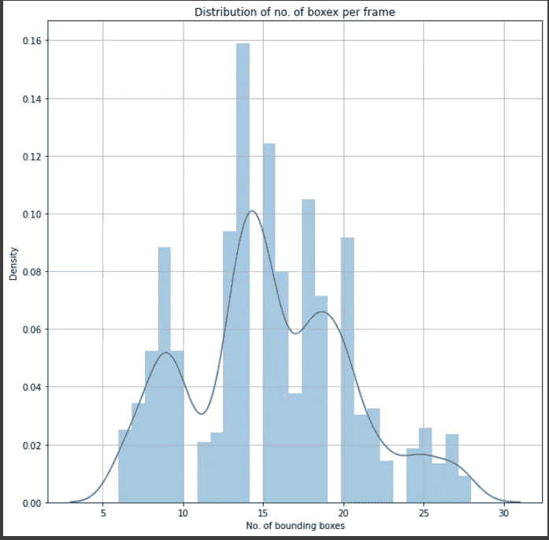

每帧的行人数量

# 预处理

对于预处理，我们可以使用 xml_df 来创建我们的扩充数据和记录格式。

***为什么要扩增数据？***

—为了训练模型，如果图像的训练大小很小，我们可以使用 imgaug 库增加数据。

***如何保存数据-标注？***

在我的例子中，我有 3090 张图像用于训练，这本身足以用于训练，但只是为了备份，我制作了增强数据和最终 df，以便我可以使用我的自定义数据和训练任何模型。

为了实现这一点，我们应该有 3 种格式的注释:

*   TF.record()格式
*   逗号分隔值（csv）文件格式
*   XML 格式

**创建备份数据帧和增强图像**

```
Steps : 
        1\. Creating image dataframe.
        2\. Creating xml dataframe.
        3\. making the ultimate dataframe by merging the two.
        4\. Making augmented dir in the common_path.
        5\. Making XML for augmented images.
        6\. Similarly like 1,2,3 making ultimate aug ultimate DF 
```

步骤 1、2、3:

1.  制作图像 DF:

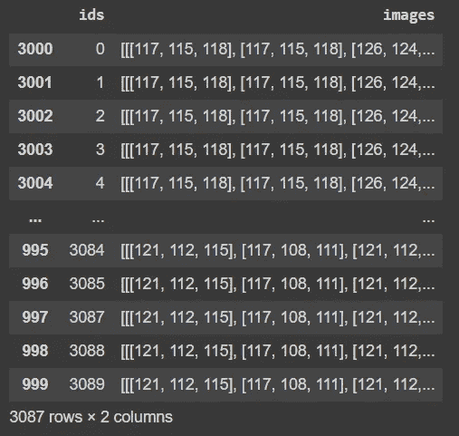

图像 _DF

2.制作 XML DF:

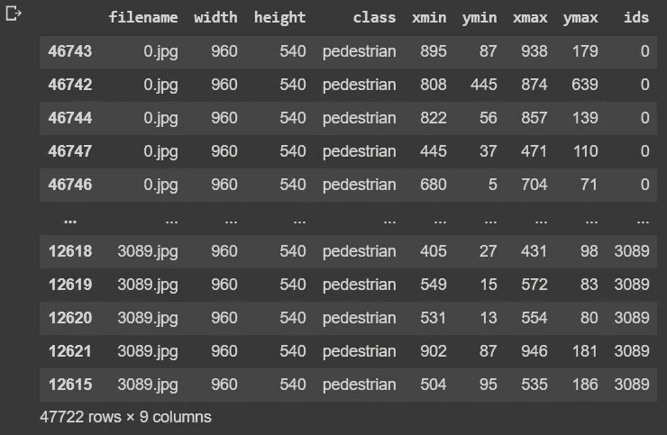

XML_DF

3 .将两者合并为最终的数据帧(可选——我保留它用于备份 4GB pandas DF)

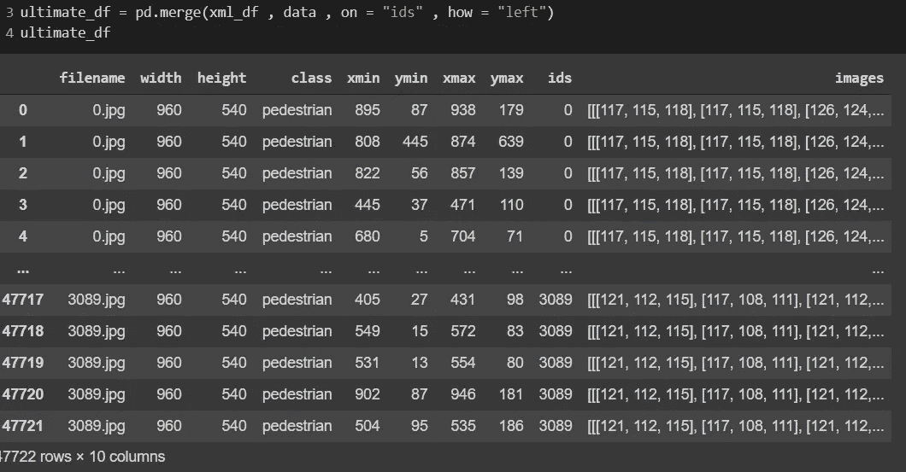

终极数据框架。

现在，使用 XML DF，我们可以扩充数据集，并通过此函数使用扩充图像创建一个扩充图像目录:

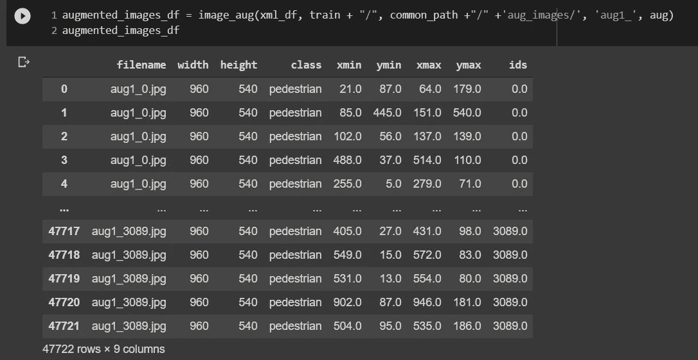

增强图像的增强测向。

制作扩充的最终数据帧(可选)

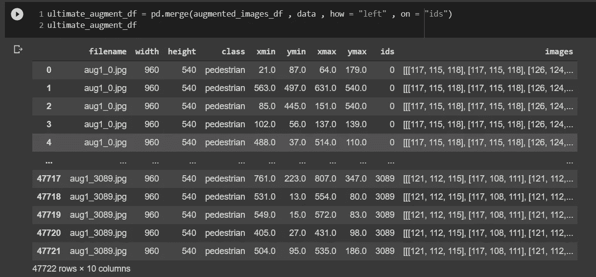

终极 _ 扩充 _ 数据帧

查看简单数据和扩充数据:

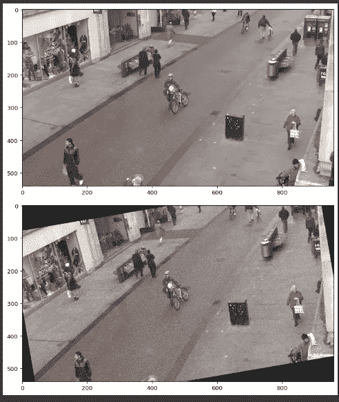

简单图像和增强图像

**创建 tf.record()格式**

预处理前的基本目录:

```
base-dir-format :{
        - train (contain all train images)
        - test  (contain all test images)
        - xml   (Annotations of all train images)
        - csv file
        - video in mp4 format
        - .ci file
        }
```

预处理后的基本目录:

```
Got all the desired files in the common_path :[
    'TownCentre-calibration.ci',        |
    'TownCentre-groundtruth.top',       |--Town-Hall-Data
    'TownCentreXVID.mp4',               |

    'train',       |
    'test',        |-- All the images data.
    'aug_images',  |

    'xmls',             |
    'xmls_augmented_1', |-- All the annotation in XML Format.
                        |

    'train.record',   |
    'val.record'      |-- All tf.record format for training.
                      |     (doesnt include augmnted data yet)

    ]

Stored the Ultimate_data.pickle and ultimate_augmented_data.pickle 
in the system(its 4GB each) for backup.
    Structure of ultimate data :
        columns : [filename    
                  width
                  height
                  class    
                  xmin    
                  ymin    
                  xmax
                  ymax
                  ids
                  images]
        Shape   : (47722 rows × 10 columns)
```

# 模型

1.  ***手机-网络-固态硬盘***

**手机网研究论文链接:**[https://arxiv.org/pdf/1704.04861.pdf](https://arxiv.org/pdf/1704.04861.pdf)**SSD 研究论文链接:**https://arxiv.org/pdf/1512.02325.pdf

**架构(移动网络):**

**关键理论:**

*   深度方向可分离卷积；

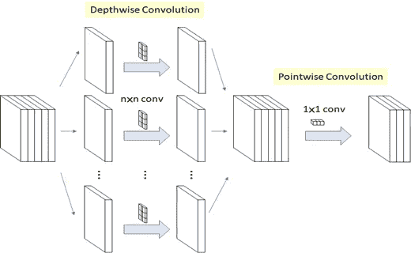

深度方向卷积

**架构(固态硬盘):**

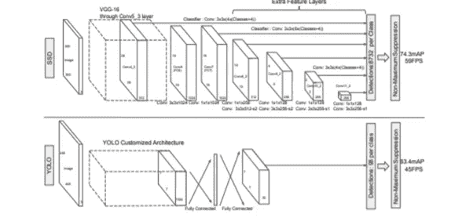

固态硬盘的架构

**关键理论:**

- **数据集包含边界框，其结构形成了多个边界框，使用 NMS 我们得到了想要的结果。**

**移动网络固态硬盘:**

它由两部分组成:

1.提取特征地图，以及

2.应用卷积滤波器来检测对象

SSD 被设计为独立于基础网络，因此它可以运行在任何基础网络之上，如 VGG、YOLO、MobileNet。

为了进一步解决在实时应用中的低端设备上运行高资源和高功耗神经网络的实际限制，MobileNet 被集成到 SSD 框架中。所以，当 MobileNet 被用作 SSD 中的基础网络时，它就成了 **MobileNet SSD。**

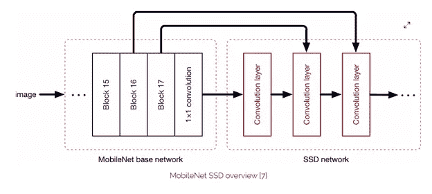

移动网络固态硬盘

**2*。YOLO V3***

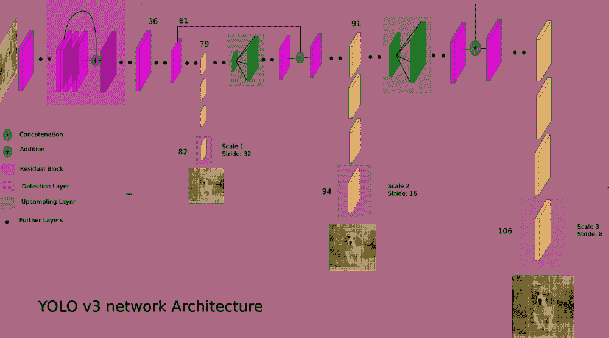

YOLO-V3 架构

解释 YOLO ( [环节](https://towardsdatascience.com/yolo-v3-explained-ff5b850390f))

# 在自定义数据集上使用预训练模型进行训练

在我的训练中，我使用了两种格式，

*   TF.record()格式
*   暗网的图像和文本格式

***使用 TF 对象检测 API***

张量流对象检测 API 在著名数据集上有许多预训练模型，如 COCO 数据集、Image-Net 数据集等等。

([链接](https://github.com/tensorflow/models/tree/master/research/object_detection))

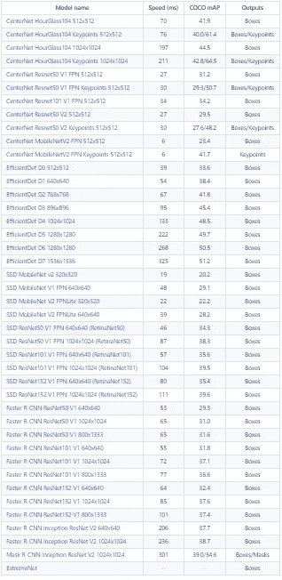

([链接](https://github.com/tensorflow/models/blob/master/research/object_detection/g3doc/tf2_detection_zoo.md))

从这些模型中，我使用 Mobile-net-SSDv2 模型和 Centrenet(作为理解 API 使用的黑盒)在我的数据集上进行训练。

***如何在我们这样的自定义数据集上训练这些模型？***

([参考链接](https://tensorflow-object-detection-api-tutorial.readthedocs.io/en/latest/training.html))

1.  克隆 TF 对象检测 API 的 git:

```
!git clone [https://github.com/tensorflow/models.git](https://github.com/tensorflow/models.git)
```

2.安装模型的所有依赖项。

```
%cd /content/models/research/!protoc object_detection/protos/*.proto --python_out=.# Install TensorFlow Object Detection API.!cp object_detection/packages/tf2/setup.py .!python -m pip install .
```

3.测试模型构建器

```
!python /content/models/research/object_detection/builders/model_builder_tf2_test.py
```

注意(如果这个命令给出错误，所有的依赖项都没有正确设置，我正在使用 google colab，所以像这样的命令！cp 已经被设置)

4.创建标签映射，并将其作为 label_map.pbtxt 保存在您的基本目录中

```
item {
  id: 1
  name: 'pedestrian'
}
```

5.现在，通过右击 tf github 链接并保存。tar 文件。下载完`*.tar.gz`文件后，使用您选择的解压缩程序(如 7zip、WinZIP 等)打开它。).接下来，打开压缩文件夹时看到的`*.tar`文件夹，并提取其内容。

```
%cd /content!wget http://download.tensorflow.org/models/object_detection/classification/tf2/20200710/mobilenet_v2.tar.gz!tar -xvf mobilenet_v2.tar.gz!rm mobilenet_v2.tar.gz
```

我们的模型目录如下所示:

```
│  └─ mobile_net_ssd_v2_fpn_640x640_coco17_tpu-8/
│     ├─ checkpoint/
│     ├─ saved_model/
│     └─ pipeline.config
```

6.定义培训参数:

```
num_classes = 1batch_size = 16num_steps = 6000num_eval_steps = 1000train_record_path = common_path + “/train.record”test_record_path = common_path + “/val.record”model_dir = ‘/content/training/’labelmap_path = ‘/content/label_map.pbtxt’pipeline_config_path = ‘mobilenet_v2.config’fine_tune_checkpoint = ‘/content/mobilenet_v2/mobilenet_v2.ckpt-1’
```

7.现在使用这些变量更改模型目录中的配置文件，如下所示:

注意:(有时配置文件不同，更改没有反映出来，所以您可以直接打开配置文件自己进行更改，切记如果配置文件处理不当，培训将不会进行)

8.设置培训:

```
!python /content/models/research/object_detection/model_main_tf2.py \--pipeline_config_path={pipeline_config_path} \--model_dir={model_dir} \--alsologtostderr \#\/ can ignore this if you dont want to overwrite \/--num_train_steps={num_steps} \ --sample_1_of_n_eval_examples=1 \--num_eval_steps={num_eval_steps}
```

9.绘图张量板

```
%load_ext tensorboard%tensorboard — logdir ‘/content/training/’ 
```

***结果为手机上网 SSD***

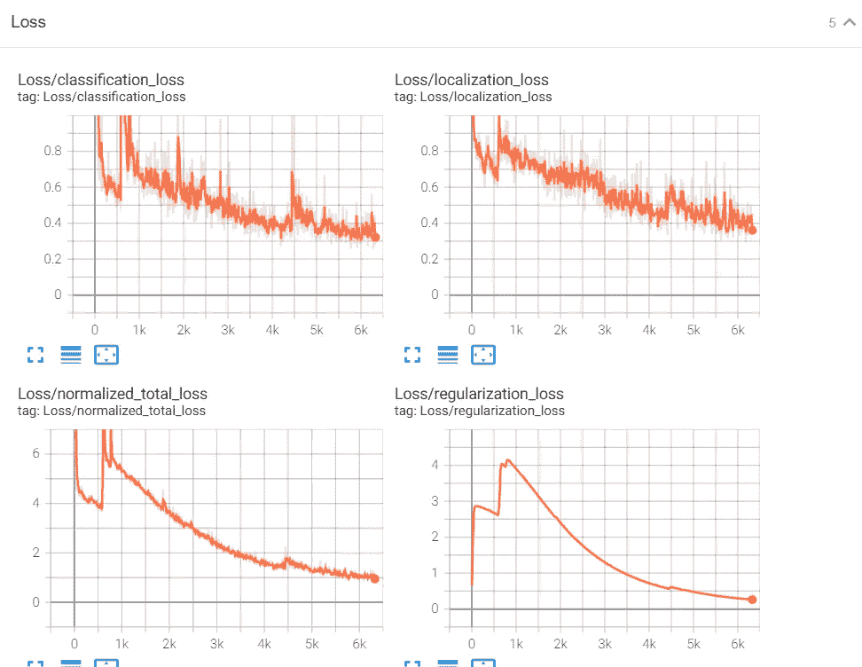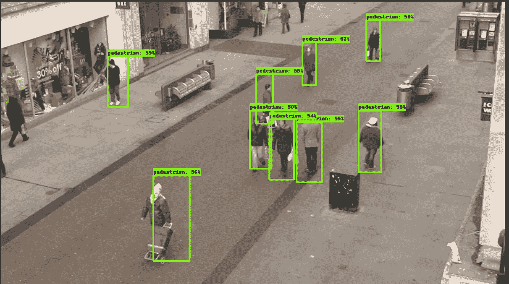

移动网络的结果

***Centrenet 的结果:***

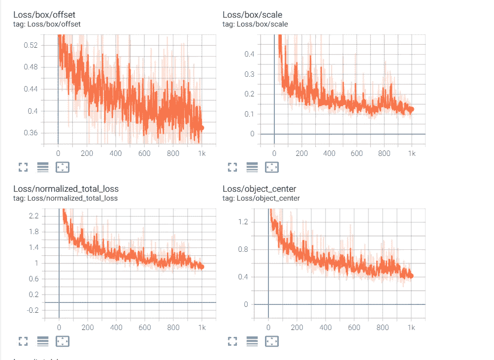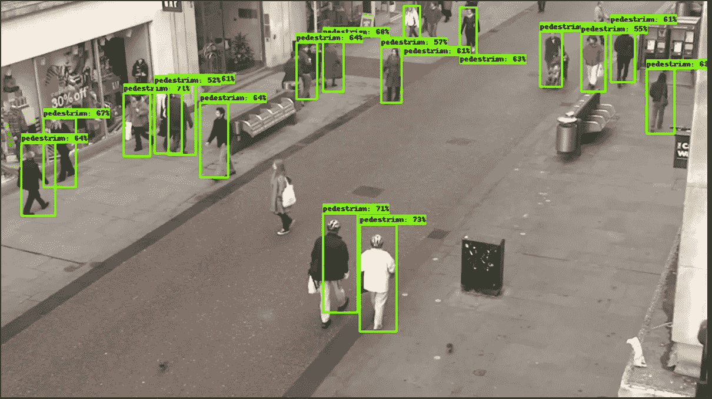

Centernet 的结果

*(对我来说有趣的是，在不知道 centernet 架构的情况下，我得到了比 mobilenet 更好的结果，因为我知道 mobilenet 的架构)*

10 .保存模型

```
output_directory = 'inference_graph'!python /content/models/research/object_detection/exporter_main_v2.py \--trained_checkpoint_dir {model_dir} \--output_directory {output_directory} \--pipeline_config_path {pipeline_config_path}
```

***在自定义数据集上训练暗网 YOLO:***

为了制作暗网格式的数据，我们可以使用一个名为 ROBOFLOW ( [link](https://roboflow.com/) )的开源网站:

转换后，我们的数据集看起来像这样:

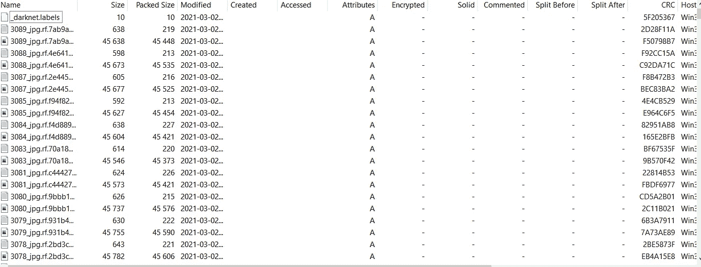

暗网的数据格式。

这里需要注意的重要一点是，通过将我们的注释格式保存为 xml、csv 和 record，我们能够在自定义数据集上使用各种各样的模型。

现在下载 darknet 模型并遵循以下步骤:

```
Steps:

    1\. Adding obj folder under darket/data.
    2\. Saving all the images and annotations in darknet/data/obj.
    3\. making a train.txt and val.txt file.
    4\. making custom configeration file in cfg/ dir.
    5\. making obj.names and obj.data  for running the cfg.
```

在完成这些步骤( [video_link](https://www.youtube.com/watch?v=zJDUhGL26iU) )后，运行以下命令:

```
%cd /content/darknet!make!chmod +x ./darknet
```

注: (我用的 google colab 就是这样！make 已经配置好了，这是重要的一步，因为这会运行所有的演示文件并为 yolo 进行配置。)

安装 do2unix 包并将给定的文件转换成 unix 格式。

```
!sudo apt install dos2unix!dos2unix ./data/train.txt!dos2unix ./data/val.txt!dos2unix ./data/obj.data!dos2unix ./data/obj.names!dos2unix ./cfg/yolov3_custom.cfg
```

开始培训:

```
%cd /content/darknet!./darknet detector train data/obj.data cfg/yolov3_custom.cfg darknet53.conv.74
```

将整个 Darknet 保存到一个 zip 文件中:

```
%cd /content/!zip -r /content/drive/MyDrive/Townhall_dataset/OxfordTownCentre/darknet_trained.zip darknet/
```

# 评估在自定义数据集上训练的模型

```
Metrics of evaluation: 
            1\. MAP
            2\. Object-count accuracy.
            3\. time-for-prediction.
```

对于移动网络:

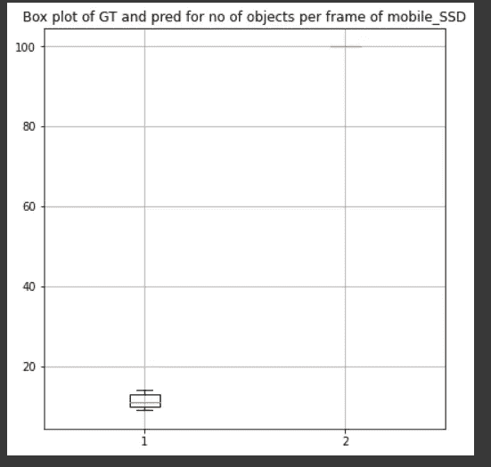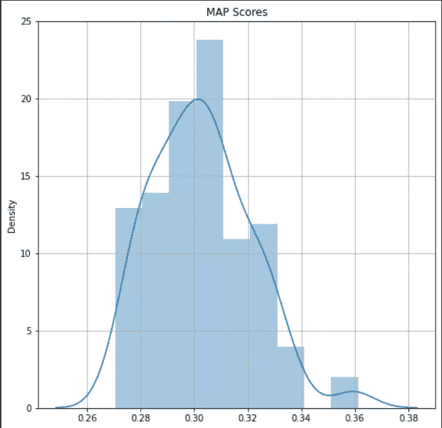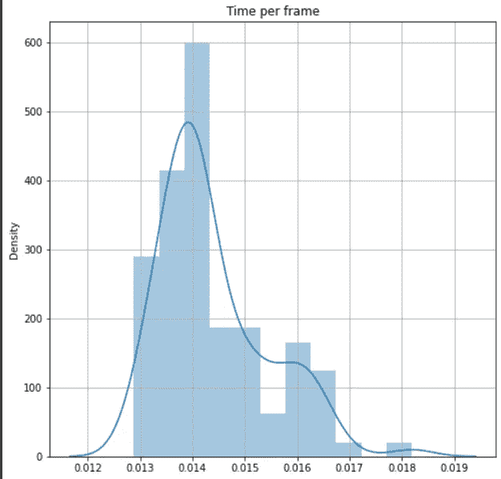

```
Observations:
  Mobile net giving the no. of objects in a frame always 100.(solved by NMS)
  MAP of the model is in the range 0.090 to 0.110
  Time per frame: 
    max time : 0.019 sec
    min time : 0.013 sec
```

对于 Centernet:

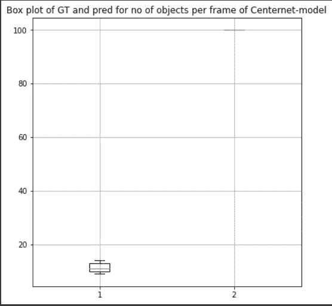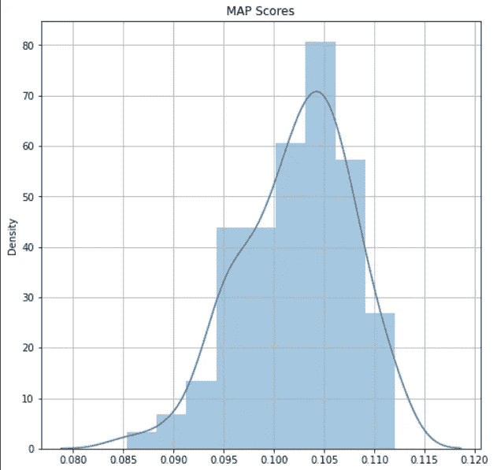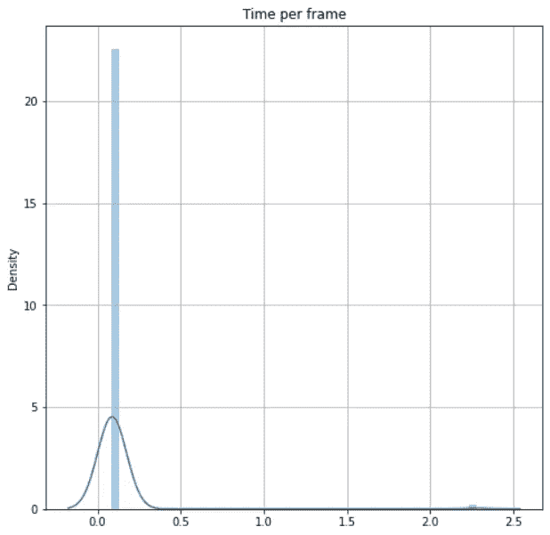

```
Observations:
  Mobile net giving the no. of objects in a frame always 100.(solved by NMS)
  MAP of the model is in the range 0.090 to 0.110
  Time per frame: 
    max time : 2.5 sec
    min time : < 0.0 sec
```

对于 YOLO-黑暗网络

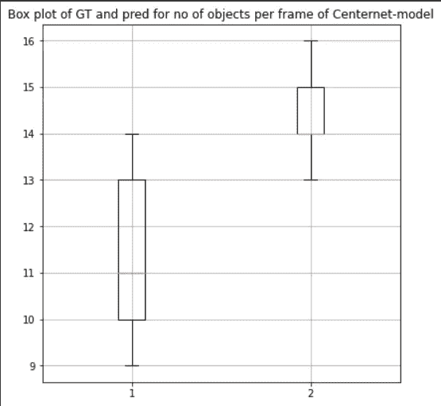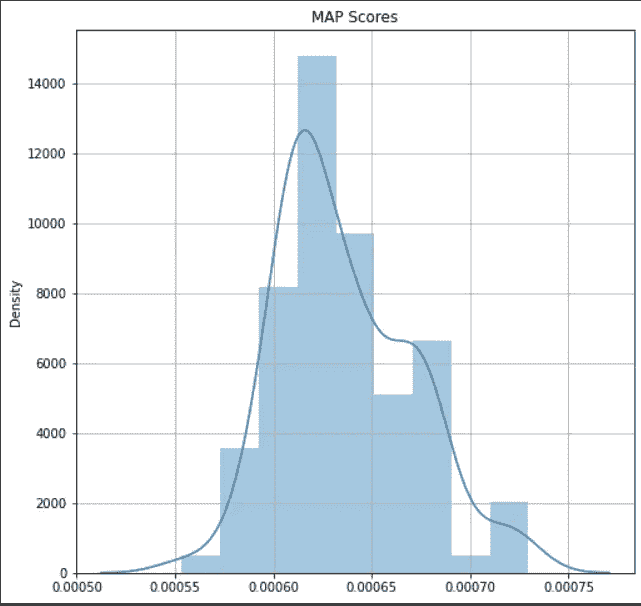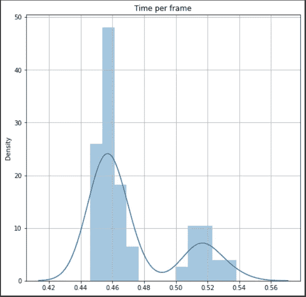

```
Observations:
  Giving the no. of objects in a frame with 14.(solved by NMS)
  MAP of the model is in the range 0.00055 to 0.00070
  Time per frame: 
    max time : 0.56 sec
    min time : 0.42 secPersonal-Observations :
    1\. Trainning time :
      - mobile-net - 5 mins
      - Center-net - 5 mins
      - darknet-yolo- 5 hours

    Performing FLASK api model using YOLO-darknet or Center-net.
```

# 对象检测的烧瓶实现；

我们可以使用 cv2.dnn 库来下载我们的暗网模型，并使用它来预测帧上的边界框。

# 输出:

# 未来工作:

1.  可以建立一个模型，该模型可以计算包围盒之间的距离，并可以使违规更加精确。
2.  可以根据积累的或更多的数据训练模型

# 参考资料:

1.  [https://arxiv.org/ftp/arxiv/papers/2012/2012.07072.pdf](https://arxiv.org/ftp/arxiv/papers/2012/2012.07072.pdf)
2.  [https://arxiv.org/pdf/1704.02431v2.pdf](https://arxiv.org/pdf/1704.02431v2.pdf)
3.  [https://github.com/thatbrguy/Pedestrian-Detection](https://github.com/thatbrguy/Pedestrian-Detection)
4.  [www.appliedaicourse.com](http://www.appliedaicourse.com)

( [GITHUB)](https://github.com/Rag-hav385/pedestrian_detection)

my-Linkedin:[https://www.linkedin.com/in/raghav-agarwal-127539170](https://www.linkedin.com/in/raghav-agarwal-127539170)