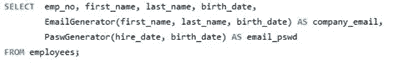

# 使用 SQL 标量函数的人员分析

> 原文：<https://medium.com/analytics-vidhya/people-analytics-using-sql-scalar-function-59edc7cab2bb?source=collection_archive---------1----------------------->

[JESHOOTS.COM](https://unsplash.com/@jeshoots?utm_source=medium&utm_medium=referral)在 [Unsplash](https://unsplash.com?utm_source=medium&utm_medium=referral) 上拍照

如今，几乎每个角色都必须以某种形式处理数据。通常，我们通过电子表格或数据库来完成。但是如果我们能学一点 SQL，你就能在工作中变得更加强大。

当今最常见的数据库结构之一是关系数据库。与关系数据库齐头并进的是结构化查询语言(SQL)。SQL 是从大型数据集中提取相关有用数据的强大而健壮的工具。

数据分析涵盖业务的方方面面，从 R&D 到营销、会计等等。其中一个方面是人员分析。

## **人物分析**

我们可以将人员分析定义为一种数据驱动的工作人员管理方法。人员分析是人才数据的收集和应用，以改善关键的人才和业务成果。

作为人力资源经理，你可以根据人才数据分析做出关于你的人的决定，而不是根据个人关系或经验做出决定。使用人员分析，经理和高级人才领导者将非常有助于释放人才数据的力量，从而提高严谨性、减少偏见并提高绩效。

## SQL 标量函数

大概你明白什么是函数，如何用 Python 编程语言来编码。如果这样做了，在 SQL Server 中创建标量函数并不难掌握。我们可以说，SQL server 标量函数接受一个或多个参数并返回单个值。

为什么 SQL 中需要标量函数？

这个函数帮助我们简化代码。有时(或每日:D)，我们有一个复杂的计算出现在许多查询中。我们可以创建一个标量函数来封装公式，而不是在每个查询中都包含公式。因此，如果需要，我们可以在每个查询中使用它。

使用 CREATE FUNCTION 语句:

> CREATE FUNCTION FUNCTION _ name(parameter _ list)
> 返回 data_type 为
> 开始
> 语句
> 返回值
> 结束

语法解释:

*   创建函数后，给出函数的名称。
*   在函数名后指定一个用括号括起来的参数列表。
*   在 RETURNS 语句中，指定返回值的数据类型。
*   最后，在函数体中包含一个 RETURN 语句来返回值。

## 员工数据集

雇员样本数据库是由帕特里克·克鲁斯和朱塞佩·马霞开发的，它提供了一个大型数据库(大约 160MB)的组合，分布在六个独立的表中，总共包含 400 万条记录。该结构与多种存储引擎类型兼容。通过包含的数据文件，还提供了对分区表的支持。

除了基本数据之外，Employees 数据库还包括一套测试，可以对测试数据执行这些测试，以确保您所加载的数据的完整性。这应该有助于确保初始加载期间的数据质量，并且可以在使用后使用，以确保在测试期间没有对数据库进行任何更改。

欲了解更多信息并将其安装在 MySQL 服务器上，请阅读[本网站](https://dev.mysql.com/doc/employee/en/)。

## 为人员分析创建 SQL 标量函数

在创建 SQL 标量函数之前，让我们看看 employees 数据库中的所有表。

雇员数据库中的表

从这个表中，我们可以看到雇员数据库有 6 个表:(1)部门，(2)部门 _ 雇员，(3)部门 _ 经理，(4)雇员，(5)薪水，和(6)头衔。

该数据库也有两个视图:(1)当前部门员工和(2)部门员工最新日期。

在这篇文章中，我想告诉你如何在 SQL 中创建标量(用户定义的)函数。以下所有功能都是使用员工数据库创建的。因此，希望该功能可以帮助人力资源经理分析他们的人才数据。

## 1.工资计算器

人力资源部每月的工作量之一是与含税工资有关的事情。您可以在 SQL 中创建简单的函数来计算实得工资。简单来说，*拿回家工资=工资-税*。如果您考虑奖金或其他奖励，您可以编辑/更改此功能。

创建税后薪金功能

你们中的一个，可能会问，为什么我在函数中使用这个查询:

> 读取 SQL 数据
> 
> 确定性的

我有两个原因。首先，当您创建一个存储函数时，您必须声明它是确定性的或者它不修改数据。其次，默认情况下，要接受 CREATE FUNCTION 语句，必须显式指定 DETERMINISTIC、NO SQL 或 READS SQL 数据中的至少一个。关于这个问题的更多细节请阅读[这里](https://dev.mysql.com/doc/refman/8.0/en/stored-programs-logging.html)

你可能会怀疑，我们的函数创建成功了吗？您必须检查模式。如果你的函数出现在**函数中，**祝贺你！！你做到了。

SalaryAfterTax 函数

可以看到， *SalaryAfterTax* 函数是出现在函数上的。因为我们使用*雇员*数据库，所以这个函数是在*雇员*模式下创建的。

这不是我做的最后一个函数。我给你看另一个功能。因此，另一个功能将出现在*功能*选项卡的下方。

让我们试试我们的新功能。从*薪水*表中，显示雇主编号、薪水，并使用 *SalaryAfterTax* 功能获得实得工资。参见下面的完整查询:

试用功能

这是结果。看看*带回家工资*栏目。这是*工资-(工资*税)的结果。*

结果

## 2.奖金计算器

在年底，一些公司给所有员工或某些员工发奖金。如果你的公司给所有员工发奖金，那么我们需要奖金制度。作为人力资源经理，你必须公平对待你的员工。

作为前一个函数，我将保持它足够简单的例子。在*员工*数据库中，我们有 7 个职称，如:高级工程师、职员、工程师、高级职员、助理工程师、技术负责人、经理。

公司职位

奖金因职称不同而不同。如果你有“高级”、“领导”和“经理”头衔，你的奖金是百分之五。但是，如果你没有，人事经理还是会给你 2%的奖金。如何把这个规则转换成 SQL 函数？以下是查询:

创建 BonusCalculator 函数

在*员工*数据库中，有*职称*表和*工资*表*。由于我们无法从一个表中访问职位和工资数据，所以我们需要连接这些列。使用左连接来连接这些表。参见下面的完整查询:*

使用 SQL 函数计算奖金

这是结果。读完这篇指导性文章后，我希望作为人力资源经理的你永远不要再错估奖金了，:D

有时候，不确定感会降临到我们身上。如果你怀疑奖金是正确的，使用这个复杂的。这里是我提供的查询，如果你想检查你的团队奖金的百分比是否准确无误。在这个查询中，我使用公共表表达式(CTE)。

在 CTE 使用 *BonusCalculator* 功能

在您查看此输出表后，可能您的不确定感会被忽略。

结果

## 3.带薪休假计算器

除了薪水和公司品牌，带薪休假是人才申请公司时考虑的竞争价值之一。在一般公司，你的带薪年假是 12 天。假设你每月有一天带薪假期。

更复杂(也更公平)的是，你的公司会给领导、经理和高级职位额外的两天带薪假期。你的公司也关心女性问题。因此，无论职位高低，每位女性员工都有额外的 2 天带薪假期。让我们将这条规则转换成 SQL 查询:

带薪休假功能查询。

在*员工*数据库中，有*职称*表和*员工*表*。*我们需要连接这些列来显示员工编号、职位、名字、姓氏和性别列。

我们得到*标题*和*性别*列后，使用*paidle leave*函数。

使用 *PaidLeave 功能*

看看下面的结果。参见 Amabile Gomatam row。作为高级工程师，他有 14 天带薪假期(12 天+ 2 天额外假期)。但是，Valdiodio Niizuma 还有 14 天的带薪假期。即使她不是高级工程师，她也有额外的带薪假期，因为性别激励。

结果

arumugam Ossenbru……获得 16 天带薪休假，因为她是高级职员，还获得性别激励(12 天+高级职位额外 2 天+性别激励额外 2 天)。

**(奖金)员工邮件生成器**

电子邮件( *email* )仍然被许多公司用作主要沟通媒介。电子邮件是免费的，所有设备都可以访问，可以作为记录，并且便于所有员工使用。

但是，挑战之一是为员工创建独特的电子邮件。如果我们使用名和姓，我们可以遇到两个名字完全相同的雇员。或者，我们可以将姓名和出生日期结合起来创建唯一的电子邮件名称。下面是函数:

电子邮件生成器功能

我们不仅提供电子邮件名称，还提供临时密码。在这个函数中，我们从雇佣日期的那一天和出生日期的那一年创建临时密码。

密码生成器功能

使用*员工*表尝试邮件和密码生成器功能。

使用电子邮件和密码生成器功能

这是结果。你所有的员工都已经有了正确的公司邮箱名和临时密码。

结果

## 外卖食品

数据分析技能不再是数据分析师的特权。无论你从事什么职业，你都有同样的机会掌握数据分析技能。SQL 是数据分析的突出技能之一。在这篇操作方法文章中，您已经了解了如何创建和使用 SQL 标量函数。

谢谢你，在我的另一篇文章中再见。