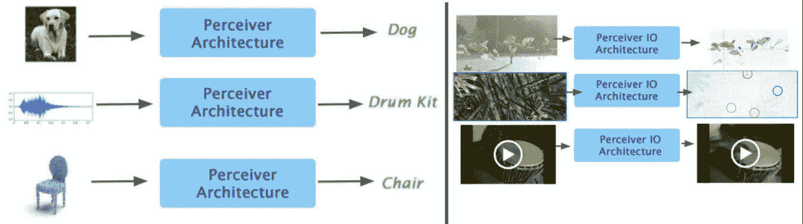
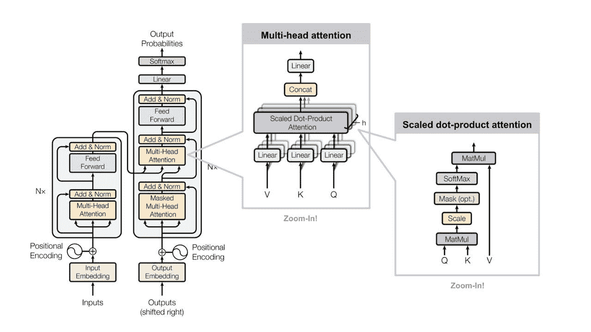
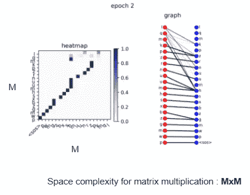
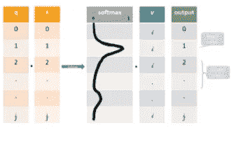
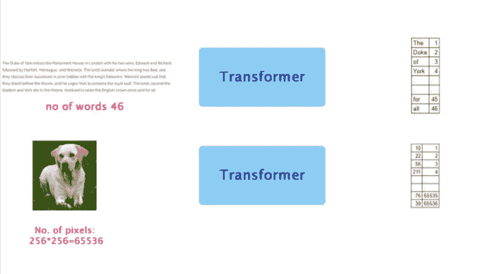
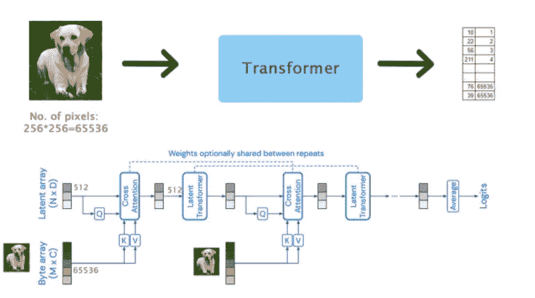
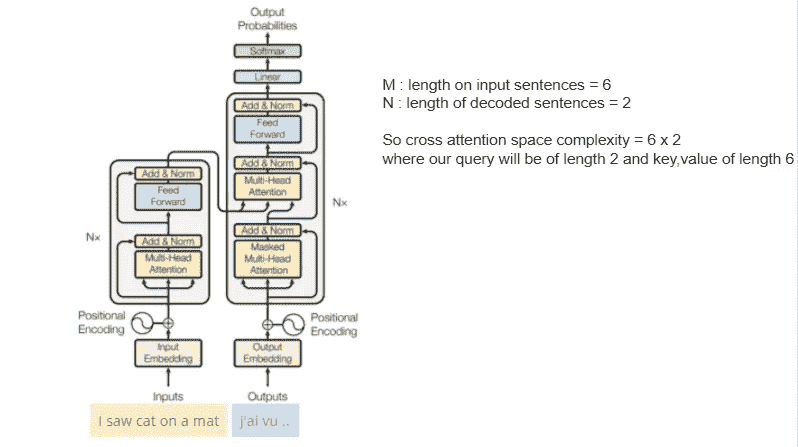
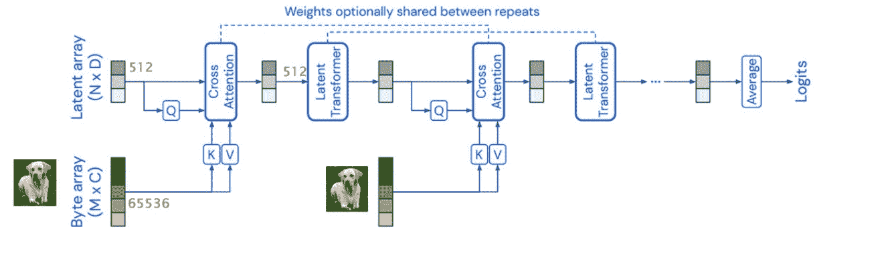
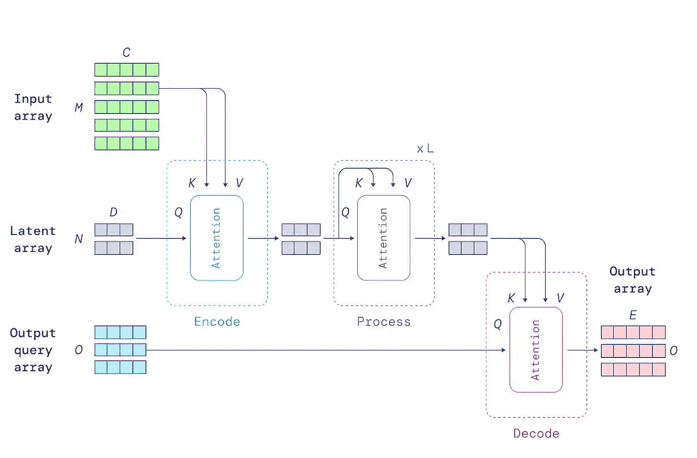

# 感知者 IO:deep mind 结构化输入输出的通用架构。解释过了！

> 原文：<https://medium.com/analytics-vidhya/perceiver-io-a-general-architecture-for-structured-inputs-outputs-4ad669315e7f?source=collection_archive---------3----------------------->

## 还提供了一个视频讲解器来理解感知者 IO 的想法

# **简介**

Deepmind 刚刚推出了[感知者 IO](https://deepmind.com/research/open-source/perceiver-IO) ，这是一个结构化输入&输出的通用架构。原始感知者的想法是它提供了

> 一种利用变压器架构的通用算法，它还解决了由于注意机制而出现的变压器的二次时间和空间复杂度。

[感知者 IO](https://arxiv.org/abs/2107.14795https://arxiv.org/abs/2107.14795) 扩展了[原始感知者](https://arxiv.org/abs/2103.03206)，其中架构的输出也可以扩展到任意大小的输出值。因此，他们创建了一种通用算法，可以将任何大小的输入输入到变压器注意块中，还可以根据需要提供所需的输出形状。首先。我们先来了解一下原变压器架构中的问题。

左侧，广义感知者模型可以接受任何类型/大小的输入，但只能接受简单的输出。感知者 IO 现在也可以提供输出，而不管输入的大小。

# 变压器中的问题

让我们了解一下 transformer 中的语言翻译任务。现在，一般来说，Transformer 工作得最好，因为它可以一次获取大量的输入序列值，这在我们的算法需要引用其他单词进行上下文时很有帮助。

因此，为了实现对上下文的深入理解，每个单词都与其他每个单词进行映射，以获得更多的理解。

在一般的变压器中，我们的第一个输入数据通过前馈层经过**多头注意力**层。在**多头关注**中会有多个**自我关注层。**

在**自我关注层中，**输入中的每个元素都与输入中的所有其他单词相关联。对于语言任务，如果输入序列中有 M 个单词，那么由于自我注意，空间复杂度变成二次的。

为什么会这样？我们来详细看看自我关注。

因此，在自我关注内部，我们将输入提供给**三个不同的完全连接的层**，以创建查询关键字和值向量。查询和关键字经历**点积矩阵乘法**以产生评分矩阵。得分矩阵决定了一个单词在其他单词上的关注程度。然后，我们添加 softmax 以获得最高的概率值，这有助于我们的模型提供更多的信心来关注哪些单词。然后乘以值向量，得到输出向量。

由于 **查询和**键之间的**乘法，当输入增加时，一般关注的变形金刚立即在空间中向上射出。**

对于语言任务来说，这没什么大不了的，因为最多输入 1000 个左右的序列。然而，当考虑**图像时，我们的输入序列将是图像**中的所有像素。对于一个 256x256 的简单图像，我们的像素大约是 62，500，这是我们的输入序列，现在我们的**空间复杂度是 65536x65536** 。

几种方法来提供替代解决方案，如 [VIT 变形金刚](https://arxiv.org/abs/2010.11929)，其中**图像已经被分成批次**然后馈送给它们，然而它仍然没有解决我们的二次复杂度。

# **原始感知纸**

现在，感知建筑通常试图将这种空间复杂性降低到一个极限，这样它就不应该是二次的。为了解决这个问题，他们在输入序列和多头注意力之间增加了一个**交叉注意力**层。

那么什么是交叉注意呢？

简单地说，我们在查询和关键字之间执行矩阵乘法，其中两者的大小都是 MxM，其中 m 是输入序列，在交叉注意中，我们的查询的大小是 N，其中 N< M。我们已经在语言翻译转换器架构中看到了这种交叉注意，其中我们的编码器与解码器执行交叉注意。

这里，如果你看到我们的编码器序列很大，但我们的解码器不是。一个潜在的数组，作为数据流的**分支流入我们的多头注意力**。现在，首先，我们的**潜在空间将从所有输入序列中仅查询几个输入序列**，然而，现在在下一步中，我们的输入序列再次被我们的潜在数组查询。现在，如果你明白它就像一个 RNN 架构，重要的特性被移到下一个步骤，权重在它们之间共享。由于这种潜在的数组瓶颈，该论文提到这种架构可以处理任何类型的输入序列，如从文本到图像到视频，甚至到单词云。

# 感知者 IO

基于之前 deep mind 共享的感知者架构，他们对算法进行了增压，在解码器的最后一层添加了**交叉注意力机制。**

因此，现在这种交叉注意力使用查询系统将编码器的潜在映射到任意大小和结构的输出，该查询系统可以通过使用对期望的输出元素唯一的查询特征向量简单地**查询潜在数组来灵活地指定广泛领域上的输出所需的语义。**

换句话说，

> 我们定义一个查询数组，其元素数量与期望的输出相同。查询可以是手工设计的、学习的嵌入，或者输入的简单函数。他们关注患者以产生期望形状的输出阵列。

编码器和解码器都接受两个输入数组，第一个用作模块的键和值网络的输入，第二个用作模块的查询网络的输入。模块的输出具有与查询输入相同的索引维度(即，相同数量的元素):这允许编码器和解码器模块产生不同大小的输出。

为了捕获输出空间的结构，我们必须确保这个查询包含适当的信息。这意味着字节的信息查询应该反映下游任务，并且理想地捕获输出中所需的任何结构。这可能包括图像中的空间位置或序列中输出单词的位置。

# 代码示例

代码示例已经收录在下面的 GitHub URL 中，您也可以在 colab 笔记本中查看。

 [## code _ examples/感知者 at main 2796gaurav/code_examples

### 这是一个由 deepmind 分享的 colab 示例，我已经对其进行了修改，以便能够通过 google 访问…

github.com](https://github.com/2796gaurav/code_examples/tree/main/Perceiver) 

如果你喜欢这个内容并且想要支持它，你可以喜欢，评论或者分享这个博客的[视频](https://www.youtube.com/watch?v=AS1Sh-KuNzs)。

感谢阅读，

> 你可以在社交媒体上关注我，了解更多内容。
> 
> [领英](https://in.linkedin.com/in/gauravc2708)
> 
> [推特](https://twitter.com/2796gaurav)