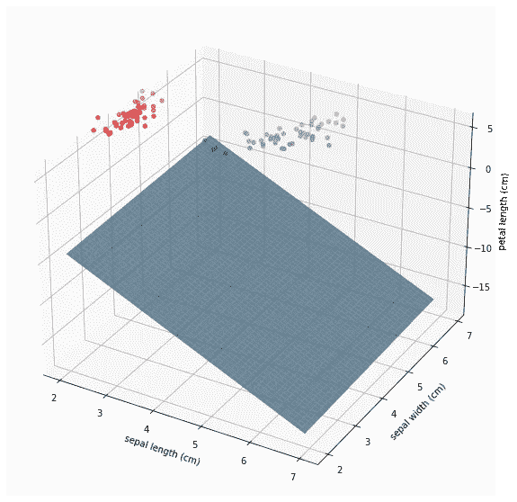
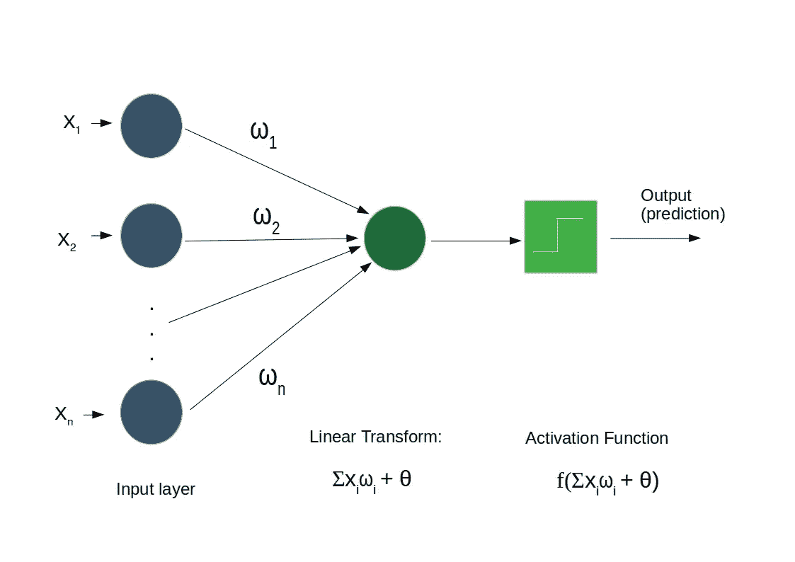
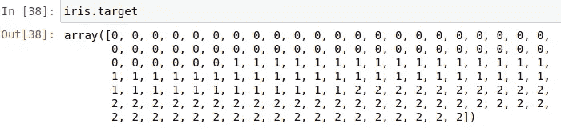
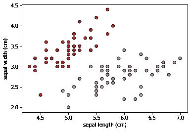
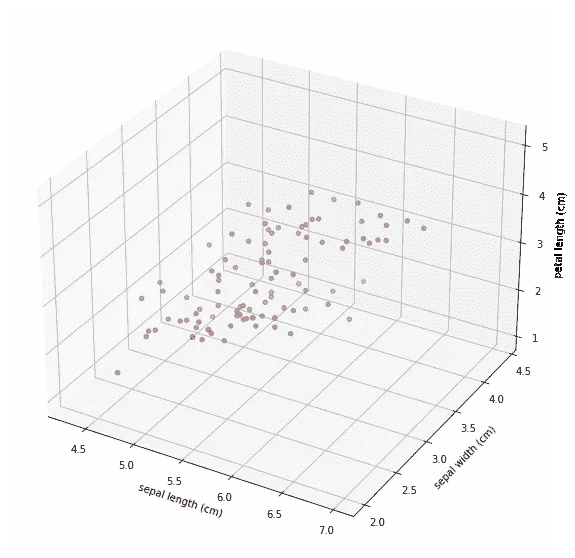
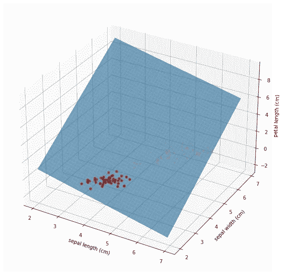

# 来自(几乎)零和 3D 可视化的感知器

> 原文：<https://medium.com/analytics-vidhya/perceptron-from-almost-zero-and-3d-visualization-4569f5d7fac3?source=collection_archive---------8----------------------->



在之前的[帖子](/analytics-vidhya/implementing-perceptron-learning-algorithm-to-solve-and-in-python-903516300b2f)中，我已经介绍了感知器算法来解决一个特定的问题(与门)。ideia 的目的是了解算法是如何工作的，现在我们可以将其推广到解决任何 l [早期可分的](https://en.wikipedia.org/wiki/Linear_separability#:~:text=In%20Euclidean%20geometry%2C%20linear%20separability,points%20as%20being%20colored%20red.)问题(这就是标题中“几乎”的原因)。

对我们以前在感知器上解决与门的工作的主要调整是概括我们的算法将接收的输入数量，因此它可以处理具有任意数量输入的数据集。也就是说，现在广义版本将能够找到[超平面](https://en.wikipedia.org/wiki/Hyperplane#:~:text=In%20geometry%2C%20a%20hyperplane%20is,are%20the%201%2Ddimensional%20lines.)，而不是找到一条线来分隔空间。

[吉菲](https://media.giphy.com/media/3o7qE1Thg4KxFpMGSk/giphy.gif)

感知器的一般结构看起来像:



作者图片

我已经把算法包装成一个类，用法分为三种方法:

*   **初始化** : __init__ 函数设置我们的感知器的输入长度、使用的激活函数(现在让我们使用经典的阶跃函数)、学习速率‘eta’(默认值=0.1)和使用的迭代次数(次数)(默认值=1000)。
*   **训练步骤**:我们调用这个方法在训练数据集中运行学习算法。(二元分类问题，线性可分)。
*   **预测:**最后，我们可以使用这种方法对一个训练集进行预测，它提供了一个评估算法性能的精度变量。

完整代码如下:

好了，为了看我们的算法在运行，让我们用获取一些数据。让我们加载[虹膜数据集](https://archive.ics.uci.edu/ml/datasets/iris)并进行一些预测:

```
from sklearn import datasets
import matplotlib.pyplot as pltiris = datasets.load_iris()#divide into features and target variables
X = iris.data[:100, ]
Y = iris.target[:100]
```

Iris 数据集为 3 种不同的鸢尾属植物(virginica、setosa 和 versicolor)提供了 4 个特征(萼片长度、萼片宽度、花瓣长度、花瓣宽度)。如果你看一下完整的数据集，每个类有三个不同的标签，



iris 数据集类别

为了进行二元分类，我们在上面的 X 和 Y 数组中取了前 100 个条目。我们可以使用下面的函数来绘制特征:

```
# Plot the training points
def plot_iris(X1, X2,  Y, X1_label, X2_label):
    plt.scatter(X1, X2, c=Y, cmap=plt.cm.Set1,
                edgecolor='k')
    plt.xlabel(X1_label)
    plt.ylabel(X2_label)plot_iris(X[:, 0], X[:, 1], Y, iris.feature_names[0], iris.feature_names[1])
```



作者

上图清楚地显示了 0 类和 1 类可以通过萼片宽度和萼片长度这两个特征进行线性分离。这与我们已经解决的与门问题类似。因此，让我们在感知器实现中再使用一个特性来解决这个问题。首先，我们在 scikitlearn 的帮助下将数据分成训练和测试:

```
from sklearn.model_selection import train_test_split# choosing three features to work with here: (X[:, :3]) X_train, X_test, y_train, y_test = train_test_split(X[:, :3], Y, test_size= 0.2)
```

我们可以在 3d 空间中可视化我们的数据:



两个第一类的虹膜数据集(setosa 和 versicolor)

现在，我们实例化我们的感知器(您将需要创建激活函数来传递给类实例):

```
def step_function(x):
    if x > 0:
        return 1
    else:
        return 0percep_iris = Perceptron(input_length=X_train.shape[1], eta=0.1, activ_f=step_function, epochs=1000)
```

我们可以获得用‘percp _ iris . weight’随机初始化的权重，并绘制随机生成的平面:


初始化生成的平面(作者)

现在，让我们实际训练我们的算法:

```
percep_iris.train(X_train, y_train)
```

然后，您可以用测试集评估算法(您应该得到 1 的准确度，因为这是一个简单的问题)

```
percep_iris.predict(X_test, y_test)
percep_iris.accuracy
```

我们还可以用训练步骤中生成的正确权重来绘制新平面:



用训练过的砝码分离平面

我们可以看到，它确实分离了测试集的所有点，这就是为什么准确率为 100%！

# **结论**

回顾最经典的分类算法之一的快速帖子。我认为从零开始实现机器学习，即使是在非常基础的水平上，也是真正理解它们并进化到解决现实世界问题的最佳方式。任何问题，音乐会和评论家将不胜感激。你可以去我的 [github](https://github.com/netofigueira/algorithms-sharing/blob/main/PerceptronClass.ipynb) 查看生成剧情的完整代码。

# 参考

【https://matplotlib.org/3.1.1/gallery/mplot3d/scatter3d.html 

米切尔，T. M. (1997)。*机器学习*。纽约:麦格劳-希尔公司。国际标准书号:978–0–07–042807–2